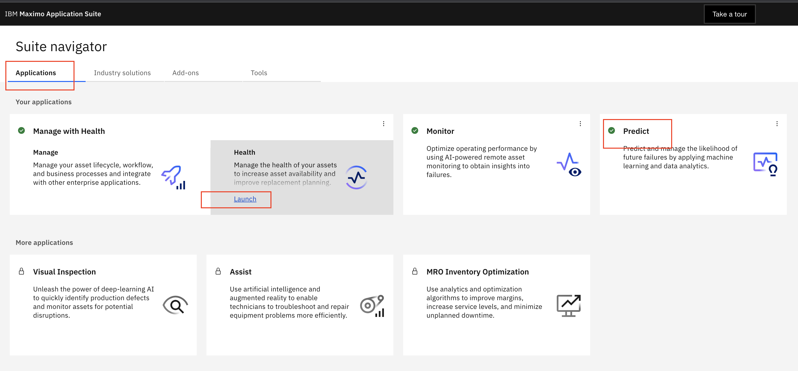
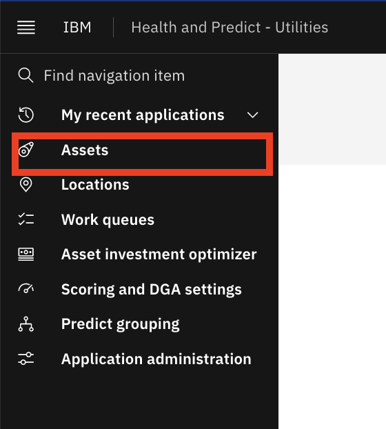

# MAS Health and Predict Overview Task Guide

This task guide is based on the MAS v8.11 early program environment.  Please follow the steps in this task guide.  Any deviation from 
the task guide and or changes you make to the system will also appear and may impact other users.  Since this is a live 
system, some changes are inevitable, and you may find that some of the details of the task guide do not match the system.

For this overview, the following are required, and have been created by your instructor.

| Capability          | Data Required                |
|---------------------|------------------------------|
| Group (with scores) | EUORG1_EUDEMO_ST_A           |
| Group (with scores) | ST_EFFICIENCY                |
| Score Type          | Substation Efficiency        |
| Custom Matrix       | Efficiency and Health        |
| Investment Project  | ST Investment Project        |
| Plan Template       | SUBSTATION_TRANSFORMER       |

If your instructor hasn't added the data, ask him to follow the steps in [Build MAS Health and Predict Demonstration](build_demo.md)

## Introduction
In this demonstration you will be a reliability engineer.   Your role is to maintain the reliability of the grid.  Your major 
responsibility is to ensure that the grid stays up and operational.  You are also responsible for making short, medium and 
long term investment decisions that drive maintenance and replacement policies. You use asset condition and operational 
data to gain insights into Asset Health, Probability of Failure and Risk, both today and into the future.

Thankfully you have a Health and Predict solution from IBM with advanced analytics that help you work efficiently and 
confidently without relying on spreadsheets or point solutions that consider 1 or 2 data sources.  Health and Predict 
incorporates multiple data sources such as `Asset Master` data from Manage, `Work order` data, historical `failure` data, `GeoSpatial` Data, 
`Inspection` and `Test` Logs, `IoT` and `Sensor` data.  Health and Predict provides a flexible asset condition framework for 
mining the asset condition data. Health and Predict helps you identify assets that are at greatest risk of failure, 
across different circuits/feeders, substations and regions. The risk assessment helps you drive asset and work management 
activities in Maximo Manage or other EAM systems to keep the grid up, reduce operational expense, optimize and defend 
capital expenditures resulting in better outcomes. 

Maximo Health and Predict are applications in Maximo Application Suite (MAS) that are targeted to the reliability engineer, 
and provide a view of the current state and future state of an enterprise's assets.  IBM Maximo Models for Electrical 
Distribution is an accelerator that extends Health and Predict designed for understanding the condition of electrical 
distribution asset classes used by the utilities industry.

##  Identify

On the “Applications” tab, there are tiles for each of the applications that the admin has loaded from the Maximo 
Application Suite (MAS).  On the “Industry Solution” tab, there is a tile for Health and Predict – Utilities.

!!! note "Value"
     Health and Predict arm you the reliability engineer with AI-powered insights to take actions to extend the life of the Utility’s assets, reduce maintenance costs, and eliminate unplanned downtime.

!!! attention "Actions"
    Follow the action items below.
    
1. From the main MAS page, select the `Applications` tab
	

2. Click the `Launch` link `Health` tile.

3. The `Asset Table View` is displayed with the default query of all assets.
	

###  Asset Table View

On the main screen, there is a table view of all managed assets in a familiar table view. From this page you can quickly 
choose the asset query that reflects the assets you are responsible for. You can filter those assets to quickly identify 
the assets that have poor scores by sorting the assets or by searching for assets using key words so that you can get the 
latest asset details on an individual asset.

!!! note "Value"
    This is particularly valuable because it shows you a mix of both IT data (from Manage) and OT data (from Monitor) together in a single view.

This asset data is coming from Maximo Manage, but MAS can connect to other EAM systems with or App Connect, via API or 
using Monitor Connectors.

Different views of the data can be generated to make it easier to identify critical assets.  On this grid, you can 
add and move columns, filter, search and sort.

!!! attention "Actions"
    Follow the action items below.

1. Select the `hamburger` icon above to the magnifying glass to show the left navigation menus. This shows how you can 
navigate to other perspectives like `locations` to understand location health. There are other menu options to setup 
health scores, asset investment analysis or and prediction capabilities.

2.  Click `hamburger` menu icon again to close the menu slider. 

    
There’s an option to create private views, and public views which are available to everyone.
 

!!! note "Value"
    Saved views allow the you to return to a particular view so that they don’t have to start over every time.  This view filters on my Substation Transformers.

!!! attention "Actions"
    Use the selection box to show your saved view.

1. Click the selection box to show the saved views then click on the `Substation Transformers` view.
 

In the Table view, there are columns with calculated data.  There are Health scores, which are created for groups of assets 
from the `Scoring setting` menu. These specify the group that scores are calculated on.  The query the notebook to use and
how frequently the score should be calculated. 

!!! note "Value"
    You don't have to spend time creating your own templates but can use the included notebook templates with predefined industry standard formulas to calculate health, criticality, risk, end of life and effective age scores for assets.   

!!! attention "Actions"
    Follow the actions below

1. You can display the data in the Table view that is most important to you. Use the selection box to choose which asset 
data columns to display in your table.

2. The `Days to Failure` column comes from a predictive model defined and scheduled in the `Predict setting` tab. 

The IBM Maximo Models for Electrical Distribution includes the following model templates:

- Substation Transformers / Substation Power (IBM Transformers Tap Changers) 

- Circuit Breaker 

    - Air Blast Circuit Breaker (IBM Circuit Breakers Air Blast) 

    - Air Magnetic Circuit Breaker 

    - Circuit Breaker 

    - Oil Circuit Breaker (IBM Circuit Breakers Oil) 

    - SF6 Circuit Breaker 

    - Vacuum Circuit Breaker 

- Distribution Transformers (IBM Transformers Tap Changers) 

    - Overheads (multiple) 

    - Undergrounds (multiple) 

- Instrument Transformers 

    - Dry Current Transformer 

    - Oil Filled Capacitive Voltage Transformer 

    - Oil Filled Current Transformer (IBM Instrument Oil Filled CTs) 

    - Oil Filled Voltage Transformer 

    - SF6 Filled Current Transformer 

- Switch gear / Gas Insulated Switch gear (IBM Gas Insulated Switchgear) 

###  Map View

Another view to help identify assets in trouble is the map view.  Using a map view focused to a container  is a good way to
understand the capabilities and benefits of the Map view. Containers enable to you reflect the geolocation of your assets 
and geo fencing of business areas.  It could be a region, town, service subscriber area you are responsible for servicing.

We’ll look at a region that contains a mixture of transformers, circuit breakers, cables (OTWs), and switches. 
Select a group of assets, or a container, that contains a mixture of transformers, circuit breakers, cables (OTWs), and 
switches.

!!! note "Value"
    Seeing how assets are spatially distributed may assist with identifying and investigating assets at risk.  This is especially true in the utilities industry that have geo location dependencies on interconnectivity, weather or area of responsibility.

!!! attention "Actions"
    Follow the action items below.

1. You filter the group of assets you want to focus on.   Reset the `View` to show `All shared` assets.  Reference the early instructions if you forgot how to do this.

2. Click the `filter` icon that looks like a funnel. 

3. Select the `pencil` symbol for containers

4. Select  `NIXON9098`
5. Click `OK`

6. Click `Apply`

You can see there are 261 assets in this container. When we sort by the health score from low to high, we find there are 
many assets with `Health` scores in poor health and many of them have a `Criticality` score of 0.  This is concerning.  Several column headers can be used to sort to help visualize the data in different ways. Sort by most critical assets 
and with the worst health.

!!! note "Value"
    Be able to quickly focus on the assets you are responsible for and in need of action.  

!!! attention "Actions"
    Follow the action items below.

1. On the `Assets Table` view, click `Health` column title to sort assets by the `Health` score.  

2.  Asset `Criticality` can be measured by understanding the importance an asset has to the grid performing it's job of providing 
electricity to customers.   Asset `End of Life` is important to know so that assets can be planned to be replaced before they reach 
their end of life.  On the `Assets Table` view, click `Criticality` column title to sort assets by the `Criticality` score. 

You need to understand the relative position of the assets with the worst health and most critical in reference to the service are you are responsible for.  

!!! note "Value"
    `Maps` provide a way to understand an asset condition scores relative to position, connectivity and condition of the impacted service areas using `Containers`. 

!!! attention "Actions"
    Follow the action items below.

1. Click `Map` button.  Selecting the `pin` icon in the upper right of the screen shows the selected assets on a map view.
The different `pin` colors and icons represents the health of the assets, according to the legend at the bottom left of 
the screen.  This is a quick way to understand which assets are in poor health.

3. Adjust the map using the controls and mouse.  You can expand a two finger pinch press on the touch pad to zoom in.   
To move the map push one finger and move with the other finger on the touch pad

4. By turning on the `Container` selection, a polygon will appear around the assets in the container.  The color of the container will reflect the overall health of the container.

5. Click the `Container` icon, and toggle on `Containers`

6. Zoom out to see the container color.  You can decrease a two finger pinch press on the touch pad to zoom out.

7. Click the `Scores` icon and selecting another score will switch the view to a different score.  The asset colors, and  container color, will change accordingly.

8. Select another score like `End of Life`

9. You can return to the Health score view, and hovering over different assets, and the container, reveals the health scores.  Click the `Health` button to return to the original view.

10. Zoom in or out  until until you  see the container outline color change from black to another color.  You can two finger  pinch press and squeeze your fingers together on the touch pad to zoom in and expand to zoom out.  Or you can use the zoom `plus` and `minus` icons on the bottom right.

11. Hover over the `Container` outline to show the `Health` score of the `Container`.

12. Click the container `NIXON9098` which is the dashed line surrounding the assets on the map to show the average scores  of all the asset in that container on a single card.

You can zoom in to see each of asset pin locations. By clicking on the pins you can view the key asset KPIs for 
that asset. You can action assets in the map view, by creating `plans`, adding a `flag` for follow up, or 
`submit a work order` by clicking the `Action` button.  Work Orders will be sent to Maximo Manage so that technicians 
can service or inspect the asset.

!!! attention "Actions"
    Follow the action items below.

1. Zoom in. Click the `pin` for `ST_1400518` to see the card. This is the  substation transformer that likely needs attention.

2. Click on the `Actions` drop down selection box button to see the available options.

   
Note that you can click on the `asset name` to open the `asset detail` page which is explained later.  However, there are 
other methods to identify assets in poor health.  In the next section you will focus on substation transformers which you 
are responsible for.

###  Charts View

The `Charts view` offers another way to identify assets that are not performing well relative to each other or based on a
common grouping like manufacture and their relative health score ranges.  You want to focus on all substation transformers 
by changing  the `type` filter, and select the `Charts view` to understand asset relative condition and performance.

!!! attention "Actions"
    Follow the action items below.

1. Return to the `Table view` using the instructions below.
2. Reset the view to show `ALL (shared assets)` by clicking `X` on the `Container` filter

3. Click the `funnel` symbol

4. Select the `pencil` symbol for `Query`

5. Select `ST_EUDEMO_A` from the list
6. Click `OK`

7. Click `Apply`

8. Select the 3rd icon in the upper right of the screen to see the selected assets on a `Charts` view

The `Charts view` shows 3 charts:

- A health wheel categorizing all of the assets by health.
- Unplanned downtime view showing hours of downtime by month.
- A chart showing failure rate per manufacturer.

You will drill-down through each of these charts to see the assets details of each category.  

!!! note "Value"
    Seeing key KPIs for multi-assets by health distribution, categorized by unplanned downtime or failure rate per manufacture can help you understand assets failure trends.

!!! attention "Actions"
    Follow the action items below.

1. Click on the manufacturer `Boggs` to see the failures by that manufacturer. Clicking on the manufacturer Boggs shows a 100% failure rate.  So all assets from Boggs have failed.

2. Return to the charts page by using the breadcrumb at the top of the page. 

###  Matrix View

Another view to help you identify the number of assets in different condition ranges is the `Matrix view`. 

!!! note "Value"
    Spend your time investigating and actioning assets that exhibit multiple conditions that meet your score range criteria. 

!!! attention "Actions"
    Follow the action items below.

1. You will look at all substation transformers.  Reset your `View` to `All (shared)` assets.

2. Click the `filter` symbol
3. Select the `edit` symbol for Query

4. Input query string `EUORG1_EUDEMO_ST` and click `Enter` Select  `EUORG1_EUDEMO_ST` radio box filter.   Click `OK` button to accept.

5. Click `Apply` to save the query.  Assets grid now only displays assets that match the query. 

6. Select the 4th icon that looks like a Matrix in the upper right of the screen. 

7. You can see the number of assets categorized on a Matrix view.
8. Set the Matrix Version to `Criticality` and `End of life` to see the X and Y axis change and score ranges change to the different score range categories. Note how many assets are for `High Need For Action` which means they need to be actioned. 

9. Click `Assets` breadcrumb to navigate back to the `Matrix` view.

10. Set the Matrix Version to `Criticality` and `End of life`.  

11. You can drill into the red cell with `Criticality` A and `End of life` High to see what assets are at close to the end of their life. Click the number of assets `#`. 

12. You can also see the number of asset in the matrix in the future years if you have configured your forecast score notebooks.

###  Work Queues View

Using `Work queues view`  is another way to identify assets in trouble or need your attention so that you can take an 
action to ensure KPIs are able to be calculated and to avoid asset unplanned downtime and be more proactive in maintenance
planning.

There are a number of `Work queues` included with Health and Predict. Here are some example `Work queues`

- Predict assets with a `High probability of failure`
- Identify `Assets in poor health` 
- Identify assets with `Assets missing data`

Work queues are preconfigured views designed to help find assets that meet specific conditions.  They can be used by the
reliability engineer to systematically address each asset on the list, in turn, and “work down” the list.

!!! note "Value"
    Allows you to prioritize your work and focus to address a specific problem, like a utility, trying to avoid unplanned downtime.

!!! attention "Actions"
    Follow the action items below.

1. Hover over the left nav bar to expand it
2. Select the `Work queues` section on the left nav bar

3. Select `Failing Before PM` work queue

   

## Investigate

The `Failing before PM` work queue shows all of the assets with scores in that work queue.  As a reliability engineer at
a Utilities plant, it is critical to avoid failures.   Note that for this `Work queues`, there are several pumps and 
substation transformers that have a predicted failure before their next planned maintenance date. Two of the transformers 
are in the container that was viewed earlier.  You will select `ST_1400518` in the queue to start managing your work load 
for the day by investigating and addressing all of the assets in the work queue.  You will use the Asset Details view to 
better understand the holistic asset condition of `ST_1400518` so that you can better assess and pick a corrective action.

!!! note "Value"
    The missing data `Work queues` are useful for an reliability engineer to help identify gaps in data necessary to create health scores or predictive failure date models.

!!! attention "Actions"
    Follow the action items below.

1. Select `ST_1400518` which opens the `asset details` view.  Details on this page will vary since this is a live demonstration environment system.

###  Assets Detail View

On the top of the `Asset Details` page there are the resulting scores from the predefined notebook for this substation 
transformer.  These are health, criticality, risk, end of life and effective age score.  Note that effective age is a 
calculation using the actual age and the health score.  An asset in poor health will have an effective age greater than 
its actual age.

On the second line, there are custom scores, like the `Substation Efficiency` score.

The next `Preventive Maintenance` date and the `MRR` come directly from Maximo Manage.

!!! note "Value"
    The asset detail page is an useful for investigating assets.  Asset condition information is presented on a single page, in easy-to-read tables, charts and graphs.

- On the top of the page, there are details about the asset, and KPIs that give a snapshot of its current state.
- For this asset, there is a `Health Score` of 44, which is in the medium `fair` zone.  
- This asset also has a high `Criticality` and low `Risk Score`. 
- This asset has a low percentage of `probability` that there will be an imminent `failure`, based on the `Installation Date` and manufacturers recommended life.
- The asset is projected to fail in the next 0 days, but the next maintenance isn't planned for 30 days.

At the beginning of the investigation, you suspected the asset was going to fail before its planned maintenance.  But, just by 
looking at the KPIs, additional evidence suggests that this asset may be in trouble, and that some action needs to be 
taken now.  The `Health history` widget of this asset is below the `Score widget`. Using the historical health chart, you can see 
this assets health has been low for some time.  This is another indication that this asset needs attention.

!!! note "Value"
    Viewing the contributors and the historical health scores can give insight into the why a particular score is trending in one direction or the other.

!!! attention "Actions"
    Follow the action items below.

1. Scroll down the page to learn more about the health of the asset, go to the `Score details` widget. 

2. Understand what is contributing to the poor health of the asset to see how you might address the problems.  
3. Expand the view to see the contributors by clicking the `chevrons` to view the contributors to poor asset health. 

4. See and sort on complete list of contributors to help understand what might be the root cause of the problem.  Click `Weight` to understand what is contributing the most to the  `Score`
5. From the `Scoring` drop down box you can also see other `Custom score` contributors that you have created using the custom score template.

The Health application supports asset-specific calculations and visualizations like `Dissolved gas analysis` for transformers. 
There a two types of visualization widgets available to understand the transformers gas conditions using inspection or 
sensor data readings.

!!! note "Value"
    Understanding gas levels can be a early indicator of underlying asset transformer problems that if not inspected or serviced could result in an unscheduled maintenance or failure. 

!!! attention "Actions"
    Follow the action items below.

1. Scroll down the `Asset Details` page until you reach the `Dissolved gas analysis` tile.

2. Click on each of the `dots` to get detailed information about the amount of those types of gases.
3. Click the `switcher` icon on the top right corner of the tile, to view the results in the table view.
4. The other widget is the history of combustible gas concentrations. It shows the combustible gas trend and rating over 
time.  The rating represents the average acceptability of detected gas concentrations. The rating is determined by the 
overall factor.  
5. Hover on each of the assessment dates to get the detailed asset condition information.

There are several predictive model templates that come with Predict.  Your data scientist has trained and deployed these 
models built using Cloud Pack for Data and Watson Studio which is included with Maximo Application Suite.  IBM Predict 
includes templates to:

- Predict days to failure
- Calculate probability of failure
- Detect anomalies
- Generate an asset life curve based on group asset deployment and decommission dates 

These templates include a large number of algorithms and can automatically select the one that best fits the data for the 
optimal outcome.  These models are built to detect specific problems for each asset problem and failure mode.  They can 
detect problems and forecast the future condition of the asset using historical asset sensor data ingested by Maximo 
Asset Monitor or streamed into Health using the App Connect included with Maximo Application Suite. 

!!! note "Value"
    Understanding what potential problems may occur in the future allows you to schedule asset maintenance or replacement without impacting customer service or production. 

!!! attention "Actions"
    Follow the action items below.

1. Scroll down `Asset Details` page until you reach the `Predictions` tile. 
2. Double click the " the `Predictions` tile tile to expand the tile and see the prediction cards.

   
Note that also included with MAS is Watson Studio and Watson Machine Learning, both of which a Data Scientist can use for 
building, training, and maintaining predictive models.  In the case of this asset, the model tells us that it is projected 
to fail in 0 days plus or minus 1 day. 

A Data Scientist can build predictive models for specific failure modes using the templates included with Predict if you have failure history data. 

The reliability engineer can select those failure modes within the card to see the projection for each failure modes. 

The failure training data is used to help calculate Failure probability.  Different failure modes can be calculated and do impact predictions. 

`Failure probability` is the chance that an asset may have a failure with a certain time period.   For this asset there is a 20% probability of failure in the next 2 months due to overheating. 

A Data Scientist must build specific models for time periods just like the failure modes. You can see the prediction results by making different selections within the card.

`Failure probability history` shows how the probability of failure for each mode and how it has changed over time.

The `Factors that contribute to failure` show which factors from the training data impacted failures the most, giving an indication of what may lead to future failures.
The anomaly detection model creates a threshold based on history and shows when the asset exceeds that threshold in the card.

The `End of life curve` is built based on training data for assets that have been decommissioned.   By applying the effective age calculation from the notebook, this curve can be used to estimate probability of an end of life failure.

The `Effective age` of the transformer is 27 years.  The curve produces an end of life probability of  89%.  This is one more indication that this asset needs to be attended to immediately.

!!! note "Value"
    Understanding this asset `Effective age` and `End of life curve` relative to all the assets, allows you to understand it's likely remaining life given given it's operation and conditional history rather instead of it's calender based age. 

!!! attention "Actions"
    Follow the action items below.

1. Hover near the point where the `Effective age` crosses the curve.  
2. How is this asset performing relative to others of a similar class and where it should be for it's age?

The `Asset timeline` card shows several pieces of key information about the asset in the same graph. For example, the timeline shows a predicted failure (on the top line of the graph), that will occur before the next preventive maintenance (on the second line of the graph). 

!!! note "Value"
    Information on the `Asset timeline` chart, like past work orders and inspection, provide valuable insight into the asset's history, and may help you better formulate what kind of action to take.

!!! attention "Actions"
    Follow the action items below.

1. Scroll down the page
2. Hover over a point on the timeline

There are several other sections on this page including:

- `Operational status`, showing recent meter readings, maintenance history, showing work orders for this asset.
- `Replacement planning`, showing any replacement or refurbishment plans created for this particular asset.

!!! note "Value"
    While each piece of information, or card, gives nsight into the state of our asset, all of the information together, gives a richer view, and helps make a data-driven decision on how to address this asset.

### Take Action

There’s enough evidence from the investigation to take some action against this asset.  Scroll to the top of the page and click the `Actions` dropdown selection box button to see the options.

!!! attention "Actions"
    Follow the action items below.

!!! note "Value"
    Corrective actions to address asset problems can be done with a couple of clicks directly from the asset detail page.

1. Scroll to the top of the page.
2. Click the `Actions` button.

You could:

- `Add flag` which sets a replacement flag on this asset to make sure it is marked to be replaced in the next round of replacement planning.
- `Create a plan` to replace or repair this asset.
- `Recalculate scores` if there is new information or your scoring notebook has changed, you can request that the scores be re-calculated to reflect these changes.
- `Edit source asset record` to navigate to the asset record to make asset changes.  In this case, possibly adjust the preventative maintenance schedule.
- `Create a service request`so that a technician can do asset repairs, inspection or replacement.

However, this asset needs urgent maintenance.  Create an emergency maintenance work order for this asset by selecting the `Create work order` option and completing the form.

!!! attention "Actions"
    Follow the action items below.

1. Select the `Create work order` option
2. Show the form
3. Click `Cancel` to return to the asset detail page

Health and Predict gives many options to identify assets at risk with a table, map, chart and asset details views.

Additionally you can use and predefined `Work Queues` to help systematically address risky assets exhibiting the same 
problems or that are missing data in order to calculate their scores.

There’s a single page from which to conduct an investigation and take an action.  In this case, submitting an emergency work order to prevent the imminent failure of a substation transformer.

In Health and Predict – Utilities, there’s also the ability to use a matrix (custom or OOTB) and do long-term replacement planning based on risk tolerance and available budget.

 

### Identify / Investigate with a Matrix

Start building an investment project from the matrix view.

!!! attention "Actions"
    Follow the action items below.

1. Hover over the left nav bar to expand it
2. Select the `Assets` section on the left nav bar

3. Make sure the asset view is for `substation transformers` by either using the filter symbol or a saved view.  If necessary, clear the filters to start from the full set of assets under management
4. Click the “Matrix” icon to move to the matrix view

The default matrix view, in this case, is set to “Substation Efficiency and Health”.  This is a custom matrix.  The out-of-the-box matrices are…
- Criticality and End of life
- Criticality and Health
- Criticality and Risk

This custom matrix is using the Health score generated by using the notebook for substation transformers.  The Substation Efficiency score is a custom score.  Together, on the matrix, they can represent a proxy for sustainability.

!!! note "Value"
    Seeing how the assets are distributed by color, and against two variables, provides an easy way to identify assets at risk.

To get a different view of the assets, change the axes of the matrix by using the pull-down menu. 

The color pattern can also be adjusted by clicking on the setting cog.  By doing this, we are adjusting our risk tolerance.

!!! note "Value"
    The ability to change the matrix, further allows you to focus on specific assets.

!!! attention "Actions"
    Follow the action items below.

1. Click on the pull-down menu to show the other matrix options

2. Click on the setting cog to briefly go into the setting page to show that the page is customizable

3. Click `Close` to return to the matrix view

This view shows that there are 35 assets in red or high category.  Click through the summary boxes, or the boxes in the matrix, to see the details of the assets in a table view.

This table view provides a perfect example of how assets can be added to a new or existing investment project.

!!! note "Value"
    The ability to drill-down allows you to focus on those asset in trouble, and take action on only those assets.

!!! attention "Actions"
    Follow the action items below.
    
1. Click on the "High" box with 35 assets in it

2. From the table view, demonstrate how all of the assets can be selected by clicking on the selection box at the top

3. Show the options to add the assets to a new or existing investment project
4. Click `Cancel`

5. Click the `Assets` breadcrumb to return to the matrix

### Take Action with AIO

In Health and Predict – Utilities, there’s a capability to build an Asset Investment Optimizer (AIO) project.

The AIO process starts with building a project of assets, assigning a length and starting date to the project, then running multiple strategies to determine which assets should be replaced over the life of the project, and when.

!!! note "Value"
    Utilizing advanced data-driven analytics to optimize OPEX and CAPEX comprehensively from various dimensions.

In this case, a project has already been built with the 35 assets in the “red” cell, and the 26 assets in the “yellow” cell next to it.

!!! attention "Actions"
    Follow the action items below.

1. Hover over the left nav bar to expand it
2. Select the `Asset investment optimizer` section on the left nav bar

3. From the `Projects` tab, click on `ST Investment Project`

There are 3 strategies built out in the “ST Investment Project”.

The first strategy is to maintain the average risk of 8.2 for the 61 substation transformers in the 25-year project.

The second is to reduce the risk to 7.0.

The third is to stay within a $2.16M budget.

Each of the scenarios uses a plan template build for Substation Transformers specific replacement costs and cost of a failure.

!!! note "Value" 
    Multiple scenario can be run to determine the best strategy to meet the risk tolerance of the enterprise, and the budget available for the project.

!!! attention "Actions"
    Follow the action items below.

1. Click the `Maintain risk` scenario

2. Review the scenario by using the 2 “details” buttons to toggle between the cost of the scenario, and the specific replacement plan
3. Repeat the process for “Stay within budget” and “Reduce risk” scenarios to review each scenario

Up to three strategies can be compared side-by-side and the details can be exported.

!!! attention "Actions"
    Follow the action items below.

1. Click the `Compare strategies` button

2. From the pop-up, click all three scenarios
3. Click `Compare`

4. Review the output noting the results of each strategy

## Summary

As the Reliability Engineer, maintaining the grid, I was able to use IBM Maximo Health and Predict to identify assets at 
risk, investigate those assets, and finally take an action to prevent a failure and unplanned downtown…saving thousands 
of dollars, and maintaining the integrity of the grid.

My actions will also help short, medium and long term investment decisions that drive maintenance and replacement policies.