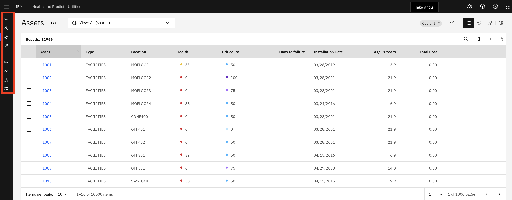

# MAS Health and Predict - Utilities Overview Task Guide

This task guide is based on the MAS v8.9 and MAS v8.10.  This workshop will use a common environment provided by your instructor.
Please follow the steps in this task guide.  Any deviation from the task guide and or changes you make to the system will 
also appear and may impact other users.  Since this is a live system, some changes are inevitable, and you may find that 
some of the details of the task guide do not match the system.

For this overview, the following are required, and have been created by your instructor.

| Lab Section         | Data Required                |
|---------------------|------------------------------|
| Group (with scores) | EUORG1_EUDEMO_ST_A           |
| Group (with scores) | ST_EFFICIENCY                |
| Score Type          | Substation Efficiency        |
| Custom Matrix       | Efficiency and Health        |
| Investment Project  | ST Investment Project        |
| Plan Template       | SUBSTATION_TRANSFORMER       |

If your instructor hasn't added the data, ask him to follow the steps in [Build MAS Health and Predict Demonstration](build_demo.md)

## Introduction
In this overview task guide you will be Marcia.  She is a Reliability Engineer (RE), whose role is to maintain the 
reliability of the grid.  Her main responsibility is to ensure that the grid stays up and operational.  She is also 
responsible for making short, medium and long term investment decisions that drive maintenance and replacement policies.  
She uses asset condition and operational data to gain insights into Asset Health, Probability of Failure and Risk, both
today and into the future. 

Thankfully, You will have a Health and Predict - Utilities solution from IBM with advanced analytics to help you do your 
work efficiently and confidently without relying on spreadsheets or point solutions that consider 1 or 2 data sources.   
Health and Predict - Utilities incorporates multiple data sources such as Asset Meter and Work order data, historical 
failure data, GeoSpatial Data, Inspection and Test Logs, IoT and Sensor data.   Health and Predict - Utilities provides 
a flexible Asset condition framework for mining the asset condition data. Health and Predict - Utilities helps you 
identify assets that are at the greatest risk of failure, across different circuits/feeders, substations and regions.  
The risk assessment helps you drive asset and work management activities in Maximo Manage or other EAM systems to keep 
the grid up, reduce operational expense, optimize and defend capital expenditures resulting in better outcomes.

Maximo Health and Maximo Predict are targeted to the RE, and provide a view of the current state of an enterprise's 
assets, and projects future conditions of those assets.  HPU is an extension of Health and Predict designed specifically 
for the Utilities industry.  Health, Predict, and HPU share the same User Interface (UI).

##  Identify

On the “Applications” tab, there are tiles for each of the applications that the admin has loaded from the Maximo Application Suite (MAS).  On the “Industry Solution” tab, there is a tile for Health and Predict – Utilities.

!!! note "Value"
     Health and Predict - Utilities arm the RE with AI-powered insights to take actions to extend the life of the Utility’s assets, reduce maintenance costs, and eliminate unplanned downtime.

!!! attention "Actions"
    Follow the action items below.
    
1. From the main MAS page, select the `Industry solutions` tab
	

2. Click the Health and Predict – Utilities tile
	

On the main screen, there is a universal view of all managed assets in a familiar table view.

!!! note "Value"
    This is particularly valuable because it shows a mix of both IT data (from Manage) and OT data (from Monitor) together in a single view.

This asset data is coming from Maximo Manage, but MAS can connect to other EAM systems.

Different views of the data can be generated to make it easier to identify critical assets. On this grid, the user can add and move columns, filter, search and sort.

!!! attention "Actions"
    Follow the action items below.

1. Select the icon next to the magnifying glass to show the column options

2. Click it again to close

There’s an option to create private views, and public views which are available to everyone.

!!! note "Value"
    Saved views allow the user to return to a particular view so that they don’t have to start over every time.

!!! attention "Actions"
    Follow the action items below.

1. Use the selection box to SHOW the saved view.

In the grid view, there are columns with calculated data.  There are Health scores, which are created for groups of assets from the Scoring tab.

!!! note "Value"
    Included with Health and Predict – Utilities are notebooks with predefined industry standard formulas to calculate health, criticality, risk, end of life and effective age scores for assets in the Utilities industry.

Similarly, information in the Days to Failure column comes from a predictive model scheduled from the Predict grouping tab

Another view to help identify assets in trouble is the map view.  Using a container with a grid is a particulary good way to demonstrate the capabilities of the map.

Select a group of assets, or a container, that contains a mixture of transformers, circuit breakers, cables (OTWs), and switches.

!!! note "Value"
    Seeing how assets are spatially distributed may assist with identifying and investigating assets at risk.  This is particularly true in the Utilities industry.

!!! attention "Actions"
    Follow the action items below.

1. Reset the view to show ALL assets as needed.
2. Click the “filter” symbol

3. Select the “pencil’ symbol for containers

4. Select  `NIXON9098`
5. Click `OK`

6. Click `Apply`

There are 261 assets in this container.  Sorting by the health score from low to high shows that there are many assets in poor health.  This is concerning given the importance of these assets to the grid performance in the distribution network.

!!! note "Value"
    Several column headers can be used to sort to help visualize the data in different ways.

!!! attention "Actions"
    Follow the action items below.

1. Click `Health` in the title bar to sort

Selecting the pin icon in the upper right of the screen shows the selected assets on a map view.

The different pin colors and icons represents the health of the assets, according to the legend at the bottom left of the screen.  This is one more way to quickly understanding which assets are in poor health.

!!! attention "Actions"
    Follow the action items below.

1. Click `Map` button

2. Adjust the map using the controls and mouse

By turning on the Container selection, a polygon will appear around the assets in the container.  The color of the container will reflect the overall health of the container. 

!!! attention "Actions"
    Follow the action items below.

1. Click the "Container" icon, and toggle on `Containers`
2. Zoom out to see the container color

Clicking the Scores icon and selecting another score will switch the view to a different score.  The asset colors, and container color, will change accordingly.

!!! attention "Actions"
    Follow the action items below.

1. Click the "Scores" icon
2. Select another score like “End of Life”

Returning to the Health score view, and hovering over different assets, and the container, reveals the health scores.

!!! attention "Actions"
    Follow the action items below.

1. Click the “Health” button to return to the original view
2. Hover over assets and the container

Clicking on the container will show all of the scores on a single card.

!!! attention "Actions"
    Follow the action items below.

1. Click the container `NIXON9098`

!!! note "Value"
    The KPIs displayed on the preview card gives us an overall summary of the assets in this region, or the container.

Zoom in and click on each of the pins to view the key KPIs of the selected asset.  By clicking the “Action” button, the user can create plans, add a flag, or submit a work order.

!!! attention "Actions"
    Follow the action items below.

1. Zoom in
2. Click the pin for "ST_1400518" to see the card

3. Click on the action tab to see the options

Here there’s a substation transformer that likely needs attention.

Note that a user can click on the name to open the asset detail page.  However, there are other methods to identify 
assets in poor health and focus on substation transformers.

The charts view offers an alternative way to identify assets at risk.

Select all substation transformers from the “type” filter, and select the charts view.

!!! attention "Actions"
    Follow the action items below.

1. Return to the grid view
2. Reset the view to show ALL assets by clicking on the "container" filter

3. Click the "filter" symbol

4. Select the "pencil" symbol for type

4. Select `substation transformers` from the list
5. Click `OK`

6. Click `Apply`

7. Select the 3rdth icon in the upper right of the screen to see the selected assets on a chart view

This page shows 3 charts:
- a health wheel categorizing all of the assets by health
- an unplanned downtime view showing hours of downtime by month
- a chart showing failure rate per manufacturer

!!! note "Value"
    Seeing key KPIs for multi-assets by health distribution, categorized by unplanned downtime or failure rate per 
manufacture can help understand assets failure trends.

Drill-down through each of these charts to see the assets details of each category.

For example, clicking on the manufacturer Boggs shows a 100% failure rate.  So all assets from Boggs have failed.

!!! attention "Actions"
    Follow the action items below.

1. Click on the manufacturer `Boggs` to see the failures by that manufacturer

2. Return to the charts page by using the breadcrumb at the top of the page

Using “work queues” is another way to identify assets in trouble, and to take an action to avoid unplanned downtime and 
be more proactive in maintenance planning.

!!! attention "Actions"
    Follow the action items below.

1. Hover over the left nav bar to expand it
2. Select the `Work queues` section on the left nav bar

3. Select `Failing Before PM` work queue

Work queues are preconfigured views designed to help find assets that meet specific conditions.  They can be used by the
reliability engineer to systematically address each asset on the list, in turn, and “work down” the list.

!!! note "Value"
    These are particularly valuable to a RE who needs to address a specific problem, like a utility, trying to avoid 
unplanned downtime.

There are a number of work queues included with Health and Predict.
- There are work queues specific to Predict, like assets with a High Probability of Failure.
- There’s also a work queue for identifying assets in poor health.

And there are work queues that show assets with missing data.

!!! note "Value"
    The missing data work queues are useful for an RE to help identify gaps in data necessary to create health scores or predictive failure models.

The “Failing before PM” work queue shows all of the assets with scores in that work queue.  As a RE at a Utilities plant, it is critical to avoid failures.
- In this work queue, there are several pumps and substation transformers that have a predicted failure before their next planned maintenance date.
- 2 of the transformers are in the container that was viewed earlier.
- Select “ST_1400518” in the queue to start managing the workload for the day, investigating and addressing all of the assets in the queue.

!!! attention "Actions"
    Follow the action items below.

1. Select `ST_1400518` which opens the asset detail page [DETAILS ON THIS PAGE WILL VARY AS THIS IS A LIVE DEMO SYSTEM]

## Investigate

On the top of the asset detail page there are the resulting scores from the predefined notebook for this substation transformer.  These are health, criticality, risk, end of life and effective age score.  Note that effective age is a calculation using the actual age and the health score.  An asset in poor health will have an effective age greater than its actual age.

On the second line, there are custom scores, like the Substation Efficiency score.

The next Preventive Maintenance date and the MRR come directly from Maximo Manage.

!!! note "Value"
    The asset detail page is an useful for investigating assets.  Asset condition information is presented on a single page, in easy-to-read tables, charts and graphs.

- On the top of the page, there are details about the asset, and KPIs that give a snapshot of its current state.
- For this asset, there is a health score of 44, which is in the medium “fair” zone.  
- This asset also has a high criticality and low risk score. 
- This asset has a low percentage of probability that there will be an imminent failure, based on the install date and manufacturers recommended life.
- The asset is projected to fail in the next 0 days, but the next maintenance isn't planned for 30 days.

At the beginning of the investigation, the asset was expected to fail before its planned maintenance.  But, just by looking at the KPIs, additional evidence suggests that this asset may be in trouble, and that some action needs to be taken.

!!! attention "Actions"
    Follow the action items below.

1. Scroll down the page

To learn more about the health of the asset, go to the “Score details” widget.

Expand the view to see the contributors by clicking the chevrons to view the details.

!!! note "Value"
    Viewing the contributors and the scores can give insight into the why a particular score is trending in one direction or the other.

The “Health history” widget of this asset is below the “Score widget”. The asset health has been low for some time.  One more indication that this asset needs attention.

!!! attention "Actions"
    Follow the action items below.

1. Scroll down the page

The application supports critical asset-specific calculations and visualizations. Dissolved gas analysis is an example for the transformers.  It offers two types of visualization widgets.

The first one is Duval triangle. It shows the current dissolved gas situation.  Click on each of the dots to get detailed information.

Click the switcher on the top-right corner to view the result in the list view.

The other widget is the history of combustible gas concentrations. It shows the combustible gas trend and rating over time

The rating represents the average acceptability of detected gas concentrations. The rating is determined by the overall factor.

Hover on each of the assessment dates to get the detailed information.

There are several predictive models built to score against incoming sensor data for the asset.

!!! note "Value"
    IBM Predict includes templates to help a Data Scientist get started building models to project days to failure, calculate probability of failure, detect anomalies, and generate an asset life curve based on group asset deployment and retirement dates.  These templates include a large number of algorithms and can automatically select the one that best fits the data for the optimal outcome.

Note that also included with MAS is Watson Studio and Watson Machine Learning, both of which a Data Scientist can use for building, training, and maintaining predictive models.

In the case of this asset, the model tells us that it is projected to fail in 0 days...plus or minus 1 day. 

- Depending on the richness of the failure history, a Data Scientist can build predictive models for specific failure modes.  And the RE can select those failure modes within the widget to see the projection for each.
- Also in the widget, there is information about the training data to help decide when a 

The Failure probability widget can show how different failure modes impact predictions.  For example, it might show the asset has a 20% probability of failure in the next 2 months due to overheating.
- A Data Scientist can build specific models for time periods.  And just like the failure modes, the user can look at the results by making different selections within the widget.
- Failure probability history shows how the probability of failure for each mode has changed over time.

The factors that contribute to failure show which factors from the training data impacted failures the most, giving an indication of what may lead to future failures.
The anomaly detection model creates a threshold based on history and shows when the asset exceeds that threshold in the widget.

The end of life curve is built based on training data for assets that have been decommissioned.   By applying the effective age calculation from the notebook, this curve can be used to estimate probability of an end of life failure.

The effective age of the transformer is 27 years.  The curve produces an end of life probability of  89%...one more piece of evidence to show that this asset needs to be attended to immediately.

!!! attention "Actions"
    Follow the action items below.

1. Hover NEAR the point where the effective age crosses the curve
2. Scroll down the page

Below the “Predictions” section there is an “Asset timeline” that shows several pieces of key information about the asset in the same graph. For example, the timeline shows a predicted failure (on the top line of the graph), that will occur before the next preventive maintenance (on the second line of the graph). 

!!! note "Value"
    Information on the chart, like past work orders and inspection, provide valuable insight into the asset's history, and may support what kind of action to take.

!!! attention "Actions"
    Follow the action items below.

1. Hover over a point on the timeline
2. Scroll down the page

There are several other sections on this page including operational status, showing recent meter readings, maintenance history, showing work orders for this asset, and a replacement planning section, showing any replacement or refurbishment plans created for this particular asset.

!!! note "Value"
    While each piece of information, or widget, gives nsight into the state of our asset, all of the information together, gives a richer view, and helps make a data-driven decision on how to address this asset.

### Take Action

There’s enough evidence from the investigation to take some action against this asset.  Scroll to the top of the page and click the "Action" button to see the options.

!!! attention "Actions"
    Follow the action items below.

1. Scroll to the top of the page.
2. Click the action button.

!!! note "Value"
    An action can be taken directly from the asset detail page.

- Add a replacement flag to this asset to make sure it is marked and will be replaced in the next cycle of the replacement planning.
- If necessary, create a plan directly for this selected asset.
- Recalculate the scores if there is new information that will impact the decision.
- Go directly to the asset record and make a change.  In this case, possibly adjust the preventative maintenance schedule.
- Create a service request.

However, this asset needs urgent maintenance.  Create an emergency maintenance work order for this asset by selecting the “Create work order” option and completing the form.

!!! attention "Actions"
    Follow the action items below.

1. Select the `Create work order` option
2. Show the form
3. Click `Cancel` to return to the asset detail page

Health and Predict – Utilities gives many options to identify assets at risk with a grid, map, and chart view…and predefined work queues to help systematically address risky assets exhibiting the same problems.

There’s a single page from which to conduct an investigation and take an action.  In this case, submitting an emergency work order to prevent the imminent failure of a substation transformer.

In Health and Predict – Utilities, there’s also the ability to use a matrix (custom or OOTB) and do long-term replacement planning based on risk tolerance and available budget.

 

### Identify / Inveatigate with a Matrix

Start building an investment project from the matrix view.

!!! attention "Actions"
    Follow the action items below.

1. Hover over the left nav bar to expand it
2. Select the `Assets` section on the left nav bar

3. Make sure the asset view is for `substation transformers` by either using the filter symbol or a saved view.  If necessary, clear the filters to start from the full set of assets under management
4. Click the “Matrix” icon to move to the matrix view

The default matrix view, in this case, is set to “Substation Efficiency and Health”.  This is a custom matrix.  The out-of-the-box matrices are…
- Criticality and End of life
- Criticality and Health
- Criticality and Risk

This custom matrix is using the Health score generated by using the notebook for substation transformers.  The Substation Efficiency score is a custom score.  Together, on the matrix, they can represent a proxy for sustainability.

!!! note "Value"
    Seeing how the assets are distributed by color, and against two variables, provides an easy way to identify assets at risk.

To get a different view of the assets, change the axes of the matrix by using the pull-down menu. 

The color pattern can also be adjusted by clicking on the setting cog.  By doing this, we are adjusting our risk tolerance.

!!! note "Value"
    The ability to change the matrix, further allows the user to focus on specific assets.

!!! attention "Actions"
    Follow the action items below.

1. Click on the pull-down menu to show the other matrix options

2. Click on the setting cog to briefly go into the setting page to show that the page is customizable

3. Click `Close` to return to the matrix view

This view shows that there are 35 assets in red or high category.  Click through the summary boxes, or the boxes in the matrix, to see the details of the assets in a table view.

This table view provides a perfect example of how assets can be added to a new or existing investment project.

!!! note "Value"
    The ability to drill-down allows the user to focus on those asset in trouble, and take action on only those assets.

!!! attention "Actions"
    Follow the action items below.
    
1. Click on the "High" box with 35 assets in it

2. From the table view, demonstrate how all of the assets can be selected by clicking on the selection box at the top

3. Show the options to add the assets to a new or existing investment project
4. Click `Cancel`

5. Click the `Assets` breadcrumb to return to the matrix

### Take Action with AIO

In Health and Predict – Utilities, there’s a capability to build an Asset Investment Optimizer (AIO) project.

The AIO process starts with building a project of assets, assigning a length and starting date to the project, then running multiple strategies to determine which assets should be replaced over the life of the project, and when.

!!! note "Value"
    Utilizing advanced data-driven analytics to optimize OPEX and CAPEX comprehensively from various dimensions.

In this case, a project has already been built with the 35 assets in the “red” cell, and the 26 assets in the “yellow” cell next to it.

!!! attention "Actions"
    Follow the action items below.

1. Hover over the left nav bar to expand it
2. Select the `Asset investment optimizer` section on the left nav bar

3. From the `Projects` tab, click on `ST Investment Project`

There are 3 strategies built out in the “ST Investment Project”.

The first strategy is to maintain the average risk of 8.2 for the 61 substation transformers in the 25-year project.

The second is to reduce the risk to 7.0.

The third is to stay within a $2.16M budget.

Each of the scenarios uses a plan template build for Substation Transformers specific replacement costs and cost of a failure.

!!! note "Value" 
    Multiple scenario can be run to determine the best strategy to meet the risk tolerance of the enterprise, and the budget available for the project.

!!! attention "Actions"
    Follow the action items below.

1. Click the `Maintain risk` scenario

2. Review the scenario by using the 2 “details” buttons to toggle between the cost of the scenario, and the specific replacement plan
3. Repeat the process for “Stay within budget” and “Reduce risk” scenarios to review each scenario

Up to three strategies can be compared side-by-side and the details can be exported.

!!! attention "Actions"
    Follow the action items below.

1. Click the `Compare strategies` button

2. From the pop-up, click all three scenarios
3. Click `Compare`

4. Review the output noting the results of each strategy

## Summary

As the Reliability Engineer, maintaining the grid, I was able to use IBM Maximo Health and Predict – Utilities to identify assets at risk, investigate those assets, and finally take an action to prevent a failure and unplanned downtown…saving thousands of dollars, and maintaining the integrity of the grid.

My actions will also help short, medium and long term investment decisions that drive maintenance and replacement policies.