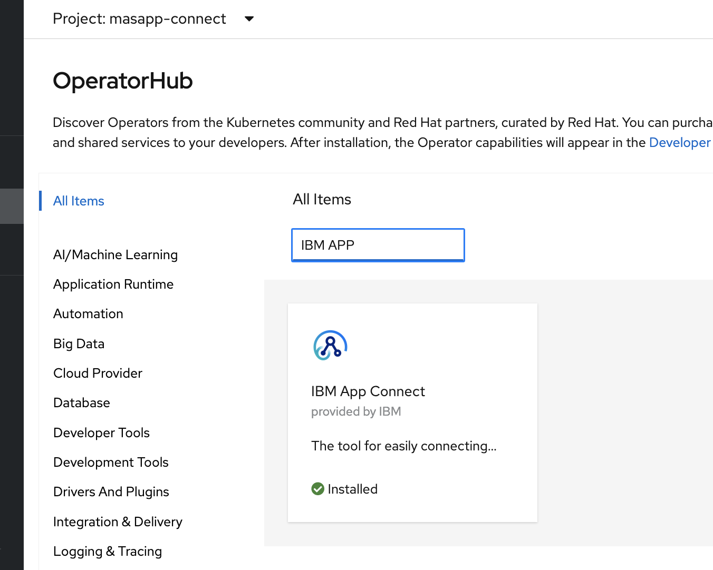
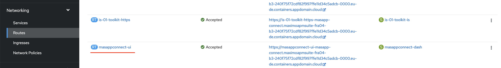

# Data Load App Connect

In this exercise you will install App Connect on IBM Cloud so that you can use load asset class data into Maximo Manage.  Only App Connect installation is covered in this lab. 

You can skip these exercise steps if you are loading data using Python.  Or your instructor has already loaded asset data into your environment.

- [Install App Connect](#appconnect_install) 
- [Deploy App Connect Integration Flows](#deploy_bar) to load data into Health Predict and Utilities

## Pre-requisites

Ensure you have access to:

1. MAS v8.7 Health and Predict Utilities installed and access to the application

2. App Connect is installed with-in OpenShift platform NOT ON IBM Cloud Platform.

3. Asset Class Data and flow bar files for the Labs provided by the instructor.

4. Installation of OpenShift version 4.6 or 4.8 installed & Administration access to OpenShift Platform so that you can complete the App Connect installation and setup steps.

5. Verify the IBM App Connect `Operator`is available in OpenShift Platform.  If IBM App Connect is not available as `Operator`, then you need to make it available using standard operator.  If an Operator is not available, use the [documenation](https://www.ibm.com/docs/en/app-connect/containers_cd?topic=access-enabling-operator-catalog) to make an operator available in OpenShift Platform.

## Install App Connect (optional)

1. Below are the steps to install IBM App Connect operator as part of OpenShift Platform.

2. Create the namespace / project in OpenShift platform. E.g. masapp-connect

3. App Connect Operator version has to be carefully choose. E.g. App Connect operator 1.5.2 in OCP 4.6 and 3.0 or 4.0 in OCP
4.8

4.  Provide the name for App Connect, choose the right version

5.  Choose the License. Select the right license name in related to operator version is provided in below. [License-Details](https://www.ibm.com/docs/en/app-connect/containers_cd?topic=resources-licensing-reference-app-connect-operator)

6.  Choose the License use as "AppConnectEnterpriseProduction"

7.  Choose the right "Channel Version"
It is important to choose the right `Channel Version`. Relevant channel version is mentioned in link above as part of Step-5

8.  Choose the `Storage type` as `persistent-claim`

9.  Choose `Common Services` as `False`

10. Provide the name for app connect, choose the right version, choose the right project name and click on `Install` Wait for about 3-5 mts. Operator will be installed.

11. Installation can be verified by clicking `Worloads` --> `Pods` --> `Project/Namespace`. Pods should be in `Running` status.

Link for App Connect installation --> [AppConn-Details](https://www.ibm.com/docs/en/app-connect/containers_cd?topic=operator-installing-red-hat-openshift)

12. Once the operator is installed successfully, there will `Integration` link created in `Networking` --> `Routes`. There is a URL created like `<appconnectName-ui>`

## Deploy Integration Flows 

Flows are used to set up assets and synchronize data each day as it changes.   Flows are deployed on the App Connect Integration Server using a Bar file.  The Bar file includes a UI for loading data using App Connect integration flows.  BAR file related subcomponents are installed and made available as part of Health & Predict Installation.

Use the steps for setting up an [Integration-Server](https://www.ibm.com/support/pages/node/6448944)

# App Connect Configuration (optional)

1. Open App Connect application by clicking the URL in above.

2. Upon click the URL App Connect Integration server opens.  Create and configure new Integration server to load the  data files provided by your instructor. Integration servers are created using "BAR" files that are made available as part of App Connect setup.