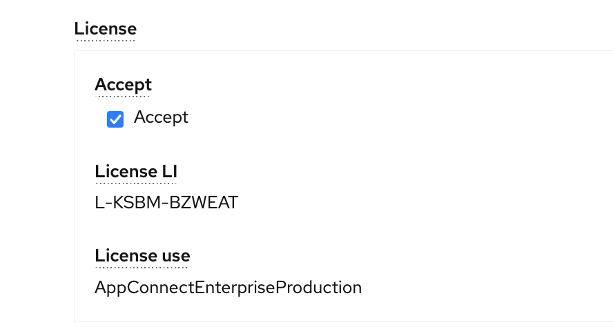
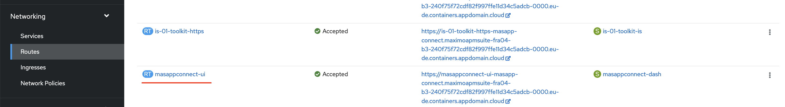

# Objectives
In this exercise you will learn how to:

* Install App Connect.
* Configure App Connect for use with Health Predict and Utilities.

You can skip these exercise steps if you are loading data using Pytho.  Or your instructor has already loaded asset data for you into your environment.

# App Connect Installation (optional)

1. Install IBM App Connect operator as part of OpenShift Platform.

2. Create the namespace / project in OpenShift platform. E.g. masapp-connect

3. App Connect Operator version has to be carefully choosen. E.g. App Connect operator 1.5.2 in OCP 4.6 and 3.0 in OCP
4.8 

4.  Provide the name for App Connect, choose the right version

5.  Choose the License. Selec the right license name in related to operator version is provided in below. [License-Details](https://www.ibm.com/docs/en/app-connect/containers_cd?topic=resources-licensing-reference-app-connect-operator)

6.  Choose the License use as "AppConnectEnterpriseProduction" 

7.  Choose the right "Channel Version"
It is important to choose the right "Channel Version". Relevant channel version is mentioned in link above as part of Step-5

8.  Choose the "Storage type" as "persistent-claim"

9.  Choose "Common Services" as "False"

10. Provide the name for app connect, choose the right version, chooes the right project name and "Click" on Install 
Wait for about 3-5 mts. Operator shall be installed. Installation can be verified by clicking "Worloads --> Pods --> {Project/Namespace}.
Pods should be in "Running" Status

Link for App Connect installation --> https://www.ibm.com/docs/en/app-connect/containers_cd?topic=operator-installing-red-hat-openshift

11. Once the operator is installed successfully, there will Integration link created in "Networking --> Routes". There 
is a URL created like `<appconnectName-ui>` 

# App Connect Configuration (optional)

1. Open App Connect application by clicking the URL in above step-11

2. Upon click the URL App Connect Integration server opens.  Create and configure new Integration server to load the 
data files. Integration servers are created using "BAR" files that are made available as part of App Connect setup.