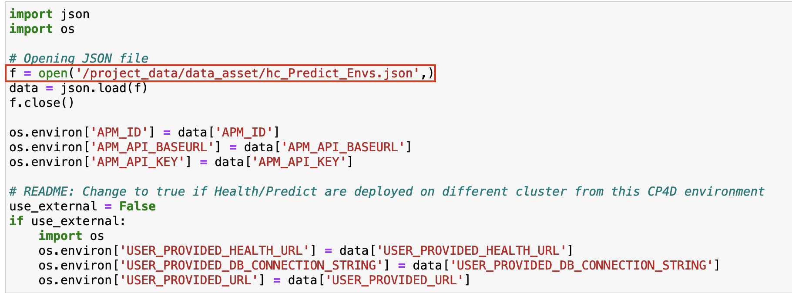
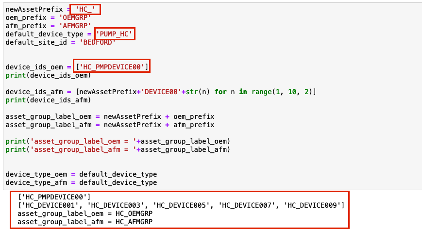
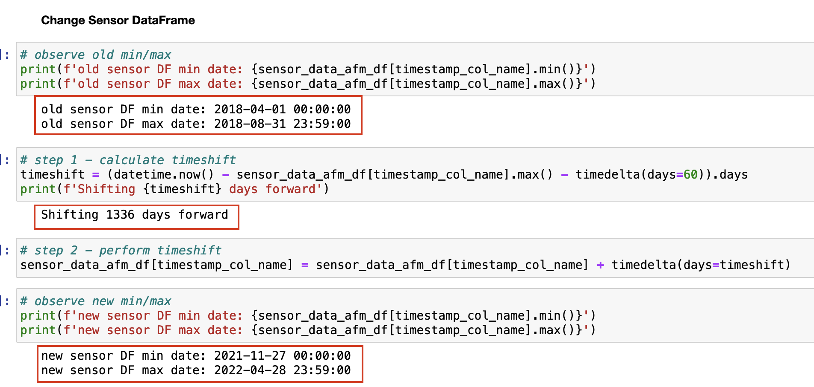
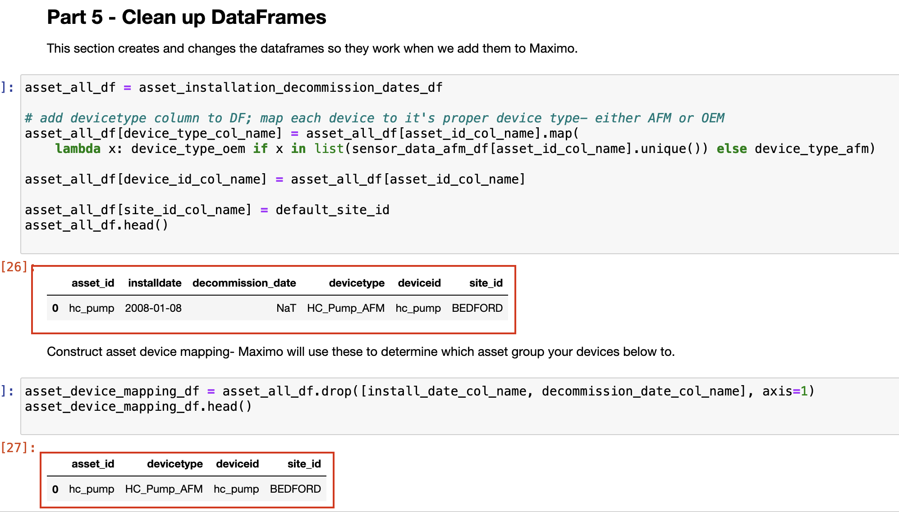
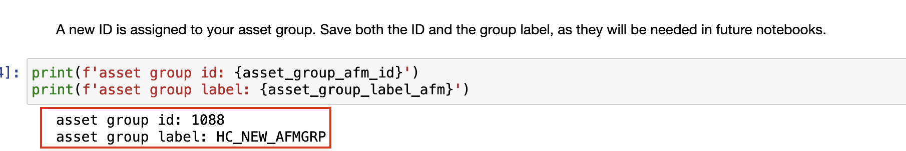
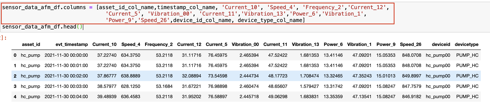
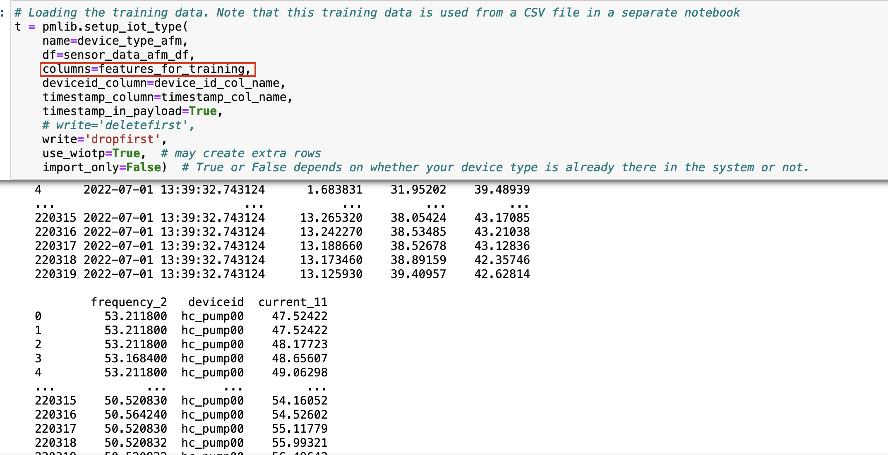
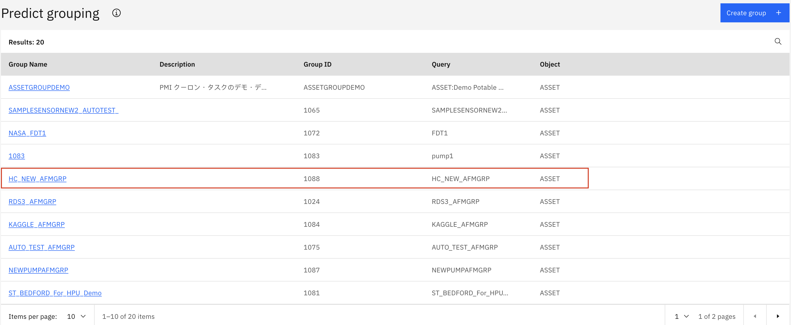
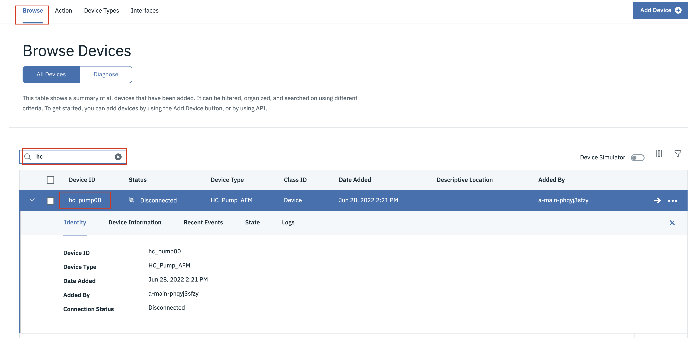

# Load Historical Pump Data Into Monitor
Maximo Predict includes notebook templates that you can use to quickly upload your device data and associate them to newly created assets within Maximo. Out of the box, users are provided with a set of notebooks including multiple different Fast Start Data Loaders. These notebooks vary in what type of data they will be uploading into the Maximo System. In this lab, we will be uploading sensor data for new devices, failure data, and new assets.

In this exercise you will use Watson Studio, Monitor and Predict to:

1. [Upload historical Data](#faststart_notebook) using the FastStart Loader notebook template. 
2. [Run Notebooks](#run_notebooks) to load your device type and device metrics into Monitor and creates Predict groups.
3. [Confirm Monitor Data Upload and Prediction Groups](#confirm_upload)
4. [Error Handling](#error_handling) for data column name format

!!! note
    You must complete the previous exercise for [Data Preparation and Loading Using Notebooks](data_preparation.md) exercise before you start this exercise.

## Pre-requisites 

- Review Predict documentation for the [list of available models](https://www.ibm.com/docs/en/mhmpmh-and-p-u/8.5.0?topic=overviews-maximo-predict-850).
- Ensure your MAS Predict environment is running and you have access.  Try your server URL that might look something like: [https://main.predict.ivt11rel87.ivt.suite.myhost.com/ibm/pmi/service/rest/system/info](https://main.predict.ivt11rel87.ivt.suite.myhost.com/ibm/pmi/service/rest/system/info)

## Upload and Start the Fast Start Data Loader Notebook

1. Upload or open the Fast Start Data Loader template notebook to your Project. These instructions will be based off using the 'FastStart2021-New.ipynb' file.  Use the steps from the previous exercise [Add Notebook From File to a Watson Studio Project](setup_watson_studio.md)  Rename the notebook template by prepending your initials to the template.  If you already have uploaded the notebook, open it with Watson Studio.
Select the `FastStart2021-New.ipynb` notebook template that you have renamed with your initials. 

2. Open the notebook.  Click on the `pencil` icon next to your notebook 

3. If the notebook fails to start, restart it.  Click on the `i` icon , `Environment` tab,  `Running status` drop down select box and choose `Restart`

## Run the Notebook

### Part 1 - Introduction
1. Run the first cell two cells. These cells are setting up the files required to complete the notebook.
2. Read the introduction for details on the notebook and how it fits into the Maximo Predict process. Ensure that your csv files are uploaded in the requested format. Note that the asset metrics csv file needs to have Asset Id, Install Date and Decommission Date, NOT the site ID. 

### Part 2 - Install the Maximo Predict SDK
1. Ensure you have a 'Predict_Envs.json' file uploaded. If one is not provided, follow the instructions in [set up Watson Studio](setup_watson_studio.md)under the 'Get URL' section to gather the `APM_ID`, `APM_API_BASE_URL`, and `APM_API_KEY` to create a JSON file containing the credentials and upload to Watson Studio with your initials prepended to the file name.
2. Run the cell to open the JSON file. If you have created a JSON file with your initials prepended, update `f = open('/project_data/data_asset/Predict_Envs.json,)` to include your initials on the file name. See example image.
 
3. Run the following two cells to set up variables required for the environment. Note that both should produce an output without errors similar to `main.predict.ivt11rel87.ivt.suite.maximo.com`
4. Run the cell to install the pmlib using the pip install command
5. Ensure the output runs without errors. (Warnings are Okay) then run the cell to import pmlib into the project
6. Run the cell to import the additional required libraries
7. Update the following values in the cell with your initials:
 - Change `newAssetPrefix = 'New_'` to `newAssetPrefix = '{initials}_'`
 - Change `default_device_type = 'Pump_AFM'` to `default_device_type = '{initials}_Pump_AFM'`
 - Change `device_ids_oem = ['PMPDEVICE002', 'PMPDEVICE004', 'PMPDEVICE006', 'PMPDEVICE008', 'PMPDEVICE010']` to `device_ids_oem = ['{initials}_PMPDEVICE00']`
8. Run the cell and make a note of the resulting output. This will be needed in future notebooks to call your assets.
 
9. Run the following cell to store the variables just created
10. Run the cell to set the preferred column names for Maximo's system

### Part 3 - Load the Data Into Dataframes
1. Update `asset_installation_decommission_dates_df = pd.read_csv('/project_data/data_asset/asset_installation_decommission_date_afm.csv')` to match the filename for your asset information (containing asset id, installation date and decommission date).
2. If your Installation Date column header or your Decommission date column header do not match the values called in this cell (`installation_date` and `decommission_date`), update to match your column headers.
3. Run the cell to load the asset attributes and ensure the output matches your data. Note that the column headers in the output should match the variables defined in the previous cell.
4. Repeat these steps for each csv file being imported for the remainder of part 3.
5. Note: Not all of these cells are redefining the column headers. If you get errors down the line, you may need to update the column header in the data frame created here. See [Update DateFrame Headers](#update_df_headers).

### Part 4 - Add Timeshift to Make Data More Recent
1. Run the first cell to view the current date range of the data.
2. Run the second cell to calculate and view the shift in time that will be applied
3. Run the third cell to perform the time shift
4. Run the fourth cell to view the new range of dates for the sensor dataframe
 
5. Repeat these steps for the remainder of part 4 to perform the timeshift on the failure data

### Part 5 - Clean up DataFrames
1. Run these two cells to clean up dataframes and reformat to Maximo's standards
 

### Part 6 - Delete Existing Data

!!! note 
    This section is REQUIRED if you are refreshing asset data or uploading new data for an existing asset. If you get errors in this section, you may need to update the column header in the data frame created here. See [Update DateFrame Headers](#update_df_headers).

1. Run the first four cells to delete data from Maximo to be replaced. Wait five minutes after the final cell to allow for the data to be fully deleted
2. Run the next two cells to delete the asset group

### Part 7 - Insert Data

The following steps will update the MAS database to include the data from the CSV files.
1. Run the cell to view the DataFrame to be imported and run the following cell to use the pmlib library to create the assets in the list.
2. Run the cell to view the assets attributes that will be imported into MAS. Run the following cell to update those values.
3. Run the cell to view the failure history that will be imported into MAS. Run the following cell to import the failure data.
4. Run the cell to write the function definitions required to create your asset group. Run the following cell to create teh asset group.
5. Run the cell to print the asset group name and the asset group id. Take a note of the results as they may be needed in future notebooks.
 

6. Run the following cell to store the notebook results
7. Set up the IOT Devices.   Update DataFrame columns from `[timestamp_col_name, asset_id_col_name, 'VELOCITYX', 'VELOCITYY', 'VELOCITYZ', 'MOTORTEMP', 'WINDINGTEMP', 'CURRENT', 'PRESSURE', 'LOAD', device_id_col_name, device_type_col_name]` to match the sensor readings for your asset. For example, the line may now read:
   `sensor_data_afm_df.columns = [asset_id_col_name,timestamp_col_name, 'Current_10', 'Speed_4', 'Frequency_2','Current_12','Current_5', 'Vibration_00', 'Current_11','Vibration_13','Power_6','Vibration_1','Power_9','Speed_26',device_id_col_name, device_type_col_name]`

8. Run the cell 
9. Click into the next cell 
10. In the menu, go to `Insert > Cell Above` 

11. In that cell, insert the following code and run:
`features_for_training=list(set(list(sensor_data_afm_df.columns))- set(['asset_id','evt_timestamp','deviceid','devicetype']))
features_for_training`
   
12. Update the value of `columns` to `columns=features_for_training`

13. Run the cell and ensure there are no errors
14. Run the following cell to import the asset device mappings
15. Continue to part 8 or scroll down to run the final cell to save the results.

### Part 8 - Add additional Data (Optional)
This portion of the notebook is optional. If there is additional data to be uploaded you can use this section and customize the data being sent to MAS and creating scoring data for your assets. These cells would have to be updated for your data.

!!! note
    
    Ensure you run the final cell with:
    `store_json = json.dumps(store)
    project.save_data("fast_execution.json", store_json, overwrite=True)`

## Confirm Data Upload and Prediction Groups

Confirm that the historical data was uploaded to Monitor.  Confirm that the Prediction group was created and linked to the model notebook template you created.

1. Navigate to Predict within your environment
2. Use the left-hand menu to go into `Predict Grouping`
    

3. Ensure your asset group is available in the list and confirm your asset is available within the group.

4. Navigate to IOT within your environment.  Under `devices`, search to ensure your `device` is there

5. Navigate to `Device Types` and find your device type. Check that your `physical` and `logical interfaces` are active.

6. Navigate to Monitor and ensure your devices have data

## Error Handling

### Update DateFrame Header
If you receive an object attribute error for pandas, with a column header initialized in [Part 2](#part-2---install-the-maximo-predict-sdk) step 10 listed similar to:
 
Then follow these steps to replace your dataframe header to resolve this error.
1. Click into the cell that resulted in an error.

2. In the menu, go to `Insert > Cell Above` 
 

3. Rename the columns by adding the following code in the cell:
`{DataFrame_to_Change}.rename(columns={'{current_column_header}': site_id_col_name}, inplace=True)`
`{DataFrame_to_Change}.head()`

4. Run the cell. The output should show the new header in the table.  For example: in order to change the `failure_data_afm_df` column header from `'site'` to the preferred header:
  

Congratulations you have loaded historical data and created Predict Groups linking your devices metrics inputs to list of assets and notebook template that will be used to score predictions using Predict with Monitor device data!

