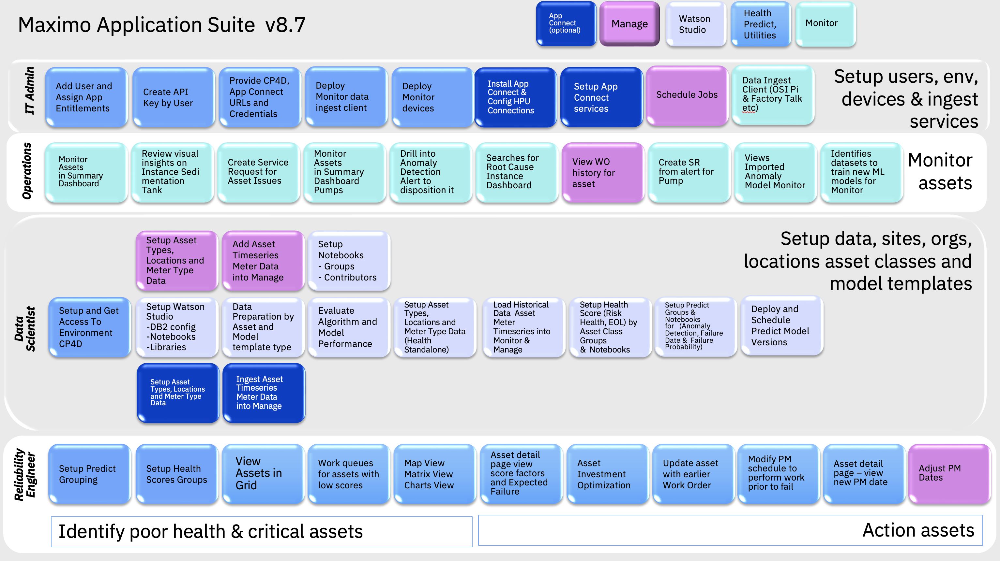
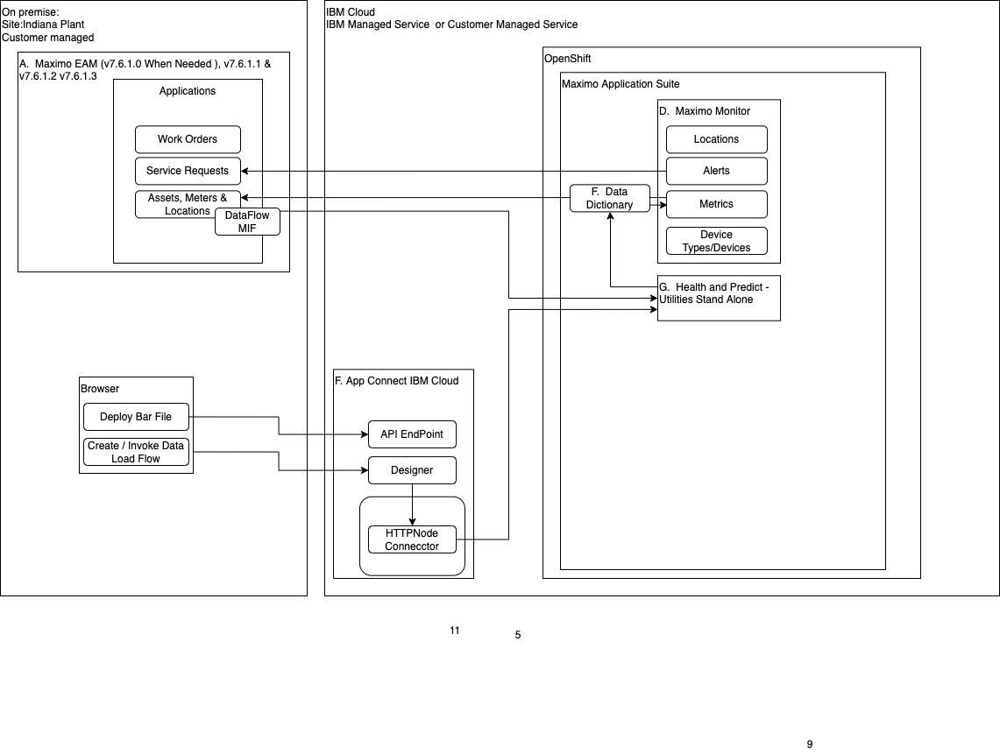
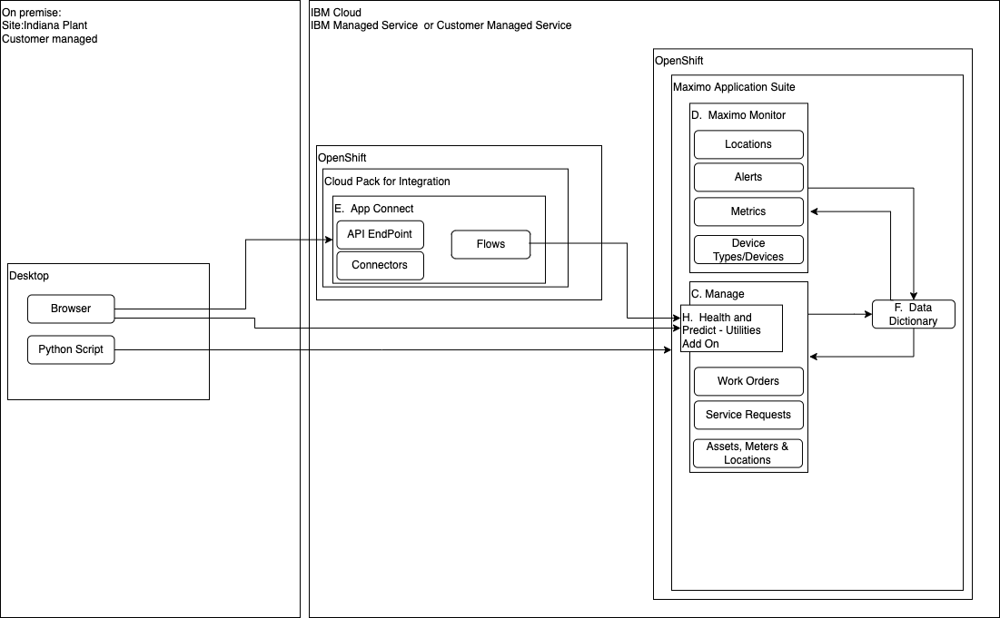

# Get Started
In this Lab you wil learn how to use Maximo Health and Predict-Utilities to understand the asset health and failure risks for pumps and other utility assets.

The version of Health and Predict - Utilities used in this Lab is for Maximo Application Suite v8.7.

## Description

Maximo Manage includes the ability to manage assets.  Reliability Engineers can use asset data stored in Manage and other data sources to better plan their asset
maintenance and repairs to ensure asset reliability and reduce operational risks.  By leveraging asset health scoring and AI algorithms to detect anomalies and predict asset failures in time to mitigate or avoid their negative impacts. 

Health and Predict - Utilities includes proven  machine learning model templates to make predictions or 
classify asset condition using asset data.  These lab exercises provide you the best practices and guided instructions for how to use Health and Predict - Utilities to set up and asses your asset condition scoring, failure prediction dates and anomaly detection using a real world public pump data set..

The intended audience for this lab are reliability engineers and data scientists who will set up the Maximo Environment and  analyze their 
data to create prediction models for asset end of life using Predict model templates.  Reliability Engineers who need to
plan to address poor asset health and risk with an asset investment plan to repair or replace their assets.

You will use a publicly available [pump data set from Kaggle](https://www.kaggle.com/datasets/nphantawee/pump-sensor-data?resource=download) to build a Anomaly Detection model.   

The [pump data definition](https://www.kaggle.com/datasets/nphantawee/pump-sensor-data/discussion/131429?resource=download) explains what sensor readings are available based on the known information about the data set provided on the Kaggle site 

You will use instructor provided simulated CSV asset data for a set of substation transformers to create health scores and asset failure predictions using the automation notebooks provided.

**Ways to Setup and Load Asset Data**

There are three possible ways to get data into Health and Predict - Utilities.

1. [Data loading Python Notebooks](hpu_models.md) requires that you have [set up Watson Studio with Predict Libraries and Notebooks ](setup_watson_studio.md).

2. Data loading meter data using EAM CronTask is not covered in this lab

3. Data loading meter data and asset types using App Connect is not covered in this lab. Only the installation is covered.

**Pre-requisites**

For this exercise ensure you have access to :

-  MAS v8.7  Health and Predict.    
-  Cloud Pak for Data Watson Studio compatible with MAS v8.7
-  App Connect (optional). You can use the App Connect add on included with Maximo Application Suite as an Add On. Or install it yourself using the App Connect exercises.
-  Access to the asset csv data and Jupyter Notebooks used to in this Lab exercise.  They can be provided by the instructor. 

# Exercises

These are the exercises available in this lab.

1. [Setup Watson Studio](setup_watson_studio.md) with Health and Predict - Utilities libraries and Notebook templates

2. [Understand Health and Predict - Utilities Models](hpu_models.md) explains how to prepare your asset data to be analyzed by Health and Predict - Utilities. 

3. [Data Preparation](data_preparation.md) explains how to prepare and format your asset data into files needed for an example prediction model using  Health and Predict - Utilities with Watson Studio.

4. [Load Historical Utilities Data](asset_data_loader.md) explains how to assess the performance of a failure date prediction model using  Health and Predict - Utilities with Watson Studio.

5. [Pump Data Dictionary](data_dictionary.md) explains the public pump data used in this lab from Kaggle.

6. [Load Historical Pump Data](fast_start_loader.md) explains how to Load Historical Pump Data Into Monitor using  Health and Predict - Utilities with Watson Studio and create:

   - Failure Prediction Date Model 
   - Failure Probability  Model 
   - Anomaly Detection Model 
   - Prediction Group to link  a group of assets to a deployed Predict models.

7. [Asset Health Scoring](appconnect_install.md) Reliability Engineer uses the MAS Health and Predict applications to review the asset conditions and ensure that there aren't any failures predicted before planned maintenance.

8. [Asset Investment Optimization](asset_investment.md) to action assets in poor condition using the Health Web UI.

9. [Install and Configure App Connect](appconnect_install.md) flows to load asset metadata and timeseries data into Health and Predict - Utilities.  (Optional)

 

### Architecture

Here is the architectural deployment pattern these labs are targeted for:

Maximo v7.6.1 deployment with Maximo Application Suite Health Predict and Utilities

Maximo Application Suite Health Predict and Utilities deployed as a Manage Add On

