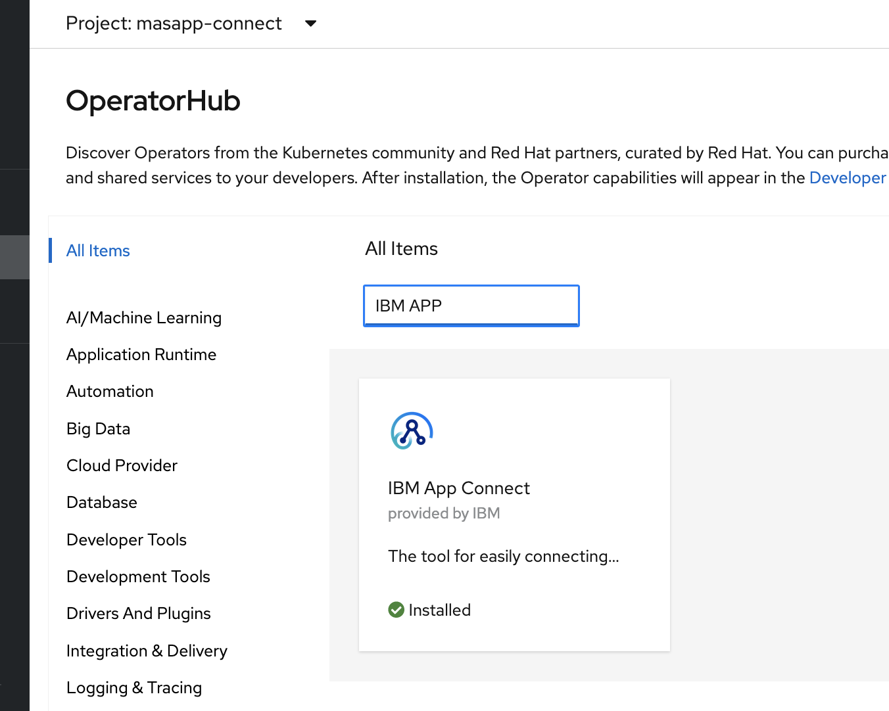

# Pre-Requisite Instructions

This Hands on Lab requires:

* Your instructor has provided you the data, Python scripts, functions and notebooks used in the lab.  

* An account for IBM ID.  If you don't have an IBM ID you can get one [here](https://www.ibm.com/account/reg/signup?): 

    - Click `Login to MY IBM` button
    - Click `Create an IBM ID` link

* Access to a Maximo Application Suite v8.7 environment. Request access from your instructor. 

* Access to Watson Studio to build and test your asset models.  Request access from your instructor.

* Working knowledge of using Jupyter notebooks to edit and test models.  See this [reference](https://realpython.com/jupyter-notebook-introduction/#:~:text=The%20Jupyter%20Notebook%20is%20an,the%20people%20at%20Project%20Jupyter.)

* Understanding of Pandas Python library for processing timeseries data.  See these references.

    - [Tutorial on Using Pandas](https://medium.com/analytics-vidhya/module-6-pandas-5b053ee1e1a1)

    - [Basic Time Series Manipulation with Pandas](https://towardsdatascience.com/basic-time-series-manipulation-with-pandas-4432afee64ea)

    - [Using Pandas timeseries and dates](https://pandas.pydata.org/pandas-docs/dev/user_guide/timeseries.html)

* Internet access to these [lab instructions](https://mam-hol.eu-gb.mybluemix.net/apm_8.7/)

* User access to a Maximo Application Suite environment.  Your Exercise facilitator can provide you with the information to access the environment.

* Test your access to the Maximo Application Suite environment.

# Optional Exercises

You can skip the App Connect Data Load Exercises if you are loading data using Python.  Or if your instructor has already loaded asset data for you into your environment.

The App Connect data loading exercises require that you either use the provided App Connect Add On included with Maximo Applicaiton Suite.  Or follow the Lab exercises to install and setup App Connect.  

2. OpenShift version 4.6 or 4.8 installed & Administration access to OpenShift Platform so that you can complete the App Connect installation and setup steps.

3. Verify the IBM App Connect `Operator`is available in OpenShift Platform.  If IBM App Connect is not available as `Operator`, then you need to make it available using standard operator.

If an Operator is not available, use the [documenation](https://www.ibm.com/docs/en/app-connect/containers_cd?topic=access-enabling-operator-catalog) to make an operator available in OpenShift Platform.

