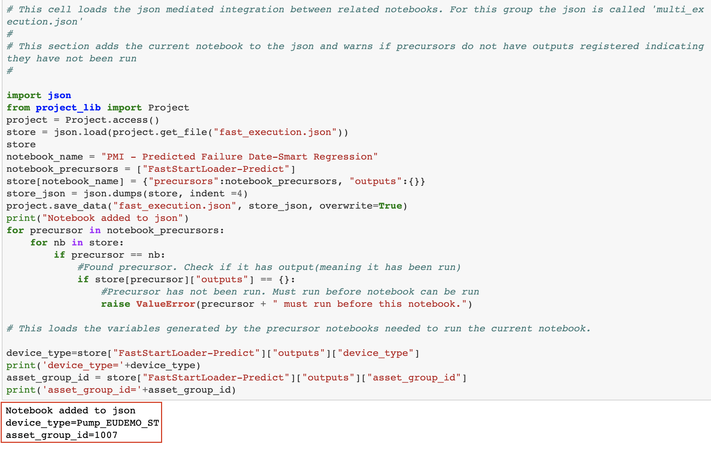
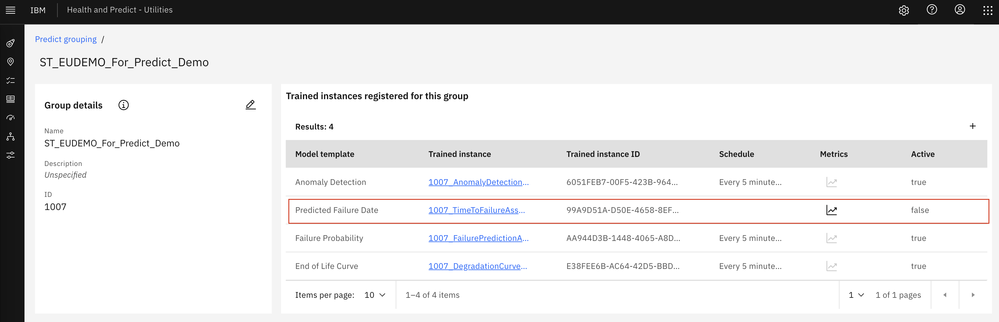
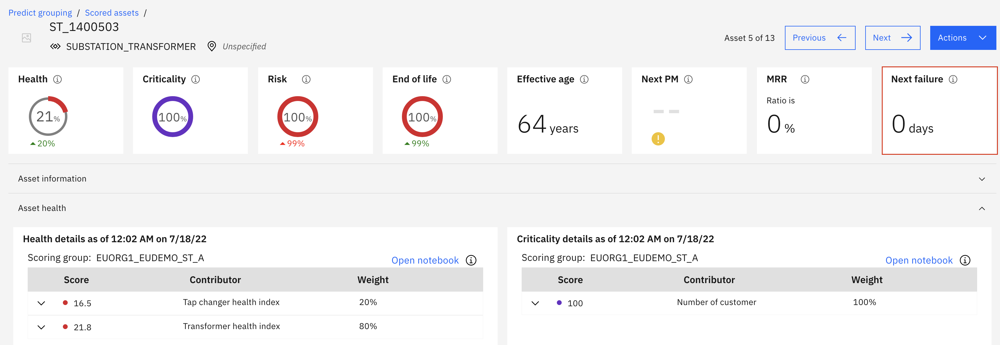
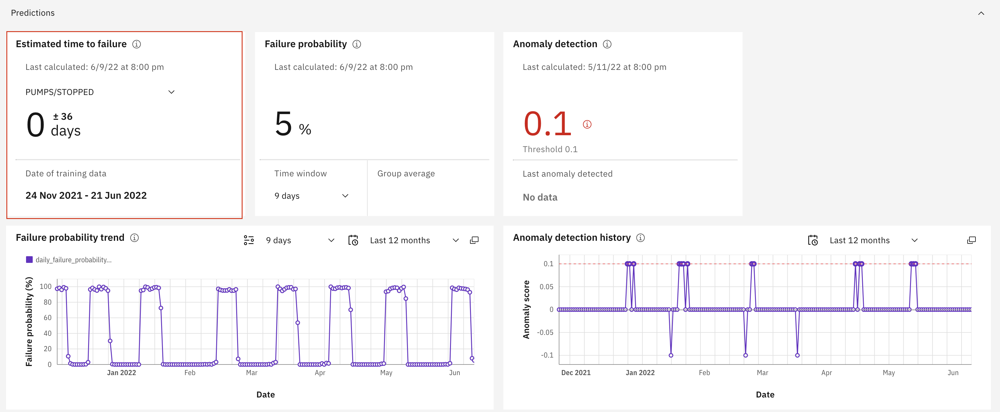

# Create Predicted Failure Date

Maximo Predict comes with notebook templates to assist in streamlining data uploads to Maximo. This notebook will create the Predicted Failure Date using provided csv files.

These instructions use the notebook named `5_PMI - Predicted Failure Date-Smart Regression-HPU` file with the Substation Transformer for Health and Predict for Utilities Demo Assets. Note that this uses simulated Pump Data for the sensor readings.

In this exercise you will use Watson Studio and Health and Predict - Utilities to:

2. [Upload the and Run the Predicted Failure Notebook](#FP_notebook) using a template to Train and Display a Predicted Failure Date
3. [Confirm](#confirm_upload) the Data Has been uploaded for your assets

!!! note

    You must complete the previous exercise for [Setup Watson Studio](setup_watson_studio.md) before you start this exercise.

## Pre-requisites 

- Review Predict documentation for the [list of available models](https://www.ibm.com/docs/en/mhmpmh-and-p-u/8.5.0?topic=overviews-maximo-predict-850).
- Ensure your MAS Predict environment is running and you have access.  Try your server URL that might look something like: [https://main.predict.ivt11rel87.ivt.suite.myhost.com/ibm/pmi/service/rest/system/info](https://main.predict.ivt11rel87.ivt.suite.myhost.com/ibm/pmi/service/rest/system/info)
- Ensure you have Access to Asset data files for the Health and Predict Utilities Demo Data
- Complete the [Load Data into Manage](asset_data_loader.md) lab for the Utilities data.
- Complete the [Load Utilities Health Scores via Notebook](utilities_score_notebook.md) lab
- Complete the [Create Utilities Predict Group and Upload Sensor Data](utilities_devicedata.md) lab 
- Have the following information from the previous lab: `Predict_Envs.JSON` and `Fast_Execution.JSON`

!!! note

    It is best to perform this lab in your own Watson Studio Project created using [Setup Watson Studio](setup_watson_studio.md) instructions. If you are using a shared project, ensure you append each file uploaded with your initials and update the file paths in the notebooks to include that change.

## Upload and Start the Predicted Failure Date Notebook

1. Upload or open the Predicted Failure Date template notebook to your Project. Use the steps from the previous exercise [Add Notebook From File to a Watson Studio Project](setup_watson_studio.md)  If you are using a shared project, rename the notebook template by prepending your initials to the template. If this is done, ensure any paths or file names within the notebook are updated as well. If you already have uploaded the notebook, open it with Watson Studio.
Select the `5_PMI - Predicted Failure Date-Smart Regression-HPU` notebook template. 

2. Open the notebook. Click on the `pencil` icon next to your notebook.

3. If the notebook fails to start, restart it.  Click on the `i` icon , `Environment` tab,  `Running status` drop down select box and choose `Restart`

## Run the Notebook

### Install the Maximo Predict SDK

1. Read the introduction to the Predicted Failure Date Notebook.

2. Run the first cell to define the requirements and some environment variables to run this notebook. This cell also checks that the precursor notebook has been run. Additionally, this cell sets the `device_type` and the `asset_group_id` from the stored device type and asset group id in the JSON file produced from the Fast Start Data Loader notebook. Ensure the printed values match your asset group and device.

3. Run the next cell to uninstall the `pmlib` and `srom` libraries. This is done to ensure the correct version is installed.

4. Run the next cell to define the API keys used to call Maximo Predict from the `Predict_Envs.JSON` file

5. Run the next cell to import the os, trim the provided base url to be used when downloading `pmlib` later in the notebook and used to contact the environment via API..

6. Run the following cell to reinstall the `pmlib` library. 

7. Run the next four cells to import the `srom`, `sklearn` and other necessary packages and libraries

### Set up the Model Training Pipeline, Train, Register and Enable the Model

1. Run the first to import `pmlib` library

2. Run the second cell to define the sensor readings columns to be considered in the model

3. Run the next cell to import the models to be tested and trained

4. Run the next cell to view the asset group the desired features will be used in the model training pipeline.

5. Run the next cell to define the model settings for the Pipeline.

6. Run the next cell to train the model. Some models take time to train.

7. Once that process is complete, run the next cell to view the resulting dataframe

8. Run the following cell to register the model to your asset group by running the next cell

9. Finally, Run the next cell to enable it and determine how often it will be run in monitor. This is the last cell to be run in this notebook.

## Confirm Model Registration

1. Navigate to Maximo Health and Predict for Utilities within your environment

2. Use the left-hand menu to go into `Predict Grouping`
 

3. Select your asset group

4. Click into your asset group and ensure you have Predicted Failure Date listed under `Trained instances registered for this group` and select an asset to go to the Health Dashboard

5. Ensure `Next Failure` box is populated at the top of the dashboard. Notice that most of these assets will have `0` in that box

6. Scroll down and expand the `Predict` section to ensure the Predicted Failure Date is visible. 

!!! note

    Recall in the [Create Utilities Predict Group and Upload Sensor Data](utilities_devicedata.md) lab only some assets have sensor data. If an asset does not have sensor data, it will not have Predict data. Additionally, most the assets with data will have a Predicted Failure date of `0 \plusminus x` The following assets should have a future failure date when the notebook is ran:

Congratulations you have created a Predicted Failure Date model and associated it to your assets!

