# Create Utilities Predict Group and Upload Sensor Data

Maximo Predict comes with notebook templates to assist in streamlining data uploads to Maximo. This notebook will create the following resources using provided csv files:

- Device Data in Monitor
- Device Asset Mapping
- Predict Groups

These instructions use the notebook named `2_FastStartLoader-Predict.ipynb` file with the Substation Transformer for Health and Predict for Utilities Demo Assets. Note that this uses simulated Pump Data for the sensor readings.

In this exercise you will use Watson Studio and Health and Predict - Utilities to:

1. [Gather notebook and CSV files](#gather_files) for all data to be uploaded
2. [Upload the and Run the Fast Start HPU Data Loader Notebooks](#FastStart_notebook) using a template to upload new Device Data and Predict Groups into Maximo
3. [Confirm](#confirm_upload) the Data Has been uploaded for your assets
4. [Handle Errors](#error_handling) that may come up in the process

!!! note

    You must complete the previous exercise for [Setup Watson Studio](setup_watson_studio.md) before you start this exercise.

## Pre-requisites 

- Review Predict documentation for the [list of available models](https://www.ibm.com/docs/en/mhmpmh-and-p-u/8.5.0?topic=overviews-maximo-predict-850).
- Ensure your MAS Predict environment is running and you have access.  Try your server URL that might look something like: [https://main.predict.ivt11rel87.ivt.suite.myhost.com/ibm/pmi/service/rest/system/info](https://main.predict.ivt11rel87.ivt.suite.myhost.com/ibm/pmi/service/rest/system/info)
- Ensure you have Access to Asset data files for the Health and Predict Utilities Demo Data
- Complete the [Load Data into Manage](asset_data_loader.md) lab for the Utilities data.
- Complete the [Load Utilities Health Scores via Notebook](utilities_score_notebook.md) lab 
- Have the following information from the previous lab: `SITE_ID`

!!! note

    It is best to perform this lab in your own Watson Studio Project created using [Setup Watson Studio](setup_watson_studio.md) instructions. If you are using a shared project, ensure you append each file uploaded with your initials and update the file paths in the notebooks to include that change.

## Gather notebooks and CSV Files

1. Ensure you have the `2_FastStartLoader-Predict.ipynb` notebook from the github as outlined in [Load Data into Manage](asset_data_loader.md#gather_files).

2. In that folder, ensure you have 3 csv files under `csv > predict_csv_st` containing asset installation information, asset failure dates and sensor data

3. Open the `hpu_st_failure_data_afm_vel_timeshifted_v17.csv` and update the Site ID to your site ID from [Load Data into Manage](asset_data_loader.md)
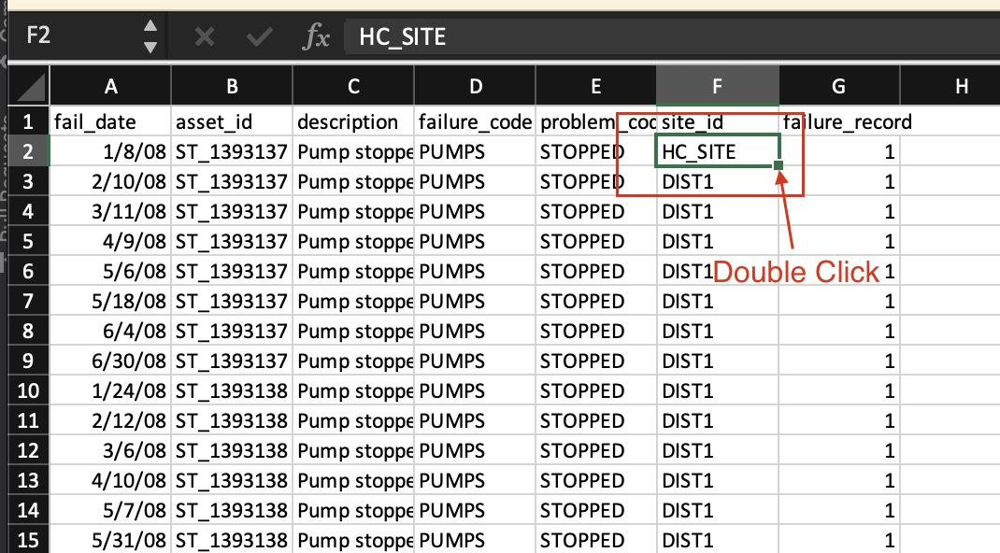 

4. In the `notebooks` folder there should be a file titled `2_FastStartLoader-Predict.ipynb`

## Upload and Start the Fast Start Data Loader Notebook

1. Upload or open the Fast Start Data Loader template notebook to your Project. Use the steps from the previous exercise [Add Notebook From File to a Watson Studio Project](setup_watson_studio.md)  Rename the notebook template by prepending your initials to the template.  If you already have uploaded the notebook, open it with Watson Studio.
Select the `2_FastStartLoader-Predict.ipynb` notebook template. 

2. Open the notebook.  Click on the `pencil` icon next to your notebook 

3. If the notebook fails to start, restart it.  Click on the `i` icon , `Environment` tab,  `Running status` drop down select box and choose `Restart`
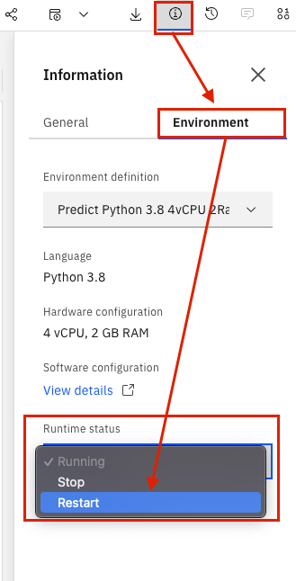

## Run the Notebook

1. Run the first cell two cells. These cells are setting up the files required to complete the notebook.

2. Read the introduction for details on the notebook and how it fits into the Maximo Predict process.

3. Ensure you have a 'Predict_Envs.json' file uploaded. If one is not provided, follow the instructions in [set up Watson Studio](setup_watson_studio.md)under the 'Get URL' section to gather the `APM_ID`, `APM_API_BASE_URL`, and `APM_API_KEY` to create a JSON file containing the credentials and upload to Watson Studio with your initials prepended to the file name.

4. Run the cell to open the JSON file.

5. Run the cell to uninstall the pmlib. This is done to ensure the right version is installed later in the process.

6. Run the following two cells to set up variables required for the environment and the structure of the JSON file that will be stored on completion of the notebook. Note that both should produce an output without error.
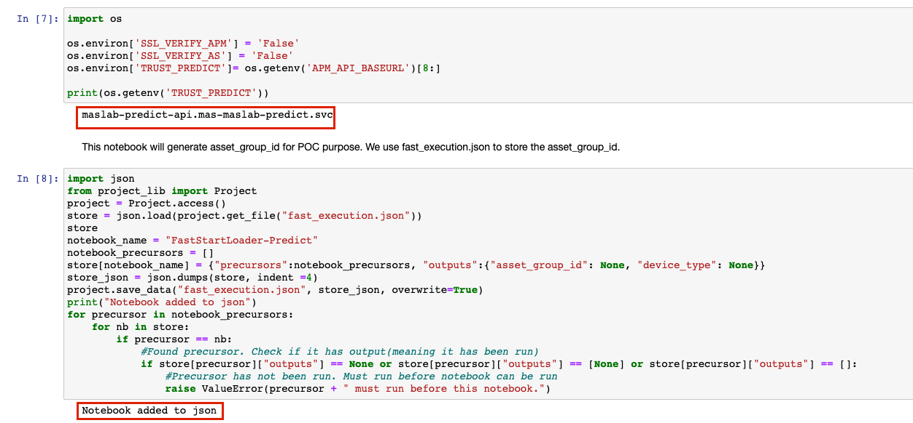 

7. Run the following 3 cells to install pmlib and import the additional required libraries

8. Update `default_site_id = 'EULARGE1'` to `default_site_id = '{your site id}'`

9. Run the cell to define your device type name, site id, and your asset group label. Make a note of the resulting output. This is the asset group label that will be the name of your predict group.
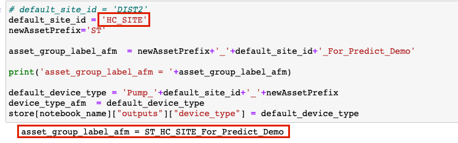 

10. Run the following cell to import the csv containing the asset data and update the dataframe's data types

11. Run the next cell to import the sensor data and update the data frame to match the desired format. This will replace the device type with the one defined two cells above and adds the asset id for each row.

12. Run the following cell to rename the `timestamp` column to the desired name and data type.

13. Run the following cell to create a list of the different Device Ids that will be created. Note that not all the assets have an associated device data.
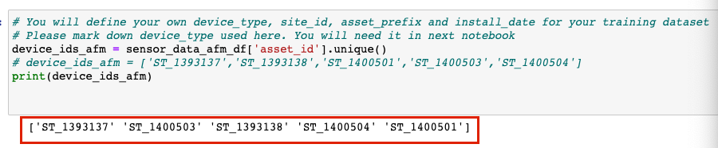 

14. Run the next cell to upload the failure data as a dataframe

15. Run the next cell to create add the devices to the asset data table imported in step 10

16. Run the following cell to construct the asset device mapping table that will be needed for later in the notebook
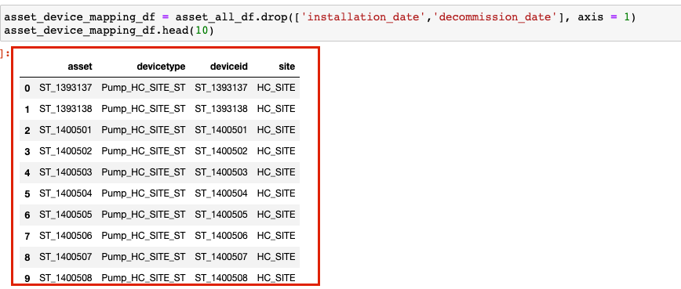 

17. Run the next 6 cells to delete the data. These cells do NOT have to be run if this is the first time uploading data. If you need to re-upload the sensor data or recreate the group then the cells are required to be run. The final cell has a 5 minute delay to ensure the data gets fully deleted. Notice there is a commented out cell that would delete your assets. This is because we uploaded assets using the [Load Data into Manage](asset_data_loader.md) and did not want to delete the extra data we uploaded.

18. Run the next cell following the delete cells to import the Maximo api calls and clean up the data frames.

19. Run the next cell to confirm the asset_group_label_afm that will be the name of your predict group

20. The next few cells will be inserting the asset data into Maximo. Run the first cell to confirm the asset data to be imported

21. Run the next two cells to shift the time of the sensor data to two days ago (to be more recent) and the failure dates accordingly

22. Note that the data is now in the current year

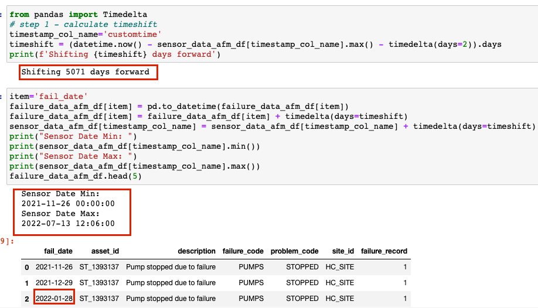 

23. The next two commented out cells will create the assets and asset attributes. Since this information was uploaded earlier in the lab, they do not have to be run

24. Run the next cell to check if the failure code exists in your organization. If it does not, it will create one.

25. Run the next cell to import the asset failure history

26. Run the following cell to define the functions to create the asset group and filter for that group

27. Run the next cell to use those functions to create the asset group filter and create teh asset group.

28. Run the next cell to get the asset group id for the recently created predict group. This will be stored in a json file and used in future notebooks.

29. Run the final cell in this section to view and note the asset group id

30. Run the first cell in the `Setup IOT Devices` section to update the column headers and view the dataframe along with the amount of data to be uploaded

31. Run the following cell to load in the training data for the models. This will set up the IOT devices and the associated sensor data.

32. Run the next cell to view the asset device mappings to be uploaded

33. Run the next cell to load the asset device mappings

34. Run the final three cells to save and view the data in the `fast_execution.json` file. Ensure the `asset_group_id` and the 34. Run the final three cells to save and view the data in the `fast_execution.json` file. Ensure the `asset_group_id` and the `device_type` match the values displayed throughout the notebook

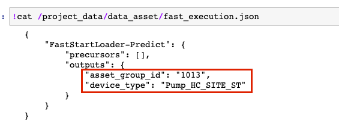 

35. The remaining cells will create scoring data for the predict group created. This is not being done since in the following labs, models will be created and assets will be scored for the created predict group at that time.

## Confirm Data Upload and Prediction Groups

Confirm that the historical data was uploaded to Monitor.  Confirm that the Prediction group was created and linked to the model notebook template you created.

1. Navigate to Maximo Health and Predict for Utilities within your environment

2. Use the left-hand menu to go into `Predict Grouping`
    

3. Ensure your asset group is available in the list and confirm your asset is available within the group.
 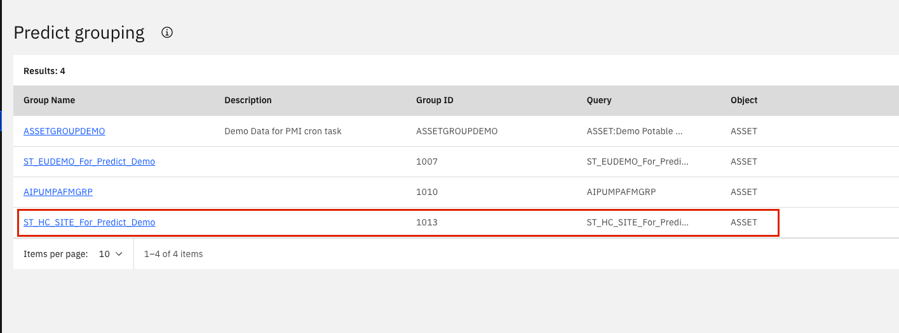 

4. Navigate to IOT within your environment.  Under `devices`, search to ensure your `device` is there
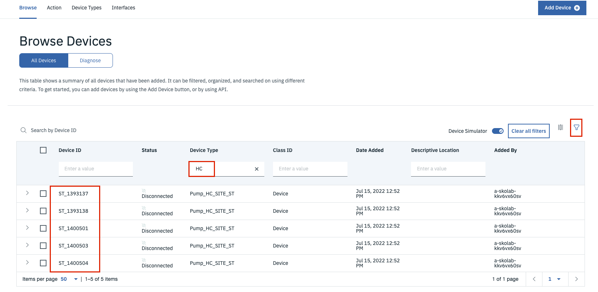

5. Navigate to `Device Types` and find your device type. Check that your `physical` and `logical interfaces` are active.

6. Navigate to Monitor and ensure your devices have data

## Error Handling

### Update DateFrame Header
If you receive an object attribute error for pandas, with a column header initialized in [Part 2](#part-2---install-the-maximo-predict-sdk) step 10 listed similar to:
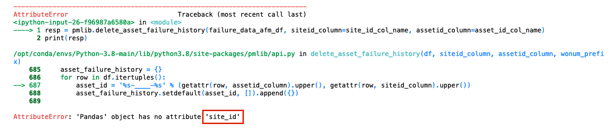 
Then follow these steps to replace your dataframe header to resolve this error.
1. Click into the cell that resulted in an error.

2. In the menu, go to `Insert > Cell Above` 
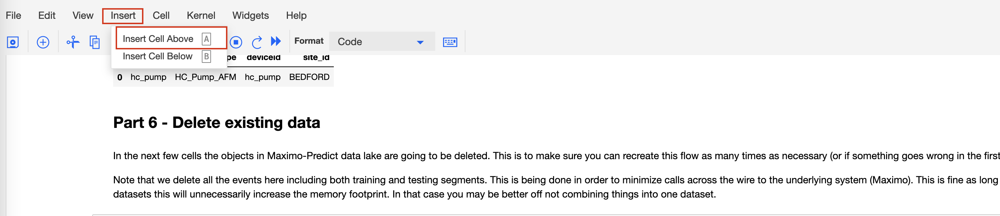 

3. Rename the columns by adding the following code in the cell:
`{DataFrame_to_Change}.rename(columns={'{current_column_header}': site_id_col_name}, inplace=True)`
`{DataFrame_to_Change}.head()`

4. Run the cell. The output should show the new header in the table.  For example: in order to change the `failure_data_afm_df` column header from `'site'` to the preferred header:
 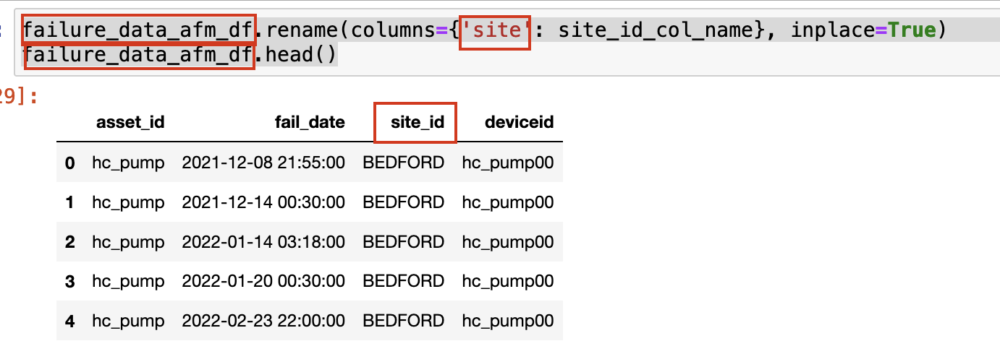 

Congratulations you have loaded historical data and created Predict Groups linking your device's metrics inputs to list of assets and notebook template that will be used to score predictions using Predict with Monitor device data!

