# Load Utilities Data Into Manage

Maximo Predict comes with notebook templates to assist in streamlining data uploads to Maximo Manage. This notebook will create the following resources using provided csv files:

- Organizations 
- Sites
- Locations
- Assets
- Meters
- Meter groups

These instructions use the notebook named '0_HPU-DataLoader.ipynb' file with the Substation Transformer for Health and Predict for Utilities Demo Assets.

In this exercise you will use Watson Studio, Manage and Predict - Utilities to:

1. [Gather notebooks and CSV files](asset_data_loader.md#gather_files) for all data to be uploaded
2. [Upload the and Run the HPU Data Loader Notebooks](#FastStart_notebook) using a template to upload new Asset and Location Data to Maximo Manage. 
3. [Confirm](#confirm_upload) the Data Has been uploaded for your assets
4. [Handle Errors](#error_handling) that may come up in the process

!!! note

    You must complete the previous exercise for [Setup Watson Studio](setup_watson_studio.md) before you start this exercise.

This notebook can only be run once per environment per site with the same data set. Prior to uploading data, ensure this data set is not available in Maximo or create a new site or choose a different asset set before running the notebook cells specific to the data to be uploaded. For example, if Substation Transformers are already uploaded for the desired site nad location, only run the cell to upload a new asset csv for that location. 

## Pre-requisites 

- Review Predict documentation for the [list of available models](https://www.ibm.com/docs/en/mhmpmh-and-p-u/8.5.0?topic=overviews-maximo-predict-850).
- Ensure your MAS Predict environment is running and you have access.  Try your server URL that might look something like: [https://main.predict.ivt11rel87.ivt.suite.myhost.com/ibm/pmi/service/rest/system/info](https://main.predict.ivt11rel87.ivt.suite.myhost.com/ibm/pmi/service/rest/system/info)
- Ensure you have Access to Asset data files for the Health and Predict Utilities Demo Data

!!! note

    It is best to perform this lab in your own Watson Studio Project created using [Setup Watson Studio](setup_watson_studio.md) instructions. If you are using a shared project, ensure you append each file uploaded with your initials and update the file paths in the notebooks to include that change.

## Gather notebooks and CSV Files

!!! note

    Reach out to Carlos Ferreira at carlos.ferreria1@ibm.com for if you cannot access the github below.

1. Navigate to `https://github.ibm.com/Watson-IoT/eam-hpu-lab` and click `Code` then `Download Zip` to download the files required to complete this lab

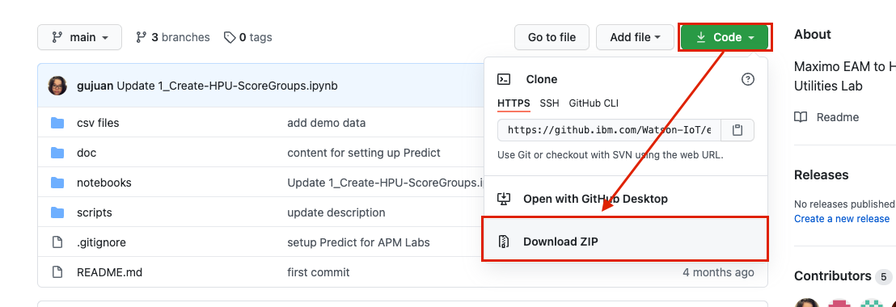 

3. Unzip the file
4. Open the folder labeled `csv file` and zip/compress the folder containing the data to be uploaded to monitor. In this lab, we will be using the file labeled `hpu_csv_v87_st` which contains only the substation transformer data.

5. Return to the root folder, and open the file labeled `scripts` and zip/compress the files inside. Rename the resulting zip file to `hpu_dataloader` then zip/compress it.
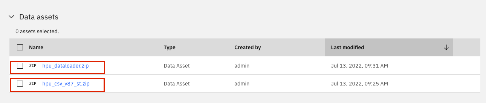
6. Gather the Base url by logging into your Maximo environment, opening the Manage Application and copying the url. Save that and the API key from the previous step to be inserted into this notebook. Follow the instructions in [set up Watson Studio](setup_watson_studio.md)under the 'Get URL' section to gather the `APM_API_KEY`.
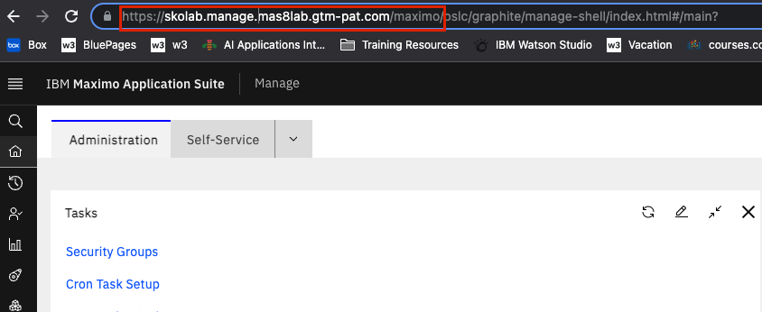

## Upload files and run the Data Loader Notebook

1. Add both the ZIP files to the data assets in your Watson Studio Project.

2. Upload the HPU Data Loader notebook to your Project. Use the steps from the previous exercise [Add Notebook From File to a Watson Studio Project](setup_watson_studio.md).

3. Select the `0_HPU-DataLoader.ipynb` notebook template. 

4. Click on the `pencil` icon next to your notebook to open it in edit mode.

5. If the notebook fails to start, restart it.  Click on the `i` icon , `Environment` tab,  `Running status` dropdown select box and choose `Restart`

## Run the Notebook

 
!!! note 

    If you are using a shared project, this cell is where you would update the file paths to include your initials

1. Run the first cell two cells. These cells are importing and unziping the files to be used and installing necessary packages.

3. Confirm the output has all the necessary files. If it does not and only lists the folder name see [Unable to Unzip the Files](unable_to_unzip)
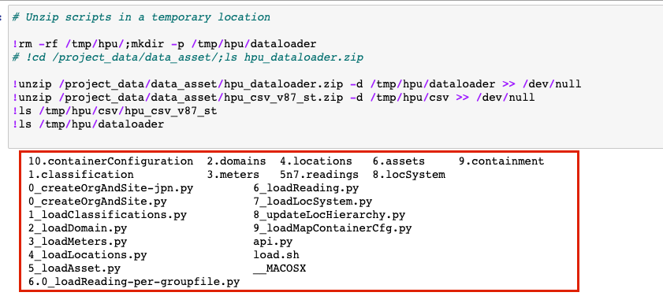 

4. Replace the values of `MX_BASE_URL` and `MX_APIKEY` with the URL and API key gathered at the start of this lab

5. Update the Site ID and the Org ID with the site and org for the data to be associated to. The cell should now look like this:
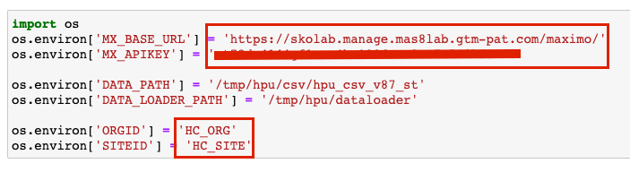 

6. Run the cell to load in the Environment Information and set up the Org and Site to be used
For steps 6-14 you will be uploading data from the CSV files. Some cells may take a few minutes to run. You will know it is complete when the text next to the cell goes from `In[*]` to `In[#]` where the `#` symbol is the order in which cells are run

7. If you are creating a new Org and Site for the assets, run the cell under `Create Org and Site`. If you are uploading data to an existing Site, skip this cell. Before loading into an existing site, ensure the assets indicated do not exist under that site.

8. Run the next cell to upload classification data

9. Run the next cell to upload in domain data

10. Run the next cell to upload in meter and meter group data

11. Run the next cell to upload in location data for containers

12. Run the next cell to upload location data

13. Run the next cell to upload meter readings for locations

14. Skip the commented out cell

15. Run the next cell to upload asset data

16. Run the next cell to upload meter readings for assets

17. Skip the commented out cell

18. Run the next cell to upload LocSystem Data

19. Run the next cell upload LocHierarchy data (Hierarchy and container data)

20. Run the final cell to update the map configuration to reflect the container data

## Confirm Proper Data Upload

The following steps will allow you confirm that the data was uploaded properly. 

1. Navigate to `Maximo Manage` for the environment provided to the notebook

2. Go to the `Assets` application

3. Filter by the created Site (or the site assets have been added to)

4. Ensure all the assets uploaded are listed and they have the associated location listed
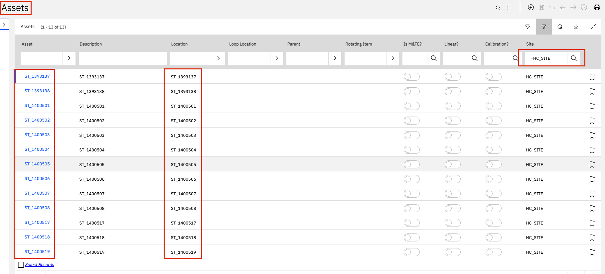 

5. Click on one of the Assets and navigate to the `Meters` tab

6. Expand one of the meters and ensure there is data. Not all demo assets have meter readings.

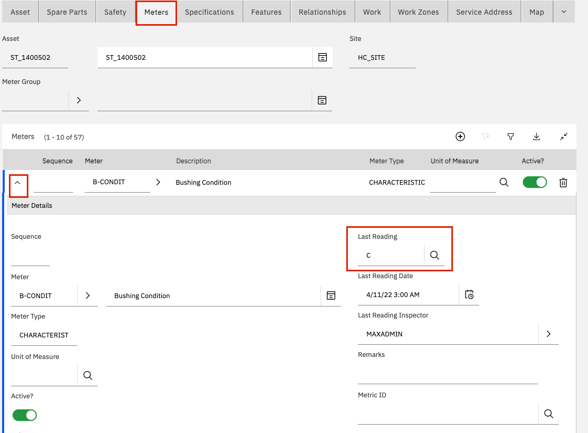 

7. Navigate to `Maximo Health`

8. Click on the `Map` view and turn `Containers` on
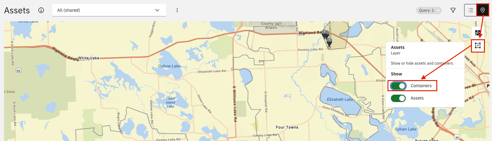 

9. Filter by your site/assets and ensure you can see containers

!!! note

    Containers should be Grey until health scores are configured.
 
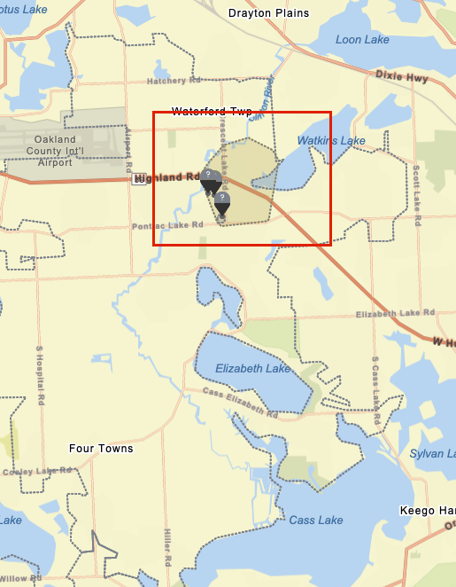 

## Error Handling

**Unable to unzip the file**

If when running the cell to unzip the files containing the scripts and the data, rather than getting the full file list in the output this is received:
    
Or when running any of the cells to create or load data, you receive an error.

Follow the steps below to ensure your file is zipped/compressed properly:

1. Open the file that needs to be re-zipped and select all the files within that folder

2. `Right Click` > `Compress`
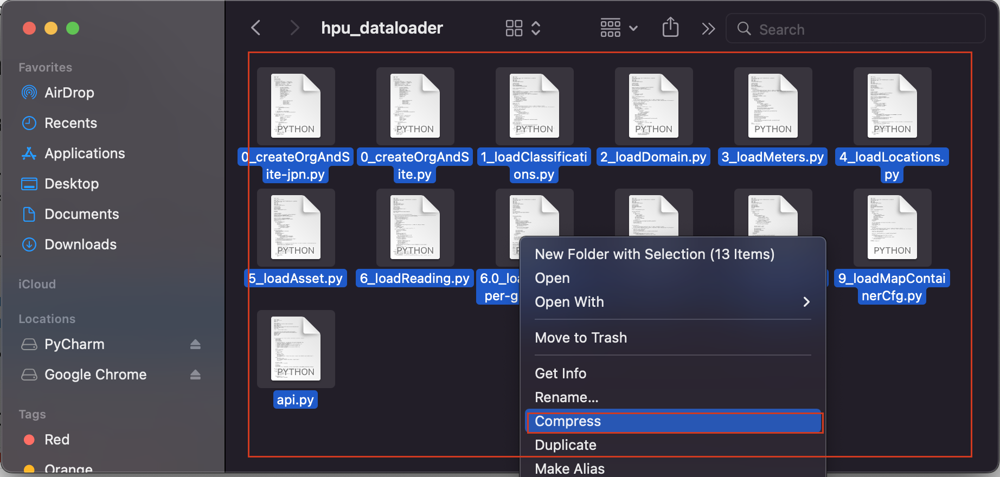 

3. Rename the resulting file to the correct file name indicated in [Gather Notebooks and CSV files](gather_files)
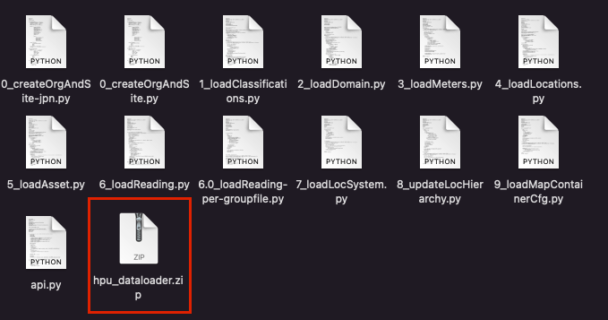 

4. Re-upload the file to your Watson Studio project and run the first cell again

!!! note

    If you are using a Windows Machine, the following steps may need to be altered.

Congratulations you have learned how to upload `Health and Predict - Utilities` data via a notebook. You have also gained experience using Jupyter Notebooks in Watson Studio!

In the next exercises you will learn how to use the `1_Create-HPU-ScoreGroups.ipynb` Notebook template to create health scores for Health and Predict for Utilities assets and associate the asset notebook to that created group.