# Asset Matrix

Maximo HP Utilities includes matrix view for determing the distribution of assets based on scores and then take action to avoid imminent failures.

In this exercise the Reliability Engineer uses HP Utilities to:
	
1. [View Matrix for Criticality and End of life, Criticality and Risk, Criticality and Health](#view-matrix-for-criticality-and-end-of-life-criticality-and-risk-criticality-and-health)
2. [View the drilled in assets list and take action](#view-the-drilled-in-assets-list-for-one-distribution)
3. [Config Matrix version](#config-matrix-version)

## Pre-requisites 

This lab requires the following

- A working Maximo Application Suite (MAS) environment with Maximo Manage, or another Enterprise Asset Management (EAM) system, Maximo Health, Maximo Health and Predict – Utilities (HPU), and Maximo Optimizer installed
- Make sure the exercise [Understand Health and Predict - Utilities Models](hpu_models.md) is done, so that Sample ST(Substation Transformer) assets have the EOL/Risk/Health scores
- Members of the EUSCORING security group can configure settings for the matrix(exercise 3), such as which version of the matrix is the default version and the colors and placement of cells.

Please note that the MAS Worldwide (WW) demo environment is NOT a suitable environment for this lab.  The WW demo environment is shared, and making ANY changes to that environment will impact other users’ ability to demonstrate MAS.

## Introduction

This lab is intended to demonstrate the Matrix view capability in HPU which is another view besides the existing Grid view, Map view, Charts View. It allows Reliability engineer to esaily idenfity the high risk assets from a matrix distribution view and take actions based on the distributions.
Reliability engineer can also easily config the different matrix versions, like to change the default version, disable version, change the matrix cells' color(category) etc.

##  Navigate to Health and Predict - Utilities

`Action:`

1. Navigate to Health and Predict - Utilities (HPU). From the main MAS page, select the `Industry solutions` tab.

2. Then click `Health and Predict – Utilities` menu.
	 

## View Matrix for Criticality and End of life, Criticality and Risk, Criticality and Health

`Action:`
1. From the main grid view, click the Matrix tab, you will see the matrix, each cell contains the assets count which fall in the x-axis and y-axis range.
   For example, the red cell in the top right corner shows the assets that End of Life is high and Criticality is also High which means high risks.
   Besides cells, there are also several cards which is summarized count for the different categories of assets, normally High is for assets that need to take action in high priority.

    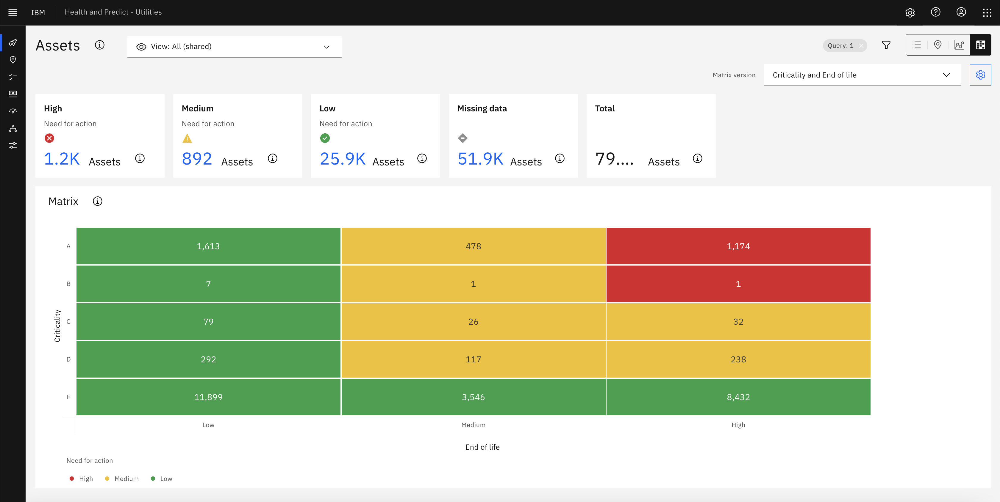

2. If there are too many assets in one cells or category, you can also use filter to reduce the counts. The followings are the detailed steps:
   - click the filter icon, then select `Type`
   - From the pop-up, find `Substation Transformers`, select it, and press `OK`.  It may be necessary to use the search capability or scroll.
   - Finally, press `Apply`, the Matrix count 

3. The default matrix version is Criticality and End of life, you can also click the dropdown on the top right corner to change to other matrix versions. 

    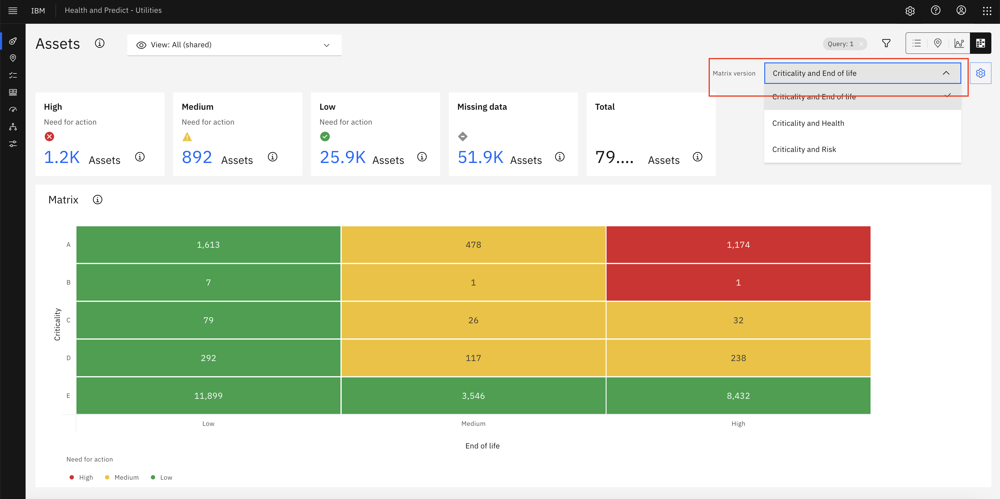

## View the drilled in assets list for one distribution
`Action:`
1. Click any cell of Matrix or any card with the blue text of number, you can see the detailed assets list.
  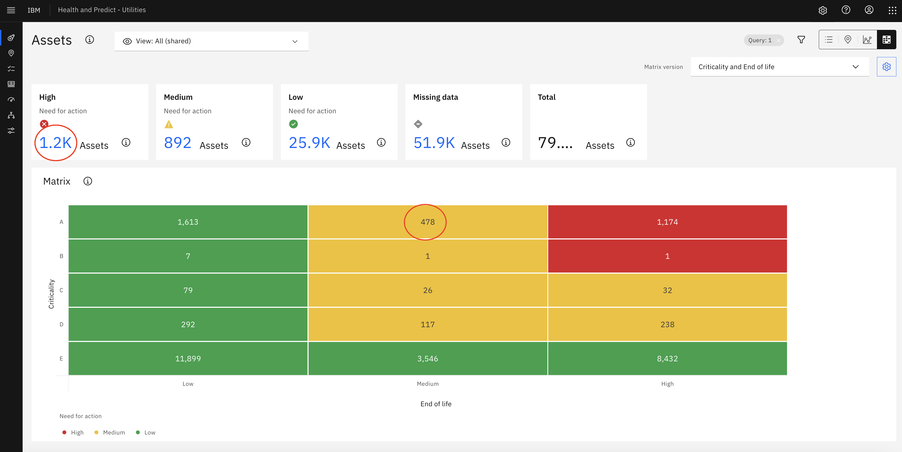
  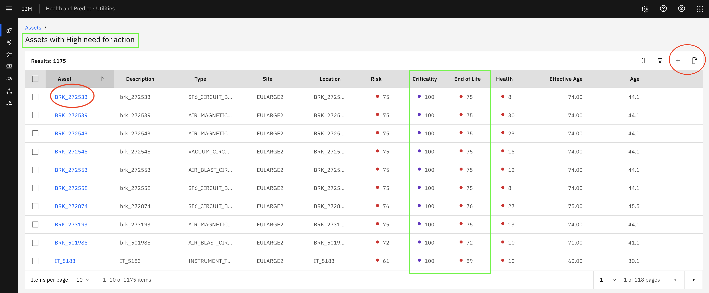
2. In the drill in page, you can filter out the interested assets list by click the filter icon.
  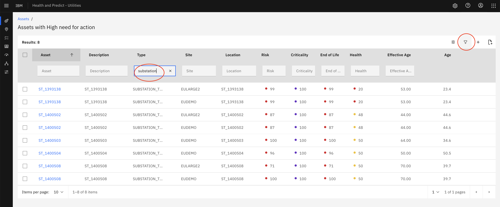
3. there are several actions that can be done in the drill in page:
   - Click one asset name, and go into asset detail page, create Work order or Service request
     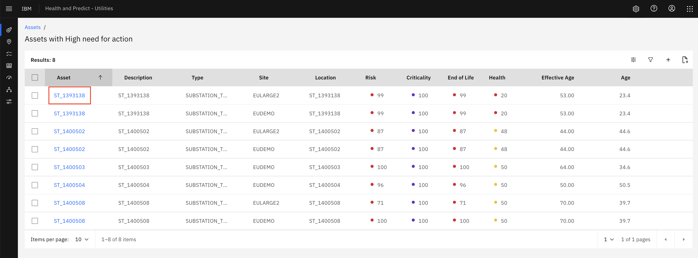
     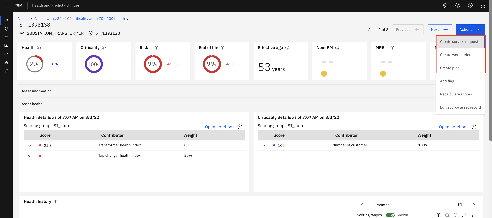
   - Add all assets to Asset Investment optimizer project
     - create a new project
     - add to existing project
     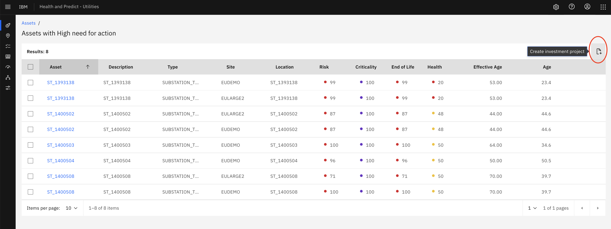
     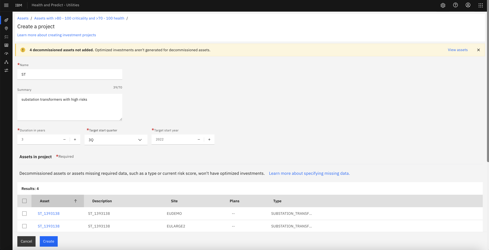
       * please refer the [Asset Investment Optimization](asset_investment.md) for more details
   - select some assets by clicking the checkbox and create AIO project
      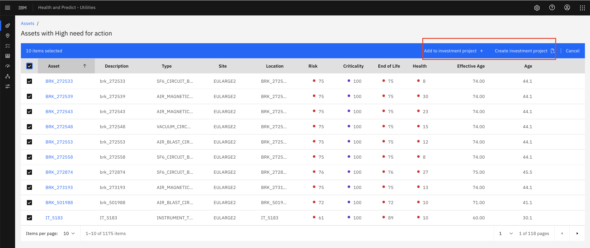

## Config Matrix version

We have by default configuration(include the category cell color/default version etc) for matrix versions, but those configuration can also be changed.

`Action:`
1. Click the Config icon in the top right corner
  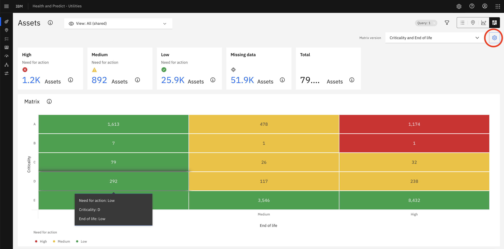
