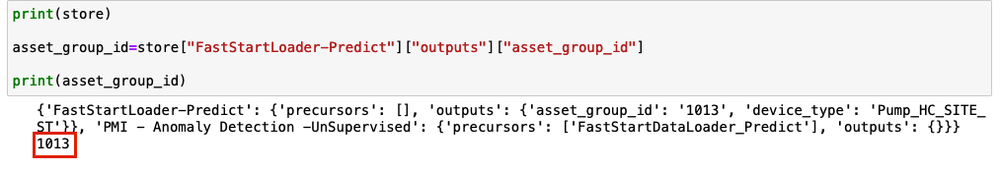
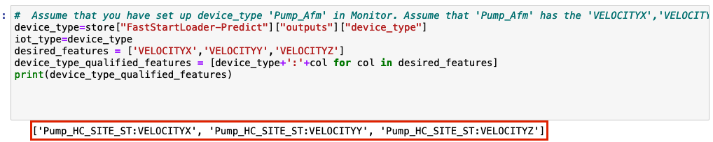
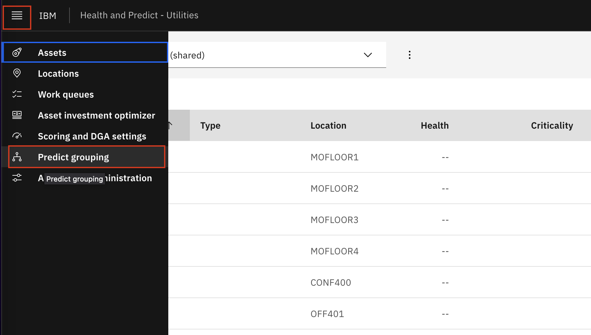
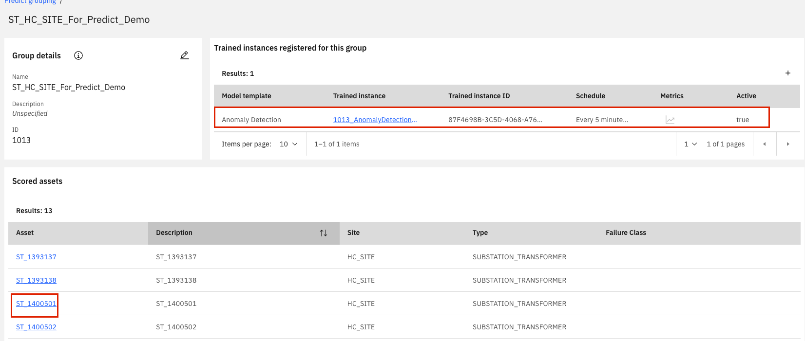
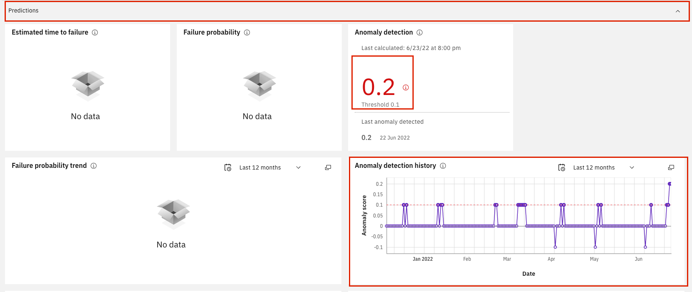

# Create Utilities Anomaly Detection Model

Maximo Predict comes with notebook templates to assist in streamlining data uploads to Maximo. This notebook will create the following resources using provided csv files:

- Anomaly Score
- Anomaly Score History

These instructions use the notebook named `3_PMI - Anomaly Detection -UnSupervised-HPU.ipynb` file with the Substation Transformer for Health and Predict for Utilities Demo Assets. Note that this uses simulated Pump Data for the sensor readings.

In this exercise you will use Watson Studio and Health and Predict - Utilities to:

2. [Upload the and Run the Anomaly Detection Notebook](#AD_notebook) using a template to Train and Display an Anomaly Detection Model
3. [Confirm](#confirm_upload) the Data Has been uploaded for your assets

!!! note

    You must complete the previous exercise for [Setup Watson Studio](setup_watson_studio.md) before you start this exercise.

## Pre-requisites 

- Review Predict documentation for the [list of available models](https://www.ibm.com/docs/en/mhmpmh-and-p-u/8.5.0?topic=overviews-maximo-predict-850).
- Ensure your MAS Predict environment is running and you have access.  Try your server URL that might look something like: [https://main.predict.ivt11rel87.ivt.suite.myhost.com/ibm/pmi/service/rest/system/info](https://main.predict.ivt11rel87.ivt.suite.myhost.com/ibm/pmi/service/rest/system/info)
- Ensure you have Access to Asset data files for the Health and Predict Utilities Demo Data
- Complete the [Load Data into Manage](asset_data_loader.md) lab for the Utilities data.
- Complete the [Load Utilities Health Scores via Notebook](utilities_score_notebook.md) lab
- Complete the [Create Utilities Predict Group and Upload Sensor Data](utilities_devicedata.md) lab 
- Have the following information from the previous lab: `Predict_Envs.JSON` and `Fast_Execution.JSON`

!!! note

    It is best to perform this lab in your own Watson Studio Project created using [Setup Watson Studio](setup_watson_studio.md) instructions. If you are using a shared project, ensure you append each file uploaded with your initials and update the file paths in the notebooks to include that change.

## Upload and Start the Anomaly Detection Unsupervised Notebook

1. Upload or open the Anomaly Detection template notebook to your Project.  Use the steps from the previous exercise [Add Notebook From File to a Watson Studio Project](setup_watson_studio.md)  If you are using a shared project, rename the notebook template by prepending your initials to the template. If this is done, ensure any paths or file names within the notebook are updated as well. If you already have uploaded the notebook, open it with Watson Studio.
Select the `3_PMI - Anomaly Detection -UnSupervised-HPU.ipynb` notebook template. 

2. Open the notebook.  Click on the `pencil` icon next to your notebook 

3. If the notebook fails to start, restart it.  Click on the `i` icon , `Environment` tab,  `Running status` drop down select box and choose `Restart`

## Run the Notebook

### Install the Maximo Predict SDK

1. Run the cell to uninstall the libraries. This is done to ensure the right version is installed later in the process.

2. Run the next cell to define the requirements and some environment variables to run this notebook. This cell also checks that the precusor notebook has been run

3. Run the next cell to define the API keys used to call Maximo Predict from the `Predict_Envs.JSON` file

4. Run the next two cells to import the os, trim the provided base url to be used when downloading `pmlib` in the second cell

5. Run the final 4 cells in this section to import the `pmlib`, `srom`, and `logging` libraries

### Set up the Model Training Pipeline

1. Run the first cell to obtain the Asset Group ID from the JSON file produced in the [Create Utilities Predict Group and Upload Sensor Data](utilities_devicedata.md) lab. Note that it prints out the Predict Group ID after being extracted.

2. Run the next cell to extract the device type and the desired features to be considered in the anomaly model.

3. Run the next cell to define the scoring strategy. There are three different scoring strategies shown to choose from.

4. Run the following cell to import all the anomaly detection models to be run through the pipeline and other functions necessary for this process

5. Run the following two cells to define the model pipeline for the determined features. This cell defines the settings to be used within the model algorithm during the training process.

6. Run the next cells to define the model group containting the pipeline, and the asset group id that the model will be trained on

### Train, Register and Enable the Model

7. Run the first cell to train the model. Some models take time to train.

8. Once that process is complete, register the model to your asset group by running the next cell

9. Finally, Run the next cell to enable it and determine how often it will be run in monitor. This is the last cell to be run in this notebook.

## Confirm Model Registration

1. Navigate to Maximo Health and Predict for Utilities within your environment

2. Use the left-hand menu to go into `Predict Grouping`
    

3. Select your asset group

4. Click into your asset group and ensure you have the Anomaly Detection Model listed under `Trained instances registered for this group` and select an asset to go to the Health Dashboard

6. Scroll down and expand the `Predict` section to ensure the anomaly detection history and the anomaly detection score is visible.

!!! note

    Recall in the [Create Utilities Predict Group and Upload Sensor Data](utilities_devicedata.md) lab only some assets have sensor data. If an asset does not have sensor data, it will not have Predict data

Congratulations you have created an Anomaly Detection model and associated it to your assets!

