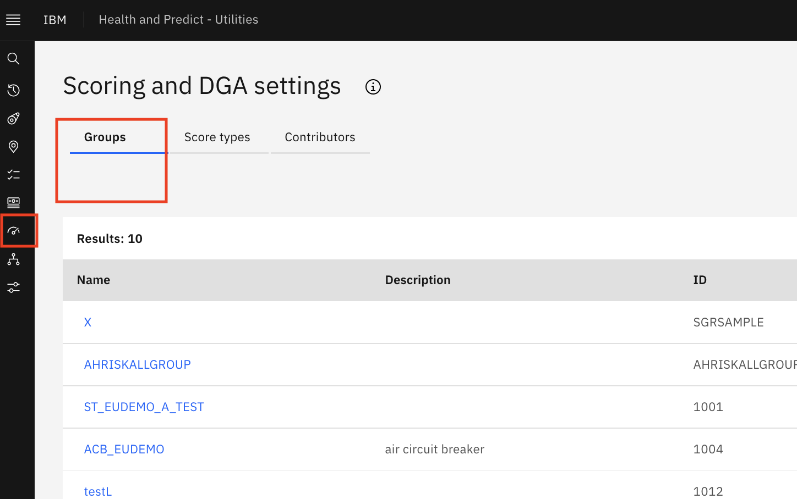

# Forecast Custom Scores Using a Machine Learning Model
Health and Predict - Utilities allows you to train a WML model based using an asset's historical score values so that you 
can forecast future asset scores.   MAS Health and Predict Utilities supports forecasting Asset Risk, End of Life scores 
and Health scores. User can enable forecast by setting two parameters:
    
        ``healthlib`.set_FutureScore_enablement(enablement=True)`

        ``healthlib`.set_FutureScore_numOfyear(numOfyear=10)` 

These can parameters can be set in any notebook and saved. The Health Library will calculate the EOL future score as EOL curve.
Risk is calculated as `Criticality * EOL`.  Once an adequate number of historical score samples are available, a future 
EOL score and Risk score can be forecasted.

To forecast Health score, MAS Health and Predict Utilities can use a Predict model notebook template to train a model based on historical score data, and register the notebook job in WML to get future scores.  MAS Health and Predict Utilities has two notebooks and one cfg file templates.  
- `IBM-Asset-HealthScore-Forecast-Sample-6.0.0.ipynb` is for training and register a forecast model
- `IBM-future-score-from-predict-sample-6.0.0.ipynb` and `IBM-future-score-from-predict-sample-6.0.0.cfg` are for creating a Substation Transformer Score Group which includes forecast Health score.      

The Predict model notebook template can also be used to forecast other custom score if it has historical scores to train on.

In this set of exercises you will use Watson Studio, MAS Health and Predict Utilities to:   
1. [Create Score Group](#create_sg) Create a Substation Transformer Score Group using IBM-future-score-from-predict-sample-6.0.0.ipynb notebook which include the logic to do Health Score forecast based on wml model.       
2. [Train WML Model](#train_model) Use IBM-Asset-HealthScore-Forecast-Sample-6.0.0.ipynb template to train a forecast model and register in wml.    
3. [Schedule Calculation](#forecast) Schedule calculation in Score Group detail page.    
4. [Check Future Score in Matrix](#confirm_results) Future scores have been forecasted.   
5. [Handle Errors](#error_handling) that may come up in the process.   

## Pre-requisites 

Ask your instructor:
- For the asset data files for the MAS Health and Predict Utilities Demo Data. 
- If they have loaded the `hpu_csv_demo` data or `hpu_csv_st` into the Health and Predict Utilities system by completing the [Load Data into Manage](../../apm_8.7/asset_data_loader) lab for the Utilities data.   
- If a data scientist has prepared the `cfg` and `notebook template` for forecasting future scores. in the cfg template, Health calculate method is replaced to use `calculate_health_score`, and in notebook template register `calculate_health_score` function, this function can handle both current and future scores.   
    &#8194;&#8194;{ width=80% height=80% }

!!! note

    This forecast notebook template that that deployed along with HPU are the Substation Transformers templates.   
    User need refer to the template to customize their own cfg and notebook for other Asset Types or Scores.

## Create a Score Group Using a Notebook Template

In this step, you will create a custom  score using the `Connecting group to notebook` option to connect to the
`IBM-future-score-from-predict-sample-6.0.0` notebook.  You will use the query function to identify the Substation 
Transformer assets in the group then create the group.

1. From the left cascading menu click `Scoring and DGA settings`.  Click the `Groups` tab.
    	

2. Click button `Create a scoring and DGA group` and fill in the form, select a query that matches the assets you would like to include in this group. Search for the `Query name` and click `Apply` button.  If you don't see one that fits your need
create a query to choose the right assets to add your score to.    
       

3. Click `Create` button to create and review the assets in the scored assets list to ensure the assets you want to have this score in are are listed.   
    	

4. Click into the score and active it one by one.    
    	   

5. After activating it, it should have a `Y` in the column named `Active`.   
    	   

## Train WML Model

1. Login to Watson Studio, and open your project.
    
2. Find the training template `IBM-Asset-HealthScore-Forecast-Sample-6.0.0.ipynb`. Click on the notebook name and then 
click on the `pencil` icon next to your notebook to open it in edit mode.

3. If the notebook fails to start, restart it.  Click on the `i` icon , `Environment` tab,  `Running status` dropdown 
select box and choose `Restart`.    
    { width=30% height=30% } 

4. Update the first code cell to fill in the env connection information including `maximoUrl`,`maximoApiKey`,`expgroupname`    
    a. `maximoUrl` can be extracted from health or manage url, e.g Get main.manage.ivt13rel88.ivt.suite.maximo.com from    https://main.manage.ivt13rel88.ivt.suite.maximo.com/maximo/oslc/graphite/relengineer/index.html".    
    b. `maximoApiKey` can be found by go to "Application Administration -> Search and enter the API Keys application, then copy key from admin user card.    
    c. `expgroupname` is the group id which you can find in the group detail page.     
    { width=60% height=60% }    

    	      

5. Update the cfg file name in below two cells if you have customized your own customized future score notebook and cfg based on the `IBM-future-score-from-predict-sample-6.0.0.ipynb` and `IBM-future-score-from-predict-sample-6.0.0.cfg` templates.
    
    

6. Create a deployment space to match the one used the below cell.
    
    

    If you change the default name space, then also need change the deployment space in `IBM-future-score-from-predict-sample-6.0.0.ipynb` and save to the latest version.
    

7. Prepare a Predict_Envs.json follow the instruction as it's used in the notebook.
    
    
8. Run the first code cell to set the `maximo_context`.

9. Run the next 13 cells to import and install the required packages including `healthlib`
       
 use `healthlib` to export Health historical scores into a csv file.   
    
10. In the last cell, you'll see the historical scores printed, and also can see the file is registered in the watson studio's data asset.   
       

11. Run the next 6 cells to set some env variables and install `pmilib`.  In MAS v8.9  `pmilib` should be added to your 
Watson Studio project if you have followed these [Setup Watson Studio for Predict instructions](setup_watson_studio.md)

12. Skip the next cell which is scenario 1 using multiple csv files for each asset's training. 

13. Run the next cell which is scenario 2 to set some basic parameters for training, you can update the `pred_win` under `params`, by default, it will predict next 5 years' future score.
    

14. Run the next cell to train the model, it will take some time cause each asset will need to be trained, you can run the following cell multiple times to check the training status.
    
    

15. After training is done, you will see a number that matches the total number of assets.
    
   
16. Run the remaining cells to register model in WML.If some error when running 34th cell, please ignore and continue run the rest cells.
    

## Trigger Calculation

The following steps will trigger the forecast for the created Score Group.   

1. Navigate to `Maximo Health and Predict for Utilities` for the provided environment

2. Go to the `Scoring and DGA Settings` application within `Maximo Health and Predict for Utilities`

3. Search for the Score Group created before.    
       

4. Click into the Score Group detail, click `Calculate Scores` and allow the scores to calculate. Wait 15 minutes for the calculation to complete.
       

## Check Future Score in Matrix

The following steps will confirm that the future score are forecasted, check future score in `Matrix Page` similar to earlier in the exercises.

1. Navigate to `Maximo Health and Predict for Utilities` for the provided environment.

2. Go to the `Scoring and DGA Settings` application within  `Maximo Health and Predict for Utilities`.

3. Search for the `Score Group` created before.    
             

4. Click into any `asset` and confirm that the scores have been calculated.   
             

5. Check future scores in Matrix.   
    Go to Assets page, select the same query that is used in score group. And click `Matrix` icon to switch to `Matrix` page.   
         

6. Click year plus button to check the summary information for future year, e.g 2023
        
         

7. Click any cell to drill in to see the related assets in a table view. Click year plus button to see which assets are in this range in next year and also show the next year score in the table.
       

Congratulations you have seen how to use notebook train a WML model, forecast future custom scores and confirmed the future score values in Matrix page.