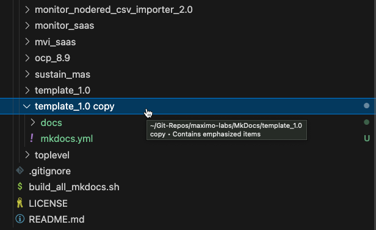
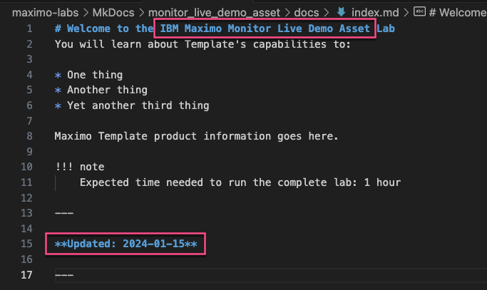
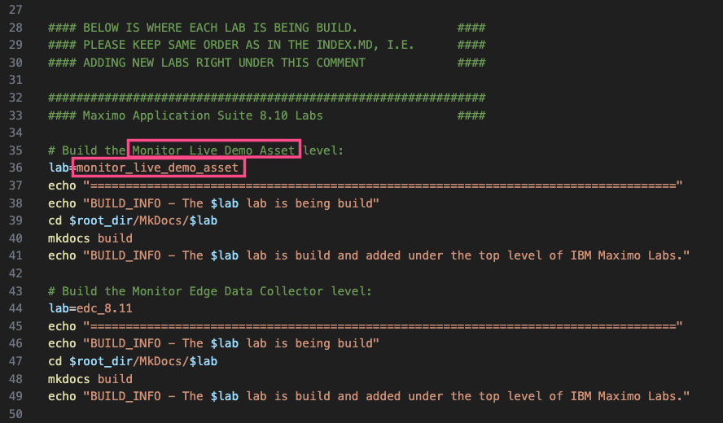
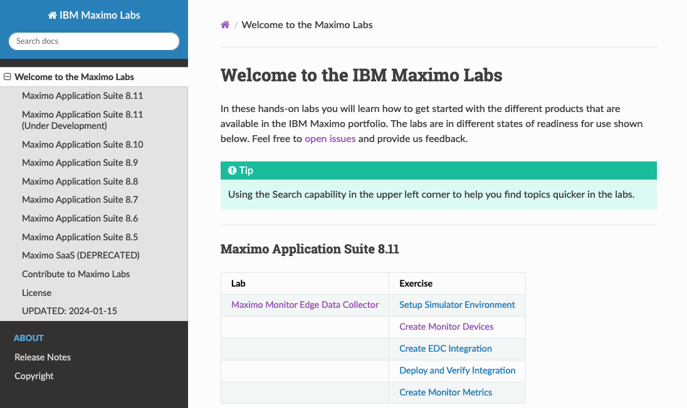

# Create new lab

Creating a new lab follows the same process as under [Add content](add_content.md):

1. Prepare your Git branch
2. Make changes
3. Commit and push your changes
4. Create Pull request
5. Clean up branches locally and remotely (Github)

The only difference is the first time you execute step "2. Make changes", then follow this process:

* Follow step "1. Prepare your Git branch" under [Add content](add_content.md#1-prepare-your-git-branch).
* Come back here and run the below "Make first changes for new lab".
* Go back to [Add content](add_content.md#3-commit-and-push-your-changes) and run from step 3. (You are done here :-)

## Make first changes for new lab

The following steps are used to crate a new lab based on the provided [template](../../template_1.0/)

### 1. Replicate Template to your lab

Select the `template_1.0` folder

Make a copy of the `template_1.0` folder

Rename the `template_1.0 copy` folder to `<product>_<version>` for wich this new lab is intended,  
e.g. `monitor_live_demo_asset` - it should now look like this:

!!! attention "Important"
    It is important that this structure is kept consistent cross all labs in order to easily build and deploy the complete set of labs.

### 2. Modify the mkdocs.yml file

The `mkdocs.yml`file holds the configuration of the new lab, i.e. some generic information about the new lab, like location of where the site will be created during the build and also which .md (markdown) files it consist of based on the navigation information.  

Select and open the `mkdocs.yml` file located in the root of you new lab folder

Edit the marked areas suitable for your new lab

Which could look like this

Save the file.

!!! note
    The `nav:` definition holds the navigation menu for the new lab. 
    It is only `index.md` and `release_notes.md` that need to have some mandatory information, as explained below. The rest of the markdown files and navigation menu is defined by the way the lab is structured and how many exercises it consist of.

### 3. Modify the index.md file

The `index.md` file is the landing / welcome page for the new lab.  

Select and open the `index.md` file located in the `docs` folder of you new lab

Edit the file and make sure to change the marked areas suitable for your new lab

Which could look like this

Save the file.

!!! attention "Remember to do this:"
    Update the `Updated` at the end of this file to current date once the new lab is ready.

### 4. Modify the release_notes.md file

The `release_notes.md` file contains a list of the Contributors to this lab as well as the Change Information.  

Select and open the `release_notes.md` file located in the `docs` folder of your new lab. Edit the file and make sure to change it so it's suitable for your new lab

Which could look like this

Save the file.

!!! attention "Remember to do this:"
    Update both sections when the lab is ready.

### 5. Add the new lab to the build script

First we need to update the `build_all_mkdocs.sh` file located in the `maximo-labs` root folder.
This file contains the shell script for building the entire IBM Maximo Labs static web site.  

Select and open the `build_all_mkdocs.sh` file

Scroll down to find `# Build the template level:`

Copy the section and paste it above the `#### DON't CHANGE THE BELOW MANDATORY...` line. Change the comment and the `lab=` variable to match the folder of the new lab.

Save the file.

!!! attention
    Please don't change **anything else!**

### 6. Build and verify your lab content

In a terminal navigate to the root of this git repo and execute the build script:

    ./build_all_mkdocs.sh

It could look like this:

Wait until it has finished building the whole site.

Open a browser and navigate to [http://localhost:8080/](http://localhost:8080/) in order to verify that the build was successful.  

The new lab has not yet been added to the `index.md` in the `toplevel` page, so you need to navigate directly to the new lab, e.g. [http://localhost:8080/monitor_live_demo_asset](http://localhost:8080/monitor_live_demo_asset) in order to verify that your changes look as expected.  

!!! tip
    Press control-c to stop the web server and get back to the prompt.

Congratulations, you have now created the foundation for the new lab following the structure and consistensy of the entire IBM Maximo Labs site.

Now you "only" need to add all the content to the foundation, by adding markdown files and images according to the structure.  

!!! tip
    The mark down files in your new lab should contain examples on : 
    - how to use chapters 
    - how to link to other md files in your lab 
    - how to link to chapters in your lab 
    - how to link to external sites  
    - how to link to images (please add plenty) 
    - how to add a table 
    - how to add admonitions (like this Tip section)

!!! attention "Remember to do this:"
    Go back to [Add content](add_content.md#3-commit-and-push-your-changes) and run from step 3. (You are done here :-)

!!! note
    It is good practise to commit your changes often and at least once the foundation is in place.
