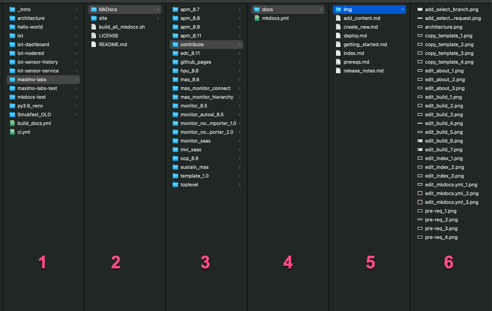

# Getting Started with contributing to The IBM Maximo Labs!

The first things you need to understand is the way this site is build and how the architecture looks like. This is needed so that your changes and additions does not break the consistancy and structure of the complete IBM Maximo Labs site.

## Structure of the labs

Here is the structure of the IBM Maximo Labs:

1. Location of the git repositories
2. The root folder of the maximo-labs git repository. Basically only contain the build script and the MkDocs folder with all the MkDocs content folders.
3. A separate folder for each lab in the form `<product>_<version>` e.g. `edc_8.11`. The `toplevel`, `template_1.0` and `contribute` folders are all part of the main content and structure for the complete site, beside each individual lab folder.
4. Only contain the `mkdocs.yml` file to configure the MkDocs build of this site / sub-site. The content is stored in the docs folder.
5. Location of the markdown files that is the source files for the specific sub-site. The `index.md` is the landing page for the lab and the `release_notes.md` contains information about the contributors and the history of this lab.
6. The `img` folder is the location of the images for that site / sub-site. They should be referenced as `img/<image>.png` within the markdown files using relative links.

## Building the labs overview

Once you have the development environment in place and have cloned or forked the github repository, you are ready to look at the `build_all_mkdocs.sh` file in the root which is the shell script that is being used to build the MkDocs site and sub-sites that this site consist of.  
Basically `build_all_mkdocs.sh` is divided into some different sections that each build the various MkDocs sites and subsites that the complete site comprises of. 
These are the building blocks of the build script:

*  Setting up some variables and erase the old site completely to avoid any leftovers
*  Building the toplevel content
*  Building the various labs with each there own separate MkDocs structure and navigation menu
*  Building the template and this contribute lab
*  Finish up and starting a webserver when running it locally, so that you can look and navigate in the complete site to verify and review any changes you've made

Now you are ready to setup your development environment :-)
 