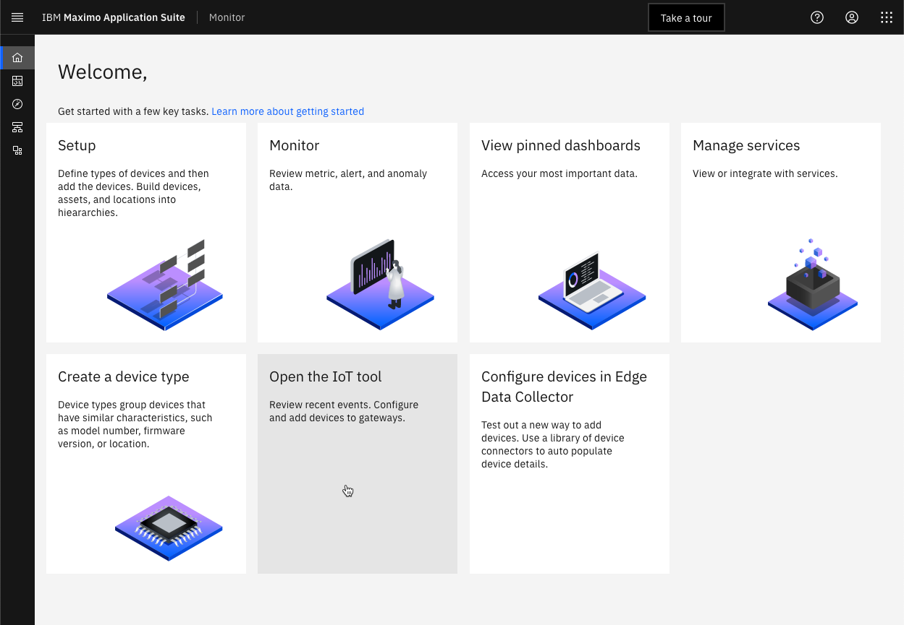

# Objectives
In this Exercise you will learn how to:

* Deploy the EDC Integration on the EDC edge
* Verify data flowing into the IoT Tool in Maximo Monitor

---
*Before you begin:*  
This Exercise requires that you have:

1. completed the pre-requisites required for [all labs](prereqs.md) and for this exercise
2. completed the previous exercises
3. verified the simulator is running as described in [exercise 1](setup.md#configure-the-modbus-simulator){target=_blank}

---

## Deploy the EDC Integration on the EDC edge

At the end of the previous exercise the Deployment guide appeared. </br>
Click on the docker command to copy it to the clipboard:
</br></br>

Open a terminal window (Mac/Linux) or Command window (Windows) on the EDC edge and then paste the docker command line from the clipboard.</br>
Click enter to execute it, and you should see something similar to the following:
</br></br>

## Verify data flowing into the IoT Tool

Navigate to the IoT Tool from the Monitor Home page:
</br></br>

Since the gateway and the devices uses the same pre-fix, then it is easy to search for them. Verify the `XX_EDC_GW_01` is in Connected state - and the two devices have been created automatically by the gateway.
</br></br>

!!! tip
    The devices created by the gateway will always be in Disconnected state, as they receive their data through the gateway.

Select one of the two simulated Lenze i550 devices and navigate to `Recent Events`:
</br></br>

Wait for a couple of minutes (you know those 60000ms defined in the Integration) until you see the first messages coming through:
</br></br>

Click on the last received payload: and see the data points that was selected in the Integration:
</br></br>

And see the data points that was selected in the Integration being send on the status event type:

``` json
{
	"timestamp": "2023-09-25T12:26:05.508843Z",
    "motor_current_ampere": 9.600000000000001,
	"output_frequency_hertz": 36.65,
 	"dc_bus_voltage_volt": 401,
 	"motor_torque_percent": 66,
 	"supply_voltage_volt": 283.5498192558055,
 	"frequency_command_hertz": 36.65,
 	"motor_voltage_volt": 700,
    "control_card_temperature_degree_celsius": 23
}
```


---
Congratulations you have successfully deployed and verified the EDC Integration.</br>
