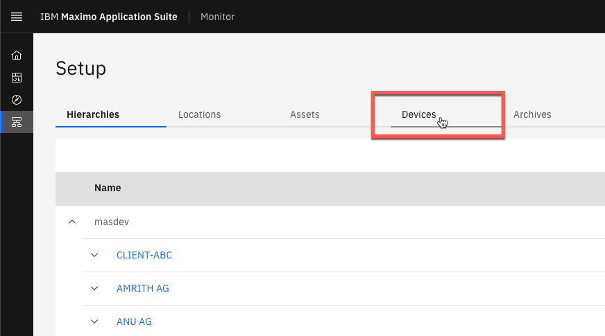
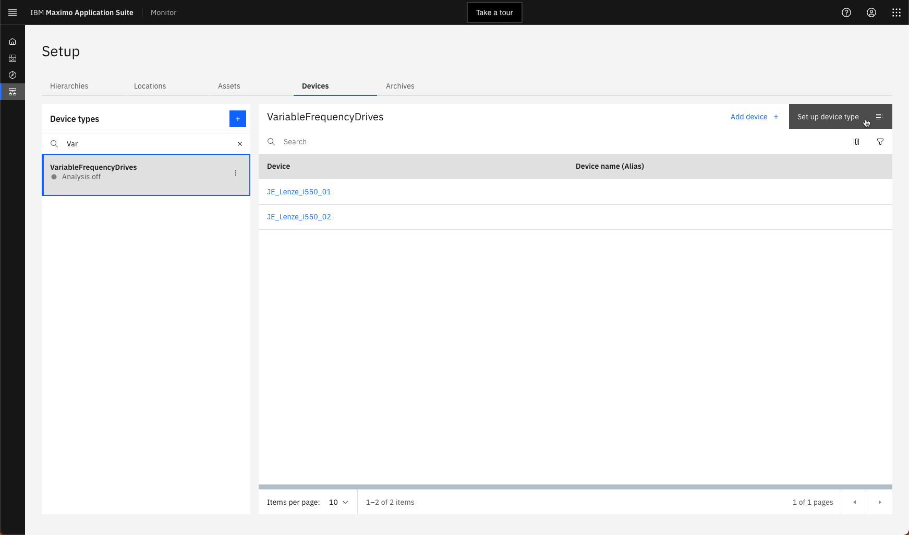
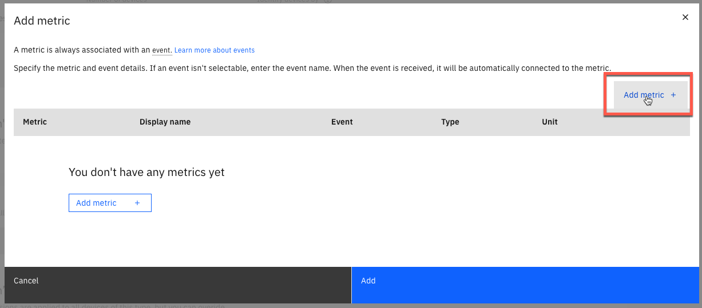

# Objectives
In this Exercise you will learn how to:

* create the metrics for the devices in Monitor

Now the data is being collected at the edge, unified and send to the IoT Tool in Maximo Monitor. You need to define the metrics on the device type level in Maximo Monitor in order to store the selected data in the Maximo Monitor database and make it available for further analysis and visualization.

---
*Before you begin:*  
This Exercise requires that you have:

1. completed the pre-requisites required for [all labs](prereqs.md)
2. completed the previous exercises
 

---

Navigate to Setup from the Monitor Home page:
  

Select `Devices`:
  

Search for the `VariableFrequencyDrives` device type and click on `Set up device type`:
  

No metrics are available. Click on `Identity`:
  

Click on `Add metric`:
  

Click on `Add metric`:
  

Enter `motor_voltage_volt` as the Metric, `Motor_Voltage` as the Display name, `status` as the Event, `NUMBER` as the Type, and `V` as the Unit.
Click on `Add metric`:
  

Add the following metrics
 
and click `Add`. 

!!! tip
    Here are the Metric names you need to use, as they are delivered by the EDC edge: 
    `motor_voltage_volt` 
    `motor_current_ampere` 
    `motor_torque_percent` 
    `dc_bus_voltage_volt` 
    `output_frequency_hertz` 
    `timestamp` 
    
!!! attention
    Be aware that the Event name and the Metric names are case sensitive - and all in small letters.

Click on the toggle to the left of `status`.  
Select the `Use this as the default timestamp` so you use the timestamp provided from the devices rather than from the time of the data injection. Click `Save`:
  

Finally, you will verify that the data is available for Monitor analytics and dashboards. 
Wait a couple of minnutes for newly received data points to be stored in Maximo Monitor. 
Click on the `Data` tab. 
Expand `Metric`. Select Motor_Current and `Data table`:
  

---
Congratulations you have successfully: 

* setup a couple of simulated Lenze i500 variable frequency drives
* created the needed gateway in the IoT Tool and device type in Monitor 
* created an Edge Data Collector Integration by defining endpoint, devices and their tags (metrics)
* deployed the EDC Integration on an EDC Edge and the device data has been collected, unified and send to Maximo Monitor
* received the unified data in the IoT Tool and selected a subset of the metrics to be stored in the Maximo Monitor database to be available for further analysis and visualization

