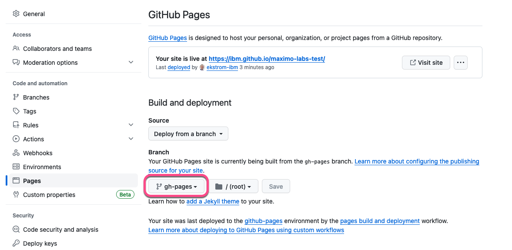
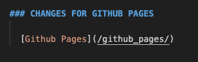
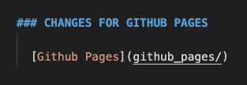

# Objectives
These are the steps to setup Github Pages in a Githup repository:

* Create a new branch: gh-pages
* Edit all links to the sub labs

## 1. Create a new branch: gh-pages

You can create the gh-pages branch directly under Code | branches by pressing the `New brach` button.

Navigating to Settings | Pages you should automatically see that Github Pages has been setup to use that branch.

## 2. Edit all links to the sub labs

The toplevel file `index.md` need to change all the links to the sub labs from absolute to relative links, e.g. change this: 

to: 

