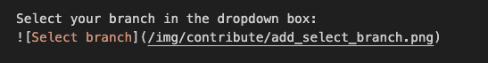
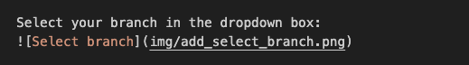
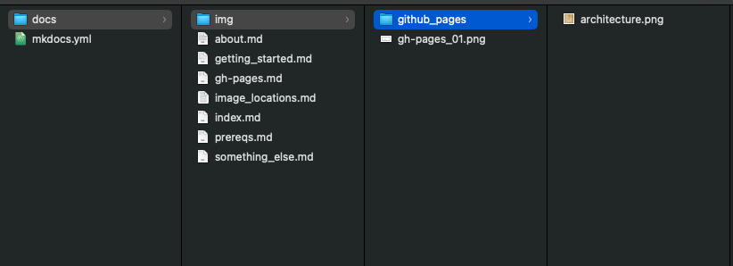
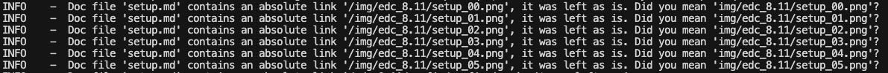
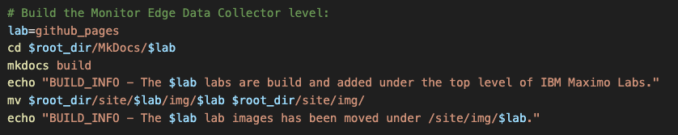
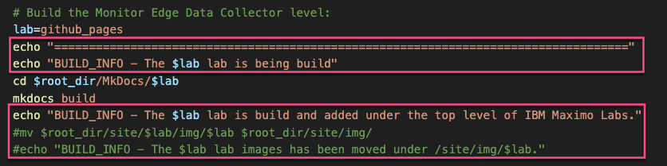

# Objectives
Image locations and references to the images has to change:

* Image location of lab images
* Edit build_all_mkdocs.sh

## 1. Image location of lab images

Previously it was needed to use absolute links to images which also had to include the name of the lab, e.g.: 

this needs to be changed to a relative link, as github pages add a first level in the URL being the name of the Github repository.
Because of that the images needs to be located under the lab, e.g.:  

This also means that the image files must be in the labs `img` folder without an additional folder that needs to have the same name as the lab.
Meaning this structure:

has to change to this structure:

It also means, that the following kind of messages during the build should dissapper:

## 2. Edit build_all_mkdocs.sh

Once the image locations have changed (in the folder structure and in the links in the md files) then we need to change the build script from:

by removing the last two lines per lab, hence do not copy images to a central (but unavailable for github pages) location:

While we are there also change/add the ecco strings to easier see what is happening during debug of building the whole site.

