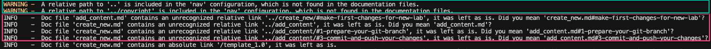
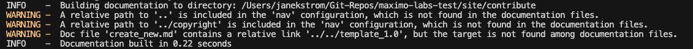
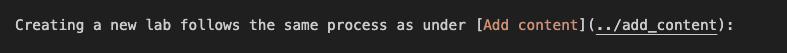
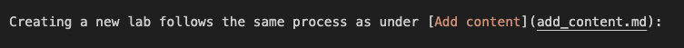
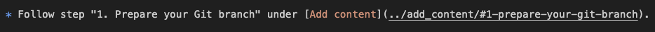
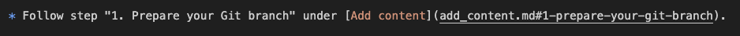

# Objectives
Update internal links to the new MKdocs standard.

This task is not needed due to deploying Maximo Labs using Github Pages, but merely a clean up activity while all labs in Maximo Labs are being updated anyway.

The aim is to get rid of the `unrecognized relative link` messages during build (in the red box):

and getting this result instead: 

!!! note
    Disregard the `WARNING` messages as they are required when using Github Pages. 
    The reason is because the links are to other MKdocs builded labs, hence the MKdocs build for this particular lab does not recognize other labs.

## Simple link

Before: 

After: 

## Link with bookmark

Before: 

After: 

---