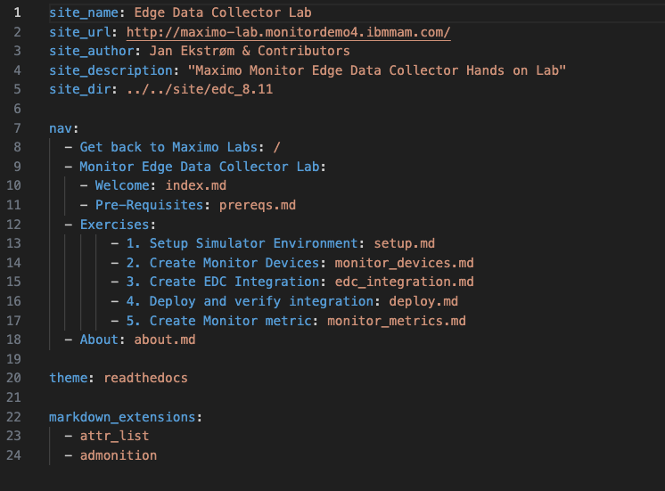

# Objectives
The mkdocs.yml file for all labs needs to be updated with the following:

* Site information
* Link to Home changed to relative URL (..)
* New About section

The About information has changed to be a separate section. 
The about.md file must be renamed to release_notes.md and the information about contributers and change information is kept. 
The about section to include link to one common Copyright page (../copyright) instead of being a part of the about.md file => easier to maintain in one place only on the top level.

## Before

## After

