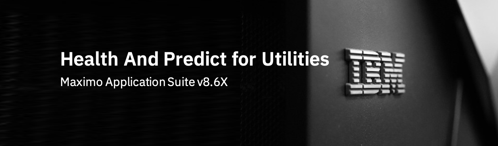

# Contributors to IBM Maximo Application Suite Health and Predict for Utilities 8.6 Overview Lab

- John Douglas - <john.douglas@ibm.com>
- Carlos Ferreira - <carlos.ferreira1@ibm.com>
- Taylor Luong - <taylor.luong@ibm.com>

---

# Change Information

|Date     |By             | Description                                           |
|:--------|:--------------|:------------------------------------------------------|
|2024-01-02|Jan Ekstrøm|Restructured to work on Github Pages.|
|2022-03-30|Taylor Luong| Uploaded 8.6 HPU lab. |

---
