# Manage - Mobile Lab

!!! note
    Please follow the `Action` statements to navigate the steps and perform the lab.

## Service Request to Work Order

Within Manage EAM, the newly created Service Request can be automated into a WO, tasks and labor are assigned and the status changed to approved.   It is beneficial to have records processed without human intervention to increase the throughput rates and allow those resources to work on more value-add activities.
In some cases, a manual review by a supervisor may occur where they can drill into related history records against the PUMP, they can also link directly to the monitor dashboard to review the details of the anomaly/alert.  Part of the evaluation may or may not give enough information to know exactly what needs to be addressed, so in this case an inspection should be performed. The supervisor can approve the work order and assign the appropriate resource.
  

## Execute Work Order
As a technician, I can login to Maximo Mobile and from the navigation page, tap My Schedule to see work that has been assigned to me whether I’m in the break room, on the other side of the plant, or even offline. 
`Action:` Go into Maximo Mobile, click My Schedule. 

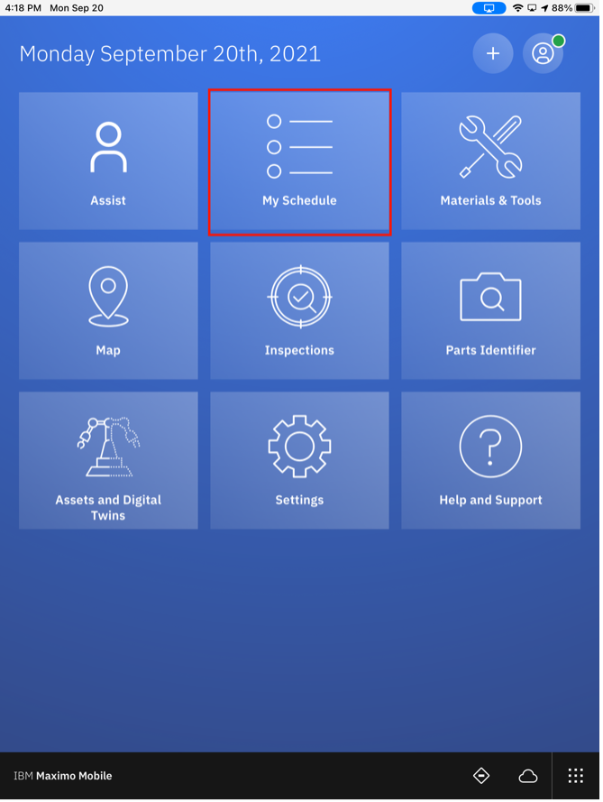{: style="height:400px;width:250px;margin-left:40px"}

!!! note
    Main Screen could look like Tiles or Tabs depending which display setting you choose. This main screen is currently using Tabs.

I see a new work order assigned to me, which is presented to me in order of priority so that I am focused on the right job at any given time in my shift. 

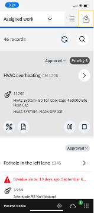{: style="height:400px;width:250px;margin-left:40px"}

I can look at all my work in a list, or use the map view to see work nearby and perform additional tasks like route optimization so I get to the correct location in the most efficient way. The location information can help direct me to the proper asset within the plant to perform the work order tasks. 
`Action:` Click on the map view icon in top right corner, then go back to My Schedule using the List menu next to Map icon.

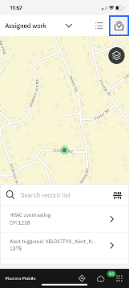{: style="height:400px;width:250px;margin-left:40px"}

As I arrive at the site of my next work order I check in with my Safety Officer so they know my location.

I open the newly assigned work order and follow the indicated touch point to Start the Work.  This will begin recording the time spent on these tasks.   
`Action:` Click Start Work in the work order that was generated from Monitor, then go into the Work Order.

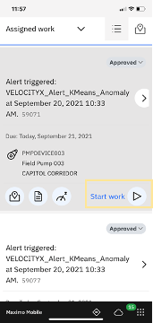{: style="height:400px;width:250px;margin-left:40px"}
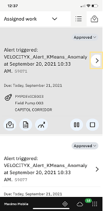{: style="height:400px;width:250px;margin-left:40px"}

Within the details of the WO, I can also see additional information including links in the long description that could take me back to monitor to see details of the anomaly.   
`Action:` Click on alert-based work order, Show the long description of the work order which includes hyperlinks back to Monitor.

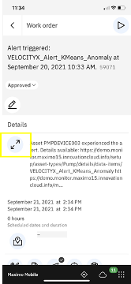{: style="height:400px;width:250px;margin-left:40px"}
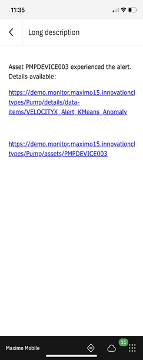{: style="height:400px;width:250px;margin-left:40px"}

Additionally, I can see an image of the Asset, and if there is a barcode available, I can validate that I am working on the right piece of equipment by using the barcode scanner.  Click the barcode icon.   I can also view Workorder history by clicking the calendar icon to the right.  

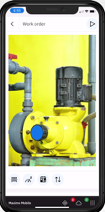{: style="height:400px;width:250px;margin-left:40px"}

By following the applications guidance, I tap on the TASK icon. Here I can see the individual steps needed to complete the inspection.  

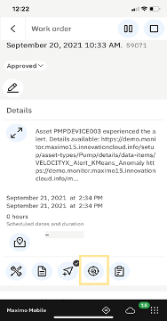{: style="height:400px;width:250px;margin-left:40px"}

It’s important that as a new technician that I have clear instructions available to me to ensure I’m performing the correct steps and gathering the proper information needed to complete this work. In Maximo Mobile, it is all about presenting the right information, in the right place, at the right time. 

I can now Start the inspection process. 
`Action:` Click the Start button. Clicking on the I information button will display related documents.

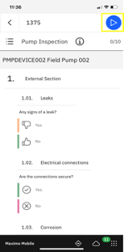{: style="height:400px;width:250px;margin-left:40px"}
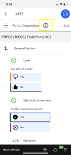{: style="height:400px;width:250px;margin-left:40px"}
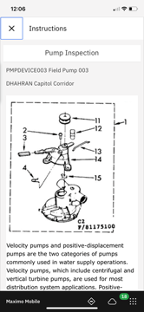{: style="height:400px;width:250px;margin-left:40px"}

`Action:` Review the inspection questions and respond All is normal except vibration and noise which are high indicating a problem. Click the Blue Checkbox to complete the inspection.

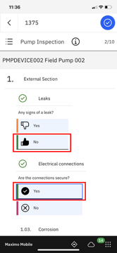{: style="height:400px;width:250px;margin-left:40px"}
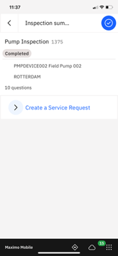{: style="height:400px;width:250px;margin-left:40px"}

I was going through the possible causes of what could be causing the vibration. There is nothing in the skid that seems to be causing instability, but I suspect that the O-ring may be worn out or deteriorated.  

It should be replaced, but since I am not familiar with how to do this, I use Maximo Assist to see if there is additional steps or instruction that would be useful. 

## Assist Queries

There are multiple options for navigating to Assist.   If there are tasks associated to the WO there is an option within the details of the task to launch Assist.

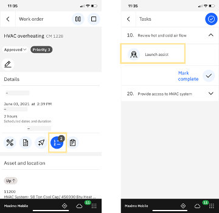{: style="height:400px;width:450px;margin-left:40px"}

From within the WO main details screen at the bottom of the record below the image, there is an icon to Launch Assist.

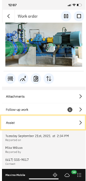{: style="height:400px;width:250px;margin-left:40px"}

From the Mobile navigator, I click ‘Assist’ to open the search page where I can enter the search criteria.

`Action:` Open the Maximo Mobile app and enter “Replace Pump O-Ring”, then select return.

{: style="height:400px;width:250px;margin-left:40px"}
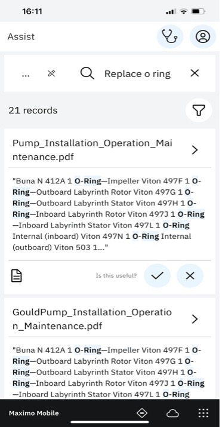{: style="height:400px;width:250px;margin-left:40px"}

Here I see the AI-powered search results arranged by most relevant recommendations at the top and organized in decreasing order of confidence. The AI shows me recommendations from manuals, historical work orders, previous collaboration sessions, training content – all of these different types of data sources are available for me to search against.  

 

If there are historical work orders, I can also look at additional details such as tasks, logs, failure reports or I can select on it to see exactly what was done in the past.

`Action:` Show historical work order. 

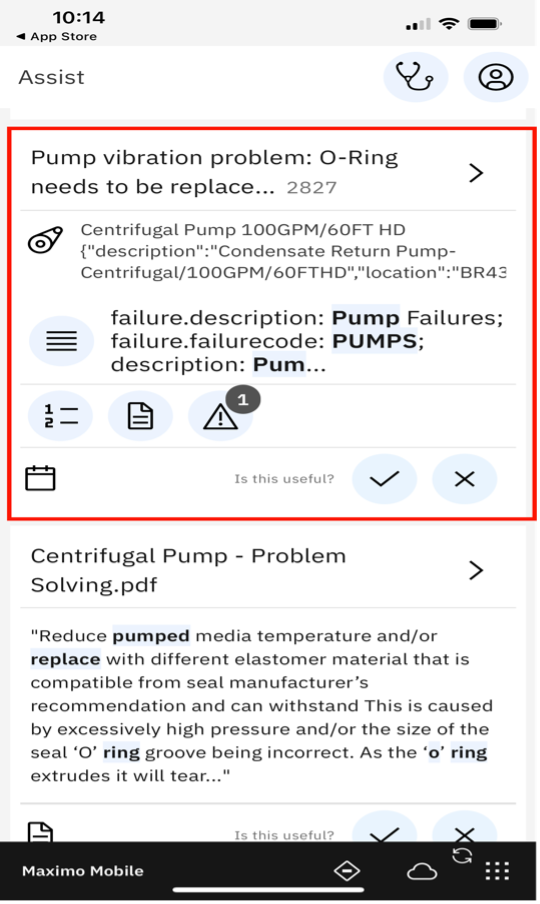{: style="height:400px;width:250px;margin-left:40px"}

 

I can also further refine the search results by selecting the filter option.

`Action:` Turn on the filter for asset type (`PUMP`), and manufacturer (`Goulds`) and select done.  

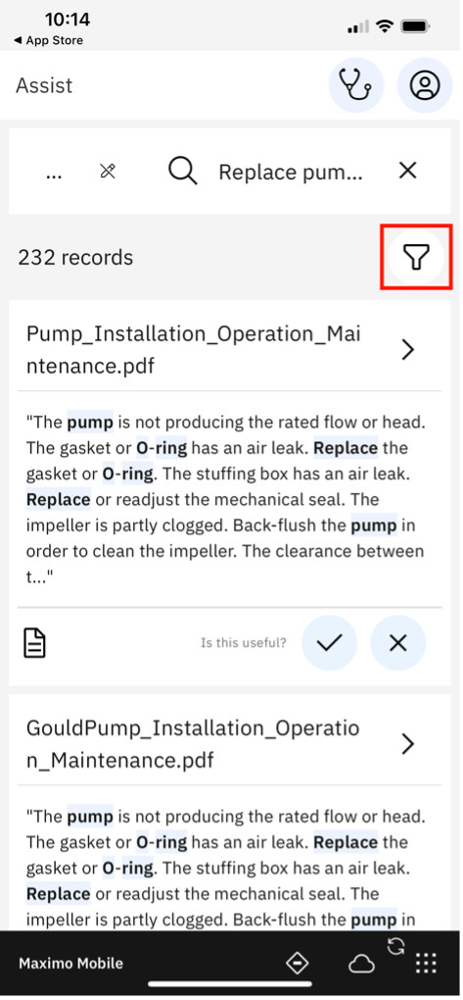{: style="height:400px;width:175px;margin-left:40px"}
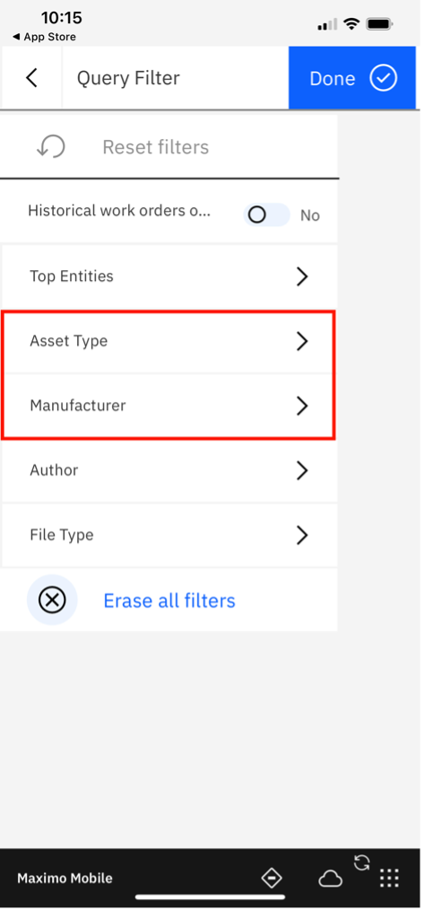{: style="height:400px;width:175px;margin-left:40px"}
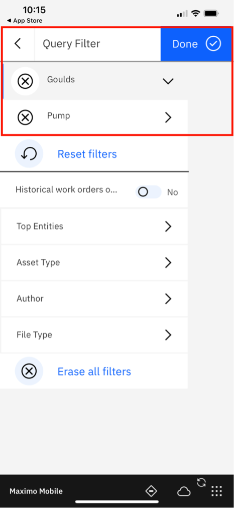{: style="height:400px;width:175px;margin-left:40px"}

 

I now see even more refined search results and the top result is now a maintenance manual. By giving the AI model feedback for the recommendations and marking them as relevant or not-relevant I am continuously training the AI models in real-time and improving the recommendations. 

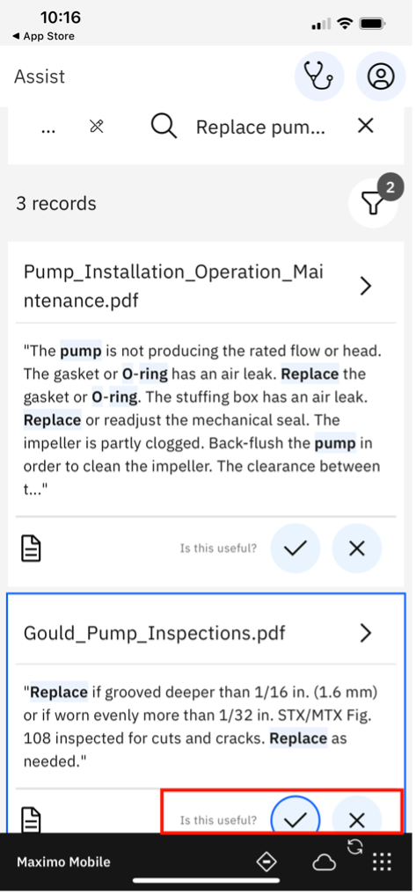{: style="height:400px;width:250px;margin-left:40px"}

`Action:` Select the `Yes` option in the search result, open up top result. 

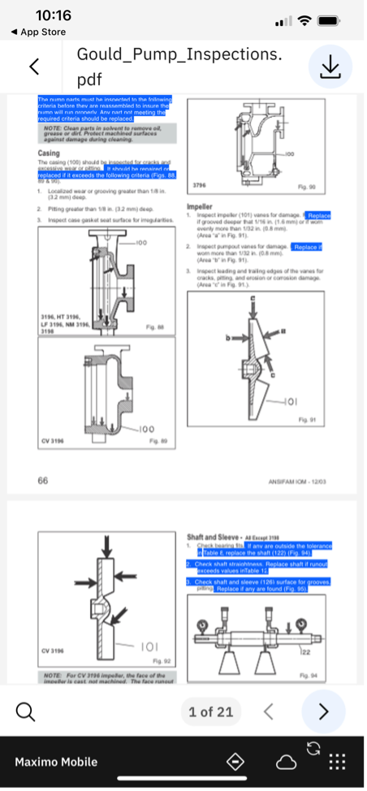{: style="height:400px;width:250px;margin-left:40px"}

Selecting the top recommendation in the search result presents the manual opened up and scrolled down to where the AI detects the most relevant passage which is highlighted in blue. This is really helpful especially in troubleshooting scenarios where there are surrounding images, and this can further help me get visual aid on the actions to take.  

 
## Contact Remote Expert

In this case, I can see the O-ring replacement instructions with visuals. I am able to follow them until I attempt to remove the O-ring. Even following these instructions, it seems like the O-ring will not come off easily, and I don’t want to risk damaging it. I could use some additional instructions to perform the fix So I choose to contact a remote expert for assistance. 

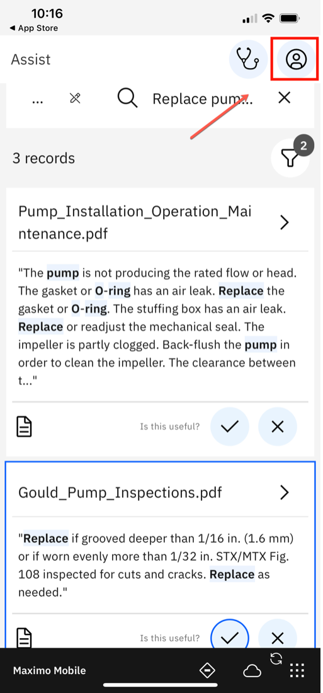{: style="height:400px;width:250px;margin-left:40px"}
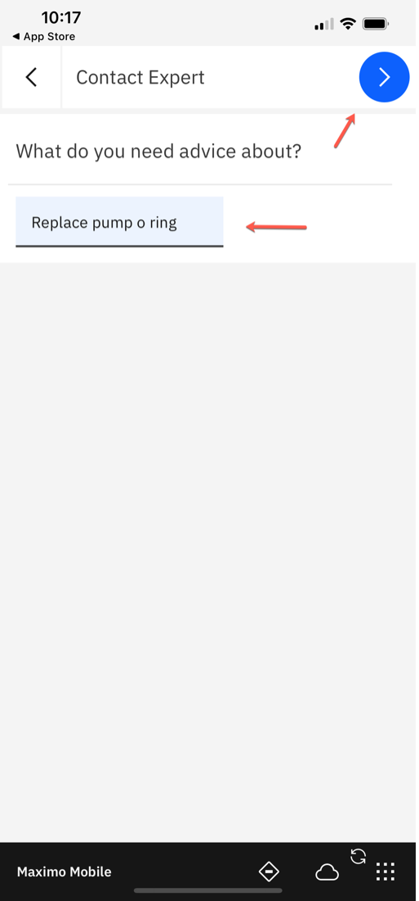{: style="height:400px;width:250px;margin-left:40px"}

`Action:` Select the `Contact Expert` option in the top right – type `replace O-ring` in the search field for (What do you need advice about?) 

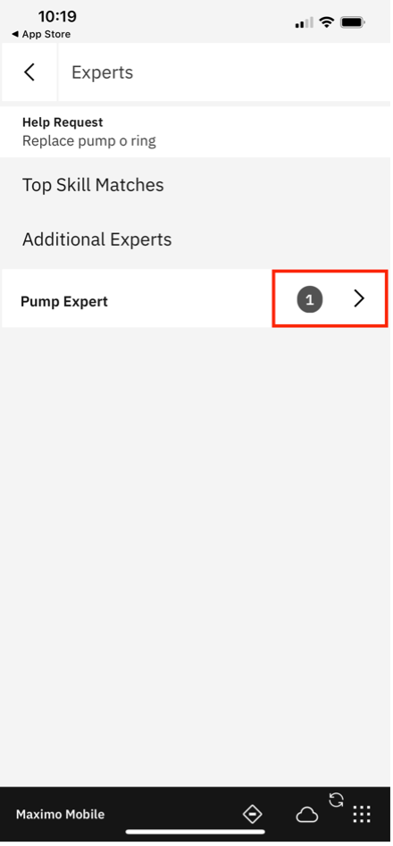{: style="height:400px;width:175px;margin-left:40px"}
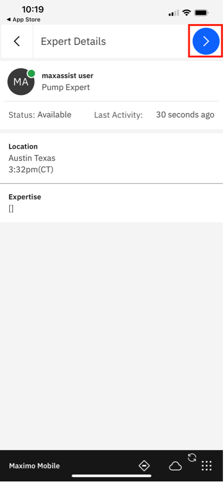{: style="height:400px;width:175px;margin-left:40px"}
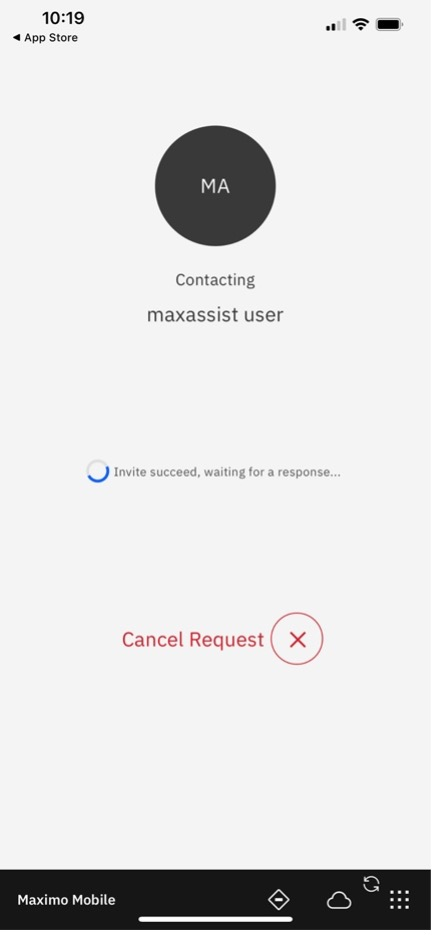{: style="height:400px;width:175px;margin-left:40px"}

Here I can see the online experts organized by area of expertise, and can also see the experts with top skill matches based on the work context. I see someone in the pump group is online so I initiate a collaboration request with them using the blue touchpoint. Soon, I receive a notification that they accepted the request and I initiate the session and can now use my mobile devices camera to show them what I see. 

!!! note
    This is where your second device will come into play.

`Action:` Select `Pump Group` to accept the request 

<b>Expert View(2nd Device):</b>
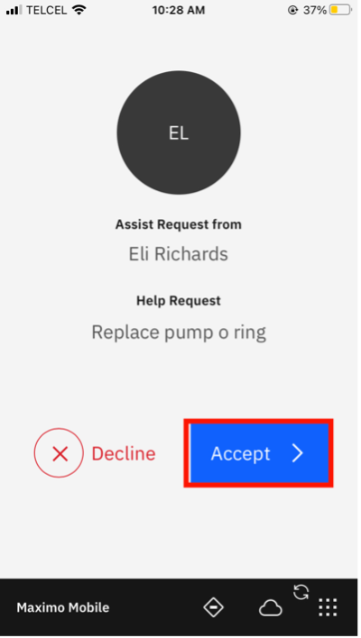{: style="height:400px;width:250px;margin-left:40px"}

<b>Technician View:</b>
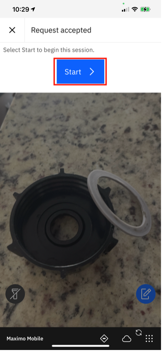{: style="height:400px;width:250px;margin-left:100px"}

`Action:` Select `START` to accept the request 

In this scenario we do not require audio but there are options to use voice or if we’re in a noisy environment we can use text to communicate.   

`Action:` Turn audio off on both devices so it doesn’t interfere. 

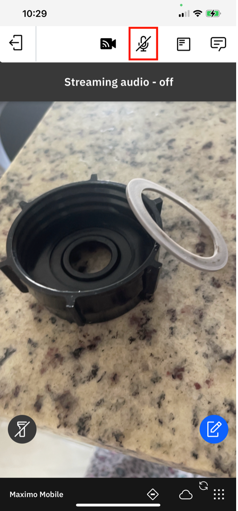{: style="height:400px;width:250px;margin-left:40px"}

As I show my phone, the expert on their side views a stream of video and images in a gallery and can select on one of them to provide what actions I should take.   I’m going to indicate where exactly I’m stuck so the expert can provide some guidance.    The expert can either enter pointed annotations or sketch on the screen directly using Augmented Reality.   There are also options with the annotations to mark them as a safety hazard so that the technician is careful as they perform the recommended action. 

<b>Technician View:</b>

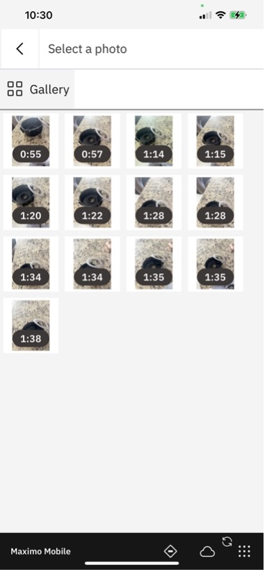{: style="height:400px;width:175px;margin-left:40px"}
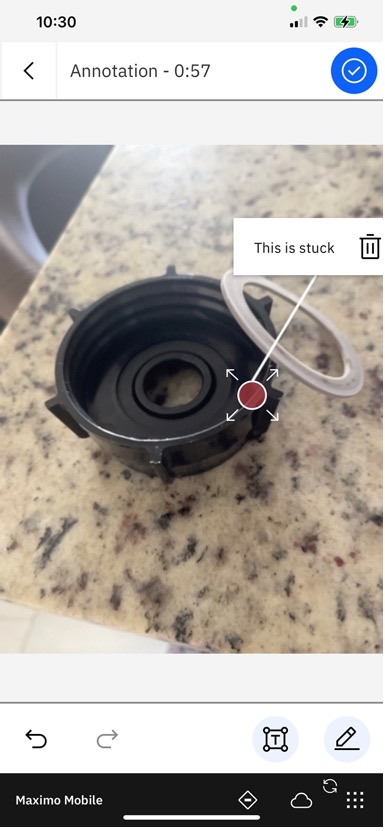{: style="height:400px;width:175px;margin-left:40px"}
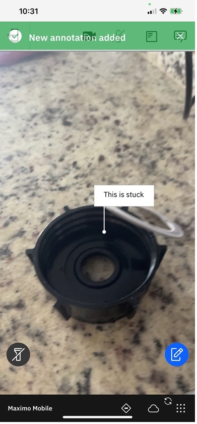{: style="height:400px;width:175px;margin-left:40px"}

`Action:`  Select blue button on the bottom right corner - Technician adds annotation - ‘this is stuck’ (red 		arrow is only pointing to annotation just made, not a part of Assist) 

<b>Expert View(2nd Device):</b>

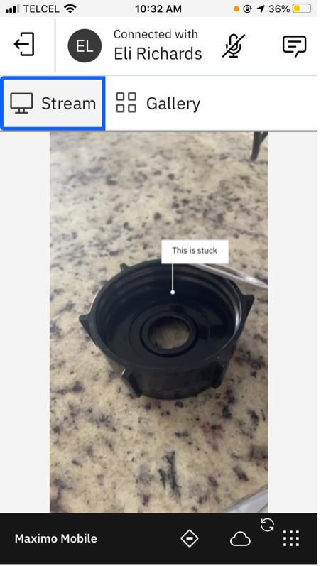{: style="height:400px;width:175px;margin-left:40px"}
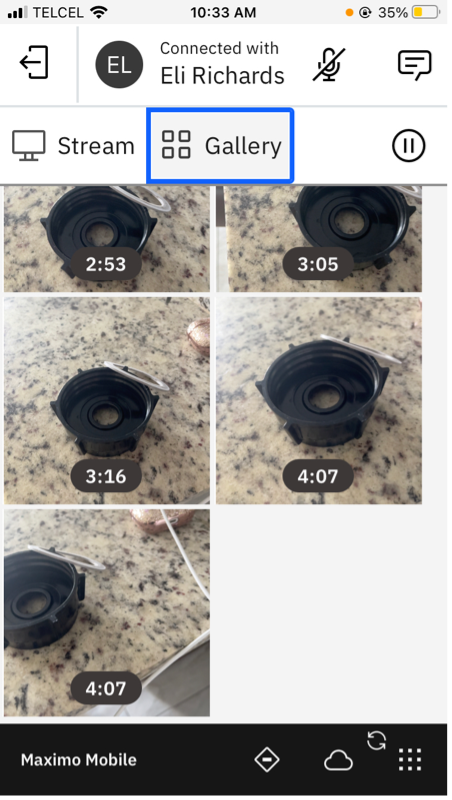{: style="height:400px;width:175px;margin-left:40px"}
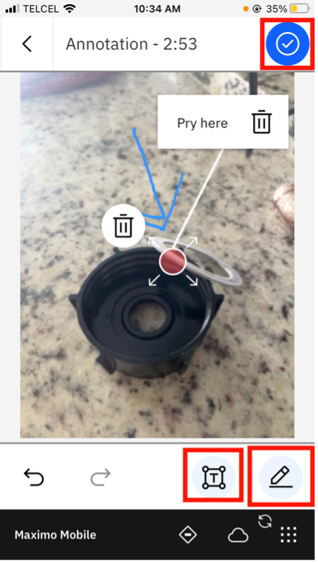{: style="height:400px;width:175px;margin-left:40px"}

`Action:` Expert adds any instruction “pry here”, either in chat or draw using sketch. 

This now shows up on the technicians view exactly where the expert had marked it which is the same experience they would have had if the two were next to each other.  

<b>Technician View:</b>

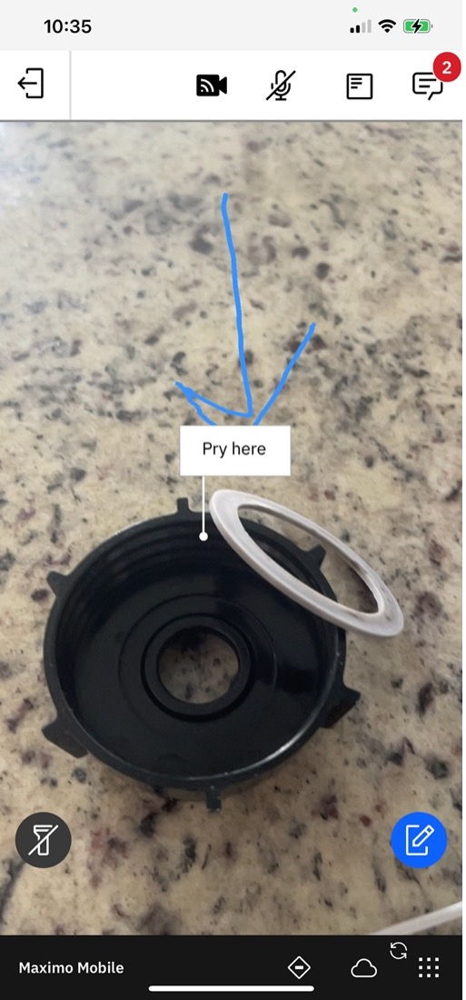{: style="height:400px;width:250px;margin-left:40px"}

You will notice that even when my phone is pointed in a different direction, the green arrow will direct me to the new annotation so I don't miss it.    

`Action:` Move phone away from annotations. 

<b>Technician View:</b>

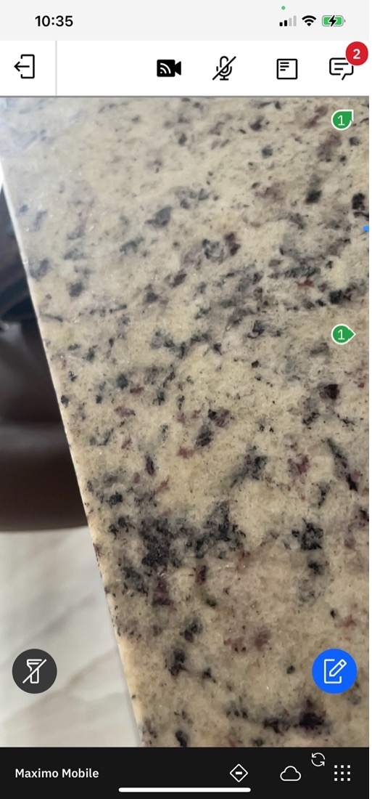{: style="height:400px;width:250px;margin-left:40px"}

The action of providing leverage to remove the o-ring worked and I’m able to now complete the rest of the tasks involved with replacing the part. I’ll end the collaboration session which will create a session summary with all of the chat transcripts and the guidance that was provided. This now can be added to the AI knowledge base for future reference. 

`Action:` Select the end the session icon in the top left corner, then select `Yes`. 

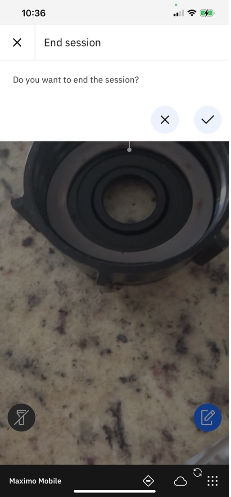{: style="height:400px;width:250px;margin-left:40px"}

## Identify Parts with AI

Now that the o-ring assembly has come off, the technician realizes the damage on the bottom of the bracket. They have seen many brackets like this one across the different pumps in the facility. Making sure they grab the right part from the right store room to replace this piece, the technician uses Parts Identifier to grab a picture of the damaged piece. 
`Action:` Open the "Parts Identifier” back on the mobile app

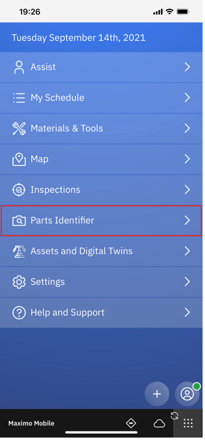{: style="height:400px;width:250px;margin-left:40px"}

The technician snaps a picture of the bracket and sees a couple different bracket pieces that are similar to the one that is damaged. Parts Identifier uses AI to brings up different parts that could potentially match the technician’s part. 
`Action:` Select camera and snap a picture of the part

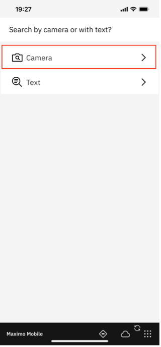{: style="height:400px;width:250px}
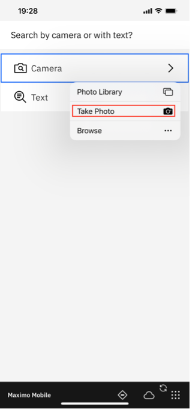{: style="height:400px;width:250px}

 

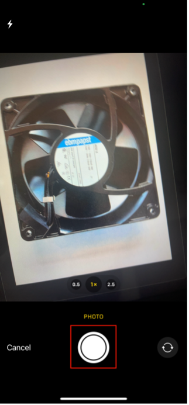{: style="height:400px;width:250px}
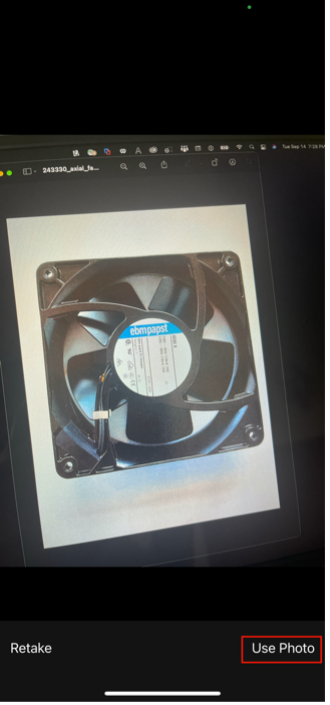{: style="height:400px;width:250px}

The technician selects the most similar piece and sees the information on this part. The technician can see exactly where this part is stored and a description of the item. This saves the technician time from searching the entire storeroom to find and match the correct replacement part or calling a friend. 
`Action:` Select the part and then blue check mark

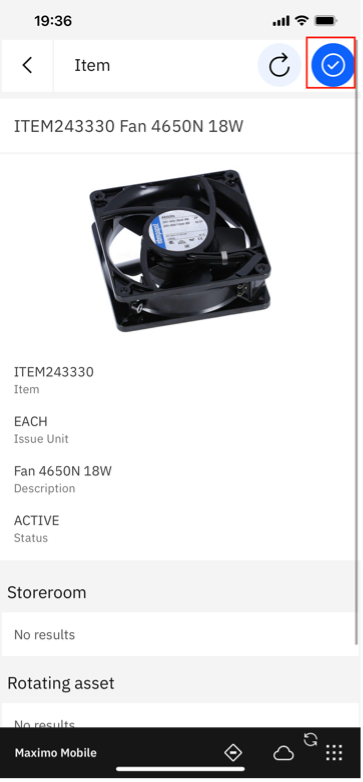{: style="height:400px;width:250px;margin-left:40px"}

If the serial number wasn’t completely wore off the part, he could also complete these steps by text. The AI would then match the exact part to the serial number within seconds. This allows for more first time fixes.

GO BACK TO THE ASSIGNED WORKORDER

## Close Work Order

Now that I have completed all the tasks for this work order, I also go ahead and add this to the comments in the work order work log that "Replaced O-Ring"    
`Action:` Open the worklog by clicking on the worklog touchpoint and type in the description 

I then need to record the failure information so that accurate data on the cause and remedy for this problem is available to support future analysis.  This information gathering is invaluable for Health and Predict as it provides rich qualitative data from the human-in-the-loop, to supplement our precise quantitative data coming from Monitor, to pinpoint exactly how, why, and when failures occurred. These failure codes for excessive vibration can now be used to update health and failure prediction dates later by a Reliability Engineer. 
`Action:` Select Report Work Icon in same view of the other icons. Add Failure Class ‘Pump Failures’, Problem ‘Stopped’, Cause ‘Vibration’ and Remedy ‘Replaced Part’. 

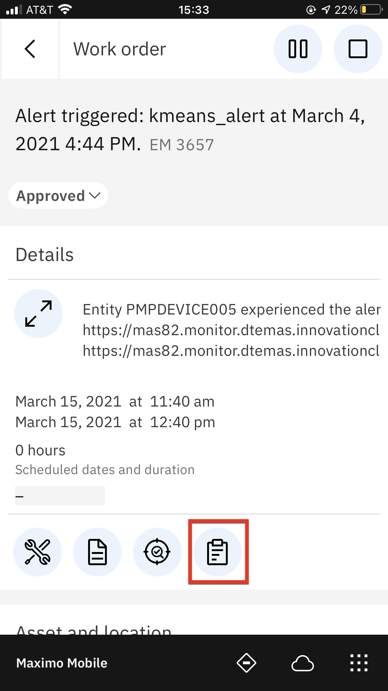{: style="height:400px;width:175px;margin-left:40px"}
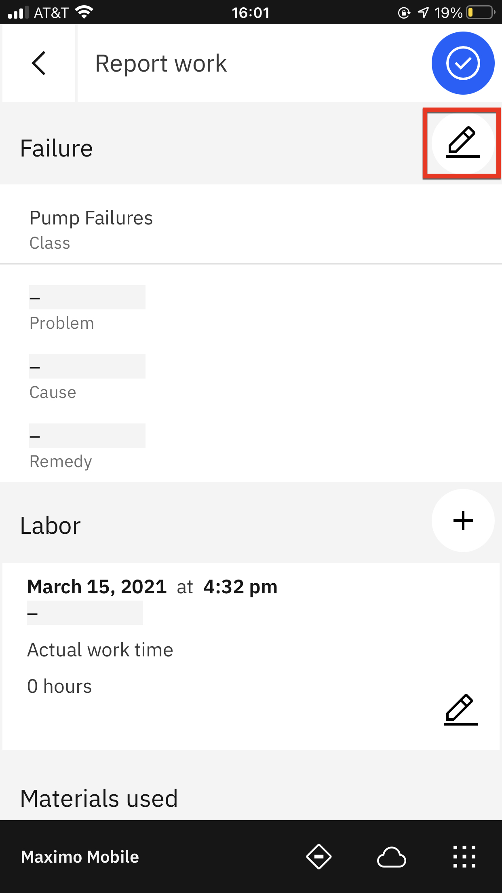{: style="height:400px;width:175px;margin-left:40px"}
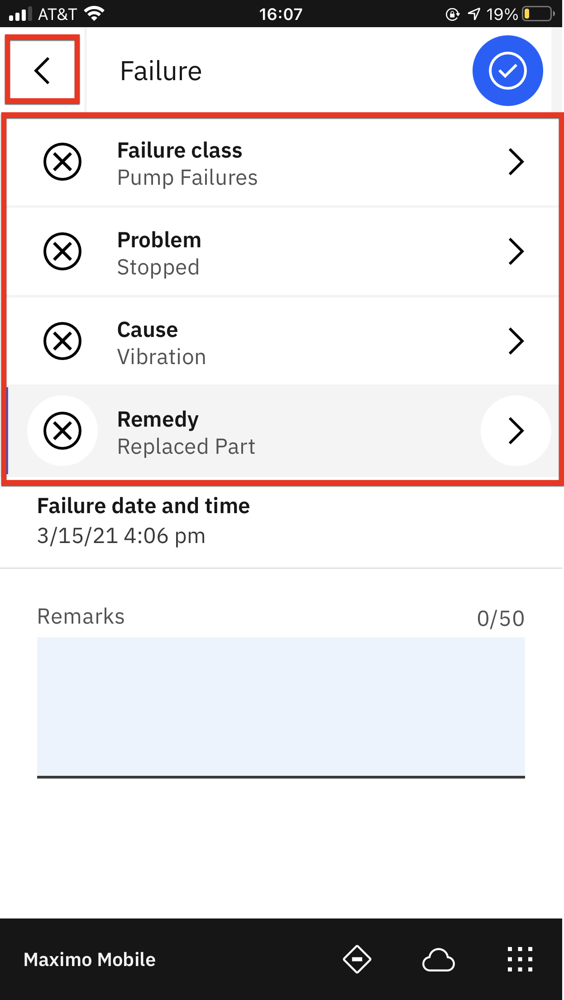{: style="height:400px;width:175px;margin-left:40px"}

I need to record the part that was used during the work and add that I used material ‘o-ring’ to the WO actuals. 
`Action:`  Add + to the Materials section, O-ring, qty 1

I want to also record the time it took to execute the steps of the WO and complete the WO. This data will help future planners and schedulers to estimate how long work like this typically takes, and more efficiently plan and assign these types of jobs. And I also add the unplanned parts and materials I used in replacing the o-ring. 
`Action:` Add time or stop the clock and close out the work order by selecting Complete work.

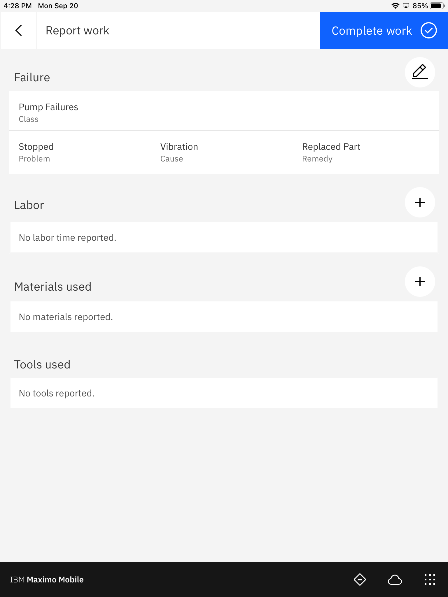{: style="height:400px;width:250px;margin-left:40px"}
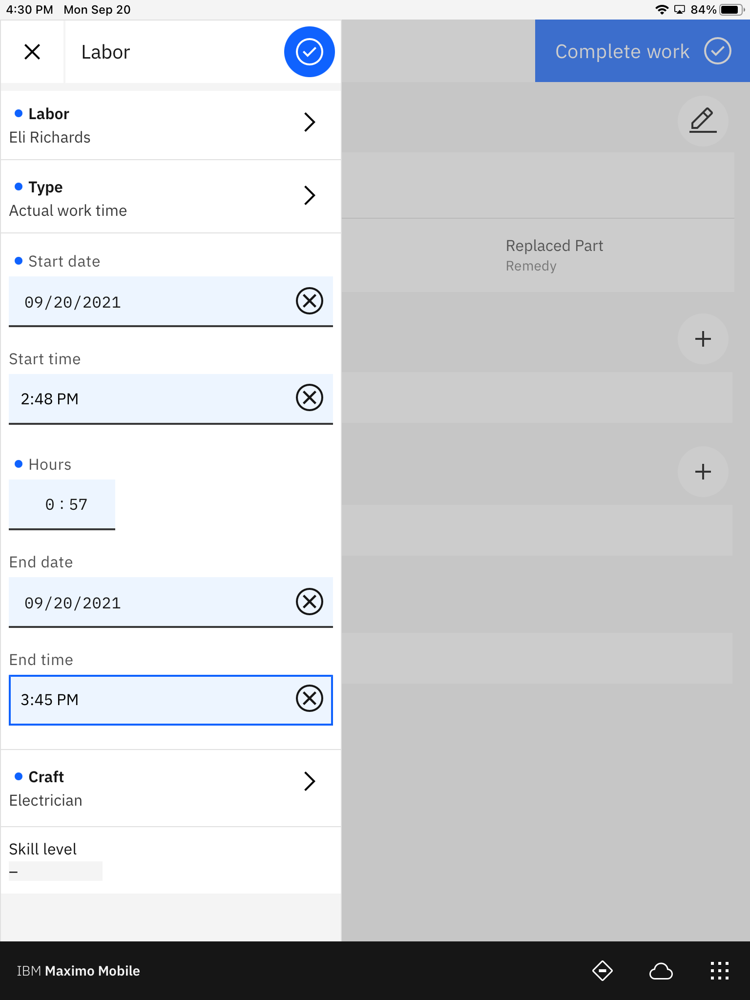{: style="height:400px;width:250px;margin-left:40px"}

As the technician is leaving the site they slip on a wet floor and fall and are unable to get up. This is a man-down situation.   

<b>TRANSITION:</b>  I’m now going to hand it over to the Safety Officer who is monitoring the technicians across the plant.

 

 

