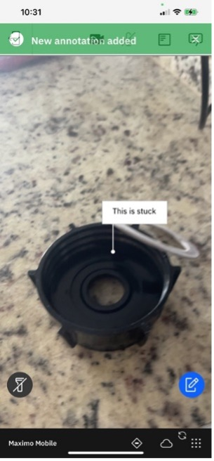
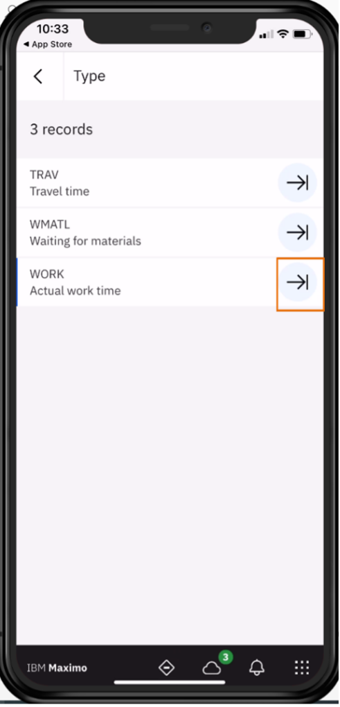

# Manage Lab (Under Construction)

If you created an Service Request (SR) in Monitor, it will be automatically turned into a work order (WO).  However, that automatic escalation will not include the job in the WO.

For this section, you need to duplicate the template `WO12345` against `PMPDEVICE005` and `Approve`.  You may wish to change the date to make your demo more realistic.

`WO12345` should be in `canceled` status in the `Work Order Tracking` app.  
 

## Work Order Tracking

In this exercise the supervisor plans work in Manage by duplicating and approving a work order. To find the work order:

1. Go to  `Work Order Tracking` in Manage. 

2. Go to `More search fields` using the vertical `…`menu. 

3. Clear the `History?` value, and click `Find`. 

4. Type `12345` in the `Work Order` field, and press enter. 

5. Open the work order by selecting `12345` from list. 
. 

6. From the left navigation bar, select `Duplicate Work Order`. 

7. In the pop-up, select `Duplicate Work Order with its Tasks`, and press `OK`. 

Your new `WO` will automatically move to `Approved` status.

## Manage - Mobile

### Technician that performs inspection and repair

In this exercies you will be a Technician that performs inspection and repair using Manage, Maximo Mobile, and Assist. If you haven’t downloaded the mobile application, this can be demonstrated using a desktop and logging into Manage.  The TECHNICIAN application can be found in the Work Orders module, under the Role Based Applications sub-menu. From the browser settings select `MORE TOOLS` and `RESPONSIVE` design view or mode to have the screen appear more like a mobile device.

Within Manage EAM, the newly created Service Request can be automated into a WO, tasks and labor are assigned and the status changed to approved.  It is beneficial to have records processed without human intervention to increase the throughput rates and allow those resources to work on more value-add activities.

In some cases a manual review by a supervisor may occur where they can drill into related history records against the PUMP, they can also link directly to the monitor dashboard to review the details of the anomaly/alert.  Part of the evaluation may or may not give enough information to know exactly what needs to be addressed, so in this case an inspection should be performed.    The supervisor can approve the work order and assign the appropriate resource.

1. In Maximo Mobile, click `My Schedule`.  Alternatively login to Manage on the deskop and open the Technician application in the Work Orders module, Role Based Applications from the left navigation menu.

2. As a technician, I can login to Maximo Mobile and from the navigation page, tap `My Schedule` to see work that has been assigned to me whether I’m in the break room, on the other side of the plant, or even offline. 
{: style="height:400px;width:250px;} 

3. Highlight the list and map icon options in the top right.  I see a new work order assigned to me, which is presented to me in order of priority so that I am focused on the right job at any given time in my shift.    I can look at all my work in a list, or use the map view to see work nearby and perform additional tasks like route optimization so I get to the correct location in the most efficient way.   The location information can help direct me to the proper asset within the plant to perform the work order tasks.   
{: style="height:400px;width:250px;}   
{: style="height:400px;width:250px;}  

4. Click the `Start arrow` in the work order that was generated from the alert in Monitor.  I open the newly assigned work order and follow the indicated touch point to `Start the Work`.  This will begin recording the time spent on these tasks.  Within Mobile the next logical action is always highlighted to help direct the user to the next step. 
{: style="height:400px;width:250px;} 

5. Click on `alert-based work order`, show the long description of the work order which shows the URL to navigate to the originating alert in the device dashboard in Monitor. 
{: style="height:400px;width:250px;} 

6. Within the details of the `WO` I can see additional information including links in the long description that could take me back to monitor to see details of the anomaly.  
{: style="height:400px;width:250px;} 

Additionally, I can see an image of the Asset, and if there is a barcode or QR code available, I can validate that I am working on the right piece of equipment by using the barcode scanner.  The second icon will show the meter reading history.  I can also view Workorder history by clicking the calendar icon.  Finally the double arrows will bring me to the Asset status, whether it is UP or DOWN.

7. Click out of the long description and scroll down to the image.    Describe and optionally open each icon.   
{: style="height:400px;width:250px;}  

By following the applications guidance, I tap on the blue highlighted `TASK` icon which also shows me the number of tasks associated with this work. Now I can see and mark complete the individual steps as well as manage any individual status’s at the task level.  

It’s important that as a new technician that I have clear instructions available to me to ensure I’m performing the correct steps and gathering the proper information needed to complete this work.   In Maximo Mobile, it is all about presenting the right information, in the right place, at the right time.

8. Click on the `blue task` icon.   Optionally complete some of the tasks.  Return to the main work order by checking each task and hitting `DONE`. 
{: style="height:400px;width:250px;}  
{: style="height:400px;width:250px;} 

There could be inspection steps associated with the overall workorder, or within a specific Task.  This workorder has an inspection form associated with it.  Click the inspection icon to open the inspection steps. 
 
9. Click the circle icon with a check box in the center to open the inspection form.

10. Click `blue icon` to start the inspection process. 
{: style="height:400px;width:250px;} 

Review the inspection questions and respond   All is normal except vibration and noise which are high indicating a problem.  Add a Temperature above 100.   Note that the temperature has a validation that has been set against it to be within a range of 0-100.   Inspection forms can also be set up with conditional questions and answers.  For example, only ask for the temperature if the vibration was high.

11. Click the `Blue` Checkbox to complete the inspection.

I was going through the possible causes of what could be causing the vibration. There is nothing in the skid that seems to be causing instability, but I suspect that the O-ring may be worn out or deteriorated.  It should be replaced, but since I am not familiar with how to do this, I use Maximo Assist to see if there is additional steps or instruction that would be useful. 
{: style="height:400px;width:250px;} 

### Technician uses Assist to find instructions

At the bottom of the main WO view, there is an action to `Launch Assist`.  Assist is an additional set of capabilities that are part of the Mobile entitlement (no additional appoints are required).

!!! note
    Assist is not available through the web browser, only on the mobile device.

                                                                                                                   
1. From the Mobile navigator you can click `Assist` to open the search page where I 	
{: style="height:400px;width:250px;} 

Also, optionally from the `Mobile navigator` you can click `Assist` to open the search page where you can launch Assist. 
{: style="height:400px;width:250px;}  

2. Select the `Contact Expert` option in the top right – type replace O-ring in the search field for (What do you need advice about?)  It seems like the O-ring will not come off easily, and I don’t want to risk damaging it.   I could use some additional instructions to perform the fix so I choose to contact a remote expert for assistance. 
{: style="height:400px;width:250px;} 

Here I can see the online experts organized by area of expertise, and can also see the experts with top skill matches based on the work context.  I see someone in the pump group is online so I initiate a collaboration request with them using the blue touchpoint.  Soon, I receive a notification that they accepted the request and I initiate the session and can now use my mobile devices camera to show them what I see.

!!! note
    This is where your second device will come into play.

3. Click `Pump Expert`.  
{: style="height:400px;width:250px;}  

4. Click `Right arrow` on `Pump Expert` tab.  
{: style="height:400px;width:250px;}   
{: style="height:400px;width:250px;}   

5. Select `Pump Group` to accept the request. 
{: style="height:400px;width:250px;}  

6. Select `START` to accept the request. 
{: style="height:400px;width:250px;}  

7. Turn `audio off` on both devices so it doesn’t interfere.  In this scenario we do not require audio but there are options to use voice or if we’re in a noisy environment we can use text to communicate.   
{: style="height:400px;width:250px;}  

8. Select `blue` button on the bottom right corner - Technician adds annotation - `this is stuck` (red arrow is only pointing to annotation just made, not a part of Assist)

9. As I show my phone, the expert on their side views a stream of video and images in a gallery and can select on one of them to provide what actions I should take.   I’m going to indicate where exactly I’m stuck so the expert can provide some guidance.    The expert can either enter pointed annotations or sketch on the screen directly using Augmented Reality.   There are also options with the annotations to mark them as a safety hazard so that the technician is careful as they perform the recommended action.
{: style="height:400px;width:250px;}     
{: style="height:400px;width:250px;}     
{: style="height:400px;width:250px;}     

10. Expert adds any instruction `pry here`, either in chat or draw using sketch. 
{: style="height:400px;width:250px;}   
{: style="height:400px;width:250px;}   
{: style="height:400px;width:250px;}  

11. This now shows up on the technicians view exactly where the expert had marked it which is the same experience they would have had if the two were next to each other.     
 

12. Move phone away from annotations. You will notice that even when my phone is pointed in a different direction, the green arrow will direct me to the new annotation so I don't miss it.    

13. Select the end the session icon in the top left corner, then select `Yes`. The action of providing leverage to remove the o-ring worked and I’m able to now complete the rest of the tasks involved with replacing the part.   

14. I’ll end the collaboration session which will create a session summary with all of the chat transcripts and the guidance that was provided.  This now can be added to the AI knowledge base for future reference. 

### Technician returns to assigned workorder to close out the work

Now that I have completed all the tasks for this work order, I also go ahead and add this to the comments in the work order work log that `Replaced O-Ring`   

1. Technician opens the worklog by clicking on the worklog touchpoint and type in the description. 

2. Open the Clipboard icon to report work.

3. Add `Failure Class`: ‘PUMPS’, `Problem`: ‘LEAK’, `Cause`: ‘SEAL LEAKING’, and `Remedy`: ‘REPLACE’

4. I then need to record the failure information so that accurate data on the cause and remedy for this problem is available to support future analysis.  This information gathering is invaluable for Health and Predict as it provides rich qualitative data from the human-in-the-loop, to supplement the quantitative data coming from Monitor, to pinpoint exactly how, why, and when failures occurred. These failure codes for excessive vibration can now be used to update health and failure prediction dates later by a Reliability Engineer. 
{: style="height:400px;width:250px;}    
{: style="height:400px;width:250px;}   

5. To report work and materials used, click the 3 buttons and choose Add Items. It is also important to accurately record the materials or items that were used as part of the repair.  This will keep inventory balances accurate, and provide complete costing information against the WO/Asset.   
{: style="height:400px;width:250px;}    
     
6. Add `+` to the `Materials` section the seal that were used, qty 1.  I need to record the part that was used during the work and add that I used material `SEAL` to the WO actuals. 
{: style="height:400px;width:250px;}   	 

7. Click the `+` next to `Eli` to report the hours and type of work performed.  The time that was spent doing the work is also a component of overall cost and effort against this repair.  It is Important to have a clear record of the amount of time spent, and for some organizations this is used as part of payroll activities.  It’s also used to more accurately define the job tasks and may lead to adjustments when comparing plans to actuals. 
{: style="height:400px;width:250px;}    	 

8. Select the `Work Type`. There is the ability to categorize the work time as either `Travel Time`, `waiting on Materials` or `Actual work time`. 
{: style="height:400px;width:250px;}     
{: style="height:400px;width:250px;}    
      
9. Add time and click `OK`.  I want to also record the time it took to execute the steps of the WO and complete the WO. This data will help future planners and schedulers to estimate how long work like this typically takes, and more efficiently plan and assign these types of jobs. And I also add the unplanned parts and materials I used. 
{: style="height:400px;width:250px;}  
{: style="height:400px;width:250px;}   

## Summary

As the technician, maintaining the distribution and water treatment assets or other critical infrastructure assets, I can access the information I need before during and after performing work. I can get additional information and assistance do the work allowing me to complete work order in a single trip. 
      
MAS Mobile capabilities: It can Be Deployed On Premises Or in Any Cloud Environment with Flexible Options and can work online or offline.  IBM Maximo Mobile stands out for integrating remote AI-based expert assistance and real-time data from wearables and sensors, enhancing the digital twin experience. Its single-downloadable application across various platforms ensures quick deployment and seamless navigation, optimizing operational productivity even in disconnected modes.

In the next lab the reliability engineer will do further analysis since the technician is only tasked with working on specific assets in their care whereas the reliability engineer is looking across all sites/pumps.

<b>TRANSITION:</b> I will now hand it over to the reliability engineer to do some further analysis since the technician is only tasked with working on specific assets in their care whereas the reliability engineer is looking across all sites/pumps.

