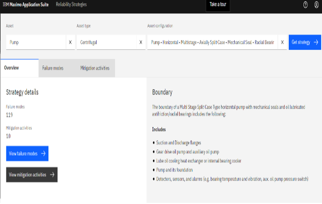
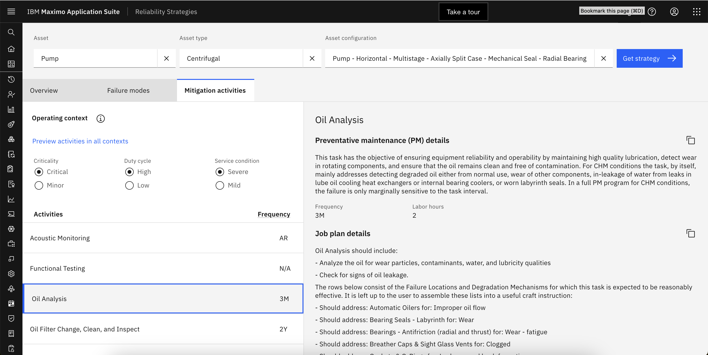

# Reliability Centered Maintenance

!!! note
    This lab is under development.  Not all steps are complete or accurate.

Asset Maintenance is an essential aspect of business operations, and it influences a significant part of operational expenses. Maintenance tasks may be preventive, predictive, or involve inspections to identify or monitor flaws.  A preventive maintenance approach is often less selective and based on a fixed schedule as per industry best practices or the OEM.  With the application of effective reliability strategies, these maintenance and inspection tasks can be more focused and centered around improving efficiency, reliability and safety of assets.

RCM is an analysis-based approach which focuses on identifying asset functions, failure causes, failure modes and effects analysis (FMEA) for individual assets.  RCM helps you prioritize, optimize and assign maintenance activities to increase asset life and decrease functional failure in the most cost-efficient way possible.

Implementing RCM requires teams to perform RCM analysis for identifying critical asset functions, desired performance standards, possible failure scenarios, causes of those failure scenarios, and consequences of each failure scenarios for individual assets which requires significant time, cost and resources. 

A dedicated RCM / FMEA application which includes a reliability strategy library is available with Maximo Application Suite which makes it easy to select and apply reliability strategies for critical assets and speeds time to value.

## Available Asset Strategies

As a reliability engineer for a water treatment plant, I want to implement RCM to improve asset availability and efficiency, and maintain my business-critical assets such as centrifugal pumps.  I’ve noticed that the lube oil tends to degrade over time.  I want to put a strategy in place to regularly monitor the lube oil to prevent wear on the pump.

In this exercise you will understand what asset classes and maintenance strategies are available in Maximo Reliability Strategies.
 
1.	Log into MAS and select the `Manage with Health` application.
 

2. Navigate to `Assets` from left nav bar. 

3. Select `Reliability Strategies` to redirect to the `Reliability Strategies` application. 

The `Reliability Strategy` library accelerates application of RCM0with a list of 58,000+ failure modes and corresponding mitigation activities already defined for individual assets.  I can use these to create preventive maintenance tasks and job plans. 
 
4. Click on the `Asset` box and a list of assets will be available for selection. 

## Filter on Pump Asset Strategies

With the `MAS Reliability Strategies` application, I have a prebuilt library of assets from which I can filter and select assets for RCM0analysis based on Asset type and Asset configuration to identify and select business critical assets.

In this exercise you will understand what pump asset class maintenance strategies are available for preventive maintenance.

1. Select Asset:  `Pump`
2. Select Asset type:  `Centrifugal`
3. Select Asset configuration:  `Pump - Horizontal - Multistage - Axially Split Case - Mechanical Seal - Radial Bearings-Oil Lubed` (the 2nd one on the list). 

## Select a Strategy

This action returns `failure modes` and corresponding mitigation activities to get `FMEA / PM` and `Job plans` for selected asset from the library, which eliminates weeks of work to analyze RCM strategies with technicians, operators and supervisors and speeds up time to value.

In this case, the `Get strategy` action provides a list of failure modes and corresponding mitigation activities for centrifugal pumps which I can analyze further to optimize our preventive maintenance tasks.

1. Navigate to the `Failure modes` tab to see the list of all possible failure modes for centrifugal pumps.
2. Expand `Lube Oil` to see corresponding failure mechanisms.
3. Expand `Degraded` failure mechanism to see corresponding failure influences.
4. Select `Normal Wear` failure influence. Select this as the `Pump Asset Strategy`

## Select a Operational Context

What level of preventive maintenance is required depends on the utilization of the asset and it's location.  This operational context is an important factor to consider in deciding on a preveventive maintenance plan.  This helps me also identify the critical affects I should monitor for my asset. Stressors that can cause or worsen the failure, universal or conditional degradation time, failure effects, repair time as well as discovery opportunities to detect the functional failure.

1. Select the pump operational context by scrolling to bottom right side of the page to see all the mitigation activities with its effectiveness listed for the `Normal Wear` for `failure influence`.
2. Navigate to `Mitigation activities` tab. This will list all the `mitigation activities` for my asset.
3. Scroll to bottom of `mitigation activities` list and select `Oil Analysis`
4. Navigate to right side of the page where `preventive maintenance` and `job plan` details are available along with `frequency and labor hours for Oil Analysis` mitigation activity.

These activities are the reliability strategies that I can apply to mitigate respective failure modes.

## Customize the Operational Context
I can also fine tune these mitigation activities as per our operating context based on criticality, duty cycle and service condition of selected asset.

1. Click on the circle `i` icon to the right of `Operating context` icon and click on `View details for this asset` link within the popup.
2. Close the dialog box and click `Preview activities in all contexts` option.
3. Close the dialog box and toggle the `Duty Cycle` radio button from High to Low.
4. In the right side of the page scroll down to `Effectiveness` section.

Changes in frequency for `Oil Analysis` activity is suggested based on the change in `duty cycle`.

`Criticality`, `Duty cycle` and `Service condition` are select-able and together these make up the `Operating context` to determine the best reliability strategy for maintenance of my asset.

This lists all the failure modes that `Oil Analysis` mitigation activity can address which provides comprehensive details as to how multiple failure modes and mitigation activities can be tied together.

## Apply the Maintenance Plan

!!! note
    This following exercise may have already been completed. Skip these steps and simply review the completed job plan and PM. 

I can copy the job plan and preventative maintenance details and navigate directly from the `Mitigation activities` tab to create respective `job plans` and `PM tasks` for my assets.

1. Copy the `Maintenance Plan` by clicking on the `copy icon` to the right of `Job plan details`.
2. Click `Open Job Plans` link within the pop up.

3. Apply filter for `job plan “57899”` to list job plan created for pump devices.

4. Click on the `long description` icon to see the text pasted from `Reliability Strategies`

The job plan details will be copied and pop up will be displayed with link to navigate to `Job Plans` in Manage. I can paste the copied job plan details to create new job plan. I have created Job plan `57899` for centrifugal pumps detailed tasks using `Reliability Strategies`.

5. Paste the `Maintenance Plan` by clicking on the `copy` icon to the right of `Preventative maintenance (PM) details` from `Mitigation activities` tab.
6. Click `Open Preventative Maintenance` link within the pop up.

7. Apply filter for asset `PMPDEVICE` to list all the PMs created for pump devices.

8. Open `PM “1030”` and click on the `long description` icon to see the text pasted from `Reliability Strategies`.

9. Paste the copied `Preventive Maintenance details` to create PM tasks for my assets.
10. Preventive Maintenance details will be copied and pop up will be displayed with link to navigate to `Preventive Maintenance` menu in Manage

With RCM analysis I have created multiple preventive maintenance task with the right frequency and precise labor hours required to mitigate each failure mode for centrifugal pump devices. Implementing RCM based PM and job plans optimizes overall asset reliability & efficiency as well as makes it much faster and simpler for our field technicians to perform PM tasks.

## Summary

As the Reliability Engineer, maintaining the grid or other critical infrastructure assets, I was able to use `IBM Maximo Application Suite Reliability Strategies` to identify assets failure modes, identify effects to measure to monitor my asset performance and identify the best preventive maintenance plans for specific asset classes and operating contexts that reflect my business needs. This will help me later setup and calculate asset health and risk to make it easier to identify and then investigate and action those assets to prevent a failure and unplanned downtown saving thousands of dollars, and maintaining the integrity of the grid.

Now that I have implemented a job plan and a Preventive Maintenance work order template using Reliability Strategies, I’m going to turn it over to the operational support engineer who can monitor all of our business critical assets as part of RCM.