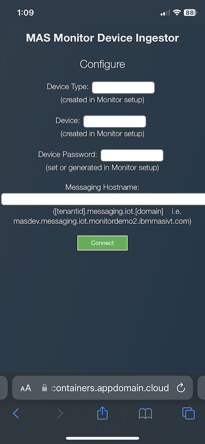
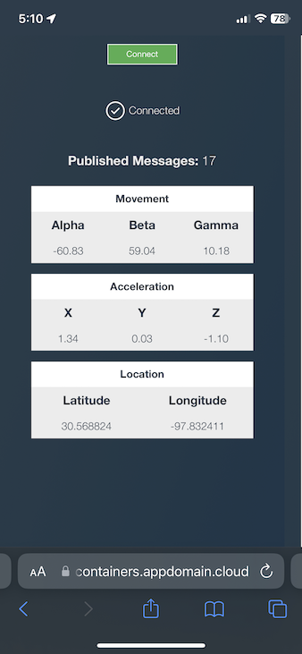

# Objectives
Send data to Monitor using the MAS Monitor Device Ingestor mobile web app

## Use the MAS Monitor Device Ingestor mobile web app

1. Open the following link on your mobile device
 Note: For IOS devices Safari must be used for the accelerometer to work
 [https://device-ingestor-mas-monitor-tool.monitordemo2-822c5cdfc486f5db3c3145c89ca6409d-0000.us-south.containers.appdomain.cloud/](https://device-ingestor-mas-monitor-tool.monitordemo2-822c5cdfc486f5db3c3145c89ca6409d-0000.us-south.containers.appdomain.cloud/)

2. Fill in the information required
     a. Device Type you created on the previous page
     b. Device you created on the previous page
     c. Device password you created on the previous page
     d. Messaging hostname which should look like this
           [tenant/workspace].messaging.iot.[domain]
           i.e. masdev.messaging.iot.monitordemo2.ibmmasivt.com
3. Click Connect button
4. For IOS devices you will get a popup to enable the accelerometer
5. The screen will say Connecting
6. Once Connected the screen will show the metrics being collected from GPS and the accelerometer
7. Go for a walk while data is being sent on your mobile device so that the GPS and accelerometer data varies
 

## Troubleshooting

<b>AMQJS0007E Socket error: undefined</></b>
 Check that the Messaging hostname was entered correctly

<b>AMQJS0006E Bad Connack return code:5 Connection Refused: not authorized.</b>
 Check the Device type, Device, and Password were entered correctly

