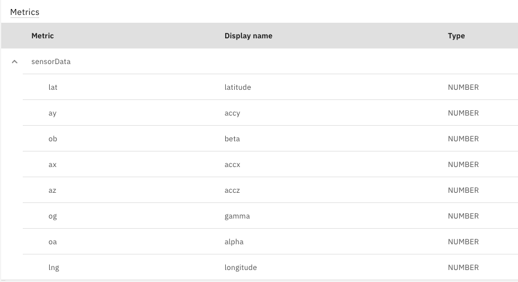

# Objectives
In this Exercise you will learn how to setup Monitor to receive data from your mobile device.

* Create a device type and setup metrics in Monitor
* Create a device in Monitor representing your mobile device

## Create a device type and setup metrics in Monitor

### Create a device type

1. Go to Setup in Monitor
2. Go to Devices tab
3. Click on + button to create a device type
4. Choose Empty/Basic template
5. Next
6. Take note of the name you give as you will need this in the mobile app config
7. Create

### Create Metrics in the device type

1. Under Metrics section click Add metric
2. Click Add metric
     a. Enter lat for metric
     b. Enter latitude for display name
     c. Enter sensorData for event
     d. Choose Number for type 
3. Click Add metric
     a. Enter lng for metric
     b. Enter longitude for display name
     c. Choose sensorData for event
     d. Choose Number for type
4. Click Add metric
     a. Enter ax for metric
     b. Enter accx for display name
     c. Choose sensorData for event
     d. Choose Number for type
5. Click Add metric
     a. Enter ay for metric
     b. Enter accy for display name
     c. Choose sensorData for event
     d. Choose Number for type
6. Click Add metric
     a. Enter az for metric
     b. Enter accz for display name
     c. Choose sensorData for event
     d. Choose Number for type
7. Click Add metric
     a. Enter oa for metric
     b. Enter alpha for display name
     c. Choose sensorData for event
     d. Choose Number for type
8. Click Add metric
     a. Enter ob for metric
     b. Enter beta for display name
     c. Choose sensorData for event
     d. Choose Number for type
9. Click Add metric
     a. Enter og for metric
     b. Enter gamma for display name
     c. Choose sensorData for event
     d. Choose Number for type
10. Click Add
11. Click Save

The metrics should look like this:

## Create a device in Monitor representing your mobile device

1. Click the blue Setup in the top left which will take you to the device types list
2. The device type you created should be selected
3. Add device
4. Enter a name for your mobile device using your initials   i.e.  MLLiPhone
5. Take note of the name you give as you will need this in the app config
6. Click Add
7. Copy the authentication token as you will need it in the mobile app config

Note: One device in Monitor needs to be used per mobile device sending data.  If you want to use more mobile devices then create additional devices in Monitor.

