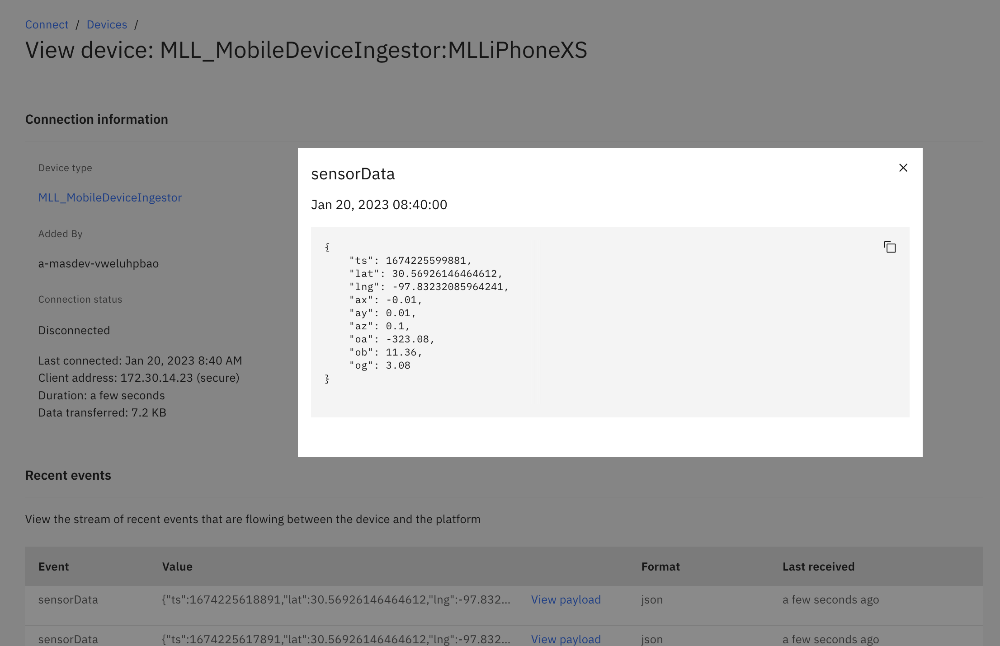
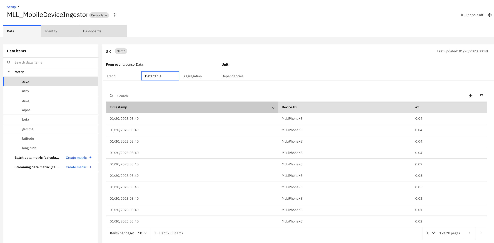

# Objectives
In this Exercise you will verify the data is being sent and is persisted in Monitor

## Verify events are being sent to Monitor
1. Go to Connect in Monitor
2. Search for the name of your Device created in a previous step
3. See the events coming in
4. Click on an event to see the payload being sent from your mobile device

## Verify data is in Monitor

1. Go to Setup in Monitor
2. Click on the Device Type created earlier in the lab
3. Click on the black button "Set up device type"
4. On the left side open Metric
5. Click on a metric and see the max and min trend

6. Click on Data table to see the values of that metric
7. Verify that data come from your device by looking at the Device ID column

8. If you cannot see data go back to the Troubleshooting section on the previous page
9. Congratulations!  You have ingested data from your mobile device into Monitor
10. Now you can explore creating calculated data metrics and dashboards in Monitor
