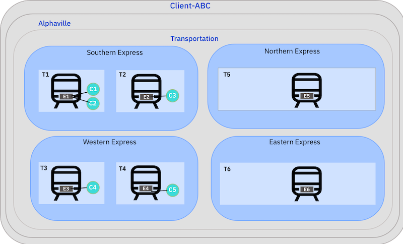
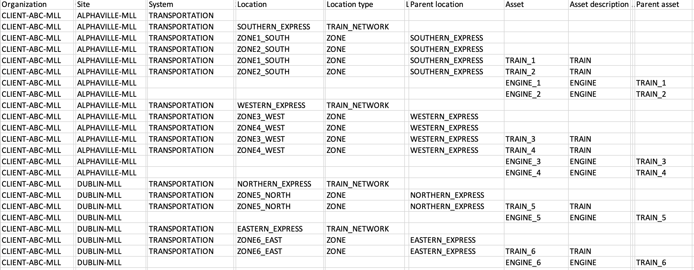
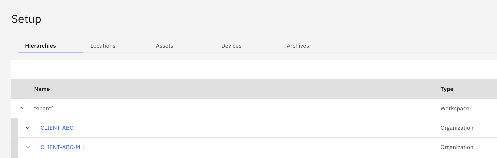

# Objectives
In this Exercise you will learn how to:

* Create an Asset Hierarchy

Organize your devices into logical or physical groups by using locations to mirror how devices are organized in the real world. Create parent and child relationships between devices and locations to build system hierarchies.

## Scenario

This exercise is based on a fictional company, Acme, that manages transportation networks for a number of clients. Client-ABC delivers a rail transportation network for the oil and gas industry.

Client-ABC divides its network into Southern Express, Western Express, Northern Express, Eastern Express. Each region has multiple zones. Each zone has one more trains. Each train has an engine and compressor devices are assigned to each engine. A sensor on each compressor measures the load and pressure of the compressor.

&nbsp;&nbsp;

When Monitor is installed first in MAS, there is an option to import a CSV file to create the hierarchy.
Note:  If Monitor is installed after Manage then the asset hierarchy will need to be created in Manage.
The CSV file for our functional company Acme that manages transportation networks looks like this:
&nbsp;&nbsp;

### Edit the Hierarchy to make it unique

1. Download the [Client-ABC hierarchy CSV](https://github.ibm.com/Watson-IoT/eam-hpu-lab/blob/main/csv-files/monitor_hierarchy/Client-ABC-hierarchy.csv) to your local system.
2. Open the file in your favorite text editor
3. Find/Replace -MLL with -<your initials\>
4. Save the file

### Import the Hierarchy

1. Open the Monitor Setup page
3. Click on Import button then choose "Import hierarchy"
4. Using the CSV file from step previous section, drag the CSV into the blue box or click to select CSV file from filesystem
5. The system will validate your CSV file
6. Click Import
7. You can see your organization on the hierarchies tab

---

