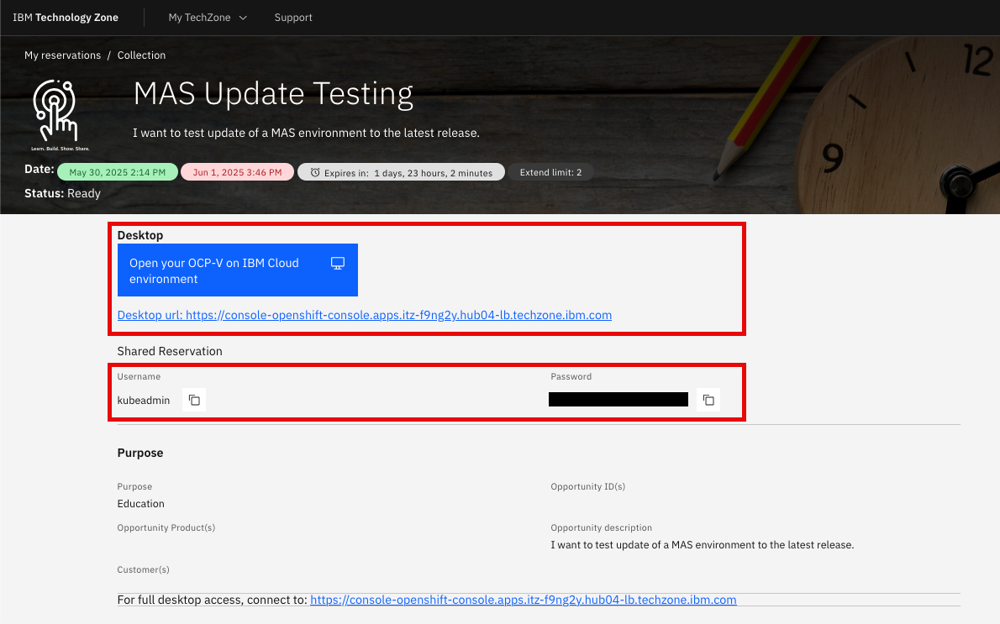
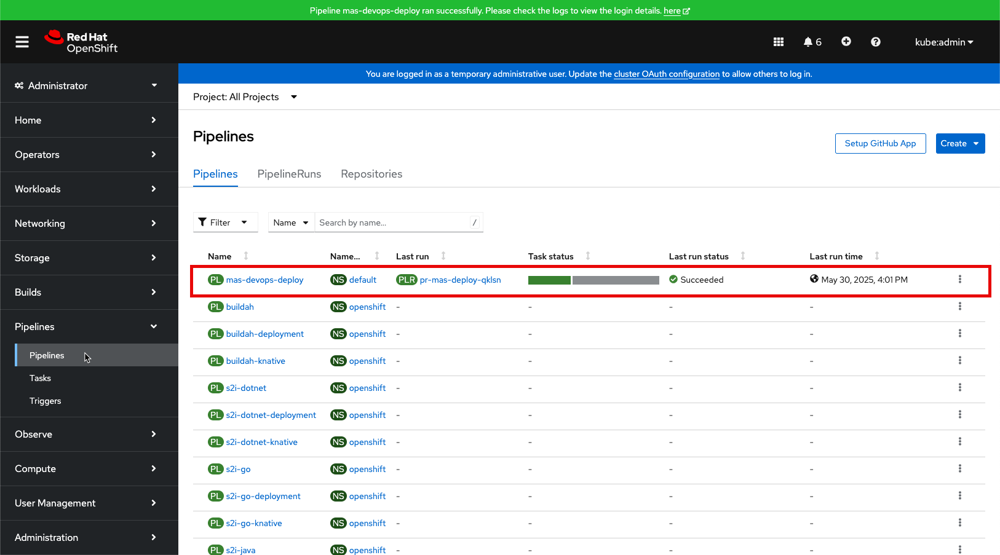

# Objectives
In this Exercise you will learn how to:

* Reserve an instance of a MAS Techzone Certified Base Image

---
*Before you begin:*  
This Exercise requires that you have:

1. completed the pre-requisites required for [all exercises](prereqs.md)

---

Login to [IBM Technology Zone](https://techzone.ibm.com/){target=_blank} (aka TechZone) with your IBMid. 

!!! note "Remember"
    Remember that TechZone is only available for IBM Business Partner and IBM'ers with an IBMid.

Search for `TechZone Certified Base Images` and you will find this page: 

  

Select the `Pre-Installed Software` tab. 
Scroll down untill you find the Maximo Application Suite images. 
At this point in time (May 30 2025) these two exists for version 9.0.x: 

  

Click on `OCP-V on IBM Cloud environment` in order to instantiate one of these. The `MAS V2 Core` image was used in this lab as that takes substantial shorter time to deploy. Click on `Reserve a environment`:

  

To understand the durations for the four different purposes, click on `Reservation Duration Policy`: 

  

Demo and Pilot purposes requires an open opportunity in IBM Sales Cloud. Education and Test only require a purpose description: 

  

In this case `Education` was selected, so a purpose description is needed and the geography has to be selected. Optionally the Name can be changed as well: 

  

Agree to IBM T&C and click on Submit:  

  

You will be greeted with a Thank you. Click on `My reservations`: 

  

You might see the initial status is `Scheduled` in the TecZone `My reservations` page: 

  

After a short while it will change to `Provisioning`:

  

After some time it will change to `Ready`:  

  

In this case it only took approx. 1.5 hours to instatiate a `MAS V2 Core` image:  

  

Now you have an OpenShift Cluster where MAS Core is installed.  
Click on the reservation and you will find the link to the OCP cluster as well as the credentials needed to login to it:  

  

Click on the link to open the IBM Cloud environment. Select `kube:admin`: 

  

Enter the credentials from the reservation page and click on `Log in`:  

  

Navigate to the `Pipelines` tab and you should see the `mas-devops-deploy` pipeline succeeded:  

  

!!! tip
    In case the pipeline did not succeed, try to rerun the PipelineRun. If that also fails then open the reservation and report the problem to TechZone Support:  
    

---
Congratulations you have successfully instantiated a MAS Techzone Certified Base Image. 
