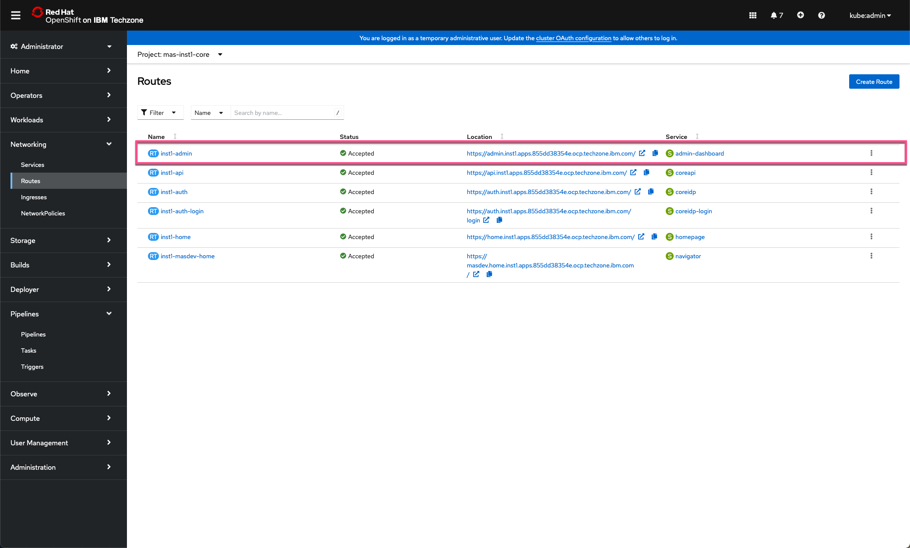
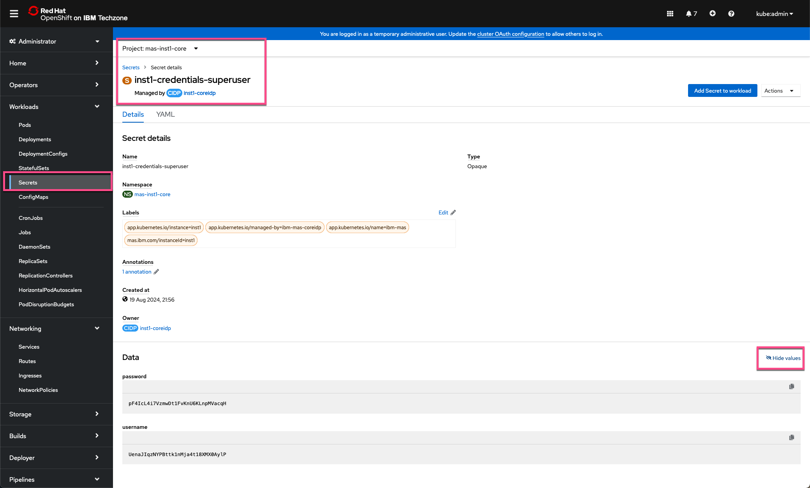
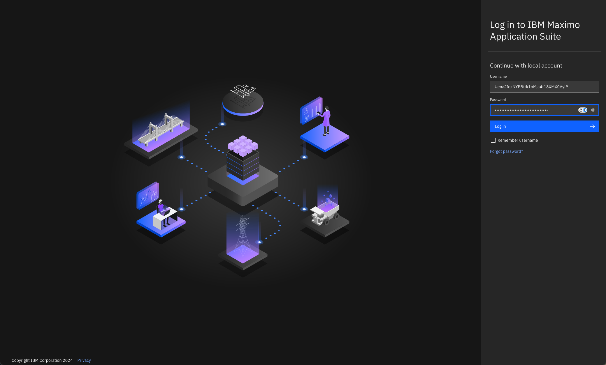
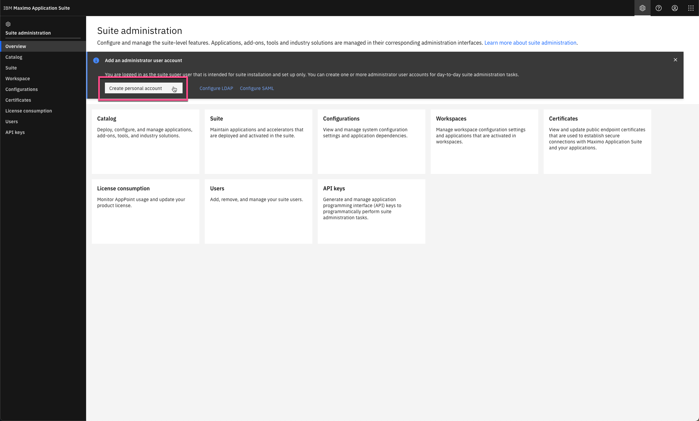
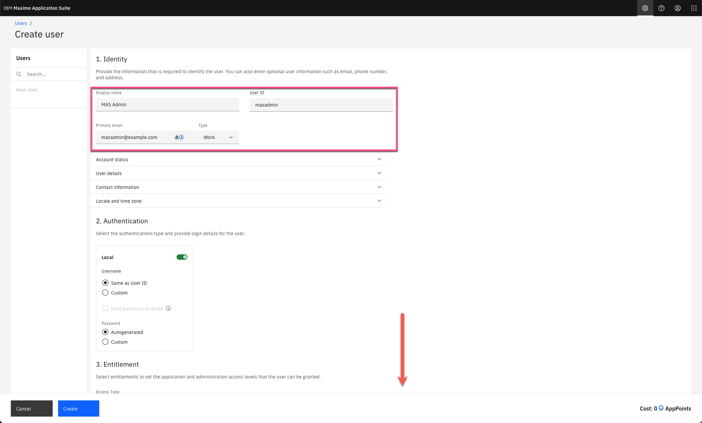
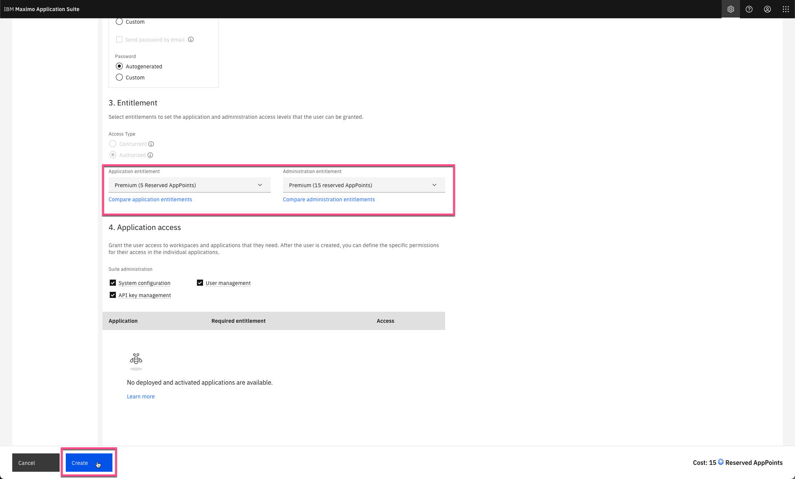
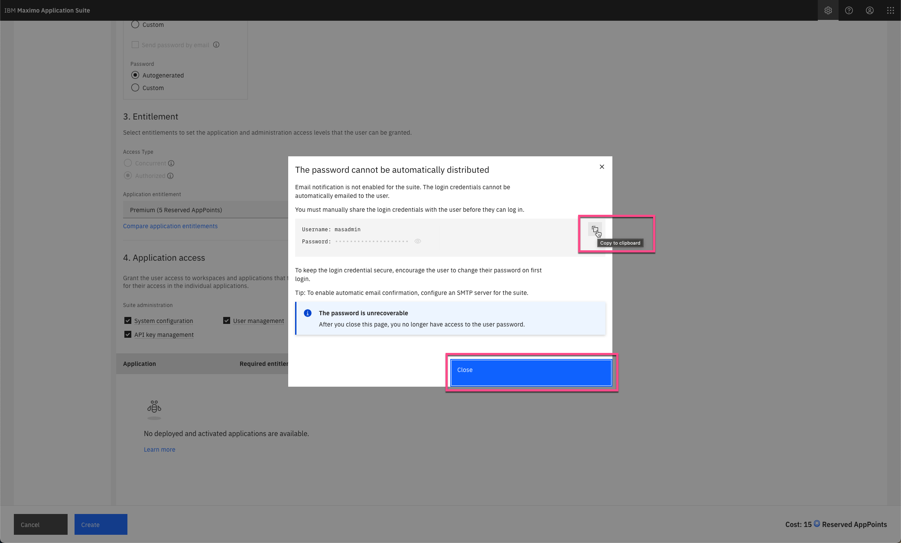
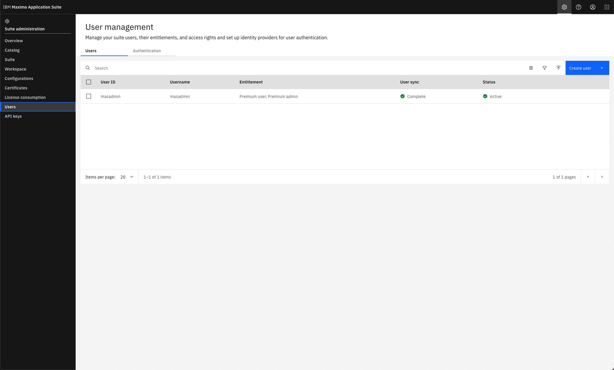

# Objectives
In this Exercise you will learn how to do the first steps once the deployment has finalized.

The OpenShift Cluster with MAS Core installed is up and running and the next step is to prepare the MAS Core for usage.  
This require to find the credentials of the suite super user in the OpenShift environment and create a MAS Administrator user for normal administrative usage in the MAS Suite Administration page. 

---
*Before you begin:*  
This Exercise requires that you have:

1. completed the pre-requisites required for [all exercises](prereqs.md)
2. completed the previous exercises

---

Login to the OpenShift Cluster where MAS Core is installed. 
Navigate to `Networking | Routes`. Select the `mas-inst1-core` project in the top.: 

  

Click on the link to the `inst1-admin` route, which will open in a new tab. 
Navigate to `Workloads | Secrets`. Ensure the `mas-inst1-core` project is selected. Filter with name `superuser`. 
Open the `inst1-credentials-superuser` secret and click on `Reveal values`: 

  

Switch to the recently opened tab and login with the MAS Super User credentials in order to authenticate the MAS installation: 

 

!!! note
    It is good practice to only use the MAS Super User account to create the first MAS Admin user and then use the new MAS Admin user going forward. 

Click on `Create a personal account` to create a the MAS administrator account: 

  

Fill out the Identity fields `Display name`, `User ID`, and `Primary email` - and scroll down: 

  

Add the proper entitlement, at least Premium Administration entitlement. Click `Create`: 

  

!!! tip
    You can hover over the three Suite administration options to see what they type of access they grant.

Copy and and save the credentials somewhere else for later use. Click `Close`: 

  

The new user will be syncronized. Click on the `Users` breadcrump link in the upper left hand corner: 

  

!!! tip "Tips"
    * Log out of the Suite Administration page and login with the new MAS Admin credentials to verify it is ready to be used.
    * You can now install the various Maximo Application Suite applications by following the [MAS Devops Ansible Collection](https://ibm-mas.github.io/ansible-devops/){target=_blank}. 

---
Congratulations you have successfully instantiated a MAS Techzone Certified Base Image and prepared it for use. 
