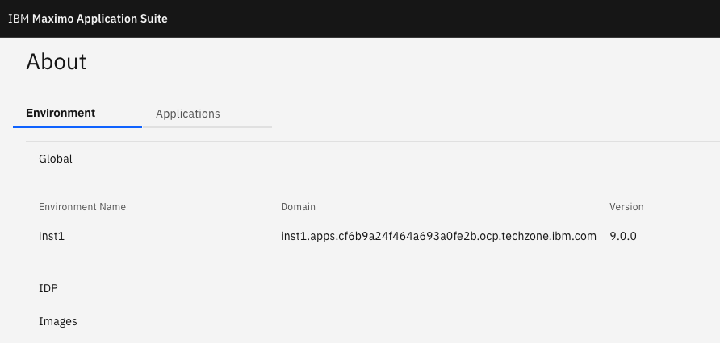

# Objectives
In this Exercise you will learn how to update MAS to the latest version.

!!! attention
    If you want to update to either 9.0.1 or 9.0.2 you should go to [exercise 4.](upgrade_mas.md) 

!!! tip
    You can see the release notes here: [Maximo Application Suite Releases information](https://www.ibm.com/support/pages/node/6570601){target=_blank} 

---
*Before you begin:*  
This Exercise requires that you have:

1. completed the pre-requisites required for [all exercises](prereqs.md)
2. completed the previous exercises

---

Login to MAS with the new MAS Admin account using the link to the MAS Home page: 
  

Click on `About` in the upper right hand corner: 
  

In this case it was a MAS 9.0.0: 
  

Now we need to figure out what MAS 9.0 OpenShift catalog was used and if a newer one is available. 
First open a terminal and run the MAS CLI docker container `docker run -ti --rm --pull always quay.io/ibmmas/cli`: 
  

Login to the OpenShift cluster using your kubeadmin account and click on `Copy login command`: 
  

Click on `Display Token` and copy the `oc login` command in its entirety: 
  

Run the command in the MAS CLI docker: 
  

Now the MAS CLI docker is authenticated against your OCP cluster. Execute `mas update` and enter `y` to proceed with this cluster. 
Notice the Maximo Operator Catalog that has been used - in this case `v9-240625-amd64` which is MAS 9.0.0. 
Also notice that newer versions are available: 
  

Press `Enter` to select the default value, i.e. 1. 
Step 5) Dependency Update Checks will be performed. 

!!! tip
    If the Dependency Update Check "hangs" then just rerun it in another window.  

Select `y` to confirm update of MongoDb and select `y` to proceed with these settings: 
  

After a little while the Pipeline Run has been submittedc to do the MAS Update: 
  

Follow the link and you will be able to see the progress of the MAS Update: 
  

Click on Logs for further details of the progress: 
  

Click on the PipelineRuns to follow the overall progress. After a while (in this case approx 22 minutes) the MAS Update has succeeded: 
  

Login to MAS and check the `About` information and you should see that MAS Core has been updated to the version selected: 
  

!!! tip
    You can now install the various Maximo Application Suite applications by following the [MAS Devops Ansible Collection](https://ibm-mas.github.io/ansible-devops/){target=_blank}  
    and they will also be on the newest version. 

---
Congratulations you have successfully instantiated and updated a MAS Techzone Certified Base Image and prepared it for use. 
