# Objectives
In this Exercise you will learn how to upgrade MAS to the latest version.

It is not possible to use the MAS CLI docker to either update nor upgrade the MAS installation that is provided through TechZone. After a lot of tinkering I managed to find a more complex method that works - at least from MAS 9.0.0 to 9.0.2, as this exercise is build upon 

---
*Before you begin:*  
This Exercise requires that you have:

1. completed the pre-requisites required for [all exercises](prereqs.md)
2. completed the previous exercises

---

Login to MAS with the new MAS Admin account using the link to the MAS Home page: 
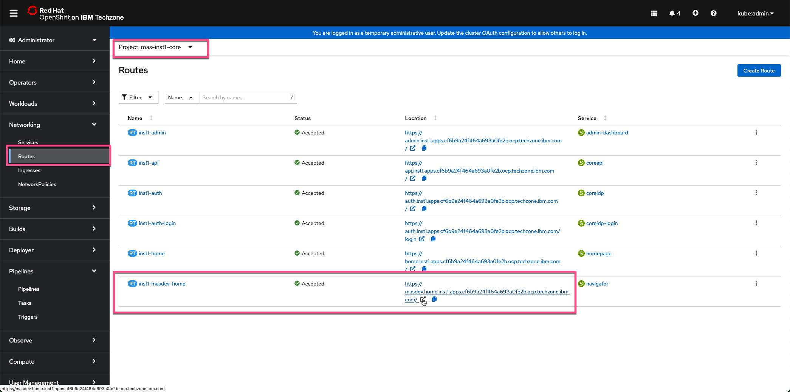  

Click on `About` in the upper right hand corner: 
  

In this case it was a MAS 9.0.0: 
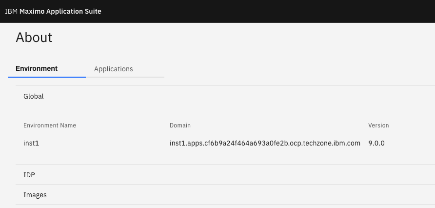  

Now we need to figure out what MAS 9.0 OpenShift catalog was used and if a newer one is available. 
First open a terminal and run the MAS CLI docker container `docker run -ti --rm --pull always quay.io/ibmmas/cli`: 
  

Login to the OpenShift cluster using your kubeadmin account and click on `Copy login command`: 
  

Click on `Display Token` and copy the `oc login` command in its entirety: 
  

Run the command in the MAS CLI docker: 
  

Now the MAS CLI docker is authenticated against your OCP cluster. Execute `mas update` and enter `yes` in step 1. 
Notice the Maximo Operator Catalog that has been used - in this case `v9-240625-amd64` which is MAS 9.0.0. 
Also notice that two newer versions are available (end of August), where 9.0.2 is the newest one: 
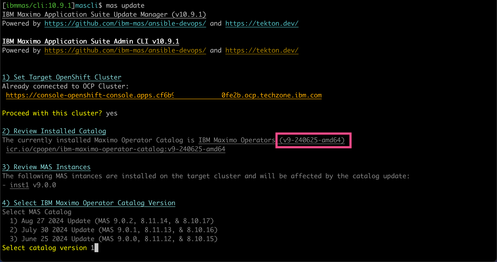  

Press `Enter` to select the default value, i.e. 1. 
Step 5) Dependency Update Chacks will be performed. You will need the `Installed Catalog` and the `Updated Catalog` values later. 
DO NOT PROCEED FROM HERE - enter `n` and `Enter` to escape from the `mas update` execution. 
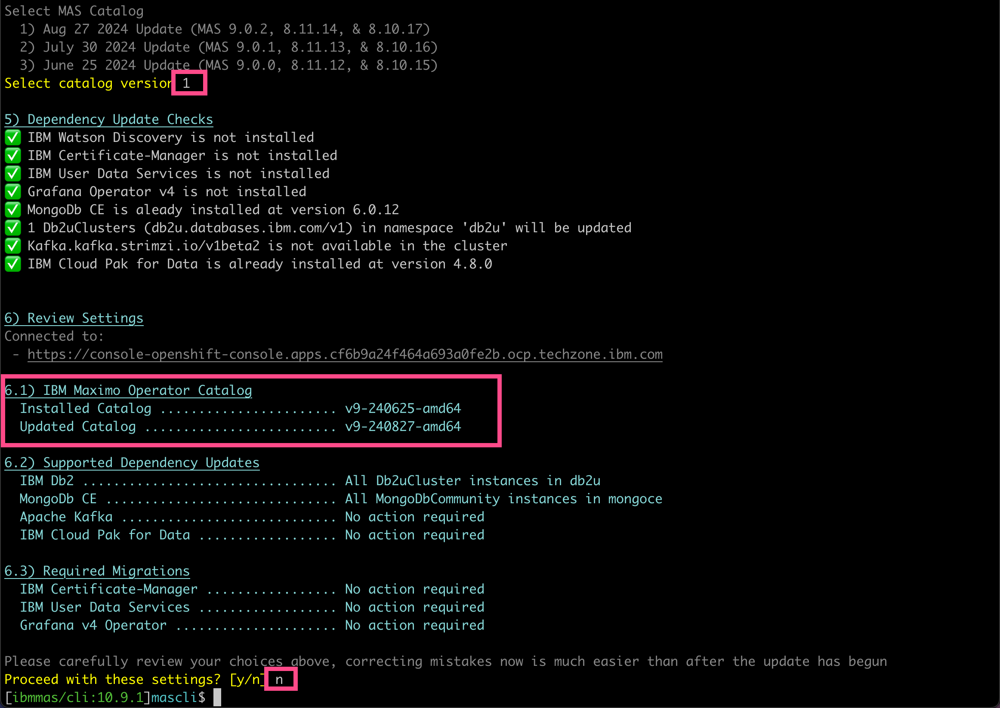  

Go to your OCP and select `Pipelines`. If you are not seing the `mas-masdevops-deploy` pipeline, then select `All Projects` and search for it. 
Open the `mas-masdevops-deploy` pipeline and click on the `YAML` tab: 
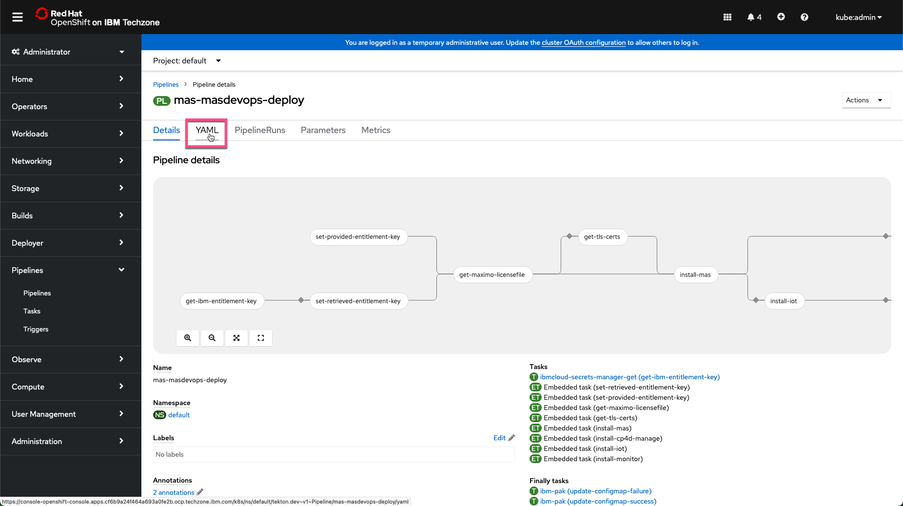  

Scroll down until you find the `Installed Catalog` default value for the Maximo operator catalog version: 
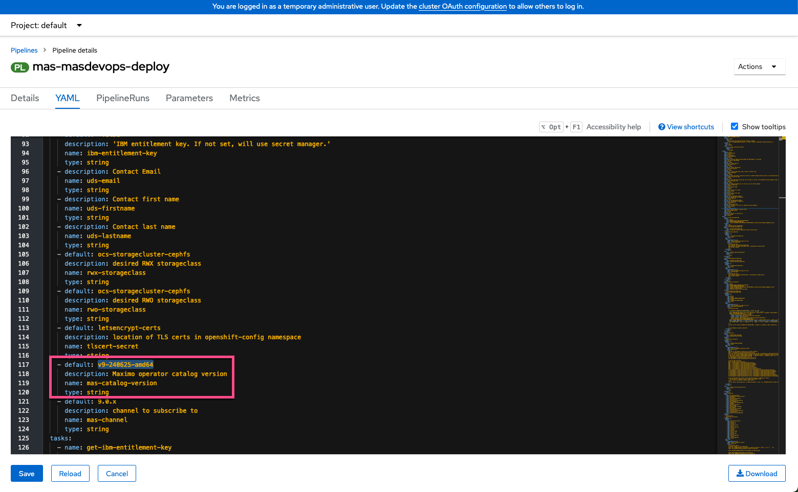  

Now replace the default value to the `Updated Catalog` value from the `mas update` command and click `Save`: 
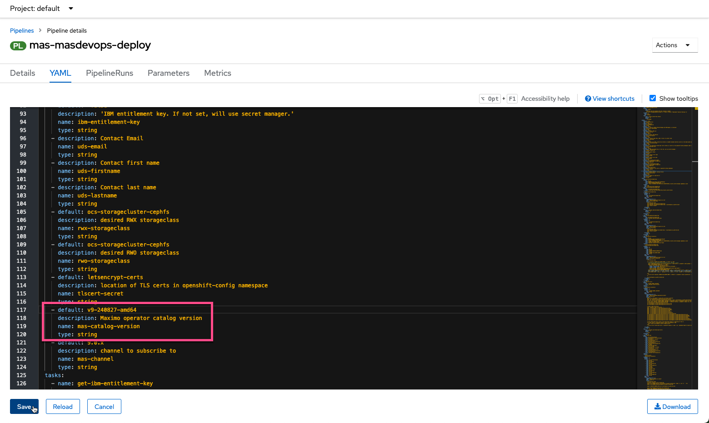  

Now the YAML is updated. Click on the pipelines in the bread crumps: 
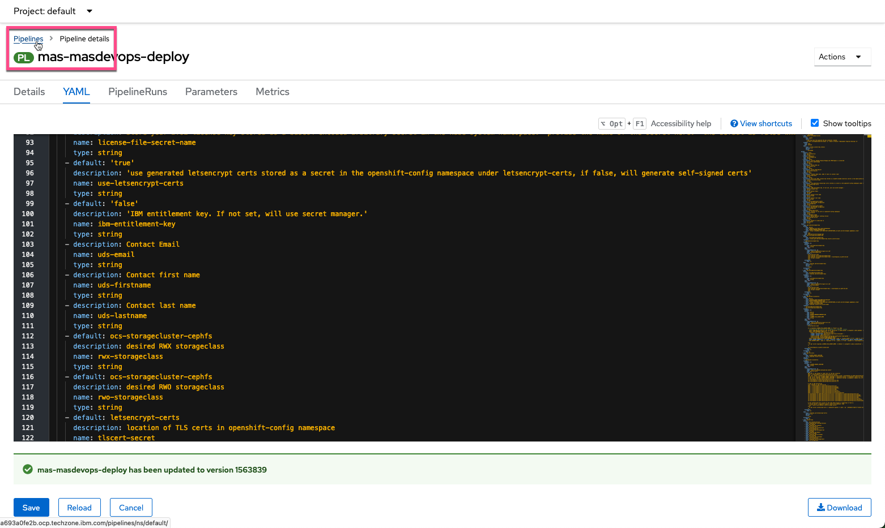  

Select the `PipelieRuns`tab: 
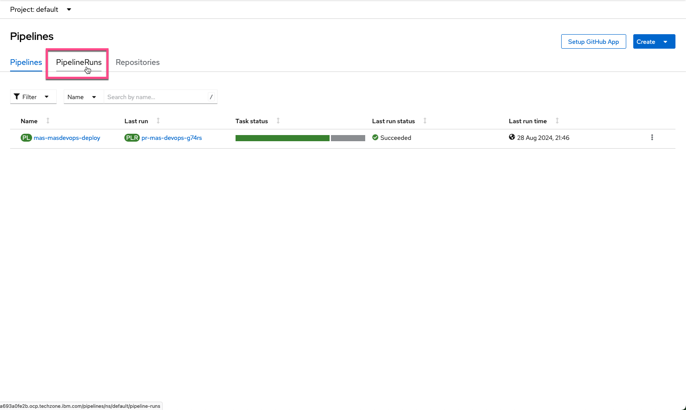  

You need to rerun the pipeline in order to upgrade to the version you selected: 
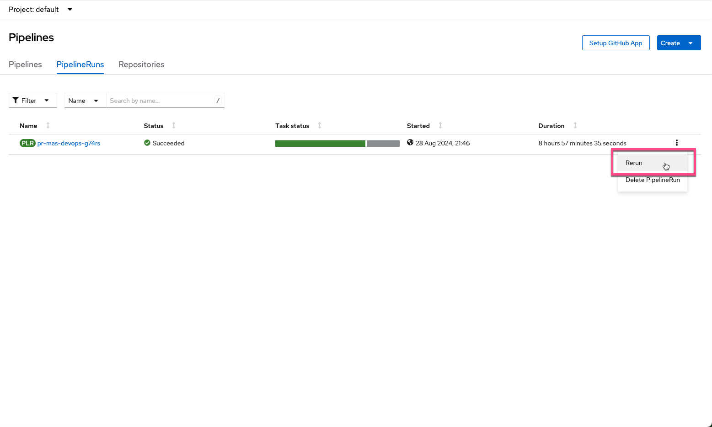  

Now you see the original Succeeded pipeline and the rerun initiated one. Click on the Task status: 
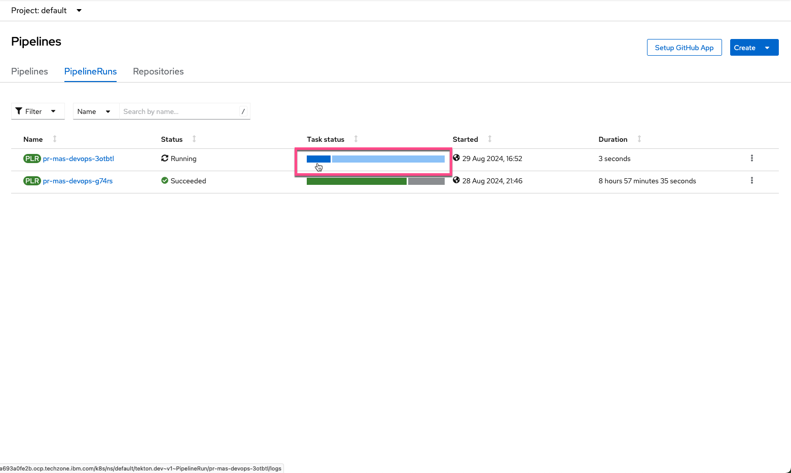  

You will see the execution of the pipeline has started. After a short while you get to the `install-mas` part.  
Don't be scared when you notice `FAILED - RETRYING ....` messages, they will occure several times: 
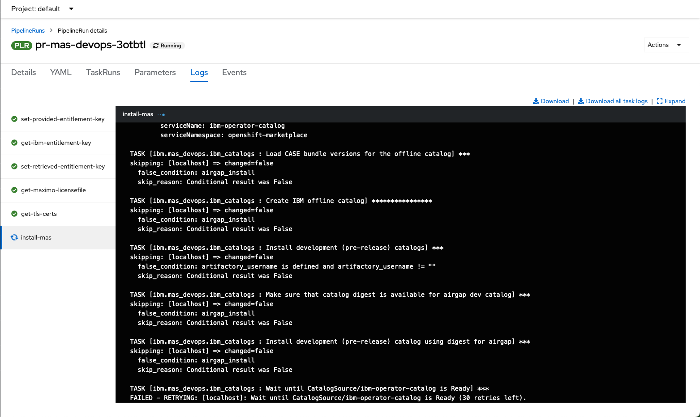  

After quite a while all the steps in the pipeline will have rerunned. It will take almost as long as when you instatiated the  
TechZone MAS 9.0 Certified Base image in the first place. In this case MAS 9.0 Core + Manage 
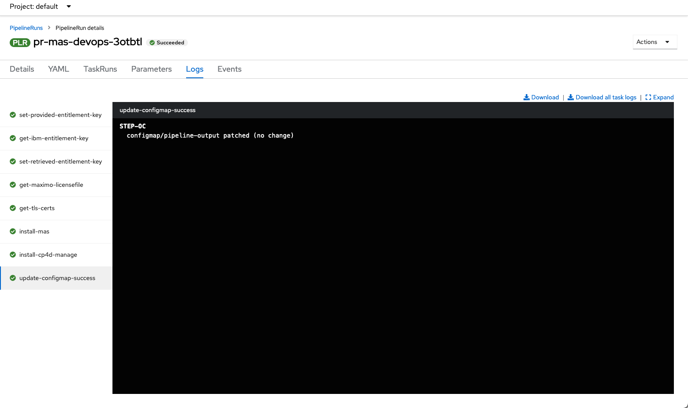  

Login to MAS and check the `About` information. The MAS Core is upgraded to 9.0.2: 
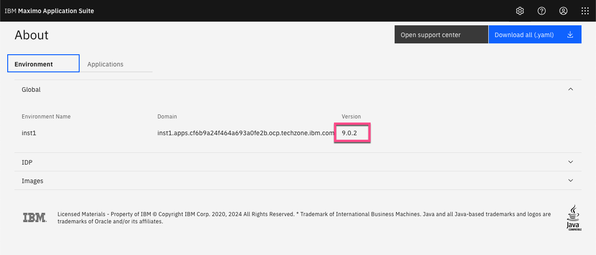  

And MAS Manage as well: 
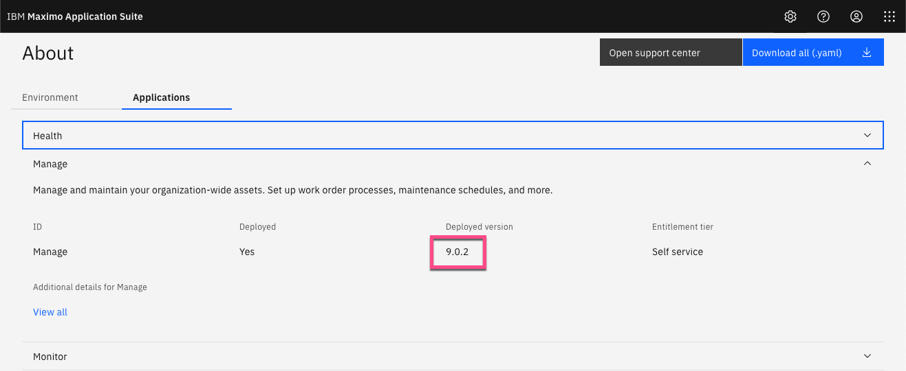  

!!! tip "Tip"
    You can now install the various Maximo Application Suite applications by following the [MAS Devops Ansible Collection](https://ibm-mas.github.io/ansible-devops/){target=_blank}  
    and they will also be on the newest version. 

---
Congratulations you have successfully instantiated and upgraded a MAS Techzone Certified Base Image and prepared it for use. 
