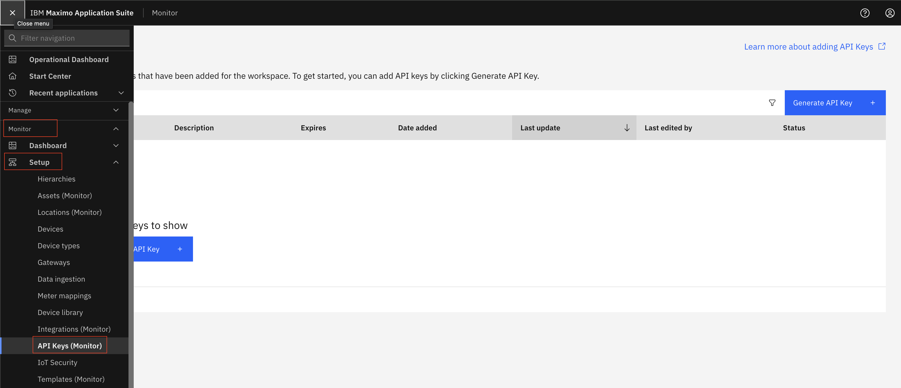
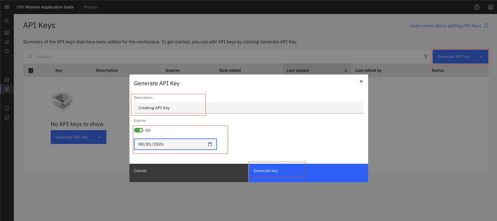
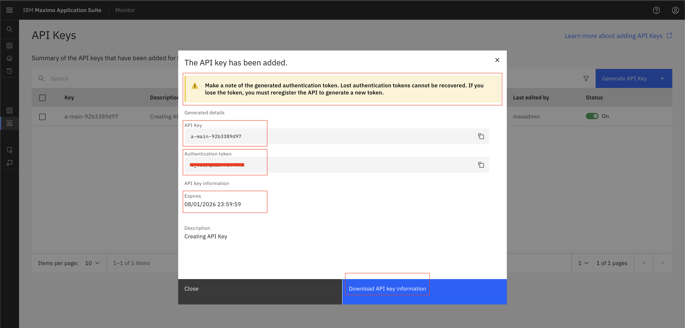
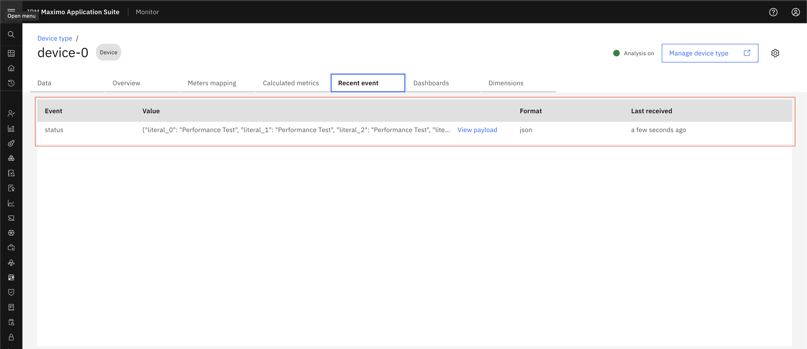
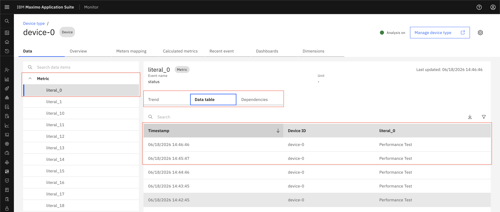

# Generate API Key

## Prerequisites
Before starting this exercise, ensure you have:

* Access to Maximo Monitor

## Steps

1. Open `Maximo Application Suite` and select `Monitor Application`.
2. Expand `Setup` under `Monitor` and Select `API Keys (Monitor)`
{:style="height:500px;width:900px"}
3. Click the `Generate API Key` button
4. Provide a meaningful name for your API key (e.g., "Monitor Integration Key")
5. Click `Generate key`
{:style="height:500px;width:900px"}
6. `Download` the generated API key and store it securely (e.g., in a password manager or secure vault)
{:style="height:500px;width:900px"}
7. Follow create a DeviceType ([Steps to create DeviceType](../../monitor_device_devicetype_setup_9.1/docs/overview_configuration.md)) and devices ([Steps to create Device](../../monitor_device_devicetype_setup_9.1/docs/add_edit_device.md#add-device))
8. Use API Key and Token for device authentication.
9. Add metric and event on device type ([Steps to add metric](../../monitor_device_devicetype_setup_9.1/docs/add_metrics.md#add-metrics))
10. ## Test Your API Key
You can test your API key using a simple curl command:

```bash
curl -X 'POST' \
  'https://`<messagingURL>`/api/v0002/application/types/`<deviceType>`/devices/`<deviceId>`/events/`<eventName>`' \
  -H 'accept: application/json' \
  -H 'authorization: Basic `YOUR_API_KEY`' \
  -H 'Content-Type: application/json' \
  -d '{`"matricName"`:"12"}'
```

Replace `YOUR_API_KEY` with the actual key you created.
11. Once you send data, data should be shown in device recent event and data table.
    **Device Recent**
    {:style="height:500px;width:900px"}
    **Device Data Table**
    {:style="height:500px;width:900px"}

!!! warning "Important"
    Make a note of the generated authentication token. Lost authentication tokens cannot be recovered. If you lose the token, you must reregister the API to generate a new token.


## Next Steps

Now that you have created an API key, you can:

* Use it to authenticate API requests of Device
* Integrate with your monitoring systems

!!! tip
    Remember to rotate your API keys regularly as a security best practice.