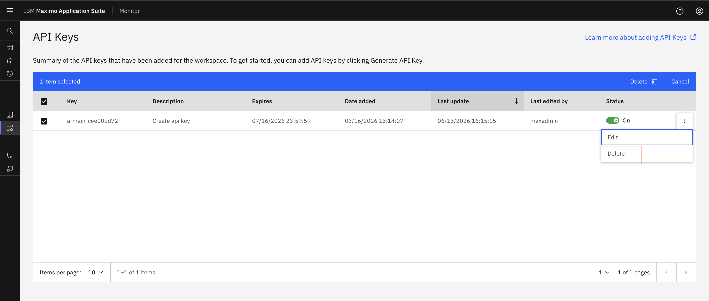
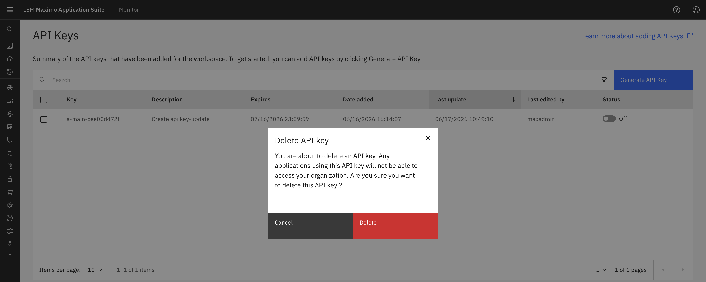
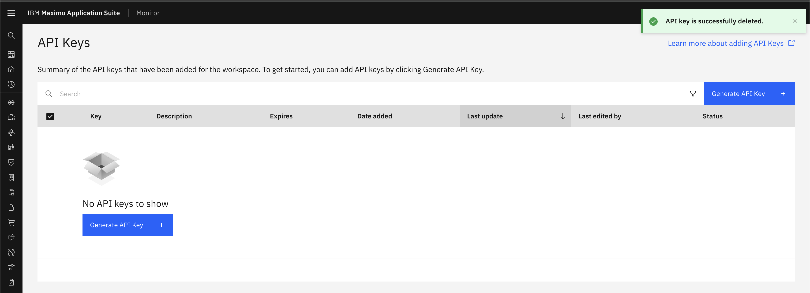

# Delete API Key

## Prerequisites
Before starting this exercise, ensure you have:

* Access to Maximo Monitor

## Steps

1. Open `Maximo Application Suite` and select `Monitor Application`.
2. Expand `Setup` under `Monitor` and Select `API Keys (Monitor)`
3. Locate the API key you want to delete in the list
4. Click on the API key row to select it
5. Click the `Delete` button or icon (typically represented by a trash can icon)
{:style="height:500px;width:900px"}
6. A confirmation dialog will appear asking you to confirm the deletion
7. Review the API key details one final time to ensure you're deleting the correct key
{:style="height:500px;width:900px"}
8. Click `Delete` to permanently remove the API key
9. The API key will be immediately removed from the system and can no longer be used for authentication
{:style="height:500px;width:900px"}

## Verification

After deleting the API key, verify that:

* The API key no longer appears in the API Keys list
* Any test API calls using the deleted key return authentication errors
* Dependent systems have been updated with new credentials (if applicable)

## Best Practices

!!! tip
    - **Audit before deletion**: Review API key usage logs before deleting
    - **Rotate instead of delete**: Consider generating a new key and updating integrations before deleting the old one
    - **Document deletions**: Keep a record of when keys were deleted and why
    - **Use expiry dates**: Set expiry dates on keys instead of manual deletion when possible

!!! danger "Critical"
    Before deleting an API key, verify that:
    
    - No active integrations are using this key
    - You have documented which systems were using this key
    - You have a backup plan for any affected services
    - You have notified relevant stakeholders about the deletion

## Next Steps

After deleting your API key, you may want to:

* [Generate a new API Key](create_api_key.md) if you need to replace the deleted one
* [Review IoT Security](iot_security.md) best practices