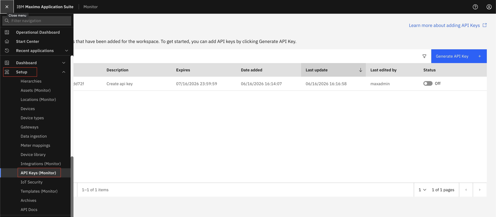
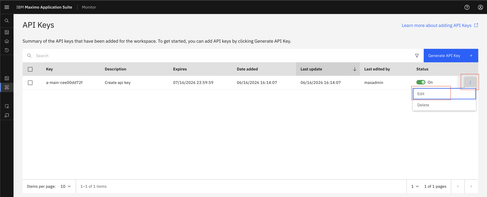
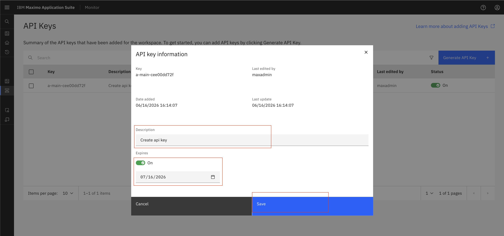

# Edit / Update API Key

## Prerequisites
Before starting this exercise, ensure you have:

* Access to Maximo Monitor

## Important Notes

!!! warning
    - Editing an API key does not change the actual key value
    - The key value remains the same; only metadata (description, expiry date) can be modified
    - If you need a new key value, you must generate a new API key

## Steps

1. Open `Maximo Application Suite` and select `Monitor Application`.
2. Expand `Setup` under `Monitor` and Select `API Keys (Monitor)`
{:style="height:500px;width:900px"}
3. Locate the API key you want to edit in the list
4. Click on the API key row to select it
5. Click the `Edit` button or icon
{:style="height:500px;width:900px"}
6. You can now update the following fields:
   
   - **Description**: Modify the description to better reflect the API key's purpose
   - **Expiry Date**: Update the expiration date to extend or shorten the key's validity period
7. After making your changes, click the `Save` button to apply the modifications
{:style="height:500px;width:900px"}

!!! tip
    - Regularly review and update expiry dates to maintain security
    - Use descriptive names to easily identify API keys and their purposes
    - Consider setting expiry dates based on your organization's security policies

## Next Steps

After editing your API key, you may want to:

* [Delete an API Key](delete_api_key.md) if it's no longer needed
* [Review IoT Security](iot_security.md) best practices