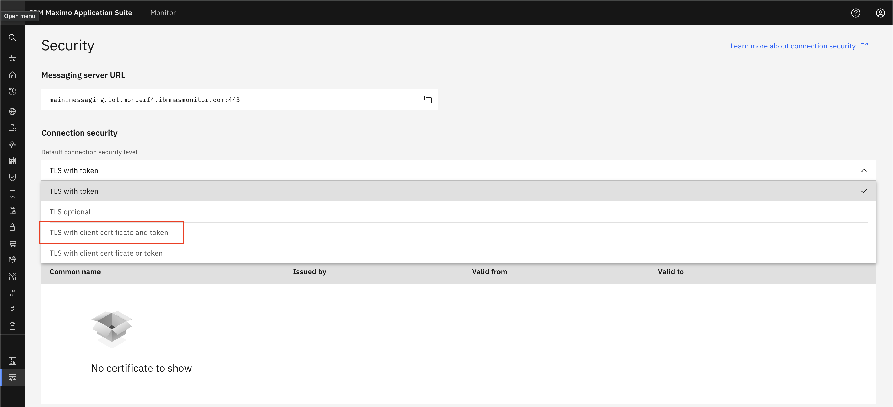
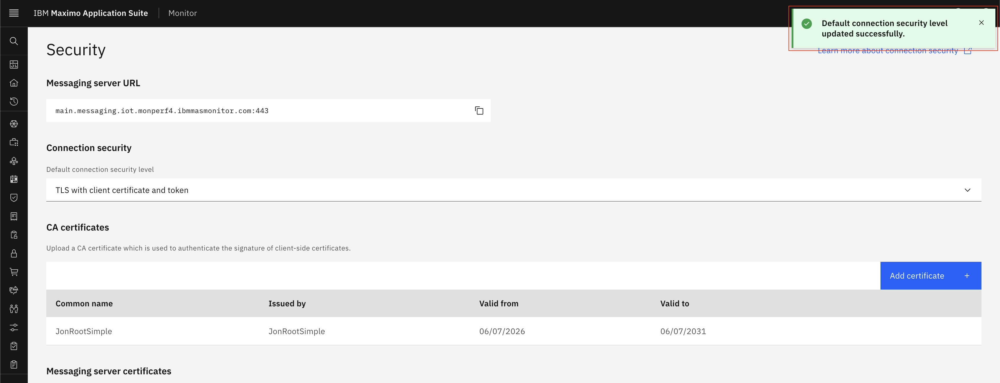

# TLS With Client Certificate and Token

## Prerequisites

Before starting this exercise, ensure you have:

* Access to Maximo Monitor

## Configure Connection Security Level

1. Open `Maximo Application Suite` and select `Monitor Application`
2. Navigate to **Setup** > **IoT Security**
{:style="height:500px;width:900px"}
3. Select **TLS with Client Certificate and Token** as the authentication method from dropdown
{:style="height:500px;width:900px"}
4. Save the configuration
{:style="height:500px;width:900px"}
5. Generate CA and client certificate and keys.
6. Add CA Certificate to the system
{:style="height:500px;width:900px"}
7. Provide details for CA Certificate and also you can view certificate details.
{:style="height:500px;width:900px"}
8. Click on Save button.
9. Now you can create a DeviceType ([Steps to create DeviceType](../../monitor_device_devicetype_setup_9.1/docs/overview_configuration.md)) and devices ([Steps to create Device](../../monitor_device_devicetype_setup_9.1/docs/add_edit_device.md#add-device)).
10. New device has username and password(token) is generated. Keep those username and password for future use.
11. Generate certificates for device and devicetype and add CA certificate in the system and keep client certificate and key for further device authentication.
    11.1. `mkdir -p ~/work/mas/ca/simple`
    11.2. `cd ~/work/mas/ca/simple`
    11.3. `openssl genrsa -out ca.key 4096`
    11.4. `openssl req -new -x509 -sha256 -days 1826 -key ca.key -out ca.crt -subj "/C=UK/ST=Hampshire/L=Winchester/O=JonTmp/CN=JonRootSimple"`
    11.5. `openssl genrsa -out jonkafkatest1.key 4096`
    11.6. `openssl req -new -key jonkafkatest1.key -out jonkafkatest1.csr -sha256 -subj "/C=UK/ST=Hampshire/L=Winchester/O=JonTmp/CN=d:<deviceType>:<deviceId>"`
    11.7. `openssl x509 -req -in jonkafkatest1.csr -CA ca.crt -CAkey ca.key -out jonkafkatest1.crt -days 825 -sha256`

12. Add metric and event on device type ([Steps to add metric](../../monitor_device_devicetype_setup_9.1/docs/add_metrics.md#add-metrics)).
13. Now you can use **Swagger UI** (Selecy `API Docs Menu` and select `HTTP Messaging API` click on `View APIs`) or any messaging tool like MQTTX to test device authentication using username and password.
14. User needs to provide username and token(password) and client certificate and client key for device authentication.
15. Provide parameters and topic for device and send data.
16. Once you send data, Verify data should be shown in device recent event and data table.

    **Device Recent**
    {:style="height:400px;width:700px"}
    
    **Device Data Table**
    {:style="height:400px;width:700px"}

## Best Practices

!!! tip "Security Recommendations"
    - **Unique credentials**: Each device should have unique certificate and token
    - **Backup procedures**: Secure backup of CA keys and token

## Next Steps

After configuring TLS with client certificate and token authentication:

* Review [TLS With Token](tls_with_token.md) for simpler deployments
* Review [TLS With Client Certificate or Token](tls_with_cert_or_token.md) for flexible authentication
---

**Related Topics:**
- [TLS With Token](tls_with_token.md)
- [TLS With Client Certificate or Token](tls_with_cert_or_token.md)