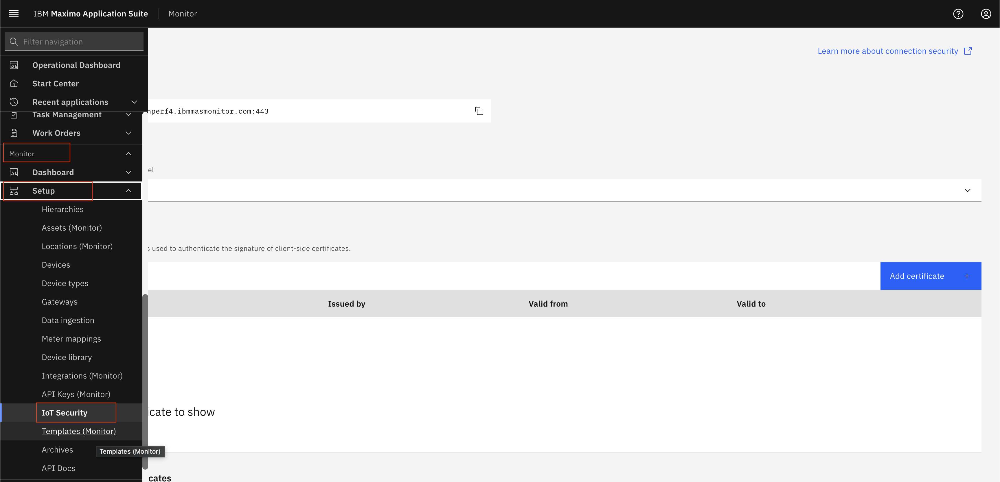
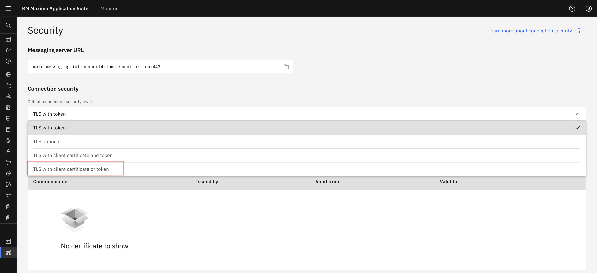
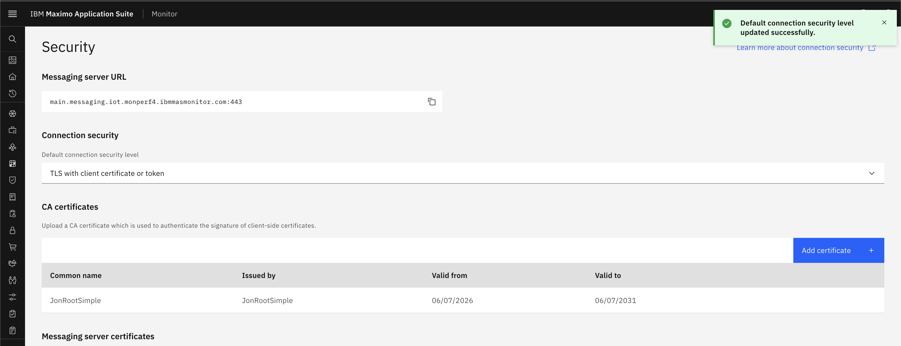
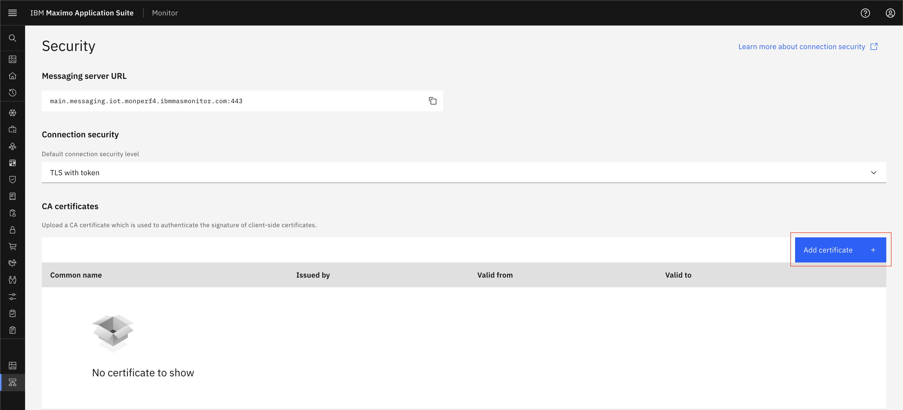
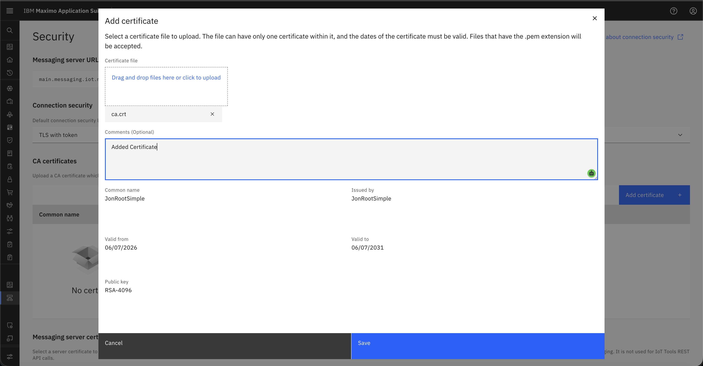

# TLS With Client Certificate or Token

## Prerequisites

Before starting this exercise, ensure you have:

* Access to Maximo Monitor

## Configure Connection Security Level

1. Open `Maximo Application Suite` and select `Monitor Application`
2. Navigate to **Setup** > **IoT Security**
{:style="height:500px;width:900px"}
3. Select **TLS with Client Certificate or Token** as the authentication method from dropdown
{:style="height:500px;width:900px"}
4. Save the configuration
{:style="height:500px;width:900px"}
5. If you are doing authentication using Certificate then Add Certificate Authority (CA) certificate if using certificates
6. Generate CA and client certificate and keys.
    6.1. `mkdir -p ~/work/mas/ca/simple`
    6.2. `cd ~/work/mas/ca/simple`
    6.3. `openssl genrsa -out ca.key 4096`
    6.4. `openssl req -new -x509 -sha256 -days 1826 -key ca.key -out ca.crt -subj "/C=UK/ST=Hampshire/L=Winchester/O=JonTmp/CN=JonRootSimple"`
    6.5. `openssl genrsa -out jonkafkatest1.key 4096`
    6.6. `openssl req -new -key jonkafkatest1.key -out jonkafkatest1.csr -sha256 -subj "/C=UK/ST=Hampshire/L=Winchester/O=JonTmp/CN=d:<deviceType>:<deviceId>"`
    6.7. `openssl x509 -req -in jonkafkatest1.csr -CA ca.crt -CAkey ca.key -out jonkafkatest1.crt -days 825 -sha256`

7. Add CA Certificate to the system
{:style="height:500px;width:900px"}
8. Provide details for CA Certificate and also you can view certificate details.
{:style="height:500px;width:900px"}
9. Click on Save button.
10. Now you can create a DeviceType ([Steps to create DeviceType](../../monitor_device_devicetype_setup_9.1/docs/overview_configuration.md)) and devices ([Steps to create Device](../../monitor_device_devicetype_setup_9.1/docs/add_edit_device.md#add-device)).
11. New device has username and password(token) is generated. Keep those username and password for future use.
12. Or you can generate certificates for device and devicetype and add CA certificate in the system and keep client certificate and key for further device authentication.
13. Add metric and event on device type ([Steps to add metric](../../monitor_device_devicetype_setup_9.1/docs/add_metrics.md#add-metrics)).
14. Now you can use **Swagger UI** (Selecy `API Docs Menu` and select `HTTP Messaging API` click on `View APIs`) or any messaging tool like MQTTX to test device authentication using username and password.
15. User needs to provide either username and password or certificate and key for device authentication.
16. Provide parameters and topic for device and send data.
17. Once you send data, Verify data should be shown in device recent event and data table.

    **Device Recent**
    {:style="height:400px;width:700px"}
    
    **Device Data Table**
    {:style="height:400px;width:700px"}

## Best Practices

!!! tip "Recommendations"
    - **Prioritize certificates** for new device deployments
    - **Document** which devices use which authentication method

---

**Related Topics:**
- [TLS With Token](tls_with_token.md)
- [TLS With Client Certificate and Token](tls_with_cert_and_token.md)