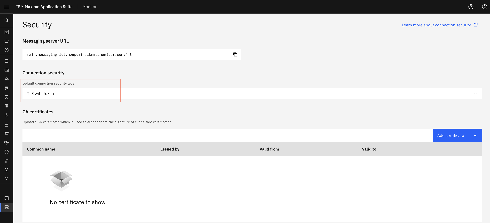

# TLS With Token

## Prerequisites

Before starting this exercise, ensure you have:

* Access to Maximo Monitor

## Important Notes

!!! warning
    - When you want to send data to device using username and password, you must use **TLS with Token** connection security level.
    - **TLS with Token** is a default option for security level.

## Configure Connection Security Level

1. Navigate to **Setup** > **IoT Security**
{:style="height:500px;width:900px"}
2. By Default **TLS with Token** selected as Connection security level
{:style="height:500px;width:900px"}
3. Click on **Save** button
4. Follow create a DeviceType ([Steps to create DeviceType](../../monitor_device_devicetype_setup_9.1/docs/overview_configuration.md)) and devices ([Steps to create Device](../../monitor_device_devicetype_setup_9.1/docs/add_edit_device.md#add-device))
5. New device has username and password(token) generated. Keep those username and password for future use.
6. Add metric and event on device type ([Steps to add metric](../../monitor_device_devicetype_setup_9.1/docs/add_metrics.md#add-metrics))
7. Now you can use **Swagger UI** (Selecy `API Docs Menu` and select `HTTP Messaging API` click on `View APIs`) or any messaging tool like MQTTX to test device authentication using username and password.
8. Provide parameters in swagger document or add topic in MQTTX for device and send data.
9. Once you send data, data should be shown in device recent event and data table.
    **Device Recent**
    {:style="height:500px;width:900px"}
    **Device Data Table**
    {:style="height:500px;width:900px"}

## Next Steps

After configuring TLS with token authentication, you may want to:

* [Configure TLS with Client Certificate or Token](tls_with_cert_or_token.md) for enhanced security
* [Configure TLS with Client Certificate and Token](tls_with_cert_and_token.md) for maximum security

---

**Related Topics:**
- [Generate API Key](create_api_key.md)
- [Edit API Key](edit_api_key.md)
- [Delete API Key](delete_api_key.md)