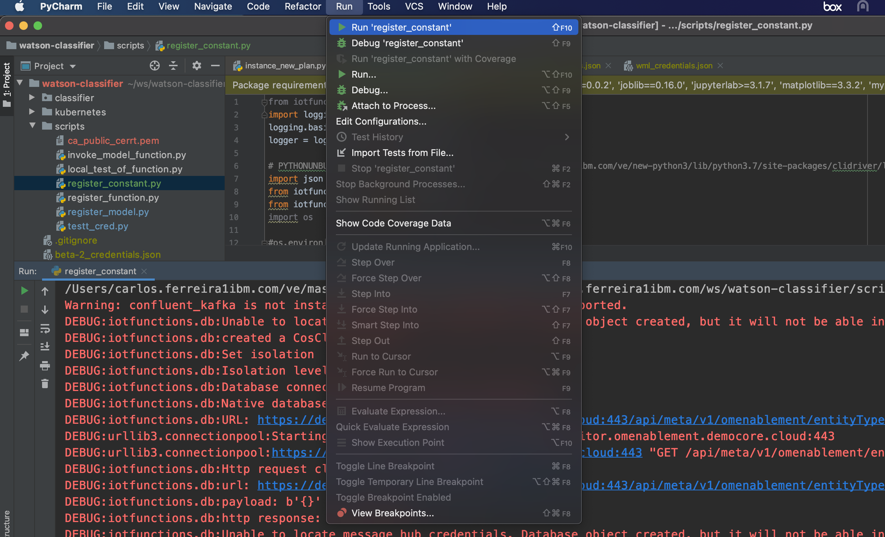
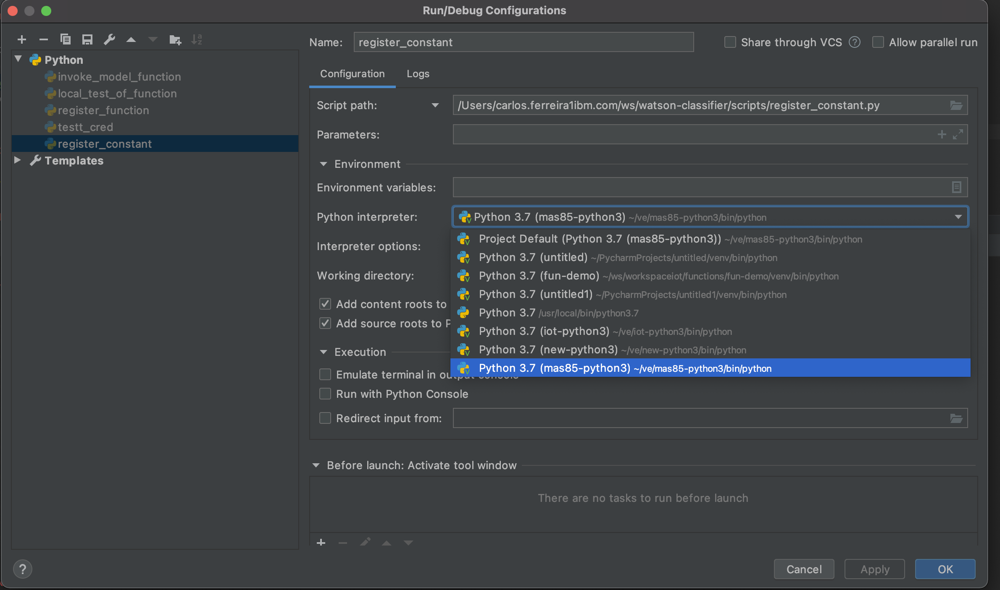
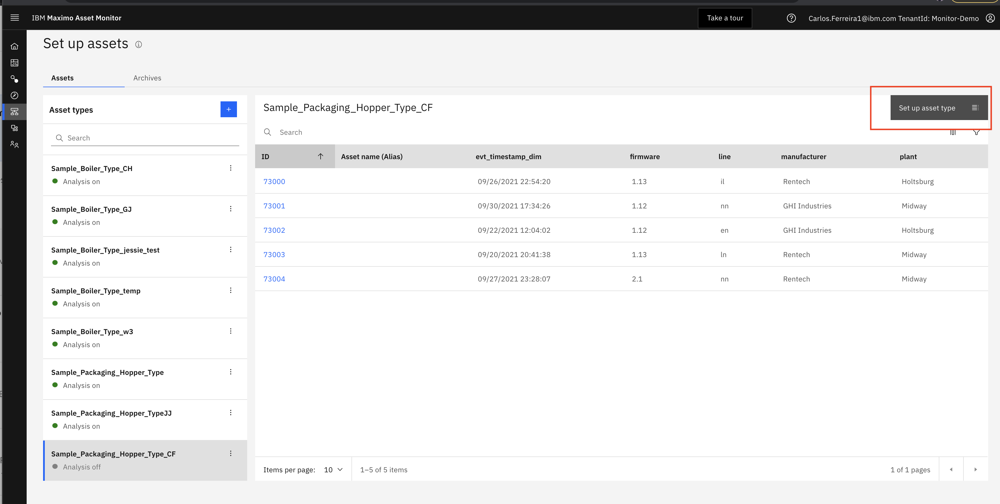
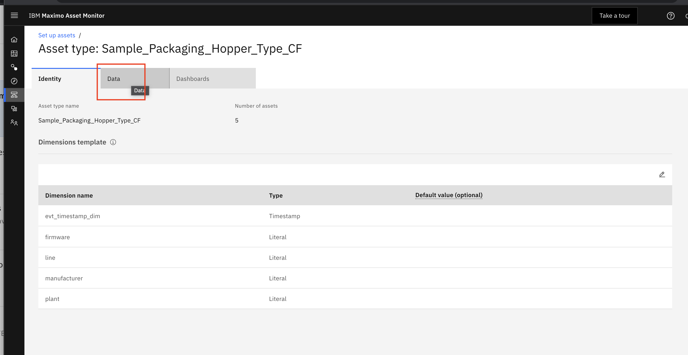
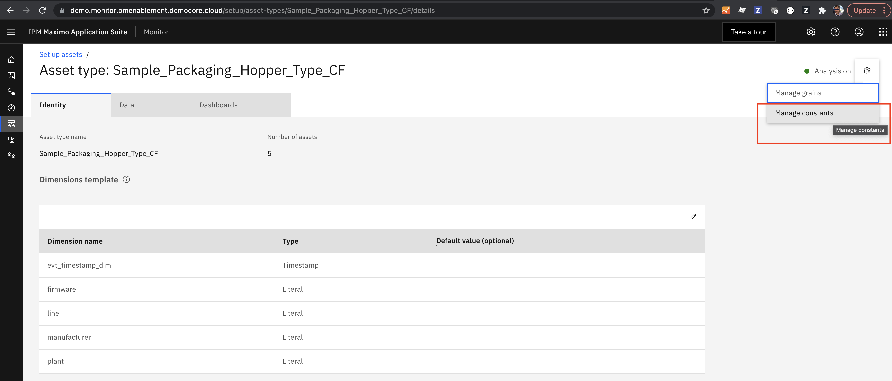
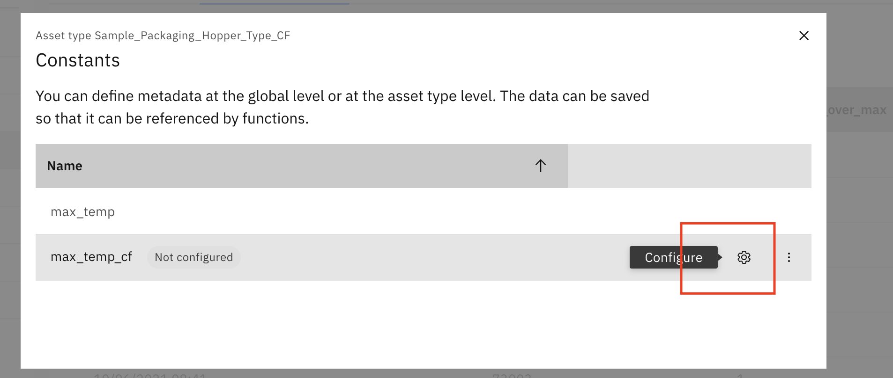
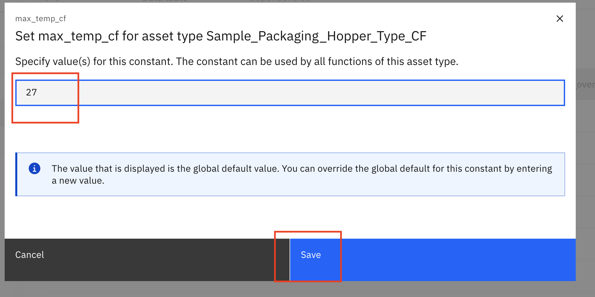
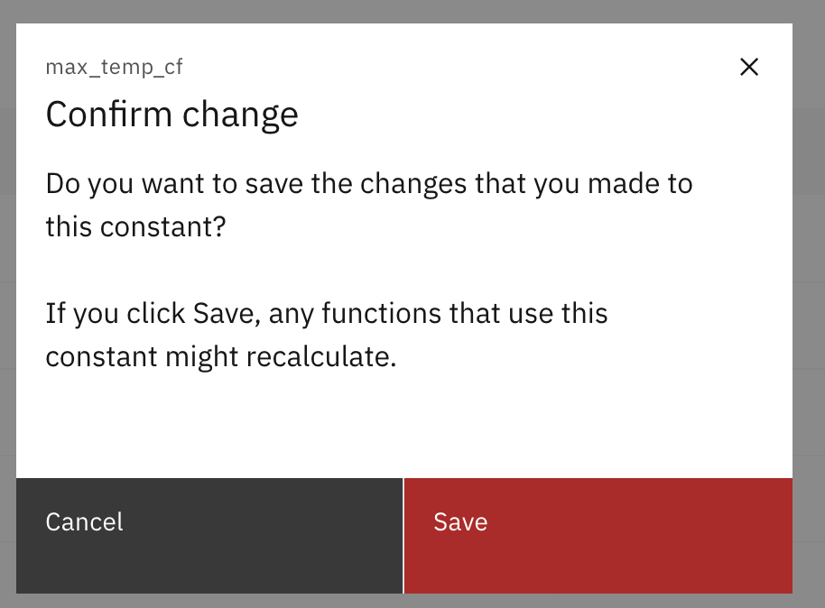

# Objectives
In this Exercise using Monitor you will learn how to add a constant for the maximum allowed ambient temperature. You will:

*  Register Constant using a script `'register_constanty.py` using [IOT Functions SDK](https://www.ibm.com/docs/en/mapms/1_cloud?topic=asr-sdks)
*  Assign a value to the `max_temp_yourinitials` constant of 27.

The ambient temperature where th Hopper Asset is located should exceed a temperature is above 27 degrees Celcius.   The 
food  packaged has a shorter shelf life when it is packaged at temperatures higher than that.  A remote operational 
support teams monitor will monitor the packaging Hooper to ensure it is operating within the required operating ranges 
and without anomalies.  

The constant will be used to specify the maximum temperature allowed in all packaging processes to ensure 
regulatory compliance.

Using a constant will also make it easier later to update any functions or alerts that reference the constant.  By simply
modifying the value of the constant all the functions and alerts will use the new value for all new calculations.

---
*Before you begin:* 
 
- You have completed the [pre-requisites](prereqs.md) required for all Exercises
- You have completed the prior exercise in this lab.
---


## Register a Constant in Monitor

In this exercise you will quickly create a constant named `max_temp_yourinitials` a that you will use in next exercises.  

1.   Define your constant.  You will name yours `max_temp_yourinitials` so that it doesn't conflict with the constants
created by others.

2.  Git clone the repository that has the code below. If you don't have access email carlos.ferreira1 @ibm.com You will 
use the code from this repository in other exercises.  From the terminal on your desktop type: 

    
    '''
    git clone github repo provided by your instructor
    cd watson-classifier
    '''

3.  Ask the instructor for your credentials_as.json file or create your own using the instructions in "Establishing
a Connection" section of the Monitor documentation.  [Establishing a Connection](https://www.ibm.com/docs/en/maximo-monitor/8.5.0?topic=calculations-using-custom-functions#env) 

Your credentials file should be structured in JSON as follows:

    '''
    {
        "tenantId": "yourtenant",
        "_db_schema": "your_dbSchema",
        "db2": {
            "username": "your_dbuser",
            "password": "your_dbpassword",
            "databaseName": "your_databaseName",
            "security": "SSL",
            "port": 32551,
            "httpsUrl": "https://cp4d-cpd-cp4d.yourdomainURL",
            "host": "yourdomainURL without HTTP prepended"
        },
        "iotp": {
            "asHost": "yourtenant.api.monitor.your_dbSchema.yourlusterdomain:443",
            "apiKey": "vourAPIKey",
            "apiToken": "yourAPIToken"
        }
    }
    '''
    

4.  Save your credentials_as.json file to in the project root directory `watson-classifier`.

5.  Start PyCharm select `File` and `Open` navigate to  your project root directory `watson-classifier` and open the 
project

6.  The script  `register_constanty.py` provided in the `watson--classifier` Github project uses IOT Functions SDK to 
create a constant.  [IOT Functions SDK](https://www.ibm.com/docs/en/mapms/1_cloud?topic=asr-sdks)  In the PyCharm project 
tab, navigate to and expand the scripts folder.  Right click on `register_constant.py` and select the `run` menu. 


Script code:

    '''
        from iotfunctions.db import Database
        import logging
        logging.basicConfig(level=logging.DEBUG)
        logger = logging.getLogger(__name__)
        import json
        from iotfunctions.db import Database
        from iotfunctions.ui import UISingle,UIMulti
        import os
        
        logger = logging.getLogger(__name__)    
        #Connect to the service
        with open('../credentials_as.json', encoding='utf-8') as F:
            credentials = json.loads(F.read())
        db_schema = None
        db = Database(credentials=credentials)
        #Connect to the service
        db = Database(credentials = credentials)
        
        #Define how the constant is represented on the UI using UISingle
        max_temp_cf = UISingle(name='max_temp_cf',
                       description='Ensure temperatures does not exceed max_temp_cf',
                       datatype=float)
        
        #Register the constant using the database object
        db.register_constants([max_temp_cf])
    '''

7.  The script will give you errors because you haven't yet setup the virtual environment.  From PyCharm menus select `Run`
and `edit configurations`.  Make sure to pick  `run` and `edit configuration` for the `register_constant.py` 

8.  Make sure you have setup your [virtual environment in Pycharm](https://www.jetbrains.com/help/pycharm/creating-virtual-environment.html). 
Once you have you can select the name of the virtual environment in PyCharm.  In the projet window click on `register_constant.py`
then from the Pycharm menu select `run` and `edit configuration`   

 
## Assign a Constant a Value in Monitor
In this exercise you will quickly create a constant named `max_temp_yourinitials` a that you will use in next exercises.  

1.  Set the value of the constant from the UI.   Login to  Monitor. 

2.  Select  `Setup Assets` tab, search for `Sample_Packaging_Hopper_Type_yourinitials` .
Click on your `Asset Type` and click on   `Setup Asset Type` button.  
 

3.  Click on the `data` tab,  

 
4.  Click on `gear` icon  and select `Manage constants` menu option
 
 
5.  A list of constants is displayed.  Select the constant named `max_temp_yourinitials`  Click `Configure`.
 
 
6. Assign a value of `27` and click `Save`.
 

7. Click `Save`.
 
 
## Next Step

You now have constant for the `max_temp_yourinitials`  that you can use in your functions and alerts in your Device Type.  
In the next exercise you will create a PythonFunction will use the constant for the max_temp in Celcius that the 
ambient temperature to check the ambient temperature hasn't been exceeded.

## OPTIONAL -  Unregister a Constant in Monitor (Optional)

Optionally you can write a unregister_constant.py script and run it after you have completed all the labs. Unregistering 
the constant will remove constant from Monitor.  Any calculation that uses this constant will stop working and cause the 
Monitor pipeline calculations to stop.

Example code:

    ```
      #Import packages and libraries
    
      import logging
      logging.basicConfig(level=logging.DEBUG)
      logger = logging.getLogger(__name__)
      import pandas as pd
      import json
      #Import these classes from IoT Functions
      from iotfunctions.db import Database
      from iotfunctions.ui import UISingle,UIMulti
    
      #Connect to the service
      with open('credentials_as.json', encoding='utf-8') as F:
        credentials = json.loads(F.read())
      db_schema = None
      db = Database(credentials=credentials)
    
      #Connect to the service
      db = Database(credentials = credentials)
    
      #Unregister the constant using the database object
      db.unregister_constants(['max_temp_yourinitials'])
  ```
 


