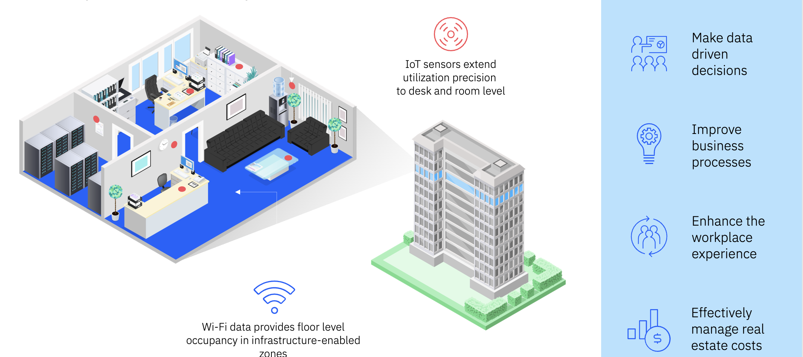
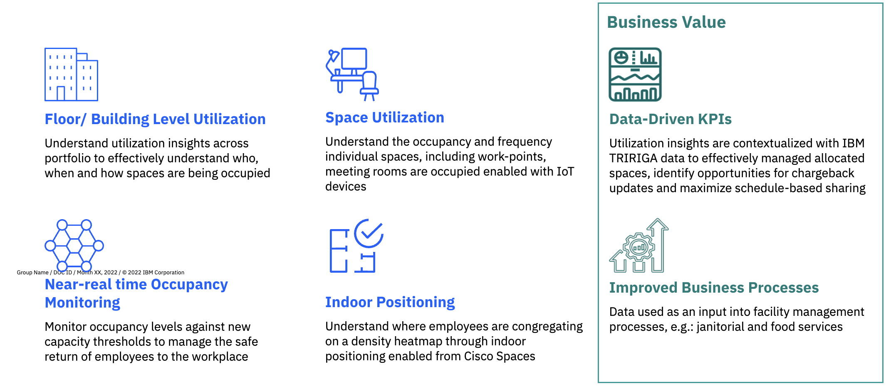

# Welcome to the Maximo Monitor 9.1 Maximo Real Estate and Facility Lab

!!! info
    This Maximo Monitor lab demonstrates the Integrate of Maximo Real Estate and Facilities.

In this lab you will learn how to configure Maximo Real Estate and Facilities to unify your location hierarchies and enable more advanced IoT device monitoring and analytics. 

Real estate is the second-largest cost burden for most large organizations. Driven by an evolving operational landscape, enterprises are rapidly shifting towards centralized models. This requires enterprise-grade solutions for cost reduction, enhanced responsiveness, and optimized efficiency.​ IBM MREF solution delivers an integrated workplace management system (IWMS) that integrates functional models across real estate, capital projects, facilities, workplace operations, portfolio data, and environmental and energy management within a single technology platform.
 

MREF connects to the existing WI-FI infrastructure and coupled with sensors enables planners to actively monitor their facilities across several use-cases​.

1. Occupancy monitoring​
2. Space utilization​
3. Floor / building level utilization
  

How MREF Enterprise IoT and AI Enhance an Organization's Ability to Respond to its Needs

  

What is purpose of using Maximo Real Estate and Facilities in MAS Monitor

  

The exercises will cover:

* Configure MREF Integration
* Turn on sync for MREF buildings
* MREF location details - Dimensions, Template, Calculated Metrics.
* Workplace analytics dashboard
* Clean Up
* Have fun

!!! note
    Expected time needed to run the complete lab: 1 hour

---

**Updated: 2025-07-3**

---