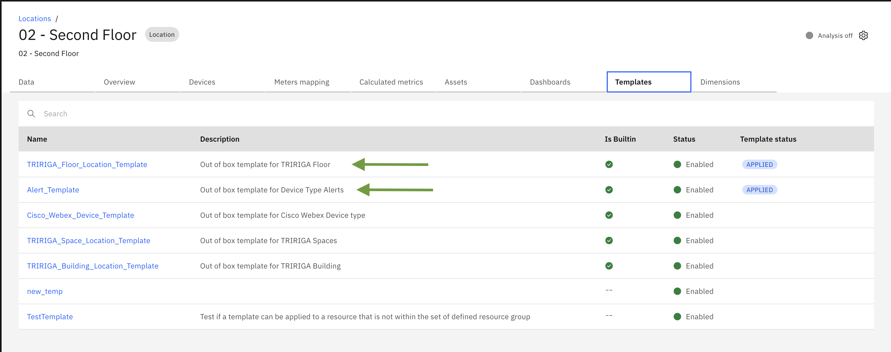
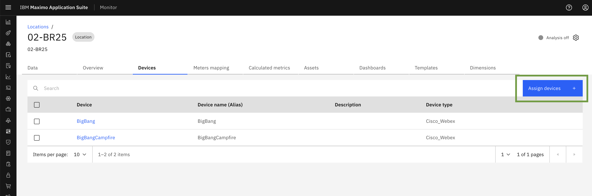
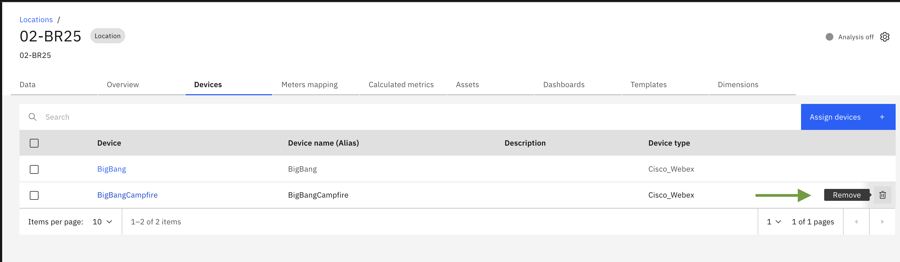

# Objectives
In this Exercise you will see details of Maximo Real Estate and facilities Location :

* Synced Location details will available in Hierarchies and Location Section
* In Location details - Overview, Template, Dimensions, Device, Calculated Metrics

---
*Before you begin:*  
This Exercise requires that you have:

1. completed the pre-requisites required for [all labs](prerequisite.md) and for this exercise
2. completed the previous exercises
3. verified the building is synced active [exercise 2](mref_buildings.md){target=_blank}

---

## View Location in Hierarchies and Location Section

Once Real Estate and Facilities Building get synced, you can see the entire hierarchy for that building. ​

The Synced buildings are now available in monitor under `Hierarchies` & `Locations` section. 

  

In Hierarchy section, you can see whole monitor location hierarchy

  

You can navigate toLocations from side menu. 

  

Here, you can search synced location name and in result it will show location name and type as `building`.

  

## View building details 

You can view details of any of the location in Locations and Hierarchy section from the ellipses button as shown in screenshot. ​`view details`.

  

  

Once you click on the `View Details` action menu, you will be redirected to the Location Details page. This page is divided into several tabs, which provide a comprehensive overview of the location.

The following tabs are available:

- Data
- Overview
- Calculated Metrics
- Template
- Dashboard

Let's explore what information is available under each tab.

### Overview Tab

Below, you'll find an overview of the building, including its Name, Site, Location Type, and Parent Location details. The Child Location section lists the available floors and its location type as `Floor`, You can click on a floor to view its details page.

  

Similarly, you can access the Floor and Space details pages. On the floor's - child location section, you'll see a list of associated spaces and its location type as `Space`. You can click on a space to view its details page.
In Parents location of floor - you'll see associated building name.

  

Space Details -

  

  

###  Template Tab

Here, you can view a list of all available templates. The Tririga template that corresponds to the specific building type will be applied to the space, floor, and building once that building has been synced.

Building Template -

Floor Template -

Space Template - 

!!! info
    The applied templates have collection of out of the box KPI (Calculated Metrics) and workplace analytics dashboard which will be generated once you assign device to space.

 

###  Device Tab

Before assign device, complete the following steps -  
Integrate with Cisco Spaces. For more information, see Integrating with Cisco Spaces. 
Integrate with Cisco Webex. For more information, see Integrating with Cisco Webex.

Once,configuration of Cisco Spaces and Cisco Webex has been completed you can assign subscribed `Cisco Webex` device to Space in order to track occupancy details, including the number of people in the space and the occupancy rate. Once a device is assigned, it will begin generating valuable insights and data, including Calculated metrics and dashboards for the space, floor, and building.

!!! note 
     you can assign only device type `Cisco Webex` device to MREF Buildings. 

To assign Cisco Webex device to Space follow the steps -  

Click on `Assign devices` button

A popup window will appear, enabling you to assign devices. You can:

Search for a device by name 
Select multiple devices to assign by checking the corresponding checkboxes

Click on `Save` 

Congratulations you have successfully assigned device in Location.

You can also remove assigned device from the location through `remove` option from action menu.

  

### Dimension Tab

This tab displays a list of dimensions associated with the Building, Floor, and Space. These dimensions are automatically generated when the building is successfully synced. The dimensions are sourced from the configured Tririga Instance, ensuring accurate and up-to-date information.

!!! note 
     - Automatically generated dimensions cannot be edited or removed.
     - You have the flexibility to add new dimensions manually.
     - Manually created dimensions can be edited or deleted as needed.

Building Dimensions -

Floor Dimensions -

Space Dimensions -

​  
### Calculated Metrics Tab

This section displays a list of Calculated Metrics associated with the Building, Floor, and Space, which are derived from Templates. These metrics are used to measure various parameters, including: Occupancy Count, Occupancy Rate, Duration (by Minute, Hour, Day, and Week) etc.

!!! note
      Calculated metrics will only be generated after a Cisco Webex device has been assigned to the Space.Please allow some time for the metrics to be generated after device assignment.

Building Calculated Metrics -

Floor Calculated Metrics

Space Calculated Metrics

  

### Data Tab

This tab provides a detailed view of dimensions and calculated metrics data. You can:

Visualize metrics and dimensions values through interactive graphs 
View detailed data for each metric and dimension in a table format, allowing for individual analysis and insights.

  **Building Calculated Metrics and Dimension details -**

Below is a list of calculated metrics. As an example, let's take a look at the metric `Building-MaxOccupancyCount-Day`.

This metric displays a graph showing the maximum occupancy count for a building on a given day.The graph provides a visual representation of the maximum occupancy count, allowing you to easily track and analyze the data.

In addition to the graph view, you can also view the calculated metrics in a table format. To do this, navigate to the Data Table tab.
This table view allows you to easily compare the metrics, making it a useful alternative to the graph view.

Below is a list of dimensions, displaying their corresponding values.

**Floor Calculated Metrics and Dimension details -**

Below is a list of calculated metrics of floor. As an example, let's take a look at the metric `Floor-MaxOccupancyCount-Day` and `Floor-MaxOccupancyRate-Minute` . Here, its showing graph and table formate of calculated metrics data.

Below is a list of dimensions of Floor, displaying their corresponding values.

**Space Calculated Metrics and Dimension details -**

Below is a list of calculated metrics of floor. As an example, let's take a look at the metric `Space-MaxOccupancyCount-Hour` and `Floor-MaxOccupancyCount-Day` . Here, its showing graph and table formate of calculated metrics data.

Below is a list of dimensions of Space, displaying their corresponding values.

  
### Dashboard Tab

This tab list the workplace analytics and alert dashboard which is automatically generated once building has been synced. This dashboards are sourced from applied template.

Building Dashboard List

Floor Dashboard List

Space Dashboard List

---
Congratulations, you have successfully covered the understanding of MREF location details. 

