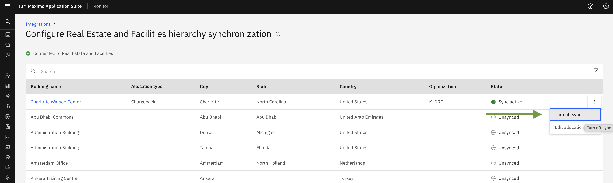
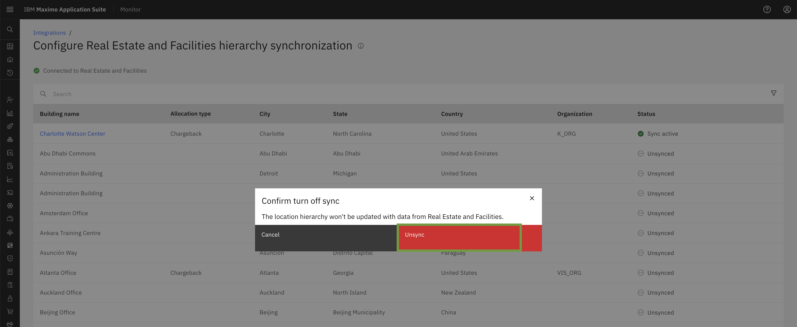
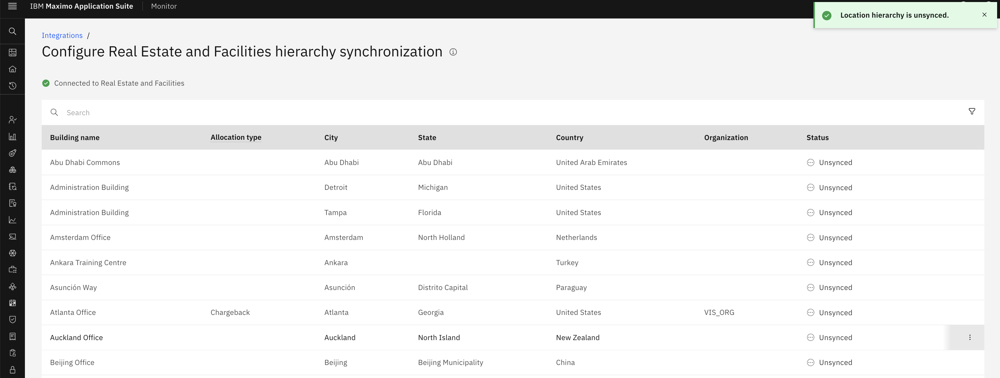
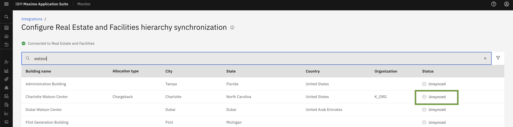

# Objectives
In this Exercise you will learn how to Turn off sync and delete Maximo Real Estate and Facilities Building.

---
*Before you begin:*  
This Exercise requires that you have:

1. completed the pre-requisites required for [all labs](prerequisite.md)

---

## Turn off sync for Maximo Real Estate and Facilities Building

You can stop syncing building data from your Tririga instance by turning off the sync feature for Buildings in the MREF integration. This will prevent any further data synchronization.

Disabling Building Sync: Step-by-Step Guide  
To turn off sync for a specific building, follow these steps:

1. Navigate to the Integration Menu.
2. Click on Configure Hierarchy Synchronization of Real Estate and Facilities.
3. Click on the 3-dot action menu next to the building you want to disable sync for.
4. Select Turn off sync from the action menu.

​

A popup window will appear. Click on the `Unsync` button to confirm that you want to turn off sync for the selected building.

​

Once you clicked on unsync button it will `Unsync` the building and show successfully message `Location hierarchy is Unsynced`.

​

 Now status of the building will show you as `Unsync`

​

!!! note 
    Once you disable building sync, no new data will be synced from your Tririga instance.

## Delete Maximo Real Estate and Facilities Configuration

To delete Maximo Real Estate and Facilities Configuration you need to make sure that all the Buildings are unsynced.​

We have a Delete button on the ellipses of Real Estate and Facilities Configuration . You can delete the configuration from here. 

​

​

This will remove all the Maximo Real Estate and Facilities buildings from Monitor. 

---
Congratulations, you have successfully covered the understanding of MREF Building turn off sync and delete. This concludes this lab. 
