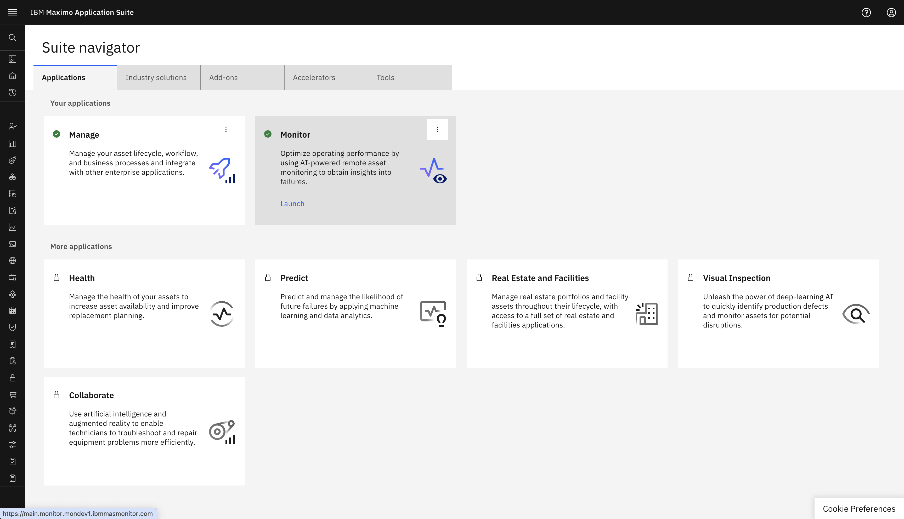
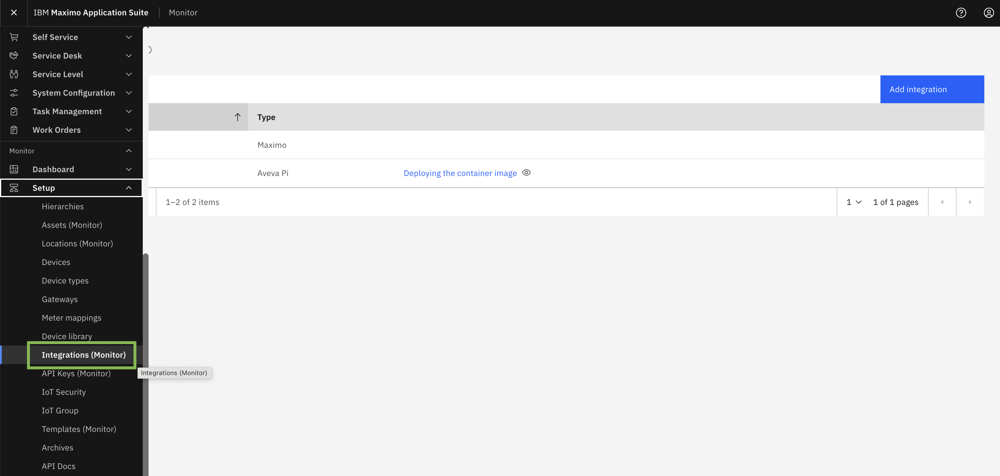
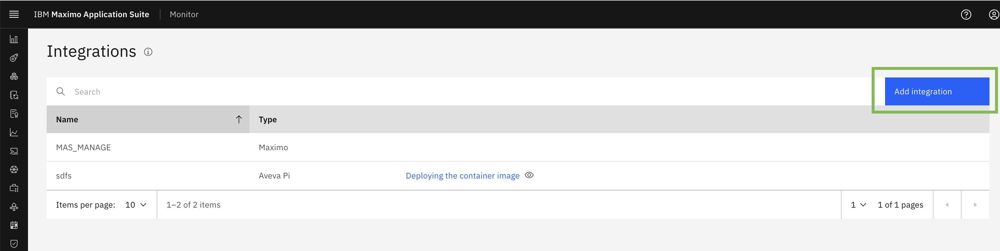
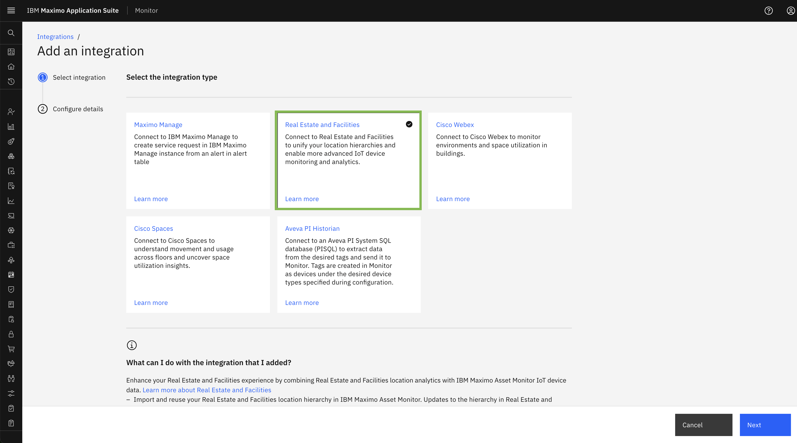
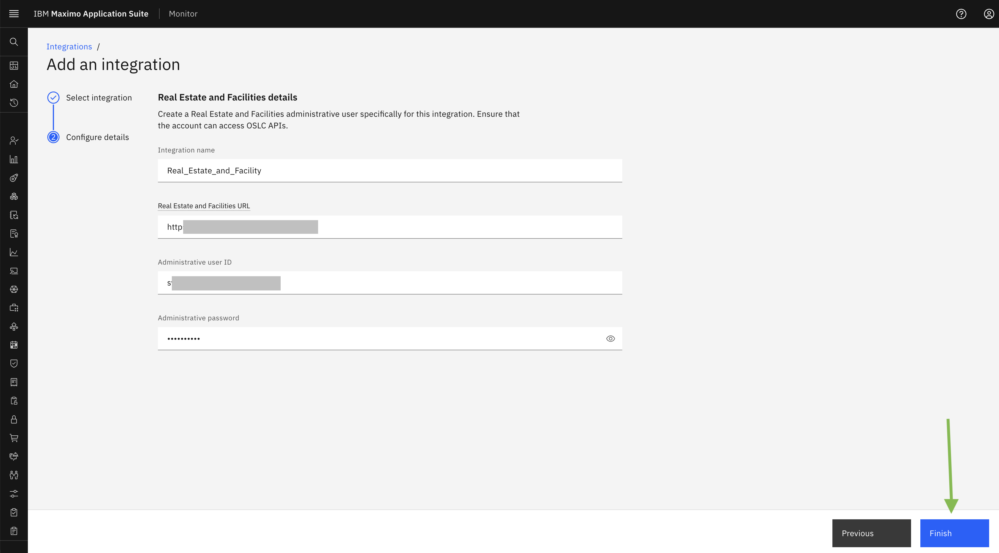
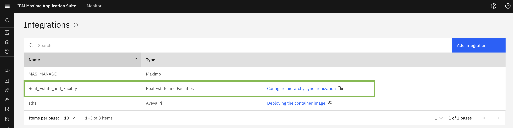
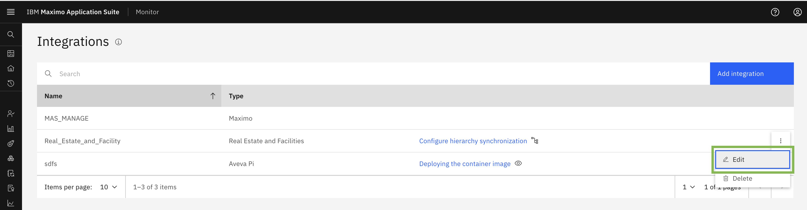
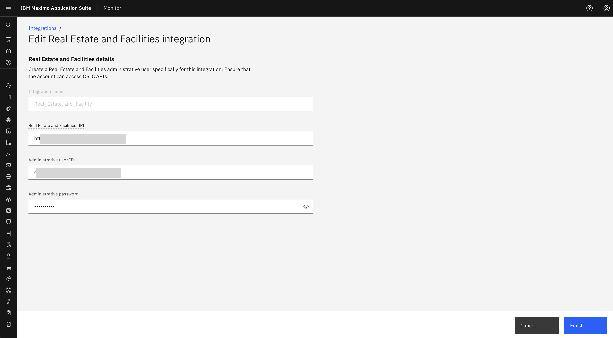

# Objectives
In this Exercise you will learn how to Configure Maximo Real Estate and Facilities Integration.

---
*Before you begin:*  
This Exercise requires that you have:

1. completed the pre-requisites required for [all labs](prerequisite.md)
2. completed the previous exercises

---

You can configure only one integration with Maximo Real Estate and Facilities. 

Login to MAS:  
  

Navigate to the Integration Page:  
  

You can add a new integration from the Add Integration button  
  

Select `Real Estate and Facilities` from integration type list and click Next.  
  

Here, In the  `INTEGRATION NAME` field, specify a name.
In the Maximo `Real Estate and Facilities URL` field, specify the URL for your Maximo Real Estate and Facilities instance.
In the `Administrative user ID` field, specify the administrative user's ID.
In the `Administrative password` field, specify the administrative user's password.
Click Finish​: 

 

Congratulations you have successfully configured Maximo Real Estate and reality Integration. 

MREF Integration will display in Integration list:  
 

You can edit Maximo Real Estate and Facility Configuration from the Edit button provided with the configuration.​ 

 

You can update the Real Estate and Facilities URL , USER ID and PASSWORD from TRIRIGA instance. ​
You will not be able to edit the Integration Name.

 

