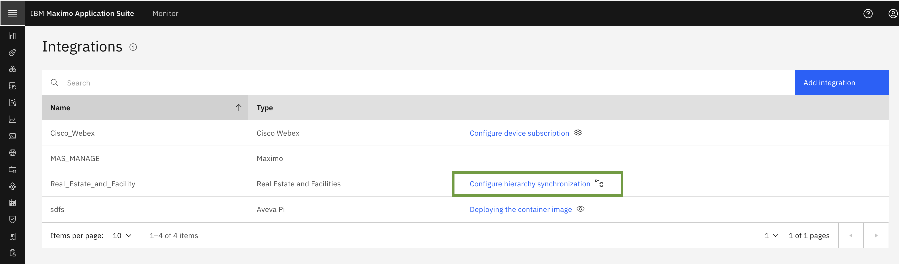
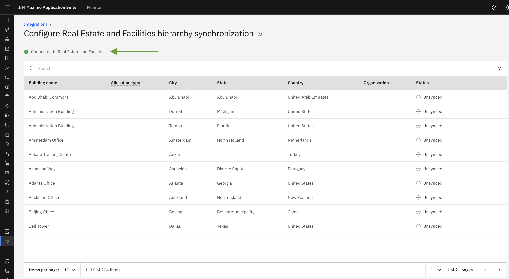
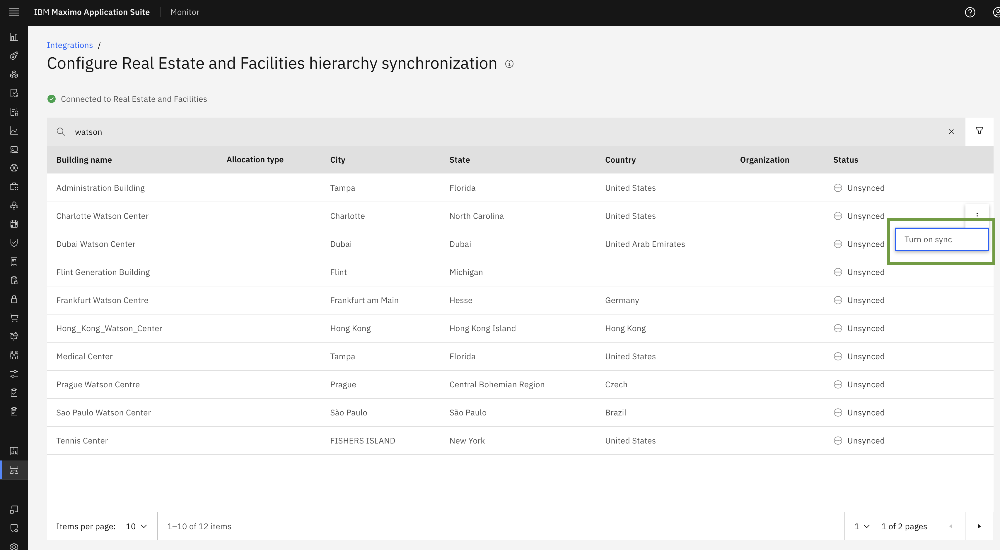

# Objectives

In this Exercise you will see Maximo Real Estate and Facilities Buildings​ list and will learn how to sync on MREF buildings..

---
*Before you begin:*  
This Exercise requires that you have:

1. completed the pre-requisites required for [all labs](prerequisite.md)
2. completed the previous exercises

---
Once we successfully create Maximo Real Estate and Facilities configurations, It will establish connection with TRIRIGA. This will internally trigger the Building sync schedular to fetch Real Estate BUILDINGS from TRIRIGA.

!!! note 
     it may take some time for the buildings to appear or become available after the configuration is complete.​

Click Configure hierarchy synchronization.

   

Here, you will see that the configuration status is connected to Real Estate and Facilities and the list of all buildings retrieved from TRIRIGA will be displayed.

   

#### How to Turn on sync for buildings & select location hierarchy

Once Maximo Real Estate and Facilities Buildings are fetched from TRIRIGA. You will be able to Turn On sync.

Enabling Building Sync: Step-by-Step Guide

- Click on the three dots next to the building for which you want to enable sync.
- The `Turn on Sync` option will appear. Click on it to proceed.

 

- A popup window will appear, allowing you to configure the sync location hierarchy.
- Enter the required details for the Maximo Monitor hierarchy: Organization, Site and System

 

After selecting the Organization, Site and System once user click on `SAVE` it will start syncing the all the details of building and the status will get changed to `IN PROGRESS` from Unsynced. 

 

When a hierarchy is synchronized, all buildings, floors, and spaces in the hierarchy in Maximo Real Estate and Facilities are duplicated in Maximo Monitor. Changes to those buildings, floors, or spaces in Maximo Real Estate and Facilities are available in Maximo Monitor.

!!! note 
     It can take a few minutes to initially populate the table. It can take up to an hour to retrieve new data from Maximo Real Estate and Facilities. Both draft and active buildings, floors, and spaces are included in the table.
    
The buildings, floors, and spaces are displayed under the System node for that hierarchy. You cannot change this setting later, but you can un-synchronize the hierarchy, delete the nodes, and then re-synchronize.

Congratulations you have successfully synced on Building.

 

#### Edit allocation

Edit the allocation type - The allocation type is an association between a space and one or more organizations. To edit to the type, click the three-dot menu and then click `Edit allocation`.

 

 By default, the allocation type is Chargeback. Click on Save to update allocation type.

 
