# Objectives
In this Exercise you will understand Maximo Real Estate and Facilities workplace analytics dashboard details.

---
*Before you begin:*  
This Exercise requires that you have:

1. completed the pre-requisites required for [all labs](prerequisite.md)

---
Maximo Real Estate and Facilities Dashboard are available in monitor under Dashboard menu - Hierarchies & Locations section. ​

In the Hierarchy Dashboard, you will be able to view the dashboard for an expanding hierarchy that you previously configured when you enabled syncing for that building.

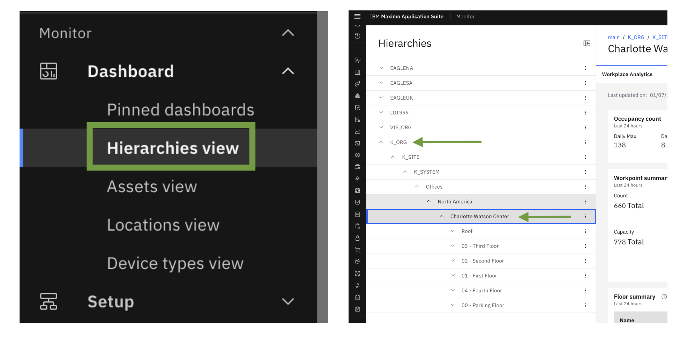 
</br>

In the Location Dashboard, you can search for a specific location by name to view its dashboard details.

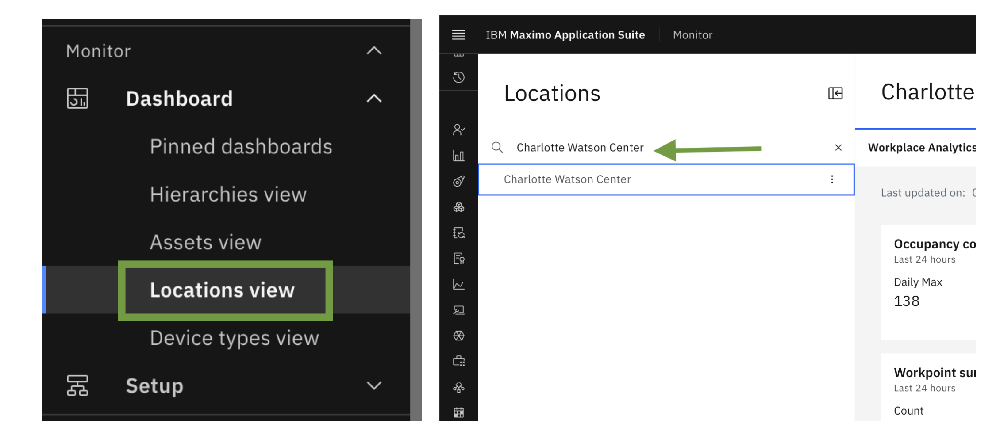


The following data is available in the Workplace Analytics dashboard:

**Occupancy rate** </br>
How occupied a space is compared to the capacity of the space, expressed as a percentage. The following equation is used to calculate occupancy rate:</br>

```
[aggregated peak daily occupancy count / capacity of the space] * 100
```

**Frequency rate**</br>
The average time the space is occupied compared with the hours of space availability, expressed as a percentage. The following equation is used to calculate frequency rate:</br>

```
space occupied / space availability x 100
```

**Occupancy count**</br>
Total number of occupants present.

**Guest count**</br>
The number of unknown people on the wifi network.

**Allocated workpoints**</br>
The number of workpoints that are allocated to either a building, floor, or organization.

**Total workpoints**</br>
The total possible number of workpoints.

A**llocated workpoint capacity**</br>
The total capacity for the allocated workpoints. This value is determined by the total allocated occupants of a space where workpoint is TRUE.

**Total workpoint capacity**</br>
The total capacity for the workpoints. This value is determined by the all occupants of a space where workpoint is TRUE.

**Average days occupied per week**</br>
Average number of days per week the workpoint is occupied. The following equation is used to calculate average days occupied per week:

```
(days occupied) / (working days) * working days per week
```

**Average hours occupied per day**</br>
The average number of hours a space is occupied per day.

**Space capacity**</br>
The capacity of each space as defined in the Maximo Real Estate and Facilities space record.


You can also access summaries of the data, such as by floor, space, or organization. You can access a heat map that summarizes the data for Maximo Monitor devices or your Cisco Webex devices.


Next, we will see th dashboard details for Buildings, Floor and Space


## Building Dashboard

Here you can see building dashboard cards which contains Occupancy count/rate, Frequency Rate, Building Timezone, Room Summary, Floor Summary, Daily averages, WorkPoint Summary, Business unit summary and Space class summary. Additionally you can apply filter time rage to see dashboard data.

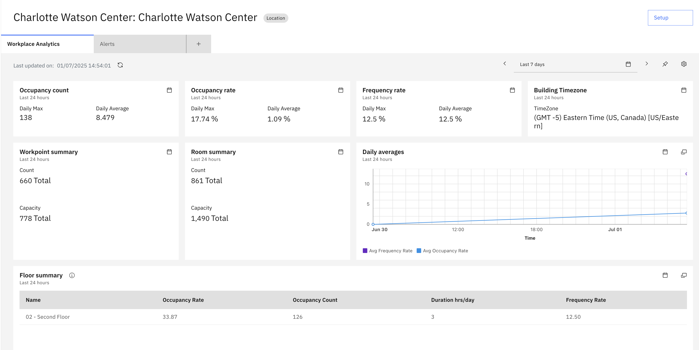 

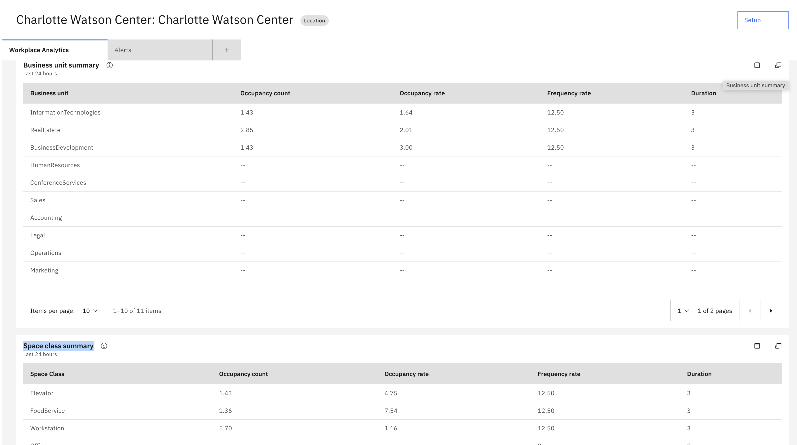 


You can also edit or delete dashboard from setting icon.

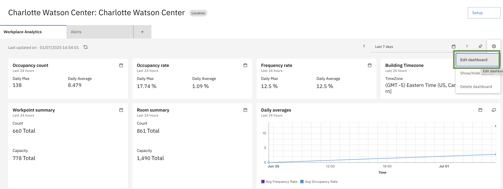 

On the Edit Dashboard page, you can modify individual cards content by updating the following elements:

- Title: Change the card's title to a name that suits your needs.
- Description: Edit the card's description to provide more context.
- Size: Adjust the card's size to fit your dashboard layout.
- Data Items: Update the data items associated with the card.
- Time Range: Change the time range for the card's data.
- JSON Editor: Edit the card's JSON configuration.
  
Additionally, you can also Add New Cards with custom configurations tailored to your specific requirements.


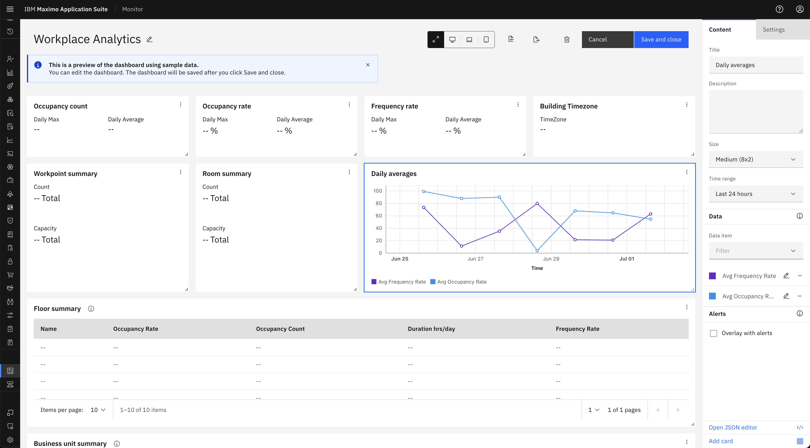 


## Floor Dashboard

Here you can see floor dashboard cards which contains floor plan, Occupancy count/rate, Frequency Rate, Room Summary, Hourly Occupancy Count graph,Number of Work points, Number of Work points Space Class summary, Individual space summary and Business unit summary

Below is a floor plan image retrieved from the configured Tririga instance. The image features an overlay with colored highlights, which represent the following space metrics:

- Occupancy Count/Rate: The number of people occupying each space.
- Frequency Rate: How often each space is used.
- Duration: The length of time each space is occupied.
  
The colored overlay indicates which spaces are currently occupied on the floor plan.

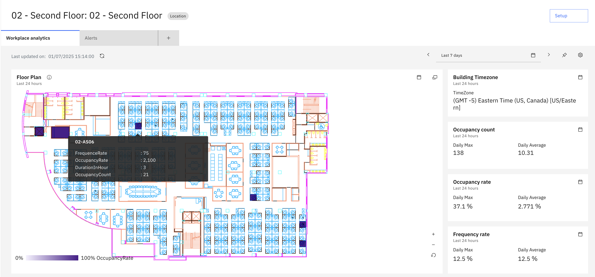 

!!!note
    The Tririga floor plan space overlay or heatmap appears only when the floor plan SVG contains an element with the id attribute set to either triSpaceLayer or triSubSpaceLayer in the floor dashboard.

</br>

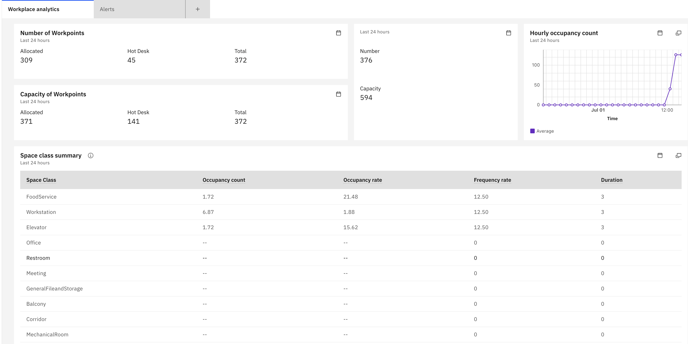 

</br>
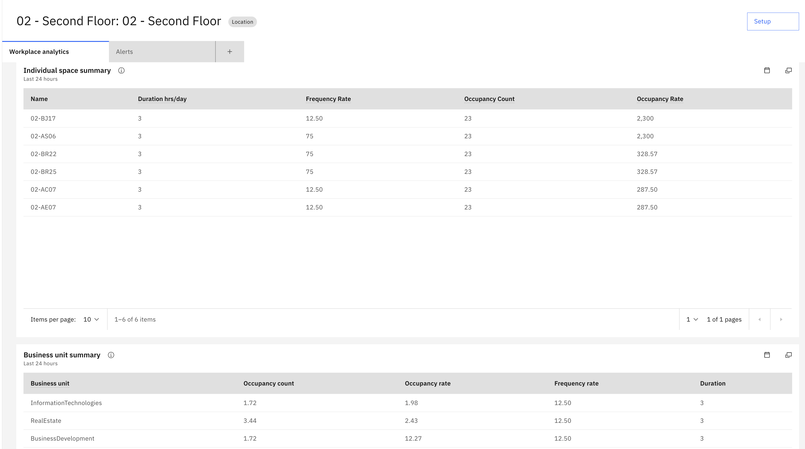 

## Space Dashboard

Here you can see space dashboard cards which contains Space Class, Space Capacity, Occupancy Count, Is Work point, Frequency Rate, Duration by Day graph.
</br>

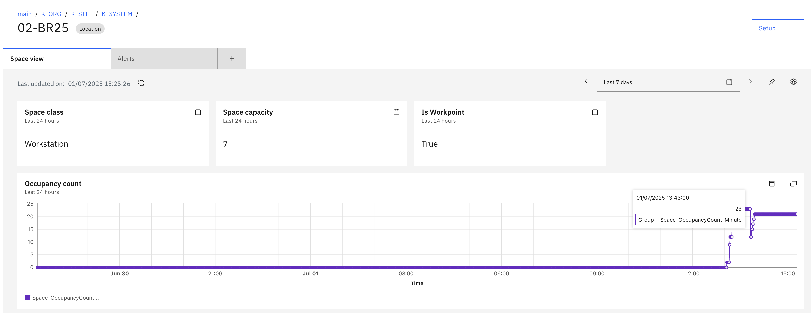 

</br>

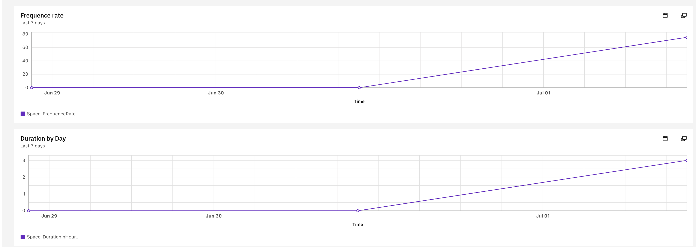 

---
Congratulations, you have successfully covered the understanding of MREF location dashboard details.</br></br>
