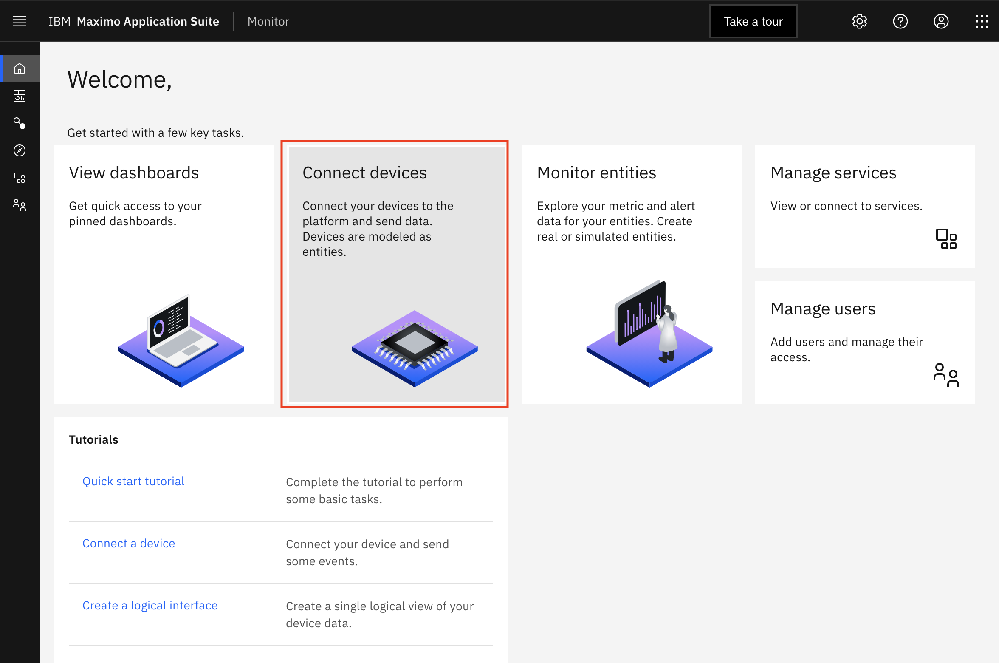
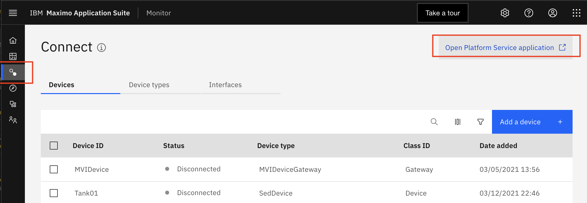
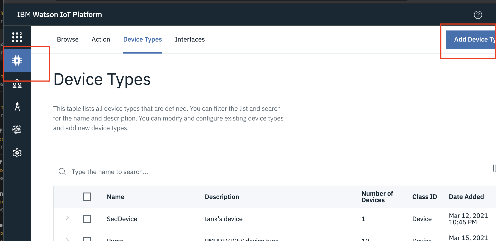
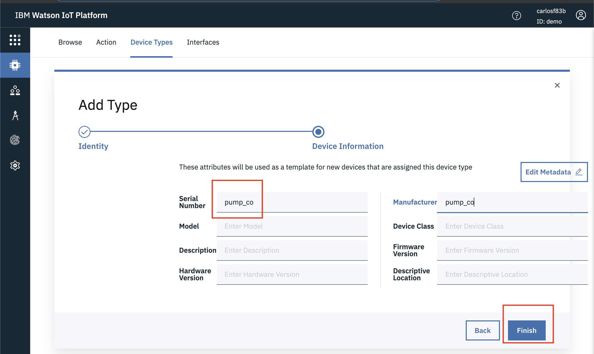

# Setup Device Types

In this exercise you will create the pump Device Type and data in Monitor IOT Platform that will receive the simulated pump 
data in the lab.  [Create a Pump Device Type](#devicetypes) in Monitor.

You can create Device Type in the UI or Programmatically.

##Create Pump Device Types in UI

To be able to ingest device data using Monitor  you must first define the format of the data using a Device  Type.  
In this exercise you will, create a `Device Type` named `pump_co` and 2 `Devices` named `11111096` and 
`111137F8`.

1.  Login to Monitor from the `Maximo Application Suite Navigator` page. Click  

2.  Click `Connect devices` tile or click On the `Connect menu`  
 

3.  Click `Open Platform Service application` in the top-right corner to open the Watson IoT 
Platform tenant associated with this  Monitor tenant in a separate browser tab. 

4.  Go to the `Device Types` menu, and click `Add Device Type`. 

!!! note
    Make sure to replace `co` in the device type name with your own initials.

5. Enter `pump_co` in the Name and Description fields - where `co` should be replaced with your initials. Note that for
the rest of this lab,  Click `Next`.

6. Enter`pump_co`  in the `Manufacturer` and `Device Class` fields.  Later you can `Dimensions` that can be used in Monitor to filter and aggregate assets in `Summary Dashboards`. Click `Finish` 
to save your changes.  
