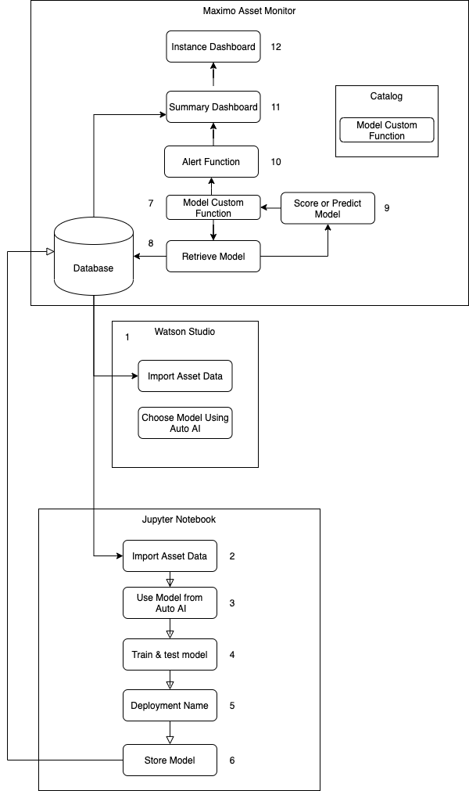
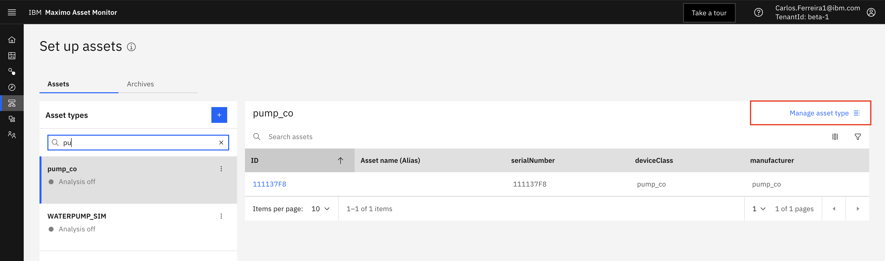
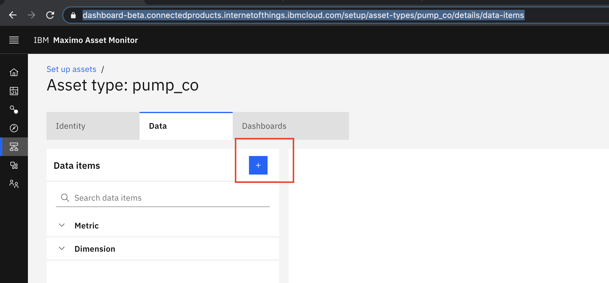
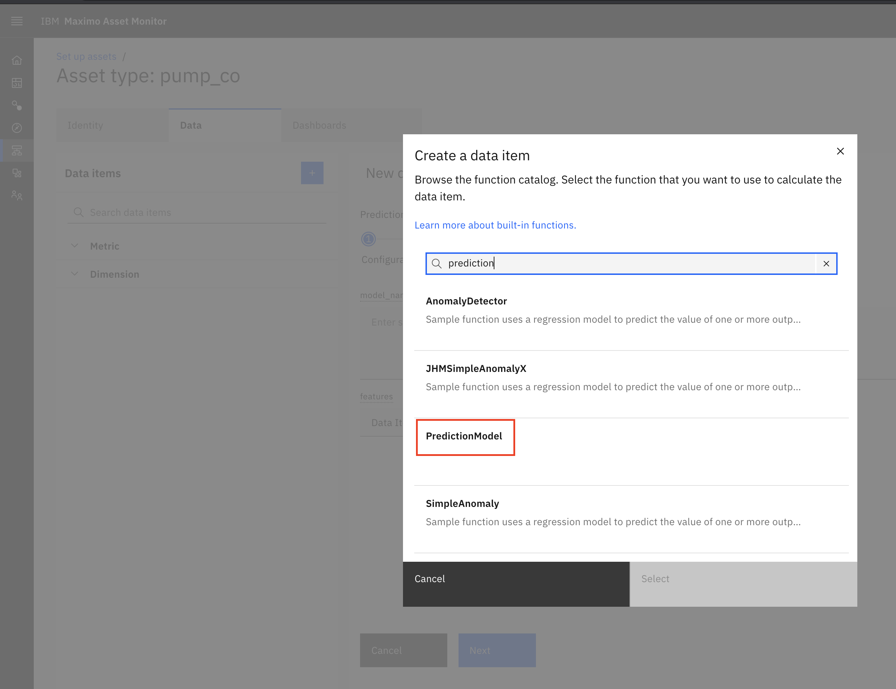
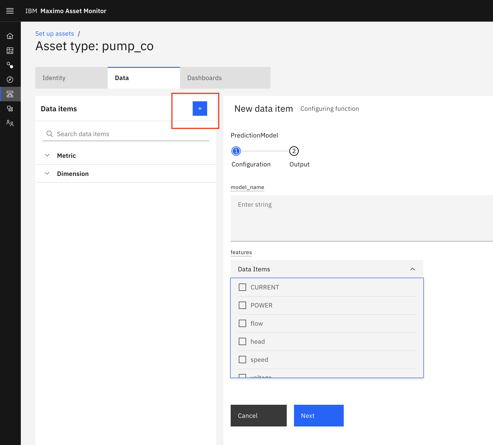
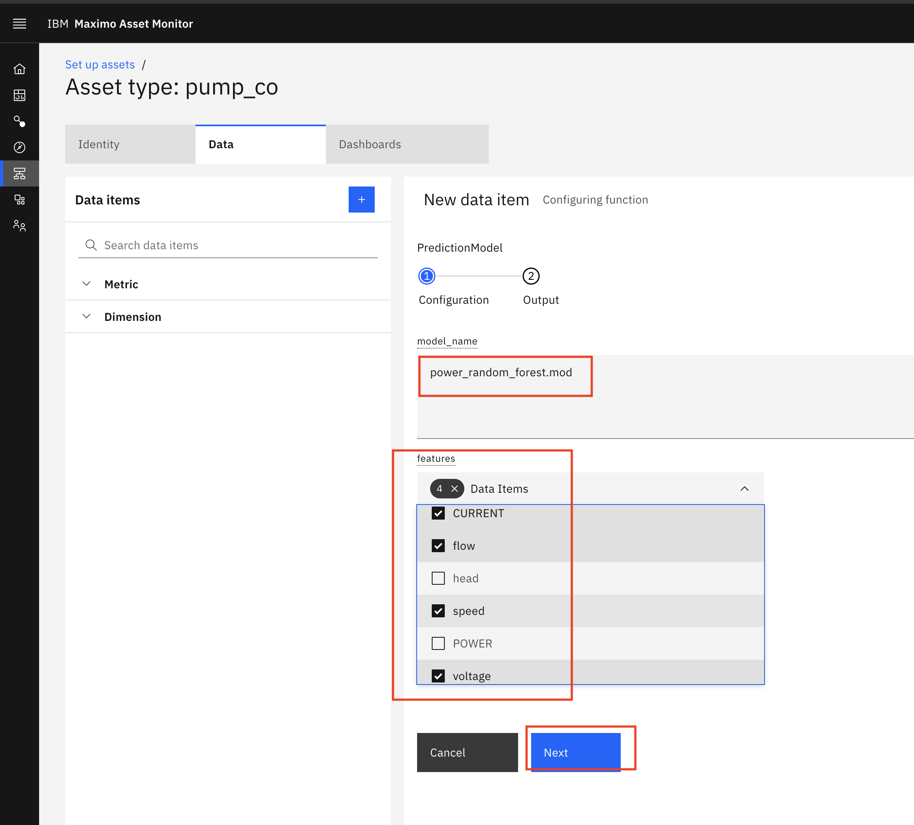
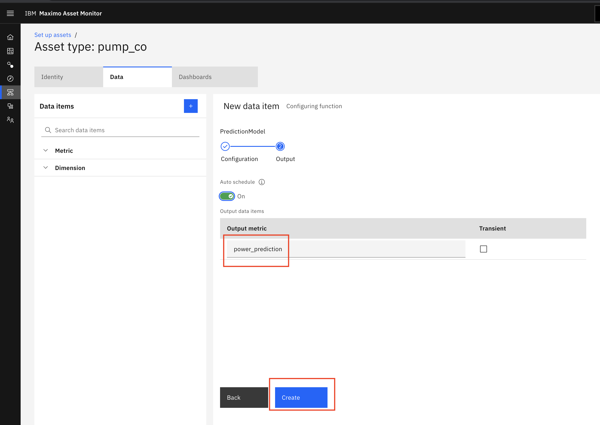
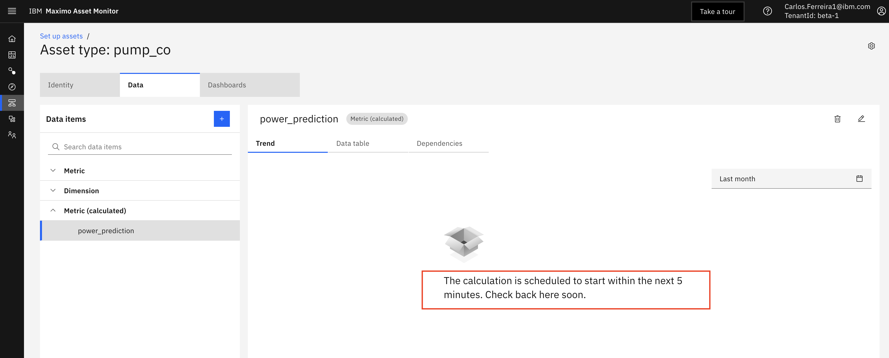

# Deploy and Configure a PredictionModel Custom Function in Monitor
<a name="deploy_model"></a>

!!! note
    Skip steps 1, 2, 3, 4 and 5 if you are in the Think2021 Hands on Lab session.  These steps have already been done for you. 

In this exercise you deploy a Monitor Custom Function to call the Prediction Model to make prediction.  Custom Functions 
are stored in Github Repositories.  Functions must be added to an Asset Type and scheduled in a pipeline to run.

Here is the Architecture flow for this tutorial. 

1.  In order for Maximo Monitor pipeline to access private Github repositories you must create a token.  Login to Github.

2.  Create a personal access token for your custom function repository using these [instructions](https://docs.github.com/en/github/authenticating-to-github/creating-a-personal-access-token)

3.  Append the token to the URL in `function.py` See the already updated URL for the custom function to call the `PredictionModel` in the `ai_prediction/functions.py`

    ```
    PACKAGE_URL = 'git+https://yourtoken@github.com/yourgithub/maximo_autoai.git'
    ```

4.  Save and commit the changes to the github repo.  
    
    ```
    git add ./custom/functions.py
    git commit -m "my function changes"
    git push origin master
    ```
     
5.  Custom Functions are stored in Github Repositories. They are added to a Monitor catalog by registering them. Register 
the function using this script. 

    ```
    python3 ./scripts/register_RredictionModel_function.py 
    ``` 

6.  After registering the function in Monitor, you can add the `PredictionModel` custom function from the catalog  to 
`pump_co` Asset Type. This will enable the function to run every 5 minutes and make a prediction using latest meter 
readings. Navigate to the `Setup` menu. Search for and pick the  `pump_co` asset type and click on the `Setup Asset Type` 
[Link](https://dashboard-beta.connectedproducts.internetofthings.ibmcloud.com/setup/asset-types/pump_co/details/data-items)


7.  Click the `+` icon to add a data item function as a calculated metric to your Asset Type.  

8.  Search for the `PredictionModel` function. 

9.  Set the value for the `Model Name` to the one you used in the earlier exercise [Deploy and Configure a Prediction Model Custom Function in Monitor](#CreateModel) 
that includes your initials.
    ```
    modelname = power_random_forest_yourinitials.mod
    ```
    Each Asset can have multiple associated `metrics` which track sensor readings over time.  Since the model you created
requires `speed`, `flow`, `voltage`, `CURRENT` to predict `POWER`  Select the those as input metrics to the function. 
Click the `Next` button.



10.  Set the name of the `Output metric` name to `power_prediction`  This will have the predicted power value returned 
from your Model invoked by your PredictionModel custom function.


11.  The pipeline is scheduled to run ever 5 mins by default.   You must wait five minute for the pipeline to execute and
calculate your  



