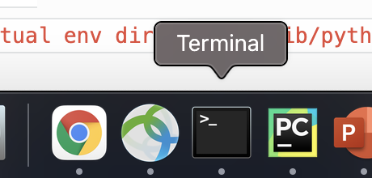
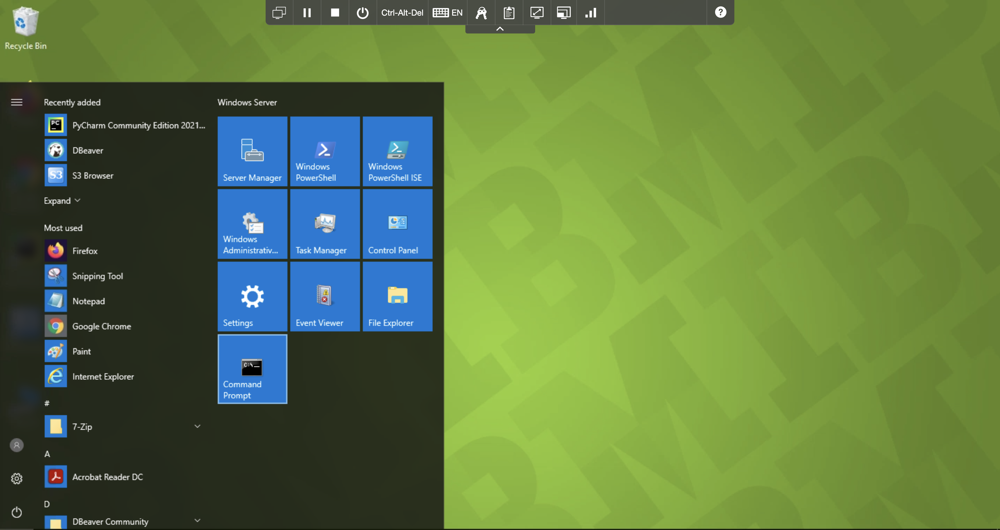
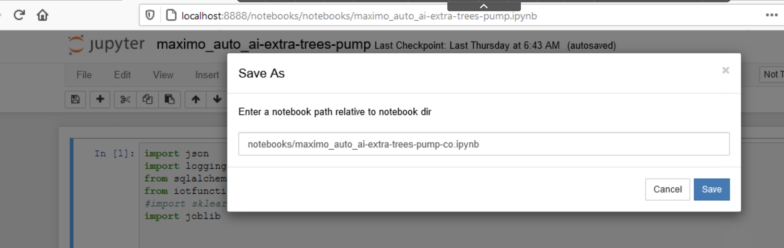
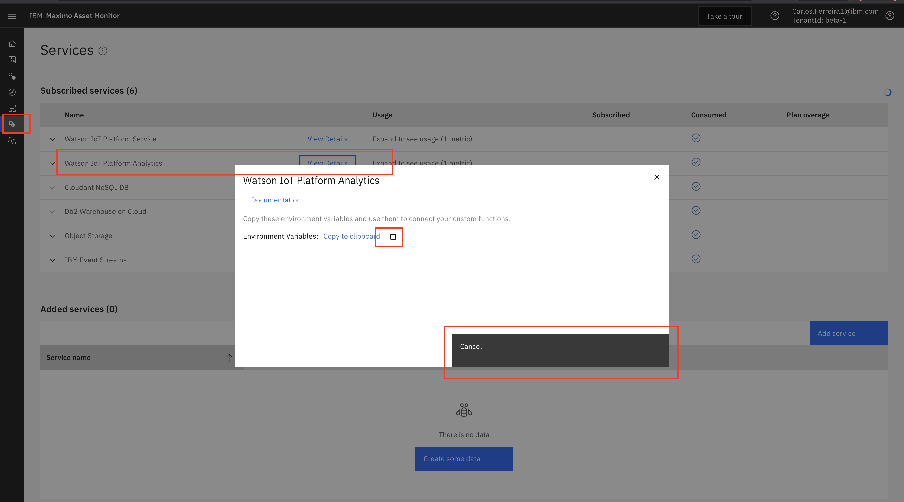
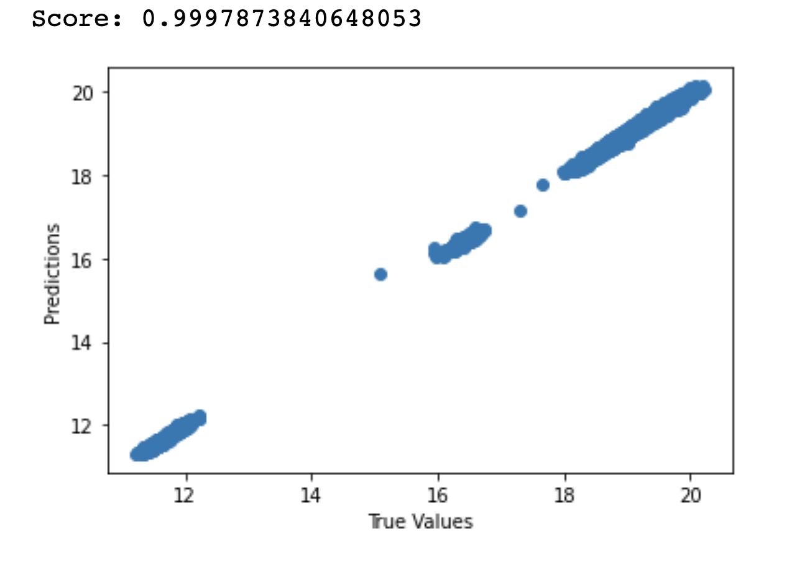
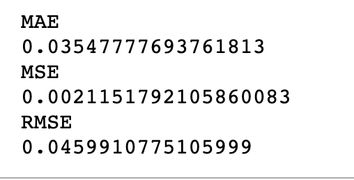

#Train, Test and Save Prediction Model in Monitor

Monitor provides an APi to store and retrieve models that can  be called using using a custom function to make predictions. 
This exercise include a sample Jupyter Notebook that shows you how to retrieve data from Monitor and a csv file to train 
a model. How to store a model and retrieve a model from Monitor make a prediction. 

In these exercises using the provided Jupyter Notebook you will:

-  [Train a Model](#TrainModel)
-  [Test a Model](#TestModel)
-  [Save a Model in Monitor](#SaveModel)
-  [Retrieve a Model from Monitor](#RetrieveModel)

##Train a Model 
<a name="TrainModel"></a>

!!! note
    If this lab is instructor led, he or she will provide you access to virtual image that has the Jupyter and the notebooks 
    already installed.  Skip steps 3, 4 and 8 if you are using Windows Virtual Machine.

1.  Open a terminal window on Mac or a command prompt window on Windows. 
 
    
2.  Activate your virtual environment. 

    ### Example for Mac
    
    ```
    cd /Users/<"replace with your user id">/<"replace with your virtual environment name">/bin                   
    cd /Users/carlosferreira/ve/iot-python3/bin   
    source activate
    ```

    ### Example for Windows
    
    ```
    cd C:\Users\ibmuser\iot-python3
    .\Scripts\activate.bat
    ```


2.  Change directory to your cloned github project directory.

    ### Example for Mac
    
    ```
    cd /Users/student01/MAS_AutoAI
    ```

    ### Example for Windows
    
    ```
    cd C:\Users\ibmuser\iot-python3\maximo_autoai
    ```

3.  Apply export variables in terminal for DYLD_LIBRARY_PATH for DB2 jars on Mac OS X only.

    ### Example for Mac
   
    ```
    cd "<replace with the git cloned project directory name>"
    cd /Users/carlos.ferreira1ibm.com/ws/autoai        
    export DYLD_LIBRARY_PATH=<"replace with your virtual env directory>"/lib/python3.7/site-packages/clidriver/lib:$DYLD_LIBRARY_PATH
    export DYLD_LIBRARY_PATH=/Users/carlosferreira/ve/iot-python3/lib/python3.7/site-packages/clidriver/lib:$DYLD_LIBRARY_PATH   # Example
    ``` 

4.  Set PYTHONPATH to your project directory where you installed your virtual environment

    ### Example for Mac
   
    ```
    export PYTHONPATH="<replace with your root_project_directory>"/maximo_autoai 
    export PYTHONPATH=/Users/carlosferreira/Documents/AutoAILabs/iot-python3/maximo_autoai    
    ```

5.  Start the Jupyter Notebook service.  and launch browser with Jupyter Notebook to edit Linear Regression Models.
   
    ```
    jupyter notebook
    ```

6.  Jupyter will open in a browser tab.  Open and study the project notebook named [maximo_auto_ai-extra-trees-pump.ipynb](http://localhost:8888/notebooks/notebooks/maximo_auto_ai-extra-trees-pump.ipynb) 
using the [instructions](setup_local_environment.md) for the virtual environment you created. Click on `Notebooks` folder.
Click on notebook named `maximo_auto_ai-extra-trees-pump.ipyn`

7.   Make a copy of the Project Notebook  Rename the notebook, change the name of your notebook by appending your own 
initials to the end of the Jupyter Notebook name. In the jupyter notebook, select `file` menu and `Save As`. Enter
`notebooks/maximo_auto_ai-extra-trees-pump-co.ipynb` and click `Save`.


8.  This code in the notebook sets the Monitor credentials and entity type for your your instance of Monitor.  Copy your 
credentials in Monitor from `Services` menu and Watson IOT Platform Analytics.  Save it in a file named `beta-1_credentials.json`
in the directory shown in the code below.  
   
    ```
    credentials = {}
    with open('/Users/carlos.ferreira1ibm.com/ws/autoai/beta-1_credentials.json', encoding='utf-8') as F:
        credentials = json.loads(F.read())
    db = Database(credentials = credentials)
    db_schema = "BLUADMIN" #  set if you are not using the default
    entity_type = 'pump_co'
    ```
    
9.  This code in the notebook build a model for each pump.  The `Entity_Type_ID` uniquely identifies each asset the model 
should be trained for. Set the `Entity_Type_ID` the model should be associated with.  There are two ways to search the 
custom function logs in Cloud Object Storage using Cyberduck that are described in the exercise named  [Download, Install and Configure CyberDuck for View Logs in Monitor](#cyberduck)  
To find your `Entity_Type_ID` in the logs in Monitor,  launch Cyberduck, and locate your pump, e.g. pump_co.  Unzip and 
open one of the *.gz files there (e.g. 111012.gz) and search for 'entity_type_id'. It should be on the first row of the
log files.

    ```
    entity_type = 'pump_cp'
    entity_type_id = 19305
    entity_name = '04714B6037F8'
    a_df = r_df.loc[r_df['device_id'] == entity_name, :]
    print ('a_df.shape 1')
    print (a_df.shape)
    print (a_df)
    ```

9. This code in the notebook splits the data into train and test subsets.

    ```
    from sklearn.model_selection import train_test_split 
    X_train, X_test, y_train, y_test = train_test_split(x, y, test_size=0.20, random_state=42)
     ```
      
10. This code in the notebook creates the model using the train data.

    ```
    extra_trees_model = ExtraTreesRegressor()
    extra_trees_model.fit(X_train, y_train.values.ravel() )
    ```  
   
## Test a Model 
<a name="TestModel"></a>

1. This code in the notebook tests the model using the test data to make a prediction.  It should return a power 
 prediction = 11.471

    ```
    row = [[ 971.0,  989.633,  331.0,  26.44]]
    yhat = extra_trees_model.predict(row)    
    x_pos_predictions = extra_trees_model.predict(X_test)
    ```
     
2. This code in the notebook plots the prediction accuracy by comparing prediction values versus true values.  

    ```
    plt.scatter(y_test, x_pos_predictions)
    plt.xlabel('True Values')
    plt.ylabel('Predictions')
    ```    

3.  This code in the notebook calculates the model accuracy. Smaller values indicate better accuracy making predictions. 

    ```
    from sklearn import metrics
    print("Mean Absolute Error")
    print(metrics.mean_absolute_error(y_test, x_pos_predictions))
    print("Mean Square Error")
    print(metrics.mean_squared_error(y_test, x_pos_predictions))
    print("Root Mean Square Error")
    print(np.sqrt(metrics.mean_squared_error(y_test, x_pos_predictions)))
    ```
       
##Save Model to Monitor.  
<a name="SaveModel"></a>
In the notebook, change the name of your model by replacing `co` with your own initials `power_extra_trees_model_co.mod` 

1.  This code in the notebook saves the model to disk locally, re-loads the mode into memory and tries to make a prediction.

    ```
    import pickle
    model_file_path = '/Users/carlos.ferreira1ibm.com/ws/autoai/models/power_random_forest.mod'
    pickle.dump(extra_trees_model, open(model_file_path, 'wb'))
    model = pickle.load(open(model_file_path, 'rb'))
    row = [[1160.0, 1190.626, 438.0, 33.16]]    
    yhat = model.predict(row)
    ```
   
2. This code in the notebook saves the model in Monitor.  Make sure you replace the `co` in the model name to your own 
initials  `power_extra_trees_model_co.mod`

    ```
    from iotfunctions.db import Database
    import json
    credentials = {}
    credential_file = '/Users/carlos.ferreira1ibm.com/ws/autoai/beta-1_credentials.json'    
    with open(credential_file, encoding='utf-8') as F:
        credentials = json.loads(F.read())
    db_ctp = Database(credentials=credentials, entity_type_id=entity_type_id )
    from datetime import datetime
    model_name = 'power_extra_trees_model_co.mod'
    try:
        feature_vector = ['speed', 'flow', 'voltage', 'CURRENT' ]
        model_dict  = {
        'model': model,
        'feature_vector': feature_vector,
        'timesstamp' : datetime.now().strftime("%Y%m%d%H%M%S")
        }
        db_ctp.model_store.store_model(model_name, model_dict) 
    except Exception as e:
        print('Model store failed with ' + str(e))
        pass
    ```

## Retrieve a Model and Make Predictions  
<a name="RetrieveModel"></a>

1. This code in the notebook retrieves the model from Monitor and tries to make a prediction.  

    ```
    try:
        model_dict = db_ctp.model_store.retrieve_model(model_name)
        print("load model")
        monitor_model = model_dict["model"]
        print(monitor_model)
        feature_vector = model_dict["feature_vector"]
        print(feature_vector)
        feature_vector = model_dict["timesstamp"]
        print(feature_vector)
    except Exception as e:
        print("Model retrieval failed with " + str(e))
        pass
    ```    
   
Congratulations you have learned how to use the provided Jupyter notebook to train test and deploy a prediction model 
to Monitor.  For more resource intensive models you should deploy them to a separate runtime service to make predictions.  
In  the next lab exercise you will register the provided Monitor Custom function that will allow you to send the pump 
metrics data to your deployed model to make a prediction.  
