# Add Calculations, Alerts and Update Dashboards

Monitor calculations allow you to process time series data or do other scheduled activities.   Calculations could be to 
check how much the actual power consumption deviates from the prediction power consumption from the pump.  If this deviation
is too large it could indicate there is a anomaly that needs to be investigated.   In this exercise you will:

-  [Add Calculations](#AddCalcuations) to add a new metric called `predicted_power_max_deviation` using a formula `power_prediction` * 1.2
-  [Add Alerts](#AddAlerts) to raise an alert when the actual `POWER`  is greater than maximum_predicted_power_deviation.

## Add Calculations

To see and monitor the values of calculated metric in Monitor, you must add the metric, calculated metrics and alerts to 
an asset dashboard.  In this exercise you will add the new calculated metric named `power_prediction_co_max_deviation` to your 
asset calculated metrics to calculate the maximum power prediction allowed.

<a name="AddCalcuations"></a>
!!! note
    Remember to replace `co` with your initials in the name of your own asset type if you aren't in an instructor led lab.
    Remember to replace `co` with the initials that you used for your power prediction calculated metric.

1.  Click `Setup` menu.  Search on `pump_co`.  Click `pump_co` 
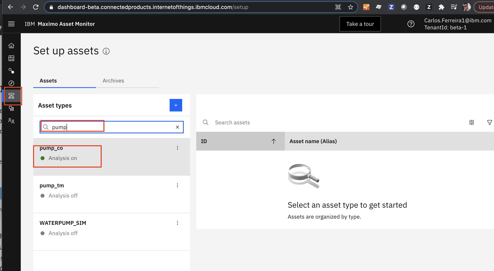

2.  Click on `Manage Asset Type` to see the metrics that have already been added to your asset type  for your  `pump_co`.
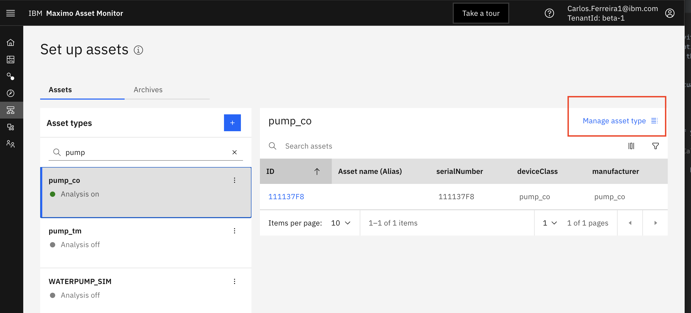

3.  Click on the `Data` tab, expand the  `Metrics` and  `Calulated Metric`   These are the raw metrics sent by the 
simulated pump time series data and the calculations used to operate on the data. Like making a prediction for power like 
you did in the last exercise to [Deploy Model](#deploy_model).
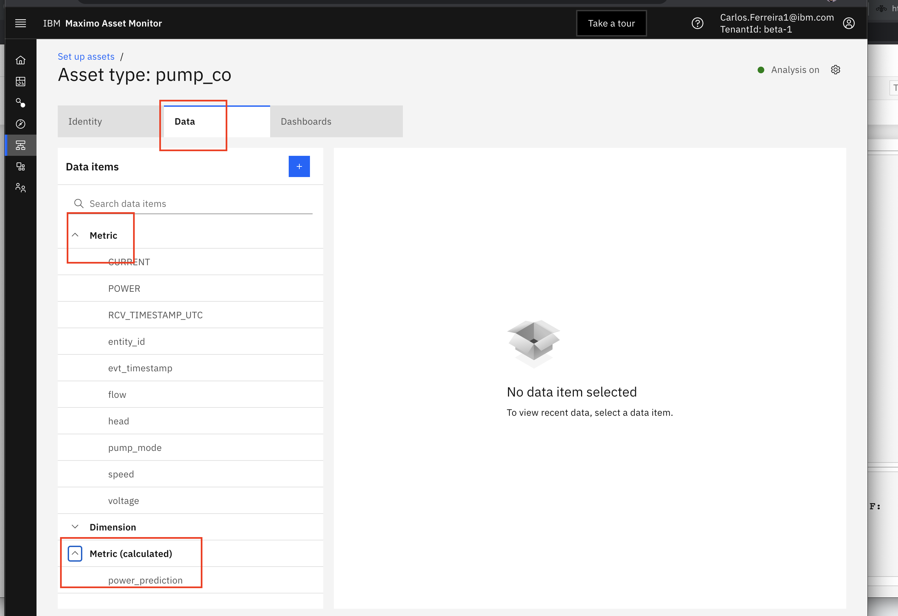

4.  Add a calculation for what is the maximum acceptable  power consumption. Click  `+` button in the Asset view, and then 
search for and select the `NewColFromCalculation` function.  Click on `select` button.
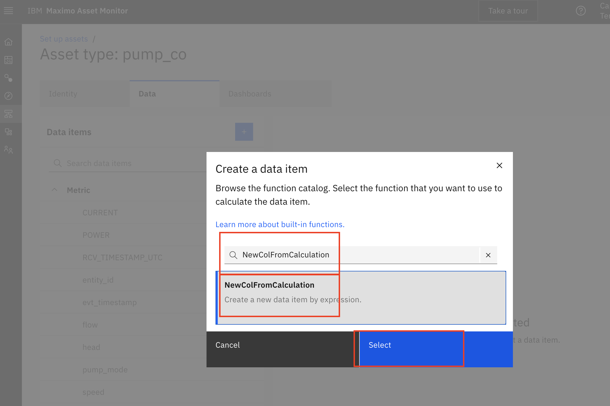

5.  From `sources` `Data Items` choose the `power_prediction` metric as the input to our calculation.  For the calculation `expression` 
enter:
    ```
    1.2*df['power_prediction']
    ```
and click the `Next` button
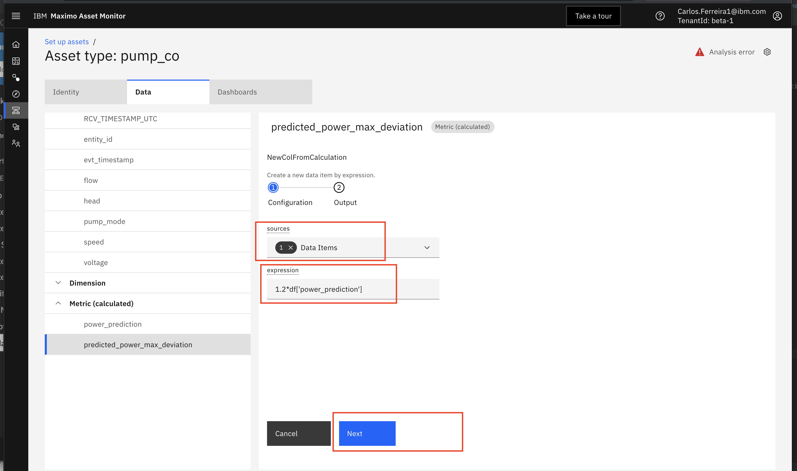


6. Set `Output metric` to  `predicted_power_co_max_deviation`.  Set `Output type` to  `Number`.  Finally click the `Next` button.
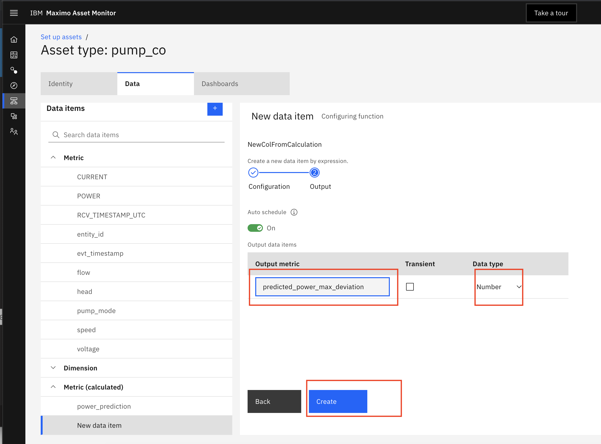


## Add alerts

<a name="AddAlerts"></a>
!!! note
    Remember to replace `co` with your initials in the name of your own calculated metrics and alert names. 

The "Alerts" function allows you to be notified when anomalies are detected.  In this exercise you will  add an Alerts 
that check if the actual `POWER` is greater than the  `predicted_power_co_max_deviation`. 

1.  Click `Setup` menu.  Search on `pump_co` if you are in the instructor led class.  Otherwise search for `pump_Your_Initials` 
to find the asset type you created and click on it.  Click `pump_Your_Initials`   


2.  Click on `Manage Asset Type` to see the metrics that have already been added to your asset type  for your `pump_Your_Initials`  


3.  Click on the `Data` tab, expand the  `Metrics` and  `Calulated Metric`   These are the raw metrics sent by the 
simulated pump time series data and the calculations used to operate on the data. Like making a prediction for power like 
you did in the last exercise to [Deploy Model](#deploy_model).


4.  Click  `+` button in the Asset view, and then search for and select the `AlertExpression` function. 
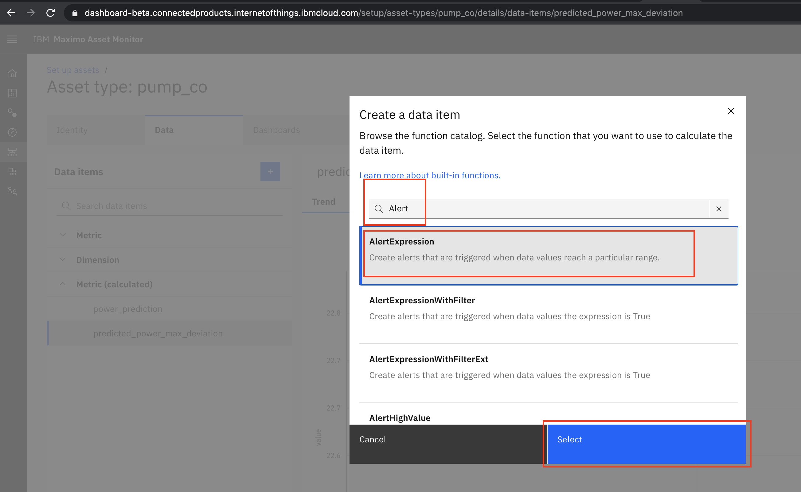

5.  Then, enter a condition indicating when the Alert should be triggered. In this case, we should get an alert whenever 
`POWER` is greater `power_prediction_co_max_deviation`

    ```
     df['POWER']>df['power_prediction_co_max_deviation']
    ```
    Click `Next`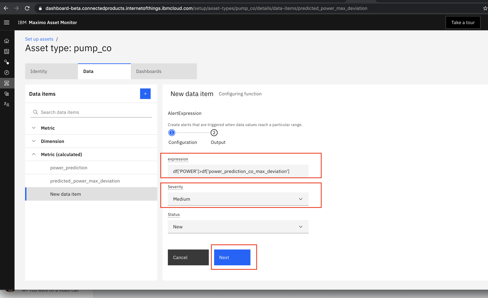

7.  Set Output metric:  `power_prediction_co_max_deviation_alert`

8.  Set Output type: `Number`

9.  Click `Create` button.  The calculation of alerts will be checked every 5 minutes by default.  You can set a different
schedule frequency as well for verifying calculations and alerts.
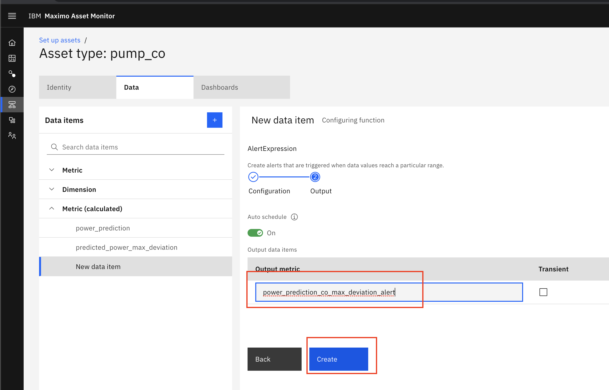

## Update Dashboard Power Card

<a name="UpdateDashboard"></a>

To see and monitor the values of calculated metric in Monitor, you must add the metric, calculated metrics and alerts to 
an asset dashboard.  In this exercise you will add the new calculated metric `power_prediction_co_max_deviation` to your 
asset dashboard as a line series card. 

!!! note
    Remember to replace `co` with your initials in the name of your own asset type if you aren't in an instructor led lab.
    Remember to replace `co` with the initials that you used for your power prediction calculated metrics and alerts.

1.  Edit the Asset dashboard  selecting your recently created calculated metric for `power_prediction_co`.  Click on 
`Monitor`,  search on `pump_co`,  click on `111137F8`, click on  `Asset Metrics Dashboard` tab and click on `Settings` 
gear icon.
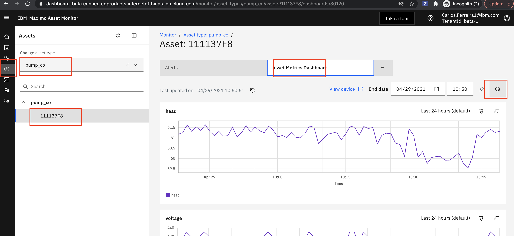

2. Click `Edit Dashboard` and then click `Continue` button in dialog.


3. Click on the `POWER` card.  In the  `card` window , `data` section click on `data item filter` and select `power_prediction_co`.
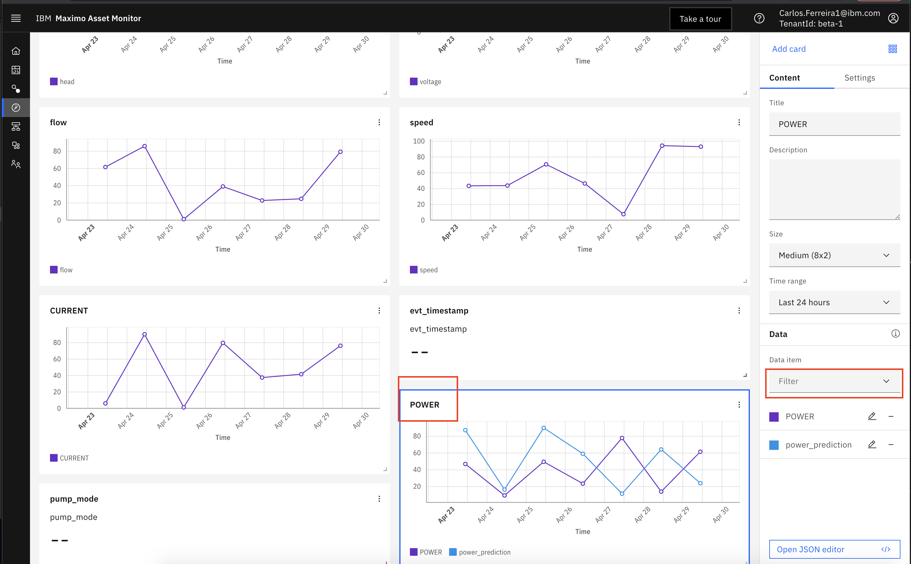

4. Click on the `Dashboard` menu tab.  In the  `card` window , `data` section click on `data item filter` and select `power_prediction_co`.
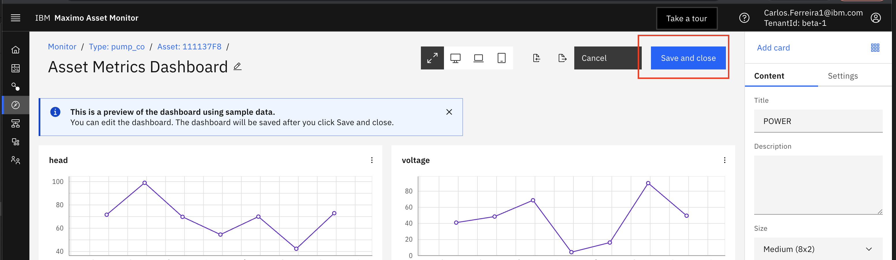

5. Click on the `POWER` card.  In the  `card` window , `data` section click on `data item filter` and select `power_prediction_co`.
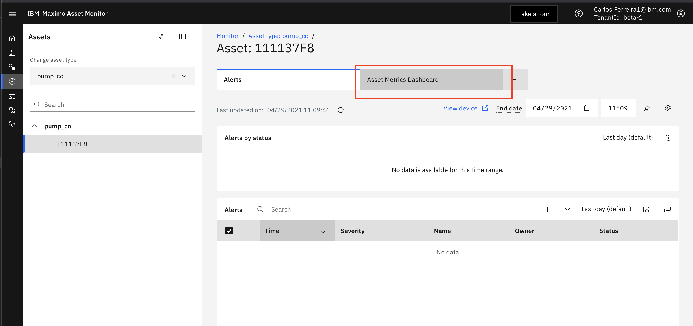

6.  Click the `Save and close` button to save your changes to the dashboard.  All pumps will now get this same dashboard 
change.  You can also create asset specific dashboards for each asset in the `Setup Asset Type` menu.

## Update Dashboard Power Card with Alert
To see a visual red dot on line series cards where alerts happen at specific time stamps you must edit the JSON of the 
dashboard directly.

1.  Edit the Asset dashboard  selecting your recently created calculated metric for `power_prediction_co`.  Click on 
`Monitor`,  search on `pump_co`,  click on `111137F8`, click on  `Asset Metrics Dashboard` tab and click on `Settings` 
gear icon.


2. Click `Edit Dashboard` and then click `Continue` button in dialog.


3. Click `Export Dashboard` and save the json file locally.

4. Update and save the Json with the following code using a Python Editor or Monitor's Json editor in the Dashboard Editor.


5. Import the updated Json file and click the `Save and close` button to save your changes to the dashboard.  All pumps will now 
get this same dashboard change.  You can also create asset specific dashboards for each asset in the `Setup Asset Type`
menu.  You should now see the Asset Metrics Dashboard with alerts similar to the one below in the Asset Dashboard.


## View Dashboard

<a name="ViewDashboard"></a>

!!! note
    Remember to replace `co` with your initials in the name of your own asset type if you aren't in an instructor led lab.
    Remember to replace `co` with the initials that you used for your power prediction calculated metrics and alerts.

1.  View the Asset dashboard.  Click on  `Monitor` menu on the left,  search on `pump_co`,  click on `111137F8`, click on 
 `Asset Metrics Dashboard` and scroll down to see the Power card.


2.  Expand the  `POWER` card.  Click on the double square icon.  When the window opens click on `POWER` and Click on `power_prediction_co` 
to toggle the lines off and on.   Notice the power values in the table below.   You can also export the data to a `csv` 
file by clicking on the funnel icon.
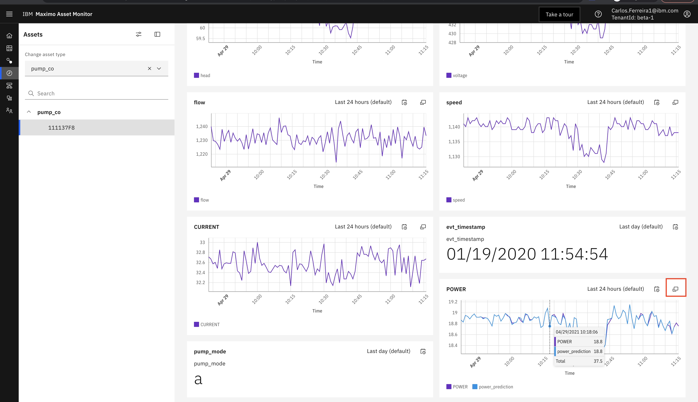


##  View Alerts 


1.  To see alerts for a specific asset,  click on  `Monitor`,  search on `pump_co` asset type,  click on `111137F8`, 
click on  `Alerts` tab. 
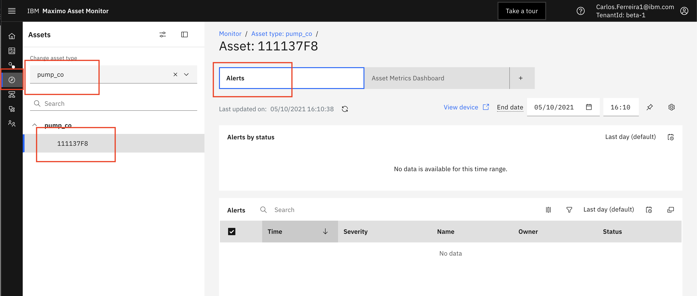

2.  To see why there aren't any alerts modify the asset dashboard for `11111096`.  Add  `power_prediction_co_max_deviation` 
to your asset dashboard.  Notice how the maximum value of the actual power never exceeds the `power_prediction_co_max_deviation`
An alert should therefore never be triggered.  Experiment setting new column calculated for `power_prediction_co_max_deviation`
to only be 1.05 higher to see if you can get some alerts showing.


Congratulations you have completed all the exercises in this lab and hopefully have a better understanding of how to 
create AI models and make the usable in Maximo Asset Monitor to monitor your assets.
